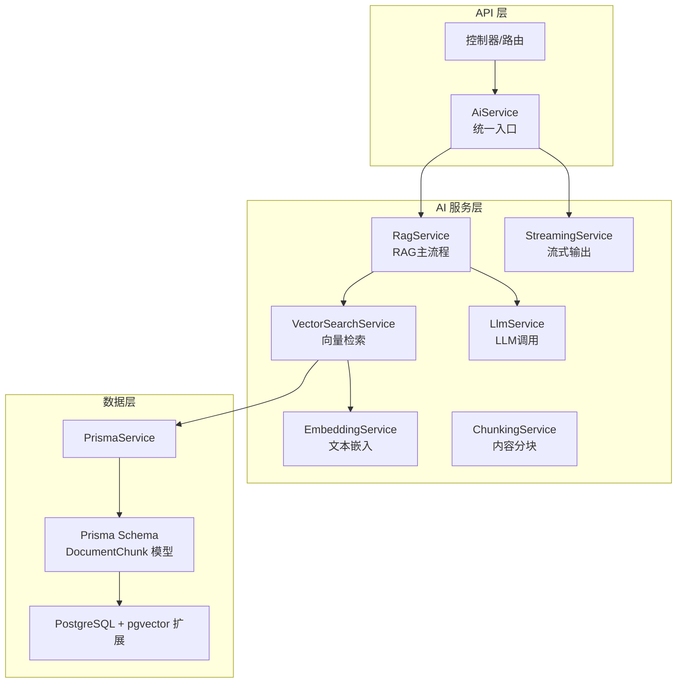
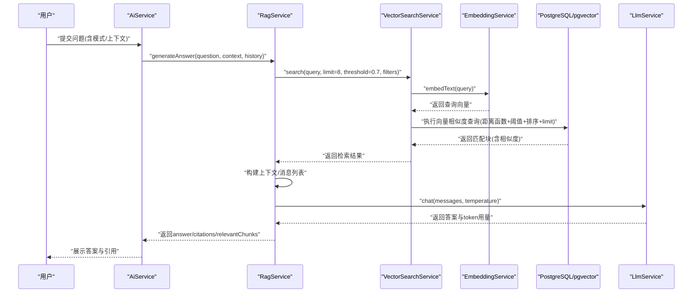
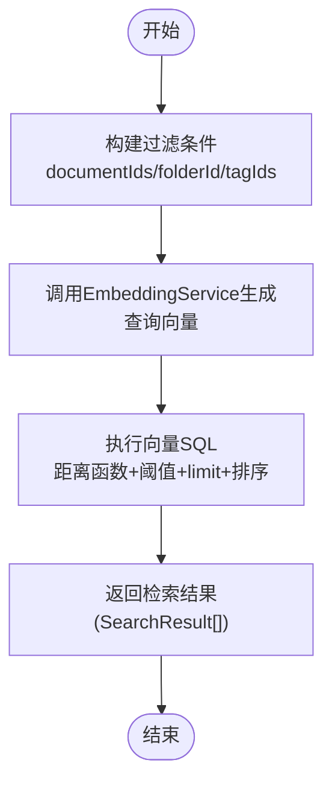
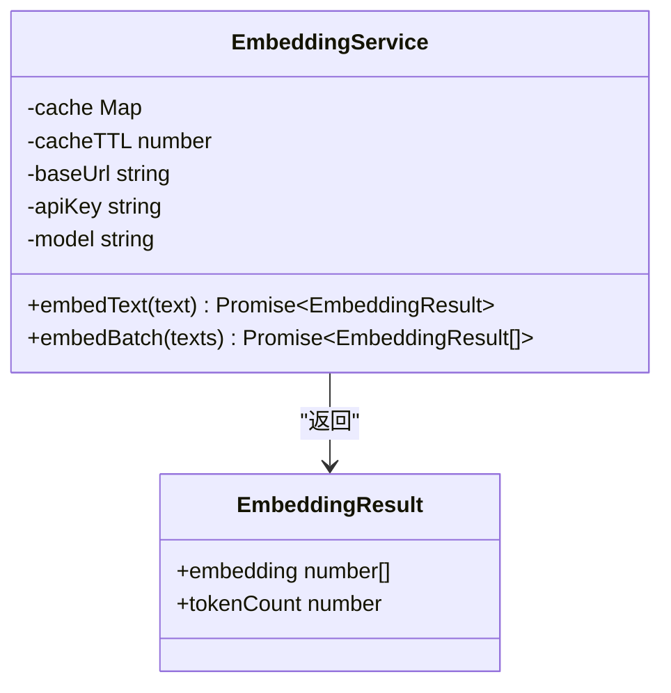
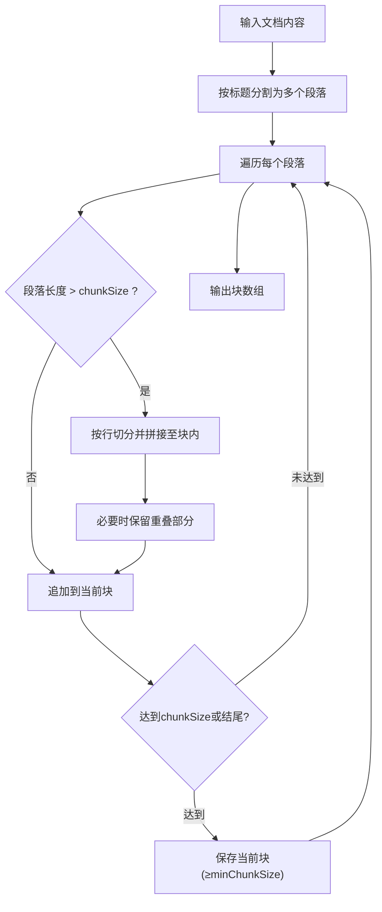
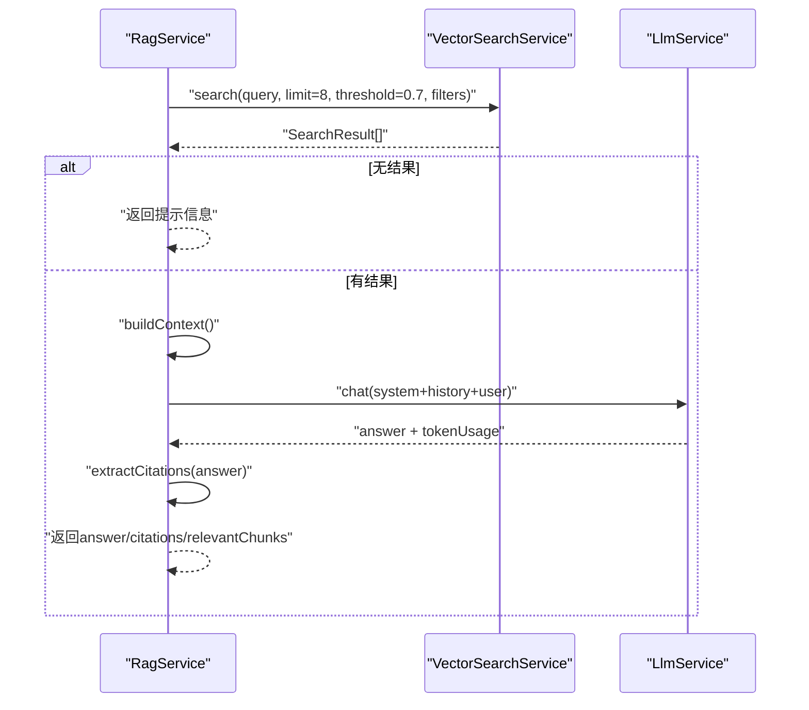
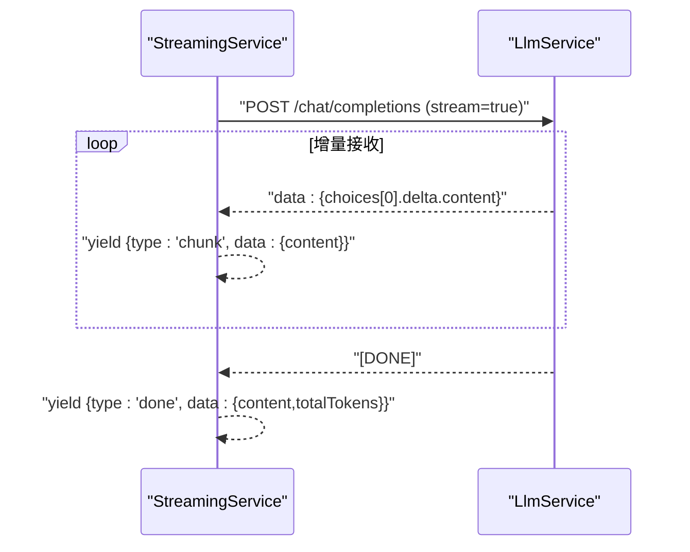
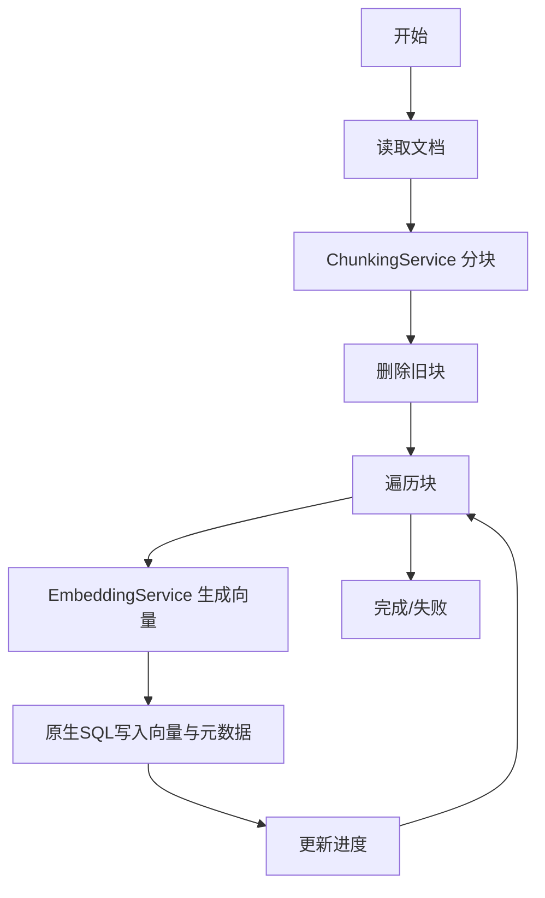
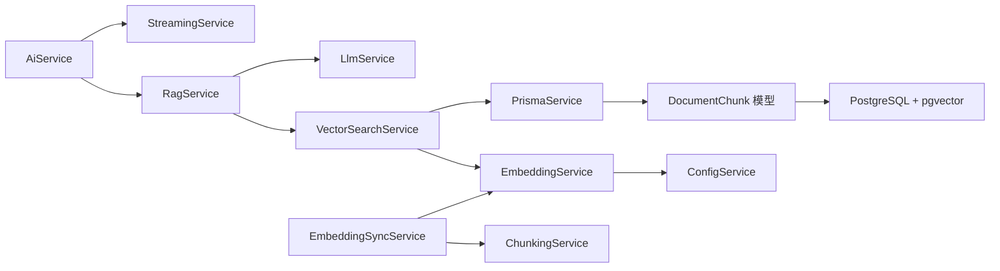

# RAG检索系统

<cite>
**本文引用的文件**
- [apps/api/src/modules/ai/rag.service.ts](file://apps/api/src/modules/ai/rag.service.ts)
- [apps/api/src/modules/ai/vector-search.service.ts](file://apps/api/src/modules/ai/vector-search.service.ts)
- [apps/api/src/modules/ai/embedding.service.ts](file://apps/api/src/modules/ai/embedding.service.ts)
- [apps/api/src/modules/ai/chunking.service.ts](file://apps/api/src/modules/ai/chunking.service.ts)
- [apps/api/src/modules/ai/llm.service.ts](file://apps/api/src/modules/ai/llm.service.ts)
- [apps/api/src/modules/ai/streaming.service.ts](file://apps/api/src/modules/ai/streaming.service.ts)
- [apps/api/src/modules/ai/ai.service.ts](file://apps/api/src/modules/ai/ai.service.ts)
- [apps/api/src/modules/embedding/embedding-sync.service.ts](file://apps/api/src/modules/embedding/embedding-sync.service.ts)
- [apps/api/prisma/schema.prisma](file://apps/api/prisma/schema.prisma)
- [docker/postgres/init.sql](file://docker/postgres/init.sql)
- [apps/api/src/config/configuration.ts](file://apps/api/src/config/configuration.ts)
- [packages/shared/src/types/ai.ts](file://packages/shared/src/types/ai.ts)
- [packages/shared/src/types/entities.ts](file://packages/shared/src/types/entities.ts)
</cite>

## 目录
1. [简介](#简介)
2. [项目结构](#项目结构)
3. [核心组件](#核心组件)
4. [架构总览](#架构总览)
5. [详细组件分析](#详细组件分析)
6. [依赖分析](#依赖分析)
7. [性能考虑](#性能考虑)
8. [故障排查指南](#故障排查指南)
9. [结论](#结论)
10. [附录](#附录)

## 简介
本文件面向APP2项目的RAG（检索增强生成）系统，系统性阐述从“用户问题”到“带引用的答案”的完整链路，覆盖向量检索、上下文构建、相似度计算、向量嵌入、内容分块、流式输出与错误处理等关键技术点。文档同时给出架构图、序列图、流程图与最佳实践，帮助开发者快速理解与优化该系统。

## 项目结构
RAG相关代码主要位于后端API模块的ai子目录，配合Prisma数据模型与PostgreSQL的pgvector扩展，形成“分块-嵌入-入库-检索-生成”的闭环。

图表来源
- [apps/api/src/modules/ai/ai.service.ts](file://apps/api/src/modules/ai/ai.service.ts#L1-L420)
- [apps/api/src/modules/ai/rag.service.ts](file://apps/api/src/modules/ai/rag.service.ts#L1-L248)
- [apps/api/src/modules/ai/vector-search.service.ts](file://apps/api/src/modules/ai/vector-search.service.ts#L1-L140)
- [apps/api/src/modules/ai/embedding.service.ts](file://apps/api/src/modules/ai/embedding.service.ts#L1-L128)
- [apps/api/src/modules/ai/chunking.service.ts](file://apps/api/src/modules/ai/chunking.service.ts#L1-L203)
- [apps/api/src/modules/ai/llm.service.ts](file://apps/api/src/modules/ai/llm.service.ts#L1-L110)
- [apps/api/src/modules/ai/streaming.service.ts](file://apps/api/src/modules/ai/streaming.service.ts#L1-L123)
- [apps/api/prisma/schema.prisma](file://apps/api/prisma/schema.prisma#L192-L210)
- [docker/postgres/init.sql](file://docker/postgres/init.sql#L1-L26)

章节来源
- [apps/api/src/modules/ai/ai.service.ts](file://apps/api/src/modules/ai/ai.service.ts#L1-L420)
- [apps/api/prisma/schema.prisma](file://apps/api/prisma/schema.prisma#L192-L210)

## 核心组件
- RagService：RAG主流程编排，负责检索、上下文构建、消息构造、调用LLM、抽取引用与统计耗时。
- VectorSearchService：执行向量相似度检索，支持按文档ID、文件夹、标签过滤，返回相似度与块级信息。
- EmbeddingService：调用外部嵌入模型生成向量，内置内存缓存与批量请求能力。
- ChunkingService：对Markdown文档进行标题级分块，支持段落/行级切分与重叠处理。
- LlmService：封装LLM调用，支持温度、最大token等参数。
- StreamingService：封装SSE流式输出，逐块推送增量内容并统计token。
- EmbeddingSyncService：文档入库流程，分块-删除旧块-批量嵌入-写入向量。
- Prisma Schema：定义DocumentChunk模型，包含向量字段与索引。

章节来源
- [apps/api/src/modules/ai/rag.service.ts](file://apps/api/src/modules/ai/rag.service.ts#L1-L248)
- [apps/api/src/modules/ai/vector-search.service.ts](file://apps/api/src/modules/ai/vector-search.service.ts#L1-L140)
- [apps/api/src/modules/ai/embedding.service.ts](file://apps/api/src/modules/ai/embedding.service.ts#L1-L128)
- [apps/api/src/modules/ai/chunking.service.ts](file://apps/api/src/modules/ai/chunking.service.ts#L1-L203)
- [apps/api/src/modules/ai/llm.service.ts](file://apps/api/src/modules/ai/llm.service.ts#L1-L110)
- [apps/api/src/modules/ai/streaming.service.ts](file://apps/api/src/modules/ai/streaming.service.ts#L1-L123)
- [apps/api/src/modules/embedding/embedding-sync.service.ts](file://apps/api/src/modules/embedding/embedding-sync.service.ts#L1-L166)
- [apps/api/prisma/schema.prisma](file://apps/api/prisma/schema.prisma#L192-L210)

## 架构总览
RAG系统采用“检索-生成”两阶段流水线：
- 检索阶段：用户问题经EmbeddingService生成查询向量，VectorSearchService通过pgvector的向量距离函数进行相似度检索，并按阈值与TopK筛选。
- 生成阶段：RagService将检索结果构建为上下文，拼接系统提示词与历史消息，调用LLM生成答案；StreamingService支持流式输出。

图表来源
- [apps/api/src/modules/ai/ai.service.ts](file://apps/api/src/modules/ai/ai.service.ts#L50-L144)
- [apps/api/src/modules/ai/rag.service.ts](file://apps/api/src/modules/ai/rag.service.ts#L71-L141)
- [apps/api/src/modules/ai/vector-search.service.ts](file://apps/api/src/modules/ai/vector-search.service.ts#L36-L67)
- [apps/api/src/modules/ai/embedding.service.ts](file://apps/api/src/modules/ai/embedding.service.ts#L33-L79)
- [apps/api/src/modules/ai/llm.service.ts](file://apps/api/src/modules/ai/llm.service.ts#L37-L86)

## 详细组件分析

### 向量检索服务（VectorSearchService）
- 功能要点
  - 接收查询文本，调用EmbeddingService生成向量。
  - 构建过滤条件：支持按documentIds、folderId、tagIds三类维度过滤。
  - 使用pgvector的向量距离运算符进行相似度计算，返回相似度与块级元数据。
  - 支持limit与threshold控制召回规模与质量。
- 关键SQL
  - 使用向量距离函数计算余弦/欧氏相似度，并以阈值过滤与limit裁剪。
  - 返回字段包含块ID、所属文档、块索引、标题、文本与相似度。
- 性能与优化
  - 建议在embedding列建立向量索引（由pgvector提供），以加速相似度检索。
  - 过滤条件尽量使用索引列，避免全表扫描。
  - 控制limit与threshold平衡召回与性能。

图表来源
- [apps/api/src/modules/ai/vector-search.service.ts](file://apps/api/src/modules/ai/vector-search.service.ts#L36-L138)

章节来源
- [apps/api/src/modules/ai/vector-search.service.ts](file://apps/api/src/modules/ai/vector-search.service.ts#L1-L140)
- [apps/api/prisma/schema.prisma](file://apps/api/prisma/schema.prisma#L192-L210)
- [docker/postgres/init.sql](file://docker/postgres/init.sql#L5-L6)

### 向量嵌入服务（EmbeddingService）
- 功能要点
  - 调用外部嵌入模型生成向量，支持批量请求（阿里百炼限制每批最多25条）。
  - 内存缓存：以文本哈希为key，7天TTL，命中直接返回向量与token估算。
  - token估算：中文字符按1.5字符/token，英文字符按4字符/Token估算。
- 错误处理
  - API失败时记录错误并抛出异常，便于上层捕获与降级。

图表来源
- [apps/api/src/modules/ai/embedding.service.ts](file://apps/api/src/modules/ai/embedding.service.ts#L1-L128)

章节来源
- [apps/api/src/modules/ai/embedding.service.ts](file://apps/api/src/modules/ai/embedding.service.ts#L1-L128)

### 内容分块服务（ChunkingService）
- 功能要点
  - 按Markdown标题进行段落级分块，优先保证语义完整性。
  - 支持chunkSize、chunkOverlap、minChunkSize参数，默认500字符块、100字符重叠、最小100字符。
  - 对超长段落按行切分，确保单块不超过chunkSize。
  - 重叠处理：优先按句号/换行截断，否则按字符数截断。
  - 估算token并计算内容哈希，用于去重与缓存。
- 输出结构
  - 每个块包含：chunkIndex、chunkText、heading、tokenCount、contentHash。

图表来源
- [apps/api/src/modules/ai/chunking.service.ts](file://apps/api/src/modules/ai/chunking.service.ts#L31-L167)

章节来源
- [apps/api/src/modules/ai/chunking.service.ts](file://apps/api/src/modules/ai/chunking.service.ts#L1-L203)

### 检索-生成主流程（RagService）
- 功能要点
  - 默认limit=8、threshold=0.7，检索相关块。
  - 若无结果，返回提示信息；否则构建上下文字符串，注入系统提示词。
  - 构造消息列表（系统+历史+用户），调用LLM生成答案。
  - 从答案中抽取引用，映射到检索块，生成摘要片段。
  - 返回answer、citations、relevantChunks与token用量、处理时间。
- 上下文构建
  - 每个块以编号形式拼接，标题前置，块间以分隔线分隔。
- 引用提取
  - 使用正则匹配答案中的引用标记，去重并生成引用列表。

图表来源
- [apps/api/src/modules/ai/rag.service.ts](file://apps/api/src/modules/ai/rag.service.ts#L71-L141)
- [apps/api/src/modules/ai/llm.service.ts](file://apps/api/src/modules/ai/llm.service.ts#L37-L86)

章节来源
- [apps/api/src/modules/ai/rag.service.ts](file://apps/api/src/modules/ai/rag.service.ts#L1-L248)

### 流式输出（StreamingService）
- 功能要点
  - 以SSE方式接收LLM增量输出，逐块推送chunk事件。
  - 统计token用量并在done事件中汇总。
  - 错误时发送error事件并记录日志。
- 与AiService集成
  - AiService在RAG模式下先retrieveContext，再将上下文插入系统提示位置，随后启动流式生成。

图表来源
- [apps/api/src/modules/ai/streaming.service.ts](file://apps/api/src/modules/ai/streaming.service.ts#L27-L121)
- [apps/api/src/modules/ai/llm.service.ts](file://apps/api/src/modules/ai/llm.service.ts#L37-L86)

章节来源
- [apps/api/src/modules/ai/streaming.service.ts](file://apps/api/src/modules/ai/streaming.service.ts#L1-L123)
- [apps/api/src/modules/ai/ai.service.ts](file://apps/api/src/modules/ai/ai.service.ts#L192-L299)

### 文档向量化同步（EmbeddingSyncService）
- 功能要点
  - 读取未归档文档，调用ChunkingService分块。
  - 删除旧块，循环对每个块调用EmbeddingService生成向量，使用原生SQL批量写入document_chunks。
  - 维护处理状态Map，支持查询同步进度。
- 数据模型
  - DocumentChunk模型包含向量字段、tokenCount、contentHash等。

图表来源
- [apps/api/src/modules/embedding/embedding-sync.service.ts](file://apps/api/src/modules/embedding/embedding-sync.service.ts#L30-L115)
- [apps/api/prisma/schema.prisma](file://apps/api/prisma/schema.prisma#L192-L210)

章节来源
- [apps/api/src/modules/embedding/embedding-sync.service.ts](file://apps/api/src/modules/embedding/embedding-sync.service.ts#L1-L166)
- [apps/api/prisma/schema.prisma](file://apps/api/prisma/schema.prisma#L192-L210)

## 依赖分析
- 组件耦合
  - RagService依赖VectorSearchService与LlmService，承担编排职责。
  - VectorSearchService依赖EmbeddingService与PrismaService，负责检索与SQL执行。
  - EmbeddingSyncService依赖ChunkingService与EmbeddingService，负责入库流程。
  - StreamingService与LlmService共同支撑流式输出。
- 外部依赖
  - AI服务：通过配置项指定基础URL、API Key、模型名称。
  - 数据库：PostgreSQL + pgvector扩展，DocumentChunk模型承载向量与元数据。

图表来源
- [apps/api/src/modules/ai/rag.service.ts](file://apps/api/src/modules/ai/rag.service.ts#L63-L66)
- [apps/api/src/modules/ai/vector-search.service.ts](file://apps/api/src/modules/ai/vector-search.service.ts#L28-L31)
- [apps/api/src/modules/ai/embedding.service.ts](file://apps/api/src/modules/ai/embedding.service.ts#L21-L28)
- [apps/api/src/modules/ai/ai.service.ts](file://apps/api/src/modules/ai/ai.service.ts#L39-L45)
- [apps/api/src/modules/ai/streaming.service.ts](file://apps/api/src/modules/ai/streaming.service.ts#L16-L22)
- [apps/api/src/modules/embedding/embedding-sync.service.ts](file://apps/api/src/modules/embedding/embedding-sync.service.ts#L21-L25)
- [apps/api/prisma/schema.prisma](file://apps/api/prisma/schema.prisma#L192-L210)

章节来源
- [apps/api/src/config/configuration.ts](file://apps/api/src/config/configuration.ts#L17-L23)
- [apps/api/src/modules/ai/ai.service.ts](file://apps/api/src/modules/ai/ai.service.ts#L1-L420)

## 性能考虑
- 向量检索
  - 在embedding列建立向量索引，降低相似度查询成本。
  - 合理设置threshold与limit：阈值过低导致大量候选，limit过大增加上下文长度与token消耗。
  - 过滤条件尽量使用索引列，减少JOIN与子查询开销。
- 嵌入调用
  - 利用EmbeddingService的内存缓存，避免重复请求。
  - 批量嵌入时遵循供应商限制（如阿里百炼每批最多25条）。
- 文本分块
  - 适当增大chunkOverlap可提升跨段落语义连贯性，但会增加检索与上下文长度。
  - minChunkSize避免产生过小块影响检索稳定性。
- LLM调用
  - 控制上下文长度，避免超出模型上下文窗口。
  - 通过temperature与max_tokens调节生成稳定性与长度。
- 数据库
  - 确保pgvector扩展已启用，schema中向量字段类型正确。
  - 定期清理过期缓存与无用向量数据，维持索引效率。

## 故障排查指南
- 常见错误与定位
  - 嵌入API失败：检查AI_BASE_URL、AI_API_KEY、AI_EMBEDDING_MODEL配置，查看EmbeddingService日志。
  - 向量检索无结果：检查threshold是否过高、limit是否过小、过滤条件是否过于严格。
  - pgvector报错：确认init.sql已执行，扩展安装成功；检查DocumentChunk模型的向量字段类型。
  - 流式输出异常：关注StreamingService的SSE解析与错误事件，检查网络与上游API稳定性。
- 日志与指标
  - 各服务均记录处理时间与token用量，便于定位瓶颈。
  - AiService在保存消息时更新对话token用量，可用于计费与限额监控。

章节来源
- [apps/api/src/modules/ai/embedding.service.ts](file://apps/api/src/modules/ai/embedding.service.ts#L75-L78)
- [apps/api/src/modules/ai/vector-search.service.ts](file://apps/api/src/modules/ai/vector-search.service.ts#L120-L138)
- [apps/api/src/modules/ai/streaming.service.ts](file://apps/api/src/modules/ai/streaming.service.ts#L117-L121)
- [docker/postgres/init.sql](file://docker/postgres/init.sql#L11-L21)
- [apps/api/src/modules/ai/ai.service.ts](file://apps/api/src/modules/ai/ai.service.ts#L107-L129)

## 结论
本RAG系统通过清晰的模块划分与稳定的外部依赖，实现了从“问题-检索-生成-流式输出”的完整链路。结合pgvector的向量检索、EmbeddingService的缓存与批量能力、ChunkingService的语义分块策略以及StreamingService的实时交互体验，能够在保证质量的同时兼顾性能与可维护性。后续可在索引优化、阈值与TopK调优、缓存策略与限流等方面持续迭代。

## 附录
- 配置项参考
  - AI_BASE_URL、AI_API_KEY、AI_CHAT_MODEL、AI_EMBEDDING_MODEL
- 数据模型要点
  - DocumentChunk：包含向量字段、tokenCount、contentHash、heading、chunkText等
- 类型定义参考
  - ChatRequest/ChatResponse、Citation、ConversationContext等

章节来源
- [apps/api/src/config/configuration.ts](file://apps/api/src/config/configuration.ts#L17-L23)
- [apps/api/prisma/schema.prisma](file://apps/api/prisma/schema.prisma#L192-L210)
- [packages/shared/src/types/ai.ts](file://packages/shared/src/types/ai.ts#L68-L94)
- [packages/shared/src/types/entities.ts](file://packages/shared/src/types/entities.ts#L67-L93)