# 大语言模型集成

<cite>
**本文引用的文件**
- [apps/api/src/modules/ai/ai.service.ts](file://apps/api/src/modules/ai/ai.service.ts)
- [apps/api/src/modules/ai/llm.service.ts](file://apps/api/src/modules/ai/llm.service.ts)
- [apps/api/src/modules/ai/rag.service.ts](file://apps/api/src/modules/ai/rag.service.ts)
- [apps/api/src/modules/ai/embedding.service.ts](file://apps/api/src/modules/ai/embedding.service.ts)
- [apps/api/src/modules/ai/vector-search.service.ts](file://apps/api/src/modules/ai/vector-search.service.ts)
- [apps/api/src/modules/ai/streaming.service.ts](file://apps/api/src/modules/ai/streaming.service.ts)
- [apps/api/src/modules/ai/chunking.service.ts](file://apps/api/src/modules/ai/chunking.service.ts)
- [apps/api/src/modules/ai/dto/chat.dto.ts](file://apps/api/src/modules/ai/dto/chat.dto.ts)
- [apps/api/src/modules/ai/ai.controller.ts](file://apps/api/src/modules/ai/ai.controller.ts)
- [apps/api/src/config/configuration.ts](file://apps/api/src/config/configuration.ts)
- [apps/api/prisma/schema.prisma](file://apps/api/prisma/schema.prisma)
- [packages/shared/src/types/ai.ts](file://packages/shared/src/types/ai.ts)
- [packages/shared/src/types/entities.ts](file://packages/shared/src/types/entities.ts)
- [apps/web/lib/api-client.ts](file://apps/web/lib/api-client.ts)
- [apps/web/hooks/use-ai-chat.ts](file://apps/web/hooks/use-ai-chat.ts)
- [apps/web/hooks/use-streaming-chat.ts](file://apps/web/hooks/use-streaming-chat.ts)
- [apps/api/package.json](file://apps/api/package.json)
</cite>

## 目录
1. [简介](#简介)
2. [项目结构](#项目结构)
3. [核心组件](#核心组件)
4. [架构总览](#架构总览)
5. [详细组件分析](#详细组件分析)
6. [依赖分析](#依赖分析)
7. [性能考虑](#性能考虑)
8. [故障排查指南](#故障排查指南)
9. [结论](#结论)
10. [附录](#附录)

## 简介
本文件面向 APP2 项目的“大语言模型集成”子系统，系统性阐述 LLM 服务的实现架构、模型适配策略、提示词工程、对话历史管理、RAG 向量检索、流式交互、性能与成本监控以及扩展与替换的最佳实践。目标是帮助开发者快速理解并安全地迭代该子系统。

## 项目结构
- 后端采用 NestJS 微服务模块化设计，AI 子系统位于 apps/api/src/modules/ai，包含 LLM 调用、RAG、嵌入、向量检索、分块、流式服务及控制器。
- 前端位于 apps/web，通过自定义 hooks 与后端 SSE/REST 接口交互。
- 数据层使用 Prisma 定义知识库相关实体，包括对话、消息、文档、分块、标签等。
- 类型定义统一放在 packages/shared 中，确保前后端一致。

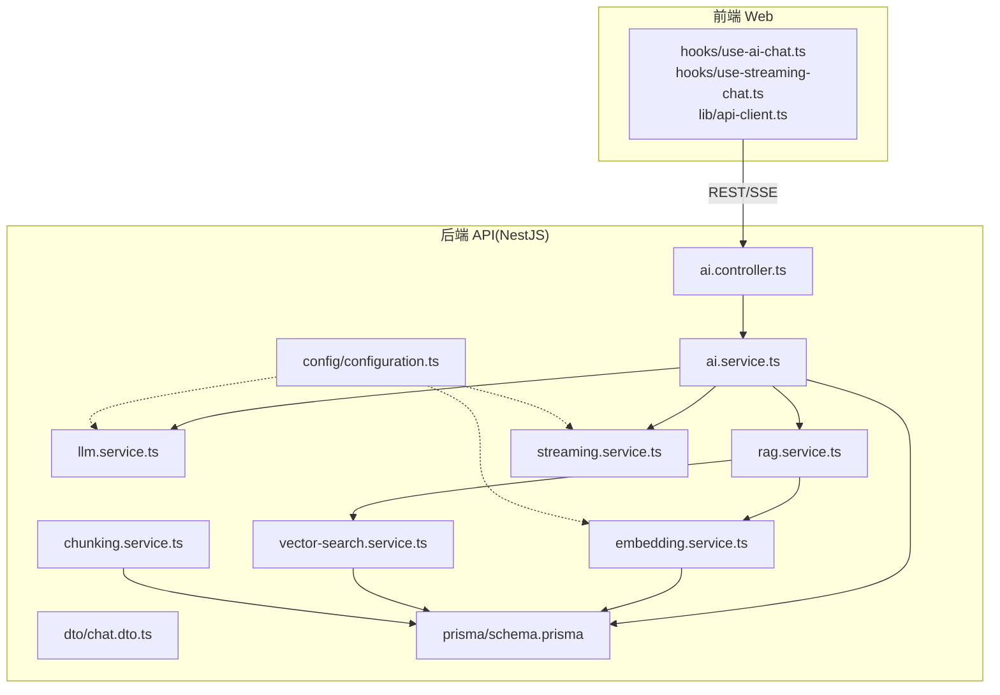

图表来源
- [apps/api/src/modules/ai/ai.controller.ts](file://apps/api/src/modules/ai/ai.controller.ts#L1-L41)
- [apps/api/src/modules/ai/ai.service.ts](file://apps/api/src/modules/ai/ai.service.ts#L1-L420)
- [apps/api/src/modules/ai/llm.service.ts](file://apps/api/src/modules/ai/llm.service.ts#L1-L110)
- [apps/api/src/modules/ai/rag.service.ts](file://apps/api/src/modules/ai/rag.service.ts#L1-L248)
- [apps/api/src/modules/ai/embedding.service.ts](file://apps/api/src/modules/ai/embedding.service.ts#L1-L128)
- [apps/api/src/modules/ai/vector-search.service.ts](file://apps/api/src/modules/ai/vector-search.service.ts#L1-L140)
- [apps/api/src/modules/ai/streaming.service.ts](file://apps/api/src/modules/ai/streaming.service.ts#L1-L123)
- [apps/api/src/modules/ai/chunking.service.ts](file://apps/api/src/modules/ai/chunking.service.ts#L1-L203)
- [apps/api/src/modules/ai/dto/chat.dto.ts](file://apps/api/src/modules/ai/dto/chat.dto.ts#L1-L40)
- [apps/api/src/config/configuration.ts](file://apps/api/src/config/configuration.ts#L1-L30)
- [apps/api/prisma/schema.prisma](file://apps/api/prisma/schema.prisma#L1-L276)

章节来源
- [apps/api/src/modules/ai/ai.controller.ts](file://apps/api/src/modules/ai/ai.controller.ts#L1-L41)
- [apps/api/src/modules/ai/ai.service.ts](file://apps/api/src/modules/ai/ai.service.ts#L1-L420)
- [apps/api/src/config/configuration.ts](file://apps/api/src/config/configuration.ts#L1-L30)
- [apps/api/prisma/schema.prisma](file://apps/api/prisma/schema.prisma#L1-L276)

## 核心组件
- LLM 服务：封装模型调用、温度与最大 token 控制、响应解析与日志。
- RAG 服务：检索相关文档块、构建上下文、注入系统提示、抽取引用。
- 向量检索：基于嵌入向量相似度搜索，支持按文档、文件夹、标签过滤。
- 嵌入服务：文本向量化与批量请求、内存缓存与 TTL。
- 分块服务：按标题与段落切分、重叠拼接、token 估算与去重。
- 流式服务：SSE 流式输出增量内容、统计 token 使用、结束事件聚合。
- AI 服务：统一编排对话流程、历史构建、摘要与建议生成、持久化与计费统计。
- 控制器与 DTO：暴露 REST/SSE 接口、参数校验与约束。
- 配置中心：统一读取 AI 服务地址、模型、API Key 等。
- 数据模型：Prisma 定义对话、消息、文档、分块、标签等实体。

章节来源
- [apps/api/src/modules/ai/llm.service.ts](file://apps/api/src/modules/ai/llm.service.ts#L1-L110)
- [apps/api/src/modules/ai/rag.service.ts](file://apps/api/src/modules/ai/rag.service.ts#L1-L248)
- [apps/api/src/modules/ai/vector-search.service.ts](file://apps/api/src/modules/ai/vector-search.service.ts#L1-L140)
- [apps/api/src/modules/ai/embedding.service.ts](file://apps/api/src/modules/ai/embedding.service.ts#L1-L128)
- [apps/api/src/modules/ai/chunking.service.ts](file://apps/api/src/modules/ai/chunking.service.ts#L1-L203)
- [apps/api/src/modules/ai/streaming.service.ts](file://apps/api/src/modules/ai/streaming.service.ts#L1-L123)
- [apps/api/src/modules/ai/ai.service.ts](file://apps/api/src/modules/ai/ai.service.ts#L1-L420)
- [apps/api/src/modules/ai/dto/chat.dto.ts](file://apps/api/src/modules/ai/dto/chat.dto.ts#L1-L40)
- [apps/api/src/config/configuration.ts](file://apps/api/src/config/configuration.ts#L1-L30)
- [apps/api/prisma/schema.prisma](file://apps/api/prisma/schema.prisma#L126-L175)

## 架构总览
系统围绕“对话编排层(AI Service)”展开，上承前端交互，下接 LLM/RAG/向量检索/嵌入/数据库。AI Service 根据模式选择通用对话或 RAG 流程；流式场景由 Streaming Service 提供增量输出；RAG 流程先检索再调用 LLM 并抽取引用；嵌入与向量检索支撑知识库上下文召回。

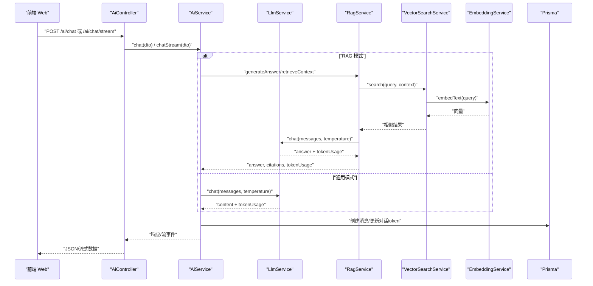

图表来源
- [apps/api/src/modules/ai/ai.controller.ts](file://apps/api/src/modules/ai/ai.controller.ts#L1-L41)
- [apps/api/src/modules/ai/ai.service.ts](file://apps/api/src/modules/ai/ai.service.ts#L50-L144)
- [apps/api/src/modules/ai/llm.service.ts](file://apps/api/src/modules/ai/llm.service.ts#L37-L86)
- [apps/api/src/modules/ai/rag.service.ts](file://apps/api/src/modules/ai/rag.service.ts#L71-L141)
- [apps/api/src/modules/ai/vector-search.service.ts](file://apps/api/src/modules/ai/vector-search.service.ts#L36-L67)
- [apps/api/src/modules/ai/embedding.service.ts](file://apps/api/src/modules/ai/embedding.service.ts#L33-L79)

## 详细组件分析

### LLM 服务（模型调用与参数）
- 功能要点
  - 通过配置中心读取基础地址、API Key、模型名。
  - 支持 temperature 与可选 max_tokens 参数传入。
  - 解析响应中的 usage 统计，记录日志。
- 参数配置
  - temperature 默认值在调用处设定，可在请求 DTO 中覆盖。
  - max_tokens 可在调用时传入，未传入时由后端决定。
- 错误处理
  - 非 OK 响应抛出错误，便于上层捕获与降级。
- 性能与成本
  - 记录处理耗时与 token 使用，便于成本统计与优化。

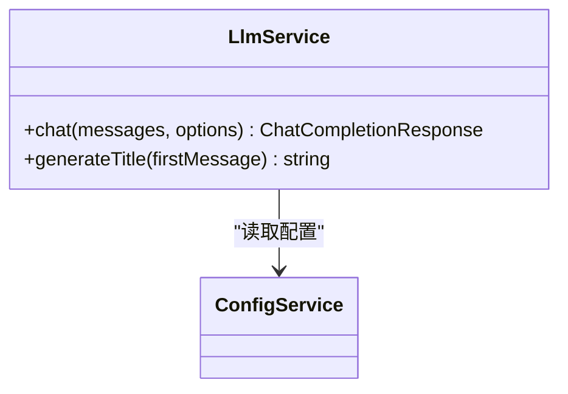

图表来源
- [apps/api/src/modules/ai/llm.service.ts](file://apps/api/src/modules/ai/llm.service.ts#L19-L110)
- [apps/api/src/config/configuration.ts](file://apps/api/src/config/configuration.ts#L17-L23)

章节来源
- [apps/api/src/modules/ai/llm.service.ts](file://apps/api/src/modules/ai/llm.service.ts#L1-L110)
- [apps/api/src/config/configuration.ts](file://apps/api/src/config/configuration.ts#L1-L30)

### RAG 服务（检索-生成-引用）
- 功能要点
  - 检索相似文档块，构建上下文字符串，注入系统提示。
  - 调用 LLM 生成答案，抽取引用标记并映射到文档片段。
  - 支持仅检索上下文（retrieveContext），用于流式前置上下文注入。
- 上下文构建
  - 将检索结果按序号编号，带标题与分隔线，便于模型引用。
- 引用抽取
  - 正则匹配引用标记，去重并构造引用列表，含片段摘录与相似度。
- 性能与成本
  - 记录处理耗时与 token 使用，便于成本归因。

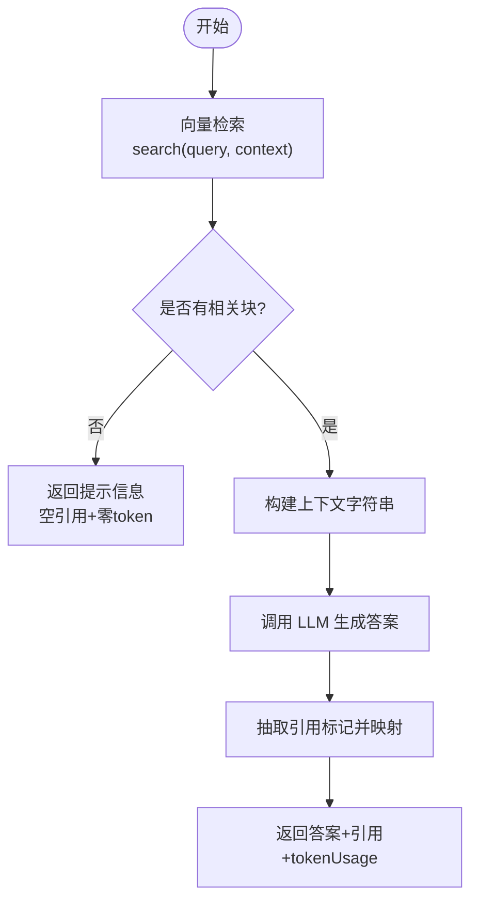

图表来源
- [apps/api/src/modules/ai/rag.service.ts](file://apps/api/src/modules/ai/rag.service.ts#L71-L141)
- [apps/api/src/modules/ai/vector-search.service.ts](file://apps/api/src/modules/ai/vector-search.service.ts#L36-L67)

章节来源
- [apps/api/src/modules/ai/rag.service.ts](file://apps/api/src/modules/ai/rag.service.ts#L1-L248)
- [apps/api/src/modules/ai/vector-search.service.ts](file://apps/api/src/modules/ai/vector-search.service.ts#L1-L140)

### 向量检索服务（过滤与相似度）
- 功能要点
  - 支持按 documentIds、folderId、tagIds 过滤。
  - 使用向量内积计算相似度，阈值与数量限制可配置。
- SQL 实现
  - 使用原生 SQL 执行向量距离查询，返回相似度与文档元信息。

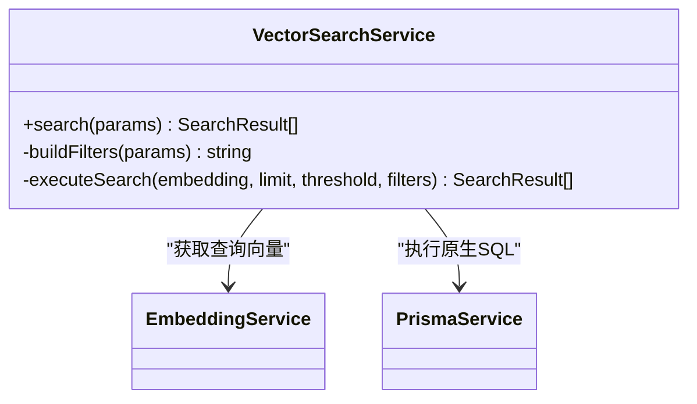

图表来源
- [apps/api/src/modules/ai/vector-search.service.ts](file://apps/api/src/modules/ai/vector-search.service.ts#L24-L140)
- [apps/api/src/modules/ai/embedding.service.ts](file://apps/api/src/modules/ai/embedding.service.ts#L10-L128)

章节来源
- [apps/api/src/modules/ai/vector-search.service.ts](file://apps/api/src/modules/ai/vector-search.service.ts#L1-L140)

### 嵌入服务（向量与缓存）
- 功能要点
  - 文本向量化，支持批量请求（阿里百炼限制每批最多 25）。
  - 内存缓存（TTL=7天），命中直接返回向量与 token 估算。
  - 提供 token 估算逻辑（中文与英文字符分别估算）。
- 扩展点
  - 可替换为外部向量库或本地模型，需保证维度与距离度量一致。

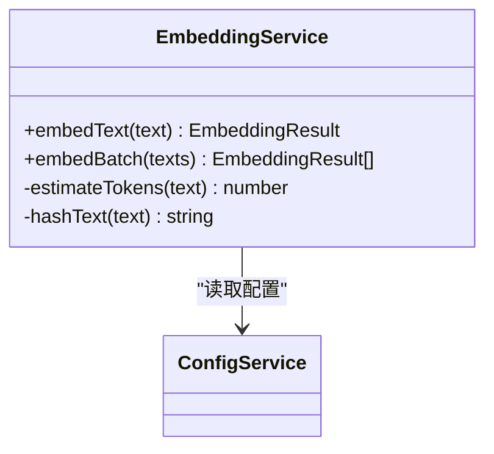

图表来源
- [apps/api/src/modules/ai/embedding.service.ts](file://apps/api/src/modules/ai/embedding.service.ts#L10-L128)
- [apps/api/src/config/configuration.ts](file://apps/api/src/config/configuration.ts#L17-L23)

章节来源
- [apps/api/src/modules/ai/embedding.service.ts](file://apps/api/src/modules/ai/embedding.service.ts#L1-L128)

### 分块服务（标题感知与重叠）
- 功能要点
  - 按 Markdown 标题分割文档，再对每个部分进行固定大小与重叠的分块。
  - 估算每块 token 数量，计算内容哈希用于去重。
- 参数
  - chunkSize、chunkOverlap、minChunkSize 可配置，默认值已内置。

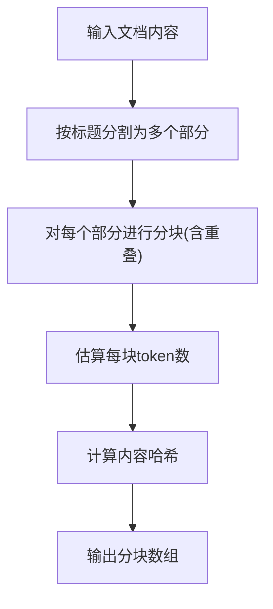

图表来源
- [apps/api/src/modules/ai/chunking.service.ts](file://apps/api/src/modules/ai/chunking.service.ts#L31-L167)

章节来源
- [apps/api/src/modules/ai/chunking.service.ts](file://apps/api/src/modules/ai/chunking.service.ts#L1-L203)

### 流式服务（SSE 增量输出）
- 功能要点
  - 以流式方式接收模型输出，逐片推送 chunk 事件。
  - 在 done 事件中汇总完整内容与 tokenUsage。
  - 记录处理耗时，便于性能分析。
- 事件类型
  - start、chunk、done、error 等，前端据此渲染与收尾。

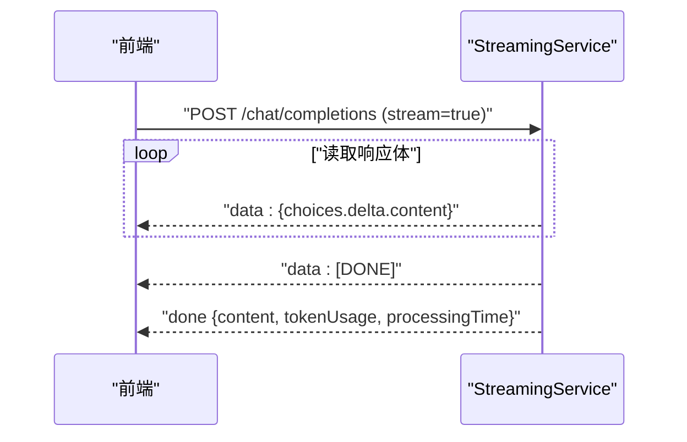

图表来源
- [apps/api/src/modules/ai/streaming.service.ts](file://apps/api/src/modules/ai/streaming.service.ts#L27-L122)

章节来源
- [apps/api/src/modules/ai/streaming.service.ts](file://apps/api/src/modules/ai/streaming.service.ts#L1-L123)

### AI 服务（对话编排与提示词）
- 功能要点
  - 对话创建/获取、历史构建（最近 N 条）、消息持久化。
  - 通用模式与 RAG 模式的分流处理。
  - 流式场景：先检索上下文注入系统提示，再启动流式生成。
  - 摘要与建议：基于历史文本生成总结与问题建议。
- 提示词工程
  - general：通用助手风格，简洁专业。
  - knowledge_base：严格依据参考资料回答，标注来源。
  - summary：对话摘要，限定长度与要点。
  - suggestion：基于最近对话建议后续问题。
- 历史管理
  - 通用模式：保留系统提示 + 最近若干条消息。
  - RAG 模式：将检索到的上下文插入系统提示后作为上下文注入。

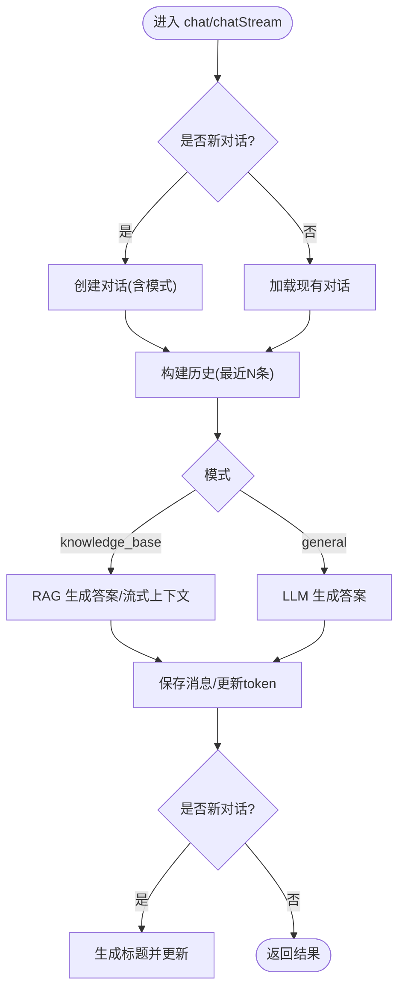

图表来源
- [apps/api/src/modules/ai/ai.service.ts](file://apps/api/src/modules/ai/ai.service.ts#L50-L144)

章节来源
- [apps/api/src/modules/ai/ai.service.ts](file://apps/api/src/modules/ai/ai.service.ts#L1-L420)

### 控制器与 DTO（接口与参数）
- 接口
  - POST /ai/chat：非流式对话。
  - SSE /ai/chat/stream：流式对话。
  - POST /ai/summarize/:id：生成摘要。
  - POST /ai/suggest/:id：获取建议。
- 参数校验
  - question 必填且最小长度为 1。
  - conversationId 可选（UUID v4）。
  - mode 限定为 general 或 knowledge_base。
  - temperature 0~2。

章节来源
- [apps/api/src/modules/ai/ai.controller.ts](file://apps/api/src/modules/ai/ai.controller.ts#L1-L41)
- [apps/api/src/modules/ai/dto/chat.dto.ts](file://apps/api/src/modules/ai/dto/chat.dto.ts#L1-L40)

### 配置中心（模型与服务地址）
- 读取环境变量，提供默认值：
  - AI_BASE_URL、AI_API_KEY、AI_CHAT_MODEL、AI_EMBEDDING_MODEL。
- 与各服务耦合点：
  - LlmService、StreamingService、EmbeddingService 均通过 ConfigService 注入配置。

章节来源
- [apps/api/src/config/configuration.ts](file://apps/api/src/config/configuration.ts#L17-L23)

### 数据模型（Prisma）
- 关键实体
  - Conversation：对话，包含模式、上下文范围、模型与 token 统计。
  - Message：消息，包含角色、内容、引用、token 使用、模型。
  - Document/DocumentChunk：文档与分块，分块包含向量字段。
  - Tag/DocumentTag：标签与文档关联。
- 关系
  - Conversation 1-N Message。
  - Document 1-N DocumentChunk。
  - Document N-M Tag。

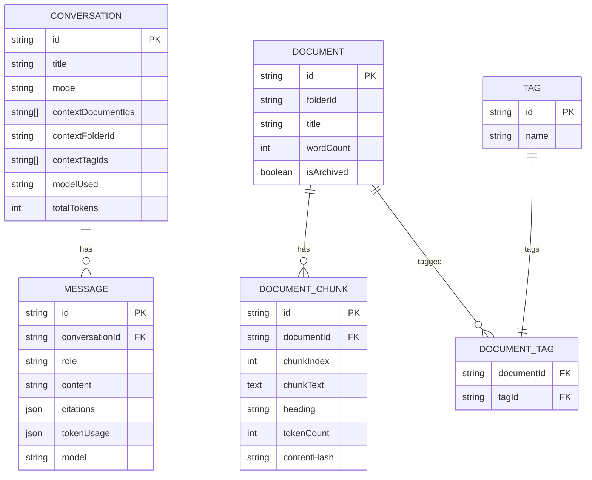

图表来源
- [apps/api/prisma/schema.prisma](file://apps/api/prisma/schema.prisma#L126-L175)
- [apps/api/prisma/schema.prisma](file://apps/api/prisma/schema.prisma#L192-L210)
- [apps/api/prisma/schema.prisma](file://apps/api/prisma/schema.prisma#L78-L102)

章节来源
- [apps/api/prisma/schema.prisma](file://apps/api/prisma/schema.prisma#L1-L276)

### 前端集成（Axios 与 Hooks）
- Axios 客户端
  - 统一 baseURL、超时、拦截器与错误处理。
- 非流式聊天
  - use-ai-chat：提交问题，接收一次性回复与 tokenUsage。
- 流式聊天
  - use-streaming-chat：SSE 读取增量内容，done 时追加完整消息。
- 类型定义
  - packages/shared 提供 AI 配置、对话上下文、引用等类型，确保前后端一致。

章节来源
- [apps/web/lib/api-client.ts](file://apps/web/lib/api-client.ts#L1-L84)
- [apps/web/hooks/use-ai-chat.ts](file://apps/web/hooks/use-ai-chat.ts#L1-L117)
- [apps/web/hooks/use-streaming-chat.ts](file://apps/web/hooks/use-streaming-chat.ts#L1-L166)
- [packages/shared/src/types/ai.ts](file://packages/shared/src/types/ai.ts#L28-L42)
- [packages/shared/src/types/entities.ts](file://packages/shared/src/types/entities.ts#L67-L98)

## 依赖分析
- 组件内聚与耦合
  - AiService 作为编排者，与 LlmService、RagService、StreamingService、ConversationsService 耦合度较高，职责清晰。
  - VectorSearchService 与 EmbeddingService 低耦合，通过嵌入接口交互。
- 外部依赖
  - 配置中心 ConfigService。
  - 数据库 Prisma。
  - 外部 LLM 服务（通过 AI_BASE_URL、AI_API_KEY、模型名配置）。
- 循环依赖
  - 未见循环依赖迹象。

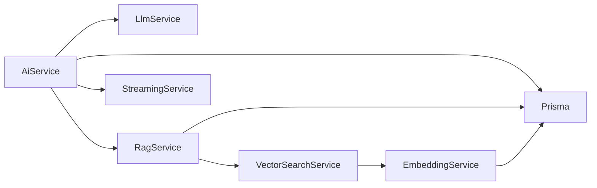

图表来源
- [apps/api/src/modules/ai/ai.service.ts](file://apps/api/src/modules/ai/ai.service.ts#L39-L45)
- [apps/api/src/modules/ai/rag.service.ts](file://apps/api/src/modules/ai/rag.service.ts#L63-L66)
- [apps/api/src/modules/ai/vector-search.service.ts](file://apps/api/src/modules/ai/vector-search.service.ts#L28-L31)
- [apps/api/src/modules/ai/embedding.service.ts](file://apps/api/src/modules/ai/embedding.service.ts#L21-L28)

章节来源
- [apps/api/src/modules/ai/ai.service.ts](file://apps/api/src/modules/ai/ai.service.ts#L1-L420)
- [apps/api/src/modules/ai/rag.service.ts](file://apps/api/src/modules/ai/rag.service.ts#L1-L248)
- [apps/api/src/modules/ai/vector-search.service.ts](file://apps/api/src/modules/ai/vector-search.service.ts#L1-L140)
- [apps/api/src/modules/ai/embedding.service.ts](file://apps/api/src/modules/ai/embedding.service.ts#L1-L128)

## 性能考虑
- 上下文窗口优化
  - 通用模式历史仅保留最近若干条，避免超出模型上下文。
  - RAG 模式将检索到的上下文注入系统提示后，结合模型上下文限制进行裁剪。
- token 使用统计
  - LLM/RAG 均返回 usage，AiService 在保存消息时累加到对话 totalTokens，便于成本归集。
- 响应时间分析
  - 各服务均记录处理耗时，可用于性能瓶颈定位。
- 成本控制
  - 通过 temperature 与 max_tokens 控制生成长度与随机性。
  - 对高频文本使用嵌入缓存，减少重复请求。
  - 合理设置向量检索阈值与数量上限，平衡召回与延迟。

章节来源
- [apps/api/src/modules/ai/ai.service.ts](file://apps/api/src/modules/ai/ai.service.ts#L149-L154)
- [apps/api/src/modules/ai/llm.service.ts](file://apps/api/src/modules/ai/llm.service.ts#L44-L86)
- [apps/api/src/modules/ai/rag.service.ts](file://apps/api/src/modules/ai/rag.service.ts#L71-L141)
- [apps/api/src/modules/ai/embedding.service.ts](file://apps/api/src/modules/ai/embedding.service.ts#L33-L79)

## 故障排查指南
- 常见错误类型
  - LLM API 错误：非 OK 响应、网络异常、鉴权失败。
  - 向量检索异常：数据库连接、SQL 执行失败、向量维度不匹配。
  - 流式读取异常：SSE 连接中断、解析错误、客户端取消。
- 日志与可观测性
  - 各服务均记录关键指标（处理耗时、token 使用、错误信息）。
- 建议排查步骤
  - 检查 AI_BASE_URL、AI_API_KEY、模型名配置是否正确。
  - 查看数据库连接与向量扩展是否启用。
  - 确认前端请求参数（question、conversationId、mode、temperature）合法。
  - 观察流式事件序列，定位首次报错位置。

章节来源
- [apps/api/src/modules/ai/llm.service.ts](file://apps/api/src/modules/ai/llm.service.ts#L61-L85)
- [apps/api/src/modules/ai/vector-search.service.ts](file://apps/api/src/modules/ai/vector-search.service.ts#L104-L138)
- [apps/api/src/modules/ai/streaming.service.ts](file://apps/api/src/modules/ai/streaming.service.ts#L117-L121)
- [apps/web/hooks/use-streaming-chat.ts](file://apps/web/hooks/use-streaming-chat.ts#L76-L135)

## 结论
本子系统以“编排层 + 模型层 + 检索层”的清晰分层实现了通用对话与知识库问答两大能力，并通过流式输出提升用户体验。通过统一配置中心、完善的日志与 token 统计，具备良好的可运维性与成本控制能力。建议在后续版本中引入更细粒度的成本计量、多模型并行评估与自动切换策略，以及更丰富的提示词模板与 A/B 测试框架。

## 附录

### 模型适配策略与最佳实践
- 适配点
  - 通过配置中心切换 AI_BASE_URL、AI_CHAT_MODEL、AI_EMBEDDING_MODEL。
  - LlmService/StreamingService/EmbeddingService 读取配置，无需修改代码即可切换供应商或模型。
- 参数策略
  - temperature：通用对话默认 0.7；摘要/标题生成建议更低（如 0.3）。
  - max_tokens：根据任务复杂度与成本预算设置上限。
- 替换建议
  - 新增服务类实现相同接口，替换注入实例即可无缝迁移。

章节来源
- [apps/api/src/config/configuration.ts](file://apps/api/src/config/configuration.ts#L17-L23)
- [apps/api/src/modules/ai/llm.service.ts](file://apps/api/src/modules/ai/llm.service.ts#L26-L32)
- [apps/api/src/modules/ai/streaming.service.ts](file://apps/api/src/modules/ai/streaming.service.ts#L16-L22)
- [apps/api/src/modules/ai/embedding.service.ts](file://apps/api/src/modules/ai/embedding.service.ts#L21-L28)

### 提示词工程与应用场景
- 通用模式（general）
  - 设计原则：简洁、专业、可读性强；允许适度创造性。
- 知识库模式（knowledge_base）
  - 设计原则：严格依据参考资料；标注来源；无信息时明确提示。
- 摘要模式（summary）
  - 设计原则：限定长度、提取关键结论、保留重要细节。
- 建议模式（suggestion）
  - 设计原则：具体可操作、与主题相关、给出 3 个建议。

章节来源
- [apps/api/src/modules/ai/ai.service.ts](file://apps/api/src/modules/ai/ai.service.ts#L14-L37)
- [apps/api/src/modules/ai/rag.service.ts](file://apps/api/src/modules/ai/rag.service.ts#L50-L61)

### 对话历史构建与管理
- 通用模式
  - 系统提示 + 历史消息 + 当前问题。
- RAG 模式
  - 系统提示 + 检索上下文 + 历史消息 + 当前问题。
- 截断策略
  - 通用模式：保留最近 N 条（如 20）。
  - RAG 模式：优先保留上下文与近期对话，避免溢出。

章节来源
- [apps/api/src/modules/ai/ai.service.ts](file://apps/api/src/modules/ai/ai.service.ts#L149-L187)
- [apps/api/src/modules/ai/rag.service.ts](file://apps/api/src/modules/ai/rag.service.ts#L105-L112)

### 性能监控与成本控制方案
- 监控项
  - 响应时间：各服务记录处理耗时。
  - token 使用：usage 返回值与对话累计统计。
  - 错误率：日志错误计数与告警。
- 成本控制
  - 限制 temperature 与 max_tokens。
  - 启用嵌入缓存，降低重复请求。
  - 合理设置向量检索阈值与数量上限。

章节来源
- [apps/api/src/modules/ai/llm.service.ts](file://apps/api/src/modules/ai/llm.service.ts#L44-L86)
- [apps/api/src/modules/ai/rag.service.ts](file://apps/api/src/modules/ai/rag.service.ts#L71-L141)
- [apps/api/src/modules/ai/embedding.service.ts](file://apps/api/src/modules/ai/embedding.service.ts#L33-L79)

### 扩展与替换最佳实践
- 新增模型
  - 在配置中心新增模型别名与默认参数。
  - 在 AiService 中按需扩展模式分支。
- 新增供应商
  - 新建服务类实现统一接口，注入 ConfigService。
  - 通过工厂或策略模式按配置动态选择实现。
- 类型一致性
  - 前后端共享类型定义，避免字段不一致导致的兼容问题。

章节来源
- [packages/shared/src/types/ai.ts](file://packages/shared/src/types/ai.ts#L28-L42)
- [apps/api/src/config/configuration.ts](file://apps/api/src/config/configuration.ts#L17-L23)
- [apps/api/src/modules/ai/ai.service.ts](file://apps/api/src/modules/ai/ai.service.ts#L71-L104)