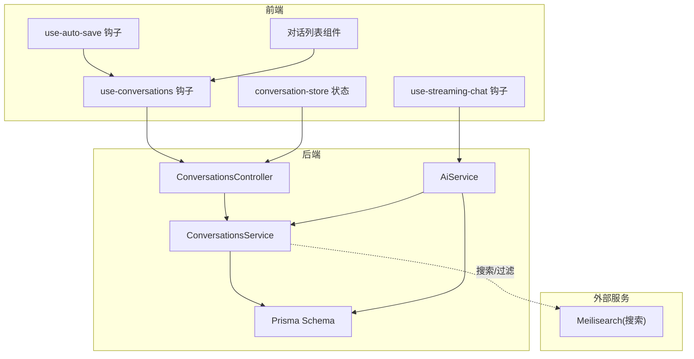
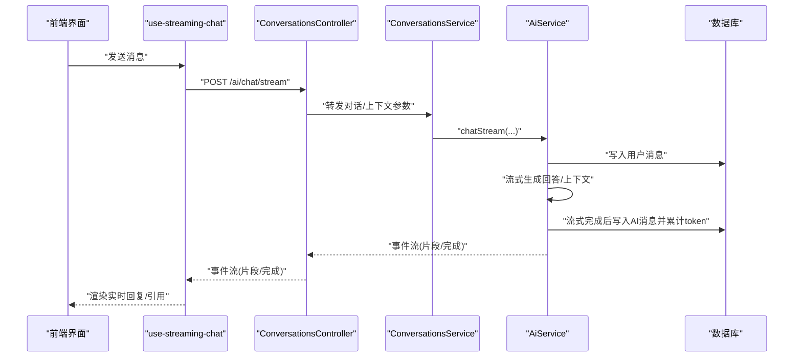
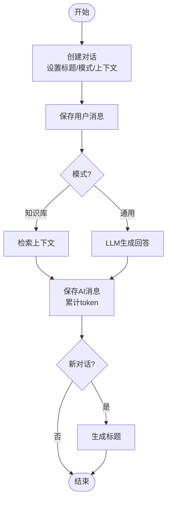
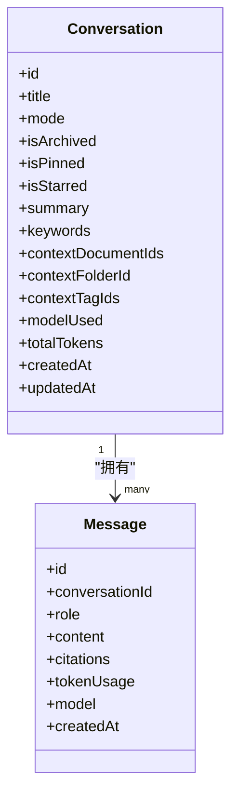
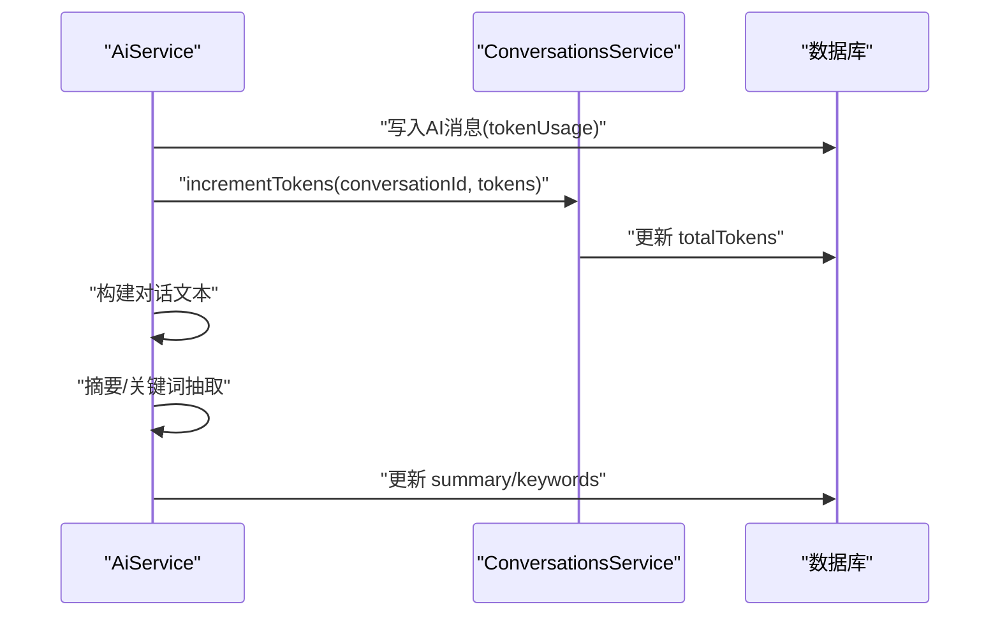
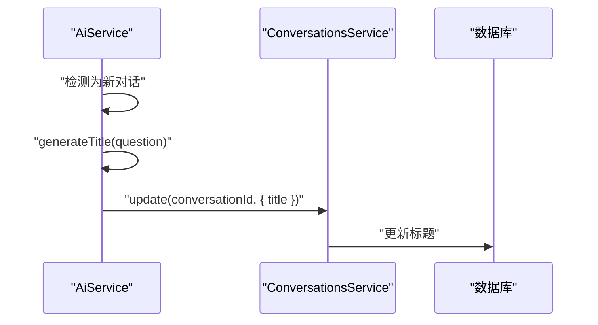
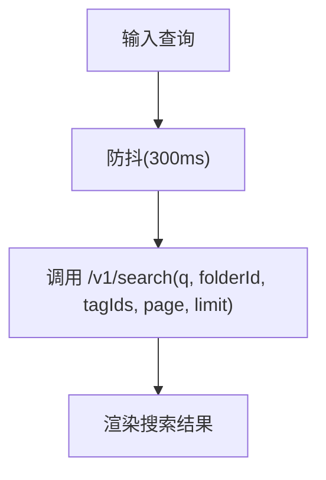
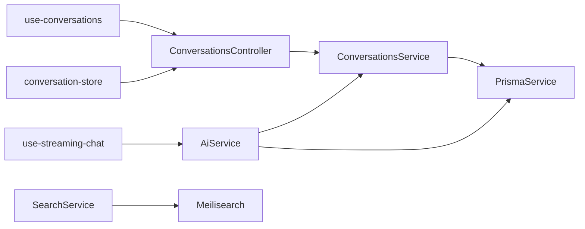

# 对话管理

<cite>
**本文引用的文件**
- [apps/api/src/modules/conversations/conversations.service.ts](file://apps/api/src/modules/conversations/conversations.service.ts)
- [apps/api/src/modules/conversations/conversations.controller.ts](file://apps/api/src/modules/conversations/conversations.controller.ts)
- [apps/api/src/modules/conversations/dto/create-conversation.dto.ts](file://apps/api/src/modules/conversations/dto/create-conversation.dto.ts)
- [apps/api/src/modules/conversations/dto/update-conversation.dto.ts](file://apps/api/src/modules/conversations/dto/update-conversation.dto.ts)
- [apps/api/src/modules/conversations/dto/query-conversation.dto.ts](file://apps/api/src/modules/conversations/dto/query-conversation.dto.ts)
- [apps/api/src/modules/conversations/dto/search.dto.ts](file://apps/api/src/modules/conversations/dto/search.dto.ts)
- [apps/api/src/modules/conversations/dto/batch-operation.dto.ts](file://apps/api/src/modules/conversations/dto/batch-operation.dto.ts)
- [apps/api/src/modules/ai/ai.service.ts](file://apps/api/src/modules/ai/ai.service.ts)
- [apps/api/prisma/schema.prisma](file://apps/api/prisma/schema.prisma)
- [apps/web/hooks/use-conversations.ts](file://apps/web/hooks/use-conversations.ts)
- [apps/web/stores/conversation-store.ts](file://apps/web/stores/conversation-store.ts)
- [apps/web/hooks/use-auto-save.ts](file://apps/web/hooks/use-auto-save.ts)
- [apps/web/hooks/use-streaming-chat.ts](file://apps/web/hooks/use-streaming-chat.ts)
- [apps/web/components/conversations/conversation-list.tsx](file://apps/web/components/conversations/conversation-list.tsx)
- [apps/web/components/conversations/conversation-card.tsx](file://apps/web/components/conversations/conversation-card.tsx)
- [apps/api/src/modules/search/search.service.ts](file://apps/api/src/modules/search/search.service.ts)
</cite>

## 目录
1. [简介](#简介)
2. [项目结构](#项目结构)
3. [核心组件](#核心组件)
4. [架构总览](#架构总览)
5. [详细组件分析](#详细组件分析)
6. [依赖分析](#依赖分析)
7. [性能考虑](#性能考虑)
8. [故障排查指南](#故障排查指南)
9. [结论](#结论)
10. [附录](#附录)

## 简介
本文件面向 APP2 项目的“对话管理”子系统，系统性梳理对话生命周期、上下文管理、统计与分析、标题自动生成、搜索与过滤、数据持久化与备份恢复、以及隐私与安全最佳实践。文档既覆盖后端 API 的设计与实现，也涵盖前端交互与状态管理，帮助开发者与产品人员快速理解与扩展该能力。

## 项目结构
对话管理涉及前后端协作的关键模块如下：
- 后端
  - 控制器与服务：负责对话的创建、查询、更新、删除、批量操作、搜索等
  - 数据模型：Prisma 定义的 Conversation、Message 表及索引
  - AI 服务：负责消息处理、流式响应、摘要与关键词抽取、标题生成
- 前端
  - React Query 钩子：封装对话列表、详情、创建、更新、删除等请求
  - Zustand 状态：管理当前对话、模式与上下文
  - 流式聊天钩子：封装 SSE/流式响应接收与 UI 更新
  - 自动保存钩子：节流保存状态与错误反馈
  - UI 组件：对话卡片与列表展示

图表来源
- [apps/api/src/modules/conversations/conversations.controller.ts](file://apps/api/src/modules/conversations/conversations.controller.ts#L25-L106)
- [apps/api/src/modules/conversations/conversations.service.ts](file://apps/api/src/modules/conversations/conversations.service.ts#L9-L303)
- [apps/api/src/modules/ai/ai.service.ts](file://apps/api/src/modules/ai/ai.service.ts#L11-L419)
- [apps/api/prisma/schema.prisma](file://apps/api/prisma/schema.prisma#L126-L175)
- [apps/web/hooks/use-conversations.ts](file://apps/web/hooks/use-conversations.ts#L1-L100)
- [apps/web/hooks/use-streaming-chat.ts](file://apps/web/hooks/use-streaming-chat.ts#L1-L166)
- [apps/web/stores/conversation-store.ts](file://apps/web/stores/conversation-store.ts#L1-L55)
- [apps/web/hooks/use-auto-save.ts](file://apps/web/hooks/use-auto-save.ts#L1-L72)
- [apps/web/components/conversations/conversation-list.tsx](file://apps/web/components/conversations/conversation-list.tsx#L1-L49)

章节来源
- [apps/api/src/modules/conversations/conversations.controller.ts](file://apps/api/src/modules/conversations/conversations.controller.ts#L25-L106)
- [apps/api/src/modules/conversations/conversations.service.ts](file://apps/api/src/modules/conversations/conversations.service.ts#L9-L303)
- [apps/api/src/modules/ai/ai.service.ts](file://apps/api/src/modules/ai/ai.service.ts#L11-L419)
- [apps/api/prisma/schema.prisma](file://apps/api/prisma/schema.prisma#L126-L175)
- [apps/web/hooks/use-conversations.ts](file://apps/web/hooks/use-conversations.ts#L1-L100)
- [apps/web/hooks/use-streaming-chat.ts](file://apps/web/hooks/use-streaming-chat.ts#L1-L166)
- [apps/web/stores/conversation-store.ts](file://apps/web/stores/conversation-store.ts#L1-L55)
- [apps/web/hooks/use-auto-save.ts](file://apps/web/hooks/use-auto-save.ts#L1-L72)
- [apps/web/components/conversations/conversation-list.tsx](file://apps/web/components/conversations/conversation-list.tsx#L1-L49)

## 核心组件
- 对话控制器与服务
  - 提供创建、查询、更新、删除、批量操作、搜索等接口
  - 支持分页、排序、过滤（归档、模式、置顶、星标）
- AI 服务
  - 负责消息处理、RAG 模式上下文检索、流式响应、摘要与关键词抽取、标题生成
  - 自动累计 token 使用量
- 前端钩子与状态
  - React Query 管理对话列表与详情
  - Zustand 管理当前对话、模式与上下文
  - 流式聊天钩子处理 SSE/流式事件
  - 自动保存钩子提供节流保存与状态反馈

章节来源
- [apps/api/src/modules/conversations/conversations.controller.ts](file://apps/api/src/modules/conversations/conversations.controller.ts#L25-L106)
- [apps/api/src/modules/conversations/conversations.service.ts](file://apps/api/src/modules/conversations/conversations.service.ts#L9-L303)
- [apps/api/src/modules/ai/ai.service.ts](file://apps/api/src/modules/ai/ai.service.ts#L11-L419)
- [apps/web/hooks/use-conversations.ts](file://apps/web/hooks/use-conversations.ts#L1-L100)
- [apps/web/stores/conversation-store.ts](file://apps/web/stores/conversation-store.ts#L1-L55)
- [apps/web/hooks/use-streaming-chat.ts](file://apps/web/hooks/use-streaming-chat.ts#L1-L166)
- [apps/web/hooks/use-auto-save.ts](file://apps/web/hooks/use-auto-save.ts#L1-L72)

## 架构总览
对话管理采用“前端请求 → 控制器 → 服务 → 数据库/外部服务”的分层架构。AI 服务在对话流程中承担消息构建、上下文检索、流式输出与统计更新职责；前端通过 React Query 与 Zustand 实现状态与 UI 的解耦。

图表来源
- [apps/api/src/modules/conversations/conversations.controller.ts](file://apps/api/src/modules/conversations/conversations.controller.ts#L25-L106)
- [apps/api/src/modules/conversations/conversations.service.ts](file://apps/api/src/modules/conversations/conversations.service.ts#L9-L303)
- [apps/api/src/modules/ai/ai.service.ts](file://apps/api/src/modules/ai/ai.service.ts#L192-L299)
- [apps/web/hooks/use-streaming-chat.ts](file://apps/web/hooks/use-streaming-chat.ts#L33-L138)

## 详细组件分析

### 对话生命周期管理
- 创建
  - 通过控制器接收 DTO，调用服务创建对话，初始字段包含标题、模式、上下文范围（文档/文件夹/标签）与默认值
- 状态维护
  - 支持置顶、星标、归档等状态切换；服务提供对应更新方法
- 自动保存
  - 前端提供自动保存钩子，节流保存状态与错误反馈
- 清理策略
  - 支持批量删除；服务在事务中同时清理对话与消息

图表来源
- [apps/api/src/modules/ai/ai.service.ts](file://apps/api/src/modules/ai/ai.service.ts#L50-L144)
- [apps/api/src/modules/conversations/conversations.service.ts](file://apps/api/src/modules/conversations/conversations.service.ts#L17-L27)

章节来源
- [apps/api/src/modules/conversations/conversations.controller.ts](file://apps/api/src/modules/conversations/conversations.controller.ts#L30-L98)
- [apps/api/src/modules/conversations/conversations.service.ts](file://apps/api/src/modules/conversations/conversations.service.ts#L17-L140)
- [apps/web/hooks/use-auto-save.ts](file://apps/web/hooks/use-auto-save.ts#L14-L52)
- [apps/web/hooks/use-streaming-chat.ts](file://apps/web/hooks/use-streaming-chat.ts#L33-L138)

### 对话上下文管理机制
- 上下文来源
  - 文档 IDs、文件夹 ID、标签 IDs 三类维度
- 动态更新
  - 前端通过状态管理更新上下文；服务提供更新接口
- RAG 模式下的上下文检索
  - AI 服务在流式前检索上下文，并将参考材料注入系统提示

图表来源
- [apps/api/prisma/schema.prisma](file://apps/api/prisma/schema.prisma#L126-L175)

章节来源
- [apps/api/src/modules/conversations/dto/create-conversation.dto.ts](file://apps/api/src/modules/conversations/dto/create-conversation.dto.ts#L10-L41)
- [apps/api/src/modules/conversations/dto/update-conversation.dto.ts](file://apps/api/src/modules/conversations/dto/update-conversation.dto.ts#L4-L31)
- [apps/api/src/modules/ai/ai.service.ts](file://apps/api/src/modules/ai/ai.service.ts#L214-L236)
- [apps/web/stores/conversation-store.ts](file://apps/web/stores/conversation-store.ts#L3-L24)

### 对话统计与分析
- Token 使用量统计
  - 服务在保存消息后累加 totalTokens
- 对话摘要与关键词
  - AI 服务汇总对话文本，生成摘要与关键词并写回对话
- 使用频率分析
  - 前端按最近更新时间排序，结合消息计数进行展示

图表来源
- [apps/api/src/modules/ai/ai.service.ts](file://apps/api/src/modules/ai/ai.service.ts#L125-L144)
- [apps/api/src/modules/ai/ai.service.ts](file://apps/api/src/modules/ai/ai.service.ts#L331-L367)
- [apps/api/src/modules/conversations/conversations.service.ts](file://apps/api/src/modules/conversations/conversations.service.ts#L145-L152)

章节来源
- [apps/api/src/modules/ai/ai.service.ts](file://apps/api/src/modules/ai/ai.service.ts#L125-L144)
- [apps/api/src/modules/ai/ai.service.ts](file://apps/api/src/modules/ai/ai.service.ts#L331-L367)
- [apps/api/src/modules/conversations/conversations.service.ts](file://apps/api/src/modules/conversations/conversations.service.ts#L145-L152)

### 对话标题自动生成
- 触发时机
  - 新对话首次收到用户消息后，AI 服务调用 LLM 生成标题并更新
- 实现要点
  - 通过系统提示词引导生成简洁标题
  - 与流式与非流式两种路径均兼容

图表来源
- [apps/api/src/modules/ai/ai.service.ts](file://apps/api/src/modules/ai/ai.service.ts#L132-L135)

章节来源
- [apps/api/src/modules/ai/ai.service.ts](file://apps/api/src/modules/ai/ai.service.ts#L132-L135)

### 对话搜索与过滤
- 对话级搜索
  - 支持按标题、摘要、消息内容模糊匹配；可叠加模式、置顶、星标过滤
- 文档级搜索
  - 使用 Meilisearch 提供全文检索，支持按文件夹与标签过滤
- 前端集成
  - React Query 钩子对查询进行防抖与缓存

图表来源
- [apps/api/src/modules/search/search.service.ts](file://apps/api/src/modules/search/search.service.ts#L15-L31)
- [apps/web/hooks/use-search.ts](file://apps/web/hooks/use-search.ts#L39-L56)

章节来源
- [apps/api/src/modules/conversations/conversations.service.ts](file://apps/api/src/modules/conversations/conversations.service.ts#L251-L302)
- [apps/api/src/modules/search/search.service.ts](file://apps/api/src/modules/search/search.service.ts#L15-L31)
- [apps/web/hooks/use-search.ts](file://apps/web/hooks/use-search.ts#L39-L56)

### 对话数据持久化与备份恢复
- 数据模型
  - Conversation 与 Message 表，包含上下文范围、摘要、关键词、token 统计等字段
  - 通过 Prisma 管理迁移与索引
- 备份与恢复
  - 建议结合数据库导出/导入与 Prisma 迁移版本管理
  - 对 Meilisearch 的索引可通过重新索引恢复

章节来源
- [apps/api/prisma/schema.prisma](file://apps/api/prisma/schema.prisma#L126-L175)
- [apps/api/src/modules/search/search.service.ts](file://apps/api/src/modules/search/search.service.ts#L33-L60)

### 隐私保护与数据安全最佳实践
- 输入校验
  - DTO 层使用验证装饰器限制类型、长度与枚举值
- 访问控制
  - 建议在控制器层增加鉴权与资源访问控制中间件
- 敏感信息处理
  - 不在日志中打印完整消息内容；对 tokenUsage 等统计字段进行脱敏展示
- 数据最小化
  - 仅存储必要的上下文与统计信息；定期清理长期未使用的对话

章节来源
- [apps/api/src/modules/conversations/dto/create-conversation.dto.ts](file://apps/api/src/modules/conversations/dto/create-conversation.dto.ts#L10-L41)
- [apps/api/src/modules/conversations/dto/update-conversation.dto.ts](file://apps/api/src/modules/conversations/dto/update-conversation.dto.ts#L4-L31)
- [apps/api/src/modules/conversations/dto/query-conversation.dto.ts](file://apps/api/src/modules/conversations/dto/query-conversation.dto.ts#L5-L33)
- [apps/api/src/modules/conversations/dto/search.dto.ts](file://apps/api/src/modules/conversations/dto/search.dto.ts#L5-L41)
- [apps/api/src/modules/conversations/dto/batch-operation.dto.ts](file://apps/api/src/modules/conversations/dto/batch-operation.dto.ts#L4-L16)

## 依赖分析
- 控制器依赖服务；服务依赖 Prisma；AI 服务依赖服务与数据库
- 前端通过钩子与控制器交互；状态通过 Zustand 管理
- 搜索功能依赖 Meilisearch

图表来源
- [apps/api/src/modules/conversations/conversations.controller.ts](file://apps/api/src/modules/conversations/conversations.controller.ts#L18-L28)
- [apps/api/src/modules/conversations/conversations.service.ts](file://apps/api/src/modules/conversations/conversations.service.ts#L12-L12)
- [apps/api/src/modules/ai/ai.service.ts](file://apps/api/src/modules/ai/ai.service.ts#L39-L45)
- [apps/api/src/modules/search/search.service.ts](file://apps/api/src/modules/search/search.service.ts#L10-L13)
- [apps/web/hooks/use-conversations.ts](file://apps/web/hooks/use-conversations.ts#L27-L33)
- [apps/web/hooks/use-streaming-chat.ts](file://apps/web/hooks/use-streaming-chat.ts#L33-L138)
- [apps/web/stores/conversation-store.ts](file://apps/web/stores/conversation-store.ts#L26-L54)

章节来源
- [apps/api/src/modules/conversations/conversations.controller.ts](file://apps/api/src/modules/conversations/conversations.controller.ts#L18-L28)
- [apps/api/src/modules/conversations/conversations.service.ts](file://apps/api/src/modules/conversations/conversations.service.ts#L12-L12)
- [apps/api/src/modules/ai/ai.service.ts](file://apps/api/src/modules/ai/ai.service.ts#L39-L45)
- [apps/api/src/modules/search/search.service.ts](file://apps/api/src/modules/search/search.service.ts#L10-L13)
- [apps/web/hooks/use-conversations.ts](file://apps/web/hooks/use-conversations.ts#L27-L33)
- [apps/web/hooks/use-streaming-chat.ts](file://apps/web/hooks/use-streaming-chat.ts#L33-L138)
- [apps/web/stores/conversation-store.ts](file://apps/web/stores/conversation-store.ts#L26-L54)

## 性能考虑
- 分页与排序
  - 列表查询支持分页与多字段排序，避免一次性加载过多数据
- 索引优化
  - 对 Conversation 的归档、置顶、星标、更新时间建立索引，提升查询性能
- 流式响应
  - 使用流式接口降低首字节延迟，提升用户体验
- 防抖搜索
  - 前端对搜索关键词进行防抖，减少无效请求

章节来源
- [apps/api/src/modules/conversations/conversations.service.ts](file://apps/api/src/modules/conversations/conversations.service.ts#L32-L77)
- [apps/api/prisma/schema.prisma](file://apps/api/prisma/schema.prisma#L150-L155)
- [apps/web/hooks/use-search.ts](file://apps/web/hooks/use-search.ts#L39-L56)

## 故障排查指南
- 对话不存在
  - 服务在读取/更新/删除时若找不到对话会抛出异常，前端需捕获并提示
- 流式响应错误
  - 流式钩子捕获网络与解析异常，显示错误信息并允许取消
- 自动保存失败
  - 自动保存钩子记录错误状态与时间，便于定位问题

章节来源
- [apps/api/src/modules/conversations/conversations.service.ts](file://apps/api/src/modules/conversations/conversations.service.ts#L92-L96)
- [apps/api/src/modules/conversations/conversations.service.ts](file://apps/api/src/modules/conversations/conversations.service.ts#L130-L140)
- [apps/web/hooks/use-streaming-chat.ts](file://apps/web/hooks/use-streaming-chat.ts#L125-L135)
- [apps/web/hooks/use-auto-save.ts](file://apps/web/hooks/use-auto-save.ts#L24-L32)

## 结论
对话管理子系统通过清晰的分层设计与前后端协同，实现了从创建到统计分析的全生命周期管理。AI 服务在对话流程中承担关键角色，提供上下文检索、流式响应与智能摘要。配合前端状态与钩子，系统在可用性与性能上取得良好平衡。建议后续完善鉴权与审计日志，进一步强化数据安全与合规。

## 附录
- 前端对话列表展示
  - 使用卡片组件展示标题、消息数与更新时间，支持删除操作

章节来源
- [apps/web/components/conversations/conversation-list.tsx](file://apps/web/components/conversations/conversation-list.tsx#L7-L49)
- [apps/web/components/conversations/conversation-card.tsx](file://apps/web/components/conversations/conversation-card.tsx#L18-L59)