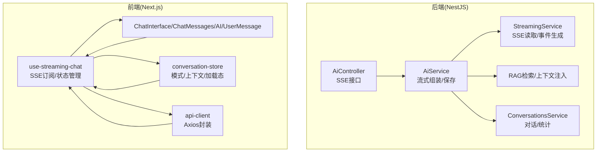
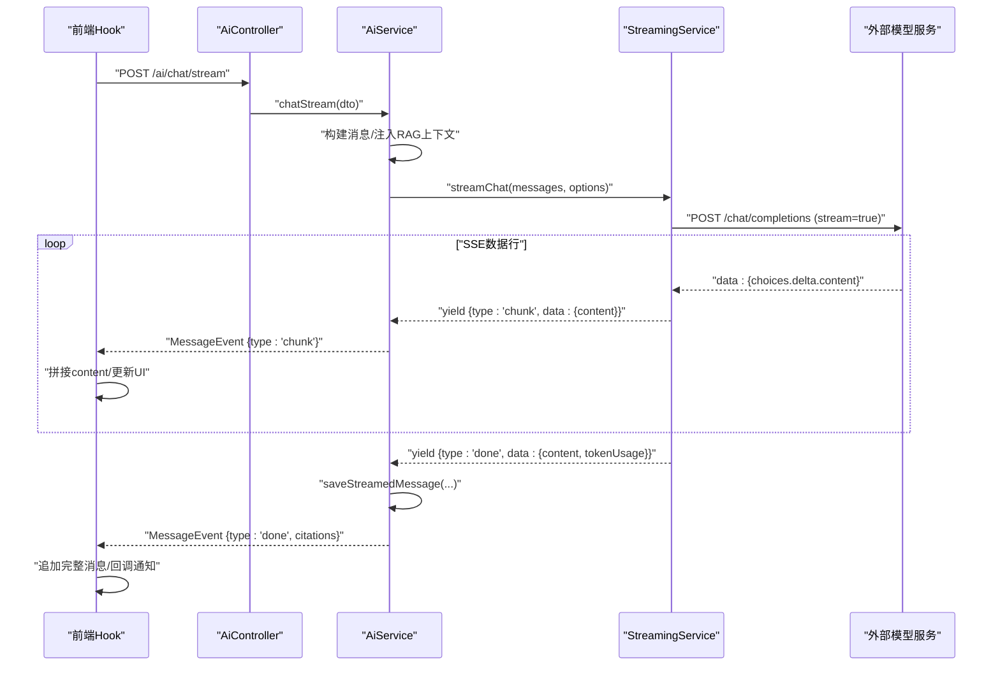
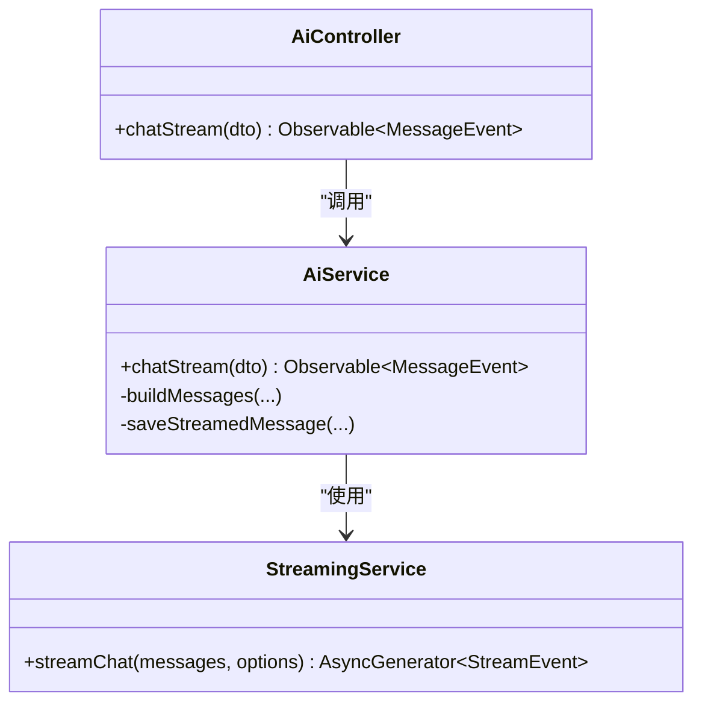
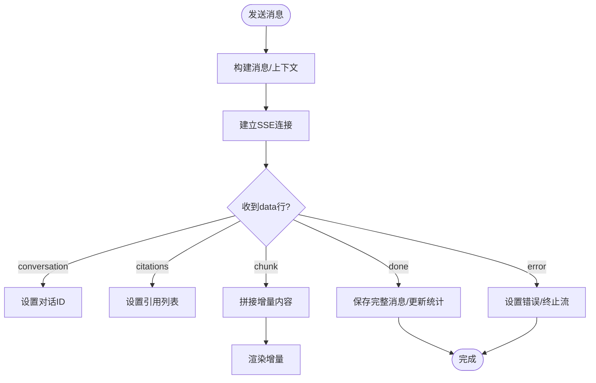
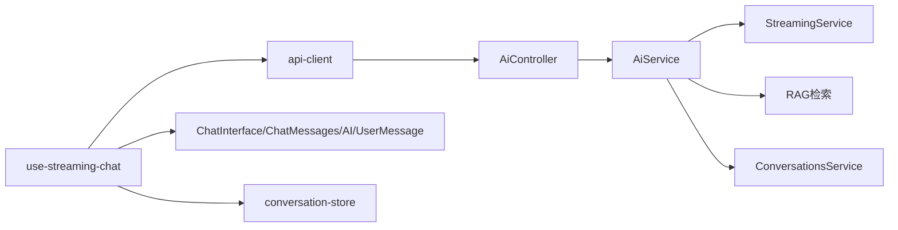

# 流式对话服务

<cite>
**本文引用的文件**
- [apps/api/src/modules/ai/streaming.service.ts](file://apps/api/src/modules/ai/streaming.service.ts)
- [apps/api/src/modules/ai/ai.controller.ts](file://apps/api/src/modules/ai/ai.controller.ts)
- [apps/api/src/modules/ai/ai.service.ts](file://apps/api/src/modules/ai/ai.service.ts)
- [apps/api/src/modules/ai/dto/chat.dto.ts](file://apps/api/src/modules/ai/dto/chat.dto.ts)
- [apps/web/hooks/use-streaming-chat.ts](file://apps/web/hooks/use-streaming-chat.ts)
- [apps/web/components/ai/streaming-message.tsx](file://apps/web/components/ai/streaming-message.tsx)
- [apps/web/components/ai/chat-interface.tsx](file://apps/web/components/ai/chat-interface.tsx)
- [apps/web/components/ai/chat-messages.tsx](file://apps/web/components/ai/chat-messages.tsx)
- [apps/web/components/ai/ai-message.tsx](file://apps/web/components/ai/ai-message.tsx)
- [apps/web/components/ai/user-message.tsx](file://apps/web/components/ai/user-message.tsx)
- [apps/web/stores/conversation-store.ts](file://apps/web/stores/conversation-store.ts)
- [apps/web/lib/api-client.ts](file://apps/web/lib/api-client.ts)
- [packages/shared/src/types/ai.ts](file://packages/shared/src/types/ai.ts)
</cite>

## 目录
1. [简介](#简介)
2. [项目结构](#项目结构)
3. [核心组件](#核心组件)
4. [架构总览](#架构总览)
5. [组件详解](#组件详解)
6. [依赖关系分析](#依赖关系分析)
7. [性能考量](#性能考量)
8. [故障排查指南](#故障排查指南)
9. [结论](#结论)
10. [附录](#附录)

## 简介
本文件面向 APP2 项目的“流式对话服务”，系统性阐述基于 Server-Sent Events (SSE) 的流式交互实现，涵盖事件流建立、数据传输协议、连接管理；前端事件监听、实时渲染、状态管理与错误恢复；流式消息的增量拼接、token 统计与引用标注显示；以及从连接建立到断开的完整生命周期管理。同时对比流式与传统同步对话的差异与优势，并给出性能优化、网络异常处理与用户体验改进建议。

## 项目结构
围绕流式对话的关键代码分布在后端 NestJS 模块与前端 Next.js 组件与 Hook 中：
- 后端
  - 控制器：负责 SSE 接口暴露
  - 服务：封装流式调用、RAG 上下文注入、消息持久化与统计
  - DTO：请求参数校验与约束
- 前端
  - Hook：封装 SSE 连接、事件解析、状态管理与取消
  - 组件：消息渲染、引用标注、输入与界面容器
  - Store：全局对话模式与上下文状态
  - API 客户端：统一请求与错误处理

图表来源
- [apps/api/src/modules/ai/ai.controller.ts](file://apps/api/src/modules/ai/ai.controller.ts#L19-L23)
- [apps/api/src/modules/ai/ai.service.ts](file://apps/api/src/modules/ai/ai.service.ts#L192-L299)
- [apps/api/src/modules/ai/streaming.service.ts](file://apps/api/src/modules/ai/streaming.service.ts#L27-L121)
- [apps/web/hooks/use-streaming-chat.ts](file://apps/web/hooks/use-streaming-chat.ts#L33-L138)
- [apps/web/components/ai/chat-interface.tsx](file://apps/web/components/ai/chat-interface.tsx#L17-L47)
- [apps/web/stores/conversation-store.ts](file://apps/web/stores/conversation-store.ts#L26-L54)
- [apps/web/lib/api-client.ts](file://apps/web/lib/api-client.ts#L8-L59)

章节来源
- [apps/api/src/modules/ai/ai.controller.ts](file://apps/api/src/modules/ai/ai.controller.ts#L1-L41)
- [apps/api/src/modules/ai/ai.service.ts](file://apps/api/src/modules/ai/ai.service.ts#L1-L420)
- [apps/api/src/modules/ai/streaming.service.ts](file://apps/api/src/modules/ai/streaming.service.ts#L1-L123)
- [apps/api/src/modules/ai/dto/chat.dto.ts](file://apps/api/src/modules/ai/dto/chat.dto.ts#L1-L40)
- [apps/web/hooks/use-streaming-chat.ts](file://apps/web/hooks/use-streaming-chat.ts#L1-L166)
- [apps/web/components/ai/chat-interface.tsx](file://apps/web/components/ai/chat-interface.tsx#L1-L125)
- [apps/web/components/ai/chat-messages.tsx](file://apps/web/components/ai/chat-messages.tsx#L1-L55)
- [apps/web/components/ai/ai-message.tsx](file://apps/web/components/ai/ai-message.tsx#L1-L163)
- [apps/web/components/ai/user-message.tsx](file://apps/web/components/ai/user-message.tsx#L1-L16)
- [apps/web/stores/conversation-store.ts](file://apps/web/stores/conversation-store.ts#L1-L55)
- [apps/web/lib/api-client.ts](file://apps/web/lib/api-client.ts#L1-L84)
- [packages/shared/src/types/ai.ts](file://packages/shared/src/types/ai.ts#L68-L102)

## 核心组件
- 后端控制器
  - 暴露 SSE 接口，将请求委派给服务层
- 流式服务
  - 通过外部模型服务发起流式请求，按行解析 SSE 数据，产出 start/chunk/citations/done/error/conversation 等事件
- AI 服务
  - 组装消息、注入 RAG 上下文、触发流式生成、流式完成后落库并更新统计
- 前端 Hook
  - 建立 SSE 连接、解析事件、维护消息列表与引用、支持取消与错误处理
- 前端组件
  - 渲染用户/AI 消息、引用标注与弹窗、自动滚动、占位与加载态
- 全局状态
  - 对话模式、上下文、加载态等

章节来源
- [apps/api/src/modules/ai/ai.controller.ts](file://apps/api/src/modules/ai/ai.controller.ts#L19-L23)
- [apps/api/src/modules/ai/streaming.service.ts](file://apps/api/src/modules/ai/streaming.service.ts#L4-L7)
- [apps/api/src/modules/ai/ai.service.ts](file://apps/api/src/modules/ai/ai.service.ts#L192-L299)
- [apps/web/hooks/use-streaming-chat.ts](file://apps/web/hooks/use-streaming-chat.ts#L23-L165)
- [apps/web/components/ai/ai-message.tsx](file://apps/web/components/ai/ai-message.tsx#L31-L161)
- [apps/web/stores/conversation-store.ts](file://apps/web/stores/conversation-store.ts#L26-L54)

## 架构总览
后端以控制器为入口，服务层负责业务编排与持久化，流式服务对接外部模型服务并产出事件流；前端通过 Hook 订阅事件，实时更新 UI 并在完成后落库。

图表来源
- [apps/api/src/modules/ai/ai.controller.ts](file://apps/api/src/modules/ai/ai.controller.ts#L19-L23)
- [apps/api/src/modules/ai/ai.service.ts](file://apps/api/src/modules/ai/ai.service.ts#L192-L299)
- [apps/api/src/modules/ai/streaming.service.ts](file://apps/api/src/modules/ai/streaming.service.ts#L27-L121)
- [apps/web/hooks/use-streaming-chat.ts](file://apps/web/hooks/use-streaming-chat.ts#L33-L138)

## 组件详解

### 后端：SSE 控制器与服务
- 控制器
  - 提供 SSE 接口，返回 Observable<MessageEvent>，由框架自动序列化为 SSE
- 流式服务
  - 通过 fetch 发起外部模型服务的流式补全请求，逐行解析 data 行，产出 start/chunk/done/error 等事件
  - 增量拼接 content，统计 token（优先使用 usage.total_tokens）
- AI 服务
  - 根据模式选择通用或 RAG 路径；RAG 模式下先检索上下文并注入到系统提示位置
  - 将流式事件映射为 MessageEvent，流式完成后异步保存消息并更新对话统计

图表来源
- [apps/api/src/modules/ai/ai.controller.ts](file://apps/api/src/modules/ai/ai.controller.ts#L19-L23)
- [apps/api/src/modules/ai/ai.service.ts](file://apps/api/src/modules/ai/ai.service.ts#L192-L299)
- [apps/api/src/modules/ai/streaming.service.ts](file://apps/api/src/modules/ai/streaming.service.ts#L27-L121)

章节来源
- [apps/api/src/modules/ai/ai.controller.ts](file://apps/api/src/modules/ai/ai.controller.ts#L1-L41)
- [apps/api/src/modules/ai/ai.service.ts](file://apps/api/src/modules/ai/ai.service.ts#L192-L299)
- [apps/api/src/modules/ai/streaming.service.ts](file://apps/api/src/modules/ai/streaming.service.ts#L1-L123)
- [apps/api/src/modules/ai/dto/chat.dto.ts](file://apps/api/src/modules/ai/dto/chat.dto.ts#L13-L39)

### 前端：事件监听、实时渲染与状态管理
- Hook
  - 建立 SSE 连接，逐行解析 data 行，分发事件到状态：conversation/citations/chunk/done/error
  - 维护消息列表、流式内容、引用、错误与加载态；支持 AbortController 取消
  - 完成后回调 onMessageComplete，便于上层处理
- 组件
  - ChatInterface：承载输入、上下文选择、消息列表与引用跳转
  - ChatMessages：渲染用户/AI 消息，支持加载态
  - AIMessage：渲染 AI 内容，支持引用标记解析与弹窗
  - StreamingMessage：用于流式渲染，自动滚动至底部，显示流式指示器
  - UserMessage：渲染用户消息
- 全局状态
  - conversation-store：维护当前对话模式、上下文与加载态

图表来源
- [apps/web/hooks/use-streaming-chat.ts](file://apps/web/hooks/use-streaming-chat.ts#L33-L138)
- [apps/web/components/ai/chat-interface.tsx](file://apps/web/components/ai/chat-interface.tsx#L28-L47)
- [apps/web/components/ai/chat-messages.tsx](file://apps/web/components/ai/chat-messages.tsx#L20-L53)
- [apps/web/components/ai/ai-message.tsx](file://apps/web/components/ai/ai-message.tsx#L60-L96)
- [apps/web/stores/conversation-store.ts](file://apps/web/stores/conversation-store.ts#L26-L54)

章节来源
- [apps/web/hooks/use-streaming-chat.ts](file://apps/web/hooks/use-streaming-chat.ts#L1-L166)
- [apps/web/components/ai/chat-interface.tsx](file://apps/web/components/ai/chat-interface.tsx#L1-L125)
- [apps/web/components/ai/chat-messages.tsx](file://apps/web/components/ai/chat-messages.tsx#L1-L55)
- [apps/web/components/ai/ai-message.tsx](file://apps/web/components/ai/ai-message.tsx#L1-L163)
- [apps/web/components/ai/streaming-message.tsx](file://apps/web/components/ai/streaming-message.tsx#L1-L85)
- [apps/web/components/ai/user-message.tsx](file://apps/web/components/ai/user-message.tsx#L1-L16)
- [apps/web/stores/conversation-store.ts](file://apps/web/stores/conversation-store.ts#L1-L55)

### 流式消息处理逻辑
- 增量内容拼接
  - 从前端 Hook 与后端流式服务均对 content 进行增量累加
- token 统计
  - 优先使用外部模型返回的 usage.total_tokens；若未返回则按增量次数估算
- 引用标注显示
  - 前端 AIMessage 将引用标记替换为可点击徽章，并支持弹窗查看摘要
  - done 事件携带 citations，用于最终展示

章节来源
- [apps/api/src/modules/ai/streaming.service.ts](file://apps/api/src/modules/ai/streaming.service.ts#L82-L95)
- [apps/api/src/modules/ai/ai.service.ts](file://apps/api/src/modules/ai/ai.service.ts#L256-L288)
- [apps/web/hooks/use-streaming-chat.ts](file://apps/web/hooks/use-streaming-chat.ts#L94-L118)
- [apps/web/components/ai/ai-message.tsx](file://apps/web/components/ai/ai-message.tsx#L60-L96)

### 生命周期管理
- 连接建立
  - 前端发起 POST /ai/chat/stream，后端返回 Observable，浏览器自动建立 SSE
- 数据传输
  - 后端流式服务持续推送 chunk，前端增量渲染
- 完成与落库
  - done 事件携带最终内容与 tokenUsage；后端保存消息并更新统计
- 断开与取消
  - 前端可通过 AbortController 主动取消；错误时统一设置 error 并清理状态

章节来源
- [apps/api/src/modules/ai/ai.controller.ts](file://apps/api/src/modules/ai/ai.controller.ts#L19-L23)
- [apps/api/src/modules/ai/ai.service.ts](file://apps/api/src/modules/ai/ai.service.ts#L248-L299)
- [apps/web/hooks/use-streaming-chat.ts](file://apps/web/hooks/use-streaming-chat.ts#L140-L144)

## 依赖关系分析
- 控制器依赖服务；服务依赖流式服务、RAG 与对话服务；前端 Hook 依赖 API 客户端与全局状态
- 事件类型与数据结构
  - 后端事件类型：start/chunk/citations/done/error/conversation
  - 前端事件消费：分别更新对话ID、引用、流式内容、完成态与错误态

图表来源
- [apps/web/hooks/use-streaming-chat.ts](file://apps/web/hooks/use-streaming-chat.ts#L1-L166)
- [apps/web/lib/api-client.ts](file://apps/web/lib/api-client.ts#L1-L84)
- [apps/api/src/modules/ai/ai.controller.ts](file://apps/api/src/modules/ai/ai.controller.ts#L1-L41)
- [apps/api/src/modules/ai/ai.service.ts](file://apps/api/src/modules/ai/ai.service.ts#L1-L420)
- [apps/api/src/modules/ai/streaming.service.ts](file://apps/api/src/modules/ai/streaming.service.ts#L1-L123)

章节来源
- [apps/web/hooks/use-streaming-chat.ts](file://apps/web/hooks/use-streaming-chat.ts#L1-L166)
- [apps/web/lib/api-client.ts](file://apps/web/lib/api-client.ts#L1-L84)
- [apps/api/src/modules/ai/ai.controller.ts](file://apps/api/src/modules/ai/ai.controller.ts#L1-L41)
- [apps/api/src/modules/ai/ai.service.ts](file://apps/api/src/modules/ai/ai.service.ts#L1-L420)
- [apps/api/src/modules/ai/streaming.service.ts](file://apps/api/src/modules/ai/streaming.service.ts#L1-L123)

## 性能考量
- 流式渲染
  - 前端按增量更新，避免一次性渲染大段内容，降低首帧延迟与卡顿
- 事件解析
  - 采用行缓冲与惰性解析，减少内存占用与解析开销
- Token 统计
  - 优先使用外部返回的 usage.total_tokens，保证准确性；未返回时按增量估算，避免重复计算
- 网络与超时
  - 前端 fetch 默认超时与 AbortController 支持快速取消；后端流式读取具备 done 判定，防止死循环
- UI 优化
  - 自动滚动至最新消息，避免频繁重绘；引用弹窗按需渲染，减少 DOM 压力

## 故障排查指南
- 常见错误类型
  - 网络错误：前端捕获 AbortError 或 HTTP 错误，设置 error 并提示
  - 解析错误：忽略单行解析失败，保证整体流式过程稳定
  - 外部服务错误：后端流式服务捕获异常并下发 error 事件
- 排查步骤
  - 检查 SSE URL 与跨域配置
  - 查看前端控制台与网络面板中的 SSE 连接状态
  - 关注后端日志中的流式完成时间与 token 统计
  - 若 done 未触发，确认外部模型服务是否正确返回 [DONE] 标记
- 用户体验
  - 提供“取消生成”按钮；在 error 时提供“重试”入口
  - 对长时间无响应的场景，提供占位与加载动画

章节来源
- [apps/web/hooks/use-streaming-chat.ts](file://apps/web/hooks/use-streaming-chat.ts#L125-L135)
- [apps/api/src/modules/ai/streaming.service.ts](file://apps/api/src/modules/ai/streaming.service.ts#L117-L120)
- [apps/web/components/ai/ai-message.tsx](file://apps/web/components/ai/ai-message.tsx#L40-L58)

## 结论
本流式对话服务通过 SSE 将后端模型的增量输出实时推送到前端，结合前端 Hook 的事件解析与状态管理，实现了低延迟、高交互性的对话体验。后端在流式完成后进行消息落库与统计更新，确保数据一致性与可观测性。相较传统同步对话，流式对话显著降低了感知延迟、提升了用户参与度，并为后续的 RAG 引用展示提供了天然支撑。

## 附录

### SSE 事件类型与含义
- start：流式开始，携带时间戳
- chunk：增量内容，携带新增文本
- citations：引用列表，仅在 RAG 模式下出现
- done：流式结束，携带最终内容与 tokenUsage
- error：发生错误，携带错误信息
- conversation：对话 ID，首次返回时携带

章节来源
- [apps/api/src/modules/ai/streaming.service.ts](file://apps/api/src/modules/ai/streaming.service.ts#L4-L7)
- [apps/api/src/modules/ai/ai.service.ts](file://apps/api/src/modules/ai/ai.service.ts#L256-L288)
- [apps/web/hooks/use-streaming-chat.ts](file://apps/web/hooks/use-streaming-chat.ts#L89-L118)

### 与传统同步对话的差异与优势
- 差异
  - 同步：等待完整响应后再渲染；流式：边生成边渲染
  - 同步：无法中途取消；流式：支持 AbortController 取消
  - 同步：无引用增量展示；流式：可即时呈现引用来源
- 优势
  - 更低的感知延迟与更高的交互感
  - 更好的中断与恢复能力
  - 更丰富的引用与溯源体验