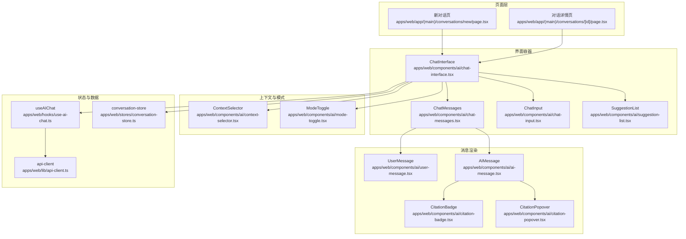
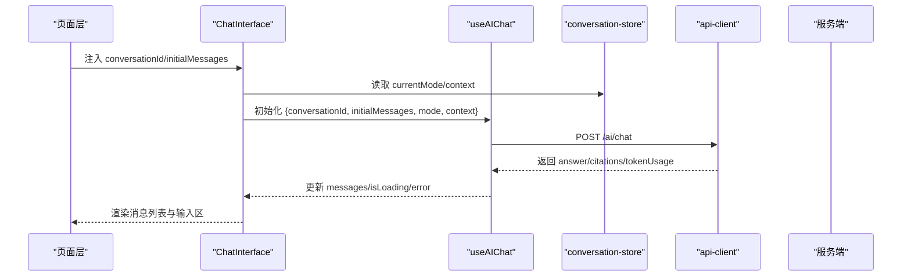
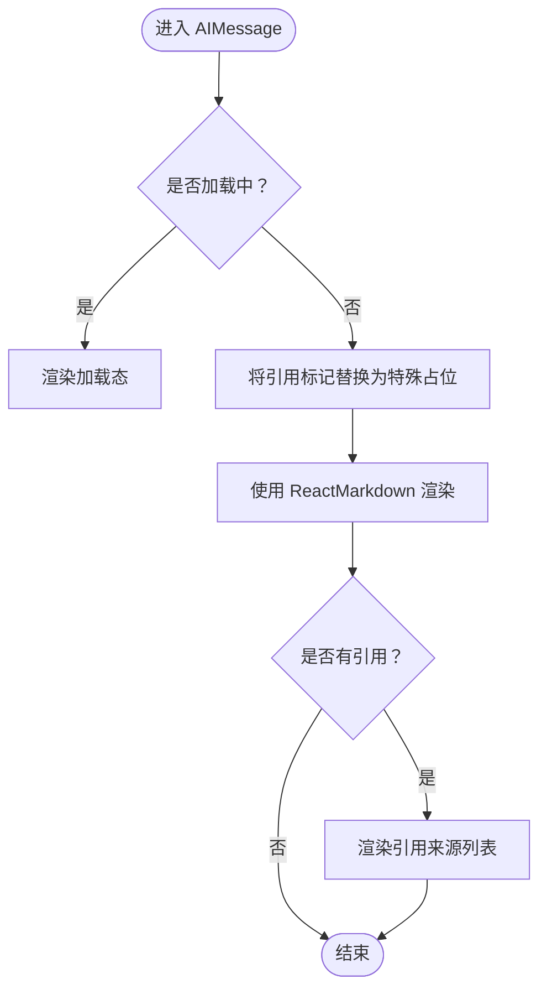
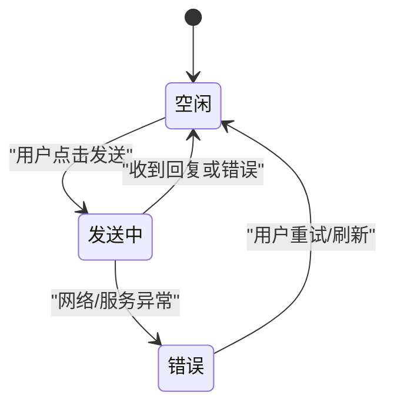
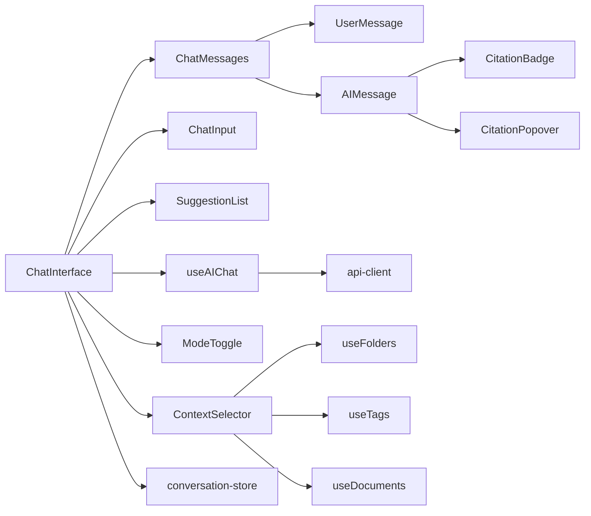

# 聊天界面组件

<cite>
**本文引用的文件**
- [apps/web/components/ai/chat-interface.tsx](file://apps/web/components/ai/chat-interface.tsx)
- [apps/web/components/ai/chat-messages.tsx](file://apps/web/components/ai/chat-messages.tsx)
- [apps/web/components/ai/user-message.tsx](file://apps/web/components/ai/user-message.tsx)
- [apps/web/components/ai/ai-message.tsx](file://apps/web/components/ai/ai-message.tsx)
- [apps/web/components/ai/chat-input.tsx](file://apps/web/components/ai/chat-input.tsx)
- [apps/web/components/ai/suggestion-list.tsx](file://apps/web/components/ai/suggestion-list.tsx)
- [apps/web/components/ai/citation-badge.tsx](file://apps/web/components/ai/citation-badge.tsx)
- [apps/web/components/ai/citation-popover.tsx](file://apps/web/components/ai/citation-popover.tsx)
- [apps/web/components/ai/context-selector.tsx](file://apps/web/components/ai/context-selector.tsx)
- [apps/web/components/ai/mode-toggle.tsx](file://apps/web/components/ai/mode-toggle.tsx)
- [apps/web/hooks/use-ai-chat.ts](file://apps/web/hooks/use-ai-chat.ts)
- [apps/web/stores/conversation-store.ts](file://apps/web/stores/conversation-store.ts)
- [apps/web/lib/api-client.ts](file://apps/web/lib/api-client.ts)
- [apps/web/app/(main)/conversations/[id]/page.tsx](file://apps/web/app/(main)/conversations/[id]/page.tsx)
- [apps/web/app/(main)/conversations/new/page.tsx](file://apps/web/app/(main)/conversations/new/page.tsx)
</cite>

## 目录
1. [简介](#简介)
2. [项目结构](#项目结构)
3. [核心组件](#核心组件)
4. [架构总览](#架构总览)
5. [详细组件分析](#详细组件分析)
6. [依赖关系分析](#依赖关系分析)
7. [性能考虑](#性能考虑)
8. [故障排查指南](#故障排查指南)
9. [结论](#结论)
10. [附录](#附录)

## 简介
本文件为 APP2 项目的聊天界面组件提供系统化 UI/UX 文档，覆盖整体架构、布局与组件层次、交互流程、消息渲染与 Markdown 解析、引用标注、输入组件功能、建议列表设计理念、状态管理方案（消息、加载、错误）、响应式与无障碍设计要点，以及用户体验优化与性能提升最佳实践。目标是帮助开发者与产品人员快速理解并高效迭代聊天界面。

## 项目结构
聊天界面主要由页面层、界面容器、消息渲染、输入与建议、上下文与模式控制、状态与数据流等模块组成。页面层负责路由与初始数据获取；界面容器负责布局与状态协调；消息渲染负责用户与 AI 的消息展示及引用解析；输入组件负责文本输入、快捷键与发送；建议列表提供智能提示；上下文选择器与模式切换用于知识库场景；状态与数据流通过自定义 Hook 与 Zustand Store 管理。

图表来源
- [apps/web/app/(main)/conversations/new/page.tsx](file://apps/web/app/(main)/conversations/new/page.tsx#L1-L9)
- [apps/web/app/(main)/conversations/[id]/page.tsx](file://apps/web/app/(main)/conversations/[id]/page.tsx#L1-L34)
- [apps/web/components/ai/chat-interface.tsx](file://apps/web/components/ai/chat-interface.tsx#L1-L125)
- [apps/web/components/ai/chat-messages.tsx](file://apps/web/components/ai/chat-messages.tsx#L1-L55)
- [apps/web/components/ai/chat-input.tsx](file://apps/web/components/ai/chat-input.tsx#L1-L77)
- [apps/web/components/ai/suggestion-list.tsx](file://apps/web/components/ai/suggestion-list.tsx#L1-L45)
- [apps/web/components/ai/user-message.tsx](file://apps/web/components/ai/user-message.tsx#L1-L16)
- [apps/web/components/ai/ai-message.tsx](file://apps/web/components/ai/ai-message.tsx#L1-L163)
- [apps/web/components/ai/citation-badge.tsx](file://apps/web/components/ai/citation-badge.tsx#L1-L35)
- [apps/web/components/ai/citation-popover.tsx](file://apps/web/components/ai/citation-popover.tsx#L1-L83)
- [apps/web/components/ai/context-selector.tsx](file://apps/web/components/ai/context-selector.tsx#L1-L134)
- [apps/web/components/ai/mode-toggle.tsx](file://apps/web/components/ai/mode-toggle.tsx#L1-L40)
- [apps/web/hooks/use-ai-chat.ts](file://apps/web/hooks/use-ai-chat.ts#L1-L117)
- [apps/web/stores/conversation-store.ts](file://apps/web/stores/conversation-store.ts#L1-L55)
- [apps/web/lib/api-client.ts](file://apps/web/lib/api-client.ts#L1-L84)

章节来源
- [apps/web/app/(main)/conversations/new/page.tsx](file://apps/web/app/(main)/conversations/new/page.tsx#L1-L9)
- [apps/web/app/(main)/conversations/[id]/page.tsx](file://apps/web/app/(main)/conversations/[id]/page.tsx#L1-L34)
- [apps/web/components/ai/chat-interface.tsx](file://apps/web/components/ai/chat-interface.tsx#L1-L125)

## 核心组件
- ChatInterface：聊天主容器，负责布局、滚动、上下文与模式联动、消息列表与输入区的组装，以及引用点击导航。
- ChatMessages：消息列表渲染器，根据角色区分用户与 AI 消息，并在加载态显示占位。
- AIMessage：AI 消息渲染器，支持 Markdown/GFM、数学公式、代码高亮、Mermaid 图表；内置引用标记解析与弹窗。
- UserMessage：用户消息渲染器，简洁的右对齐气泡。
- ChatInput：多行文本输入，自动高度、回车发送、禁用态与按钮联动。
- SuggestionList：智能建议列表，提供“可能想问”的引导，支持加载态骨架。
- ContextSelector：知识库上下文选择器，支持全部、文件夹、标签、指定文档四种范围。
- ModeToggle：通用对话与知识库模式切换。
- useAIChat：聊天数据与状态 Hook，封装消息增删、加载与错误状态、调用后端接口。
- conversation-store：Zustand 状态存储，保存当前对话、模式、上下文与全局加载状态。
- api-client：Axios 客户端，统一请求/响应拦截与错误处理。

章节来源
- [apps/web/components/ai/chat-interface.tsx](file://apps/web/components/ai/chat-interface.tsx#L1-L125)
- [apps/web/components/ai/chat-messages.tsx](file://apps/web/components/ai/chat-messages.tsx#L1-L55)
- [apps/web/components/ai/ai-message.tsx](file://apps/web/components/ai/ai-message.tsx#L1-L163)
- [apps/web/components/ai/user-message.tsx](file://apps/web/components/ai/user-message.tsx#L1-L16)
- [apps/web/components/ai/chat-input.tsx](file://apps/web/components/ai/chat-input.tsx#L1-L77)
- [apps/web/components/ai/suggestion-list.tsx](file://apps/web/components/ai/suggestion-list.tsx#L1-L45)
- [apps/web/components/ai/context-selector.tsx](file://apps/web/components/ai/context-selector.tsx#L1-L134)
- [apps/web/components/ai/mode-toggle.tsx](file://apps/web/components/ai/mode-toggle.tsx#L1-L40)
- [apps/web/hooks/use-ai-chat.ts](file://apps/web/hooks/use-ai-chat.ts#L1-L117)
- [apps/web/stores/conversation-store.ts](file://apps/web/stores/conversation-store.ts#L1-L55)
- [apps/web/lib/api-client.ts](file://apps/web/lib/api-client.ts#L1-L84)

## 架构总览
聊天界面采用“页面层 -> 容器组件 -> 渲染组件 -> 状态/Hook/Store -> API 客户端”的分层架构。页面层负责路由与初始数据注入；容器组件负责布局与状态协调；渲染组件负责 UI 表现与交互；状态/Hook/Store 负责消息、加载、错误与上下文；API 客户端负责网络请求与错误统一处理。

图表来源
- [apps/web/app/(main)/conversations/[id]/page.tsx](file://apps/web/app/(main)/conversations/[id]/page.tsx#L1-L34)
- [apps/web/components/ai/chat-interface.tsx](file://apps/web/components/ai/chat-interface.tsx#L1-L125)
- [apps/web/hooks/use-ai-chat.ts](file://apps/web/hooks/use-ai-chat.ts#L1-L117)
- [apps/web/stores/conversation-store.ts](file://apps/web/stores/conversation-store.ts#L1-L55)
- [apps/web/lib/api-client.ts](file://apps/web/lib/api-client.ts#L1-L84)

## 详细组件分析

### ChatInterface：聊天主容器
- 布局与层次
  - 顶部：模式切换与上下文选择器触发器（仅知识库模式可见）。
  - 上下文面板：可展开的知识库范围选择器。
  - 消息区域：消息列表 + 底部锚点用于自动滚动。
  - 输入区域：输入框与发送按钮。
- 交互流程
  - 发送消息：校验空闲与内容，调用 Hook 发送。
  - 引用点击：跳转到对应文档详情。
  - 自动滚动：消息更新时平滑滚动到底部。
- 与状态/数据的协作
  - 从 Zustand 读取 currentMode/context 并传递给 Hook。
  - 将 Hook 返回的 messages/isLoading 传给子组件。

章节来源
- [apps/web/components/ai/chat-interface.tsx](file://apps/web/components/ai/chat-interface.tsx#L1-L125)
- [apps/web/stores/conversation-store.ts](file://apps/web/stores/conversation-store.ts#L1-L55)
- [apps/web/hooks/use-ai-chat.ts](file://apps/web/hooks/use-ai-chat.ts#L1-L117)

### ChatMessages：消息列表渲染
- 功能要点
  - 空态提示：无消息且非加载时显示欢迎语。
  - 角色区分：用户消息使用 UserMessage，AI 消息使用 AIMessage。
  - 加载态：当存在未完成的 AI 回复时显示占位。
- 性能与体验
  - 使用 key 基于消息 id，避免重复渲染。
  - 列表容器使用纵向间距与内边距，保证阅读舒适度。

章节来源
- [apps/web/components/ai/chat-messages.tsx](file://apps/web/components/ai/chat-messages.tsx#L1-L55)
- [apps/web/components/ai/user-message.tsx](file://apps/web/components/ai/user-message.tsx#L1-L16)
- [apps/web/components/ai/ai-message.tsx](file://apps/web/components/ai/ai-message.tsx#L1-L163)

### AIMessage：AI 消息渲染与引用解析
- Markdown/GFM 支持
  - 使用 remarkGfm、remarkMath、rehypeHighlight、rehypeKatex、rehype-mermaid。
  - 内置自定义文本渲染器，将引用标记替换为可点击徽章。
- 引用标注与弹窗
  - 引用徽章点击后定位弹窗，展示文档标题、摘要与相似度。
  - 弹窗支持点击“查看原文”触发文档跳转。
- 加载态
  - 显示“AI 正在思考…”动画，增强反馈。

图表来源
- [apps/web/components/ai/ai-message.tsx](file://apps/web/components/ai/ai-message.tsx#L1-L163)
- [apps/web/components/ai/citation-badge.tsx](file://apps/web/components/ai/citation-badge.tsx#L1-L35)
- [apps/web/components/ai/citation-popover.tsx](file://apps/web/components/ai/citation-popover.tsx#L1-L83)

章节来源
- [apps/web/components/ai/ai-message.tsx](file://apps/web/components/ai/ai-message.tsx#L1-L163)
- [apps/web/components/ai/citation-badge.tsx](file://apps/web/components/ai/citation-badge.tsx#L1-L35)
- [apps/web/components/ai/citation-popover.tsx](file://apps/web/components/ai/citation-popover.tsx#L1-L83)

### UserMessage：用户消息渲染
- 设计要点
  - 右对齐气泡，强调用户视角。
  - 支持换行与长文本展示。

章节来源
- [apps/web/components/ai/user-message.tsx](file://apps/web/components/ai/user-message.tsx#L1-L16)

### ChatInput：输入组件
- 功能特性
  - 多行文本域，自动高度至最大 200px。
  - 回车发送（Shift+回车换行）。
  - 发送按钮禁用态与输入为空时禁用。
- 无障碍与可用性
  - 占位符随模式变化（知识库模式提示“基于知识库提问…”）。
  - 禁用态明确反馈。

章节来源
- [apps/web/components/ai/chat-input.tsx](file://apps/web/components/ai/chat-input.tsx#L1-L77)

### SuggestionList：建议列表
- 设计理念
  - “可能想问”引导，降低认知负担，提升首开体验。
  - 支持加载态骨架，改善感知速度。
- 交互
  - 点击建议即填充输入框并可直接发送。

章节来源
- [apps/web/components/ai/suggestion-list.tsx](file://apps/web/components/ai/suggestion-list.tsx#L1-L45)

### ContextSelector：上下文选择器
- 功能设计
  - 四种范围：全部文档、按文件夹、按标签、选择具体文档。
  - 文件夹选择下拉、标签多选、文档勾选列表（含滚动）。
- 用户体验
  - 选项卡式切换，清晰表达不同维度的选择方式。
  - 默认“全部文档”清空上下文，便于快速恢复。

章节来源
- [apps/web/components/ai/context-selector.tsx](file://apps/web/components/ai/context-selector.tsx#L1-L134)

### ModeToggle：模式切换
- 设计要点
  - 两态切换，视觉突出当前模式。
  - 与 ChatInterface 配合，决定上下文选择器是否显示与占位文案。

章节来源
- [apps/web/components/ai/mode-toggle.tsx](file://apps/web/components/ai/mode-toggle.tsx#L1-L40)

### 状态管理方案
- useAIChat Hook
  - 状态：messages、conversationId、isLoading、error。
  - 行为：sendMessage（添加用户消息 -> 调用后端 -> 添加 AI 消息 -> 返回结果），clearMessages。
  - 错误处理：捕获异常并追加错误消息，同时设置错误状态。
- conversation-store Store
  - 状态：currentConversationId、currentMode、context、isLoading。
  - 行为：setMode、setContext、setLoading、reset。
- 页面层注入
  - 对话详情页从后端获取历史消息并注入 ChatInterface。

图表来源
- [apps/web/hooks/use-ai-chat.ts](file://apps/web/hooks/use-ai-chat.ts#L1-L117)
- [apps/web/stores/conversation-store.ts](file://apps/web/stores/conversation-store.ts#L1-L55)

章节来源
- [apps/web/hooks/use-ai-chat.ts](file://apps/web/hooks/use-ai-chat.ts#L1-L117)
- [apps/web/stores/conversation-store.ts](file://apps/web/stores/conversation-store.ts#L1-L55)
- [apps/web/app/(main)/conversations/[id]/page.tsx](file://apps/web/app/(main)/conversations/[id]/page.tsx#L1-L34)

### API 与数据流
- 请求路径：POST /ai/chat
- 请求参数：question、conversationId、mode、context
- 响应字段：conversationId、messageId、answer、citations、tokenUsage
- 错误处理：统一拦截器输出日志并抛出，前端捕获后展示错误消息并保持状态一致。

章节来源
- [apps/web/hooks/use-ai-chat.ts](file://apps/web/hooks/use-ai-chat.ts#L1-L117)
- [apps/web/lib/api-client.ts](file://apps/web/lib/api-client.ts#L1-L84)

## 依赖关系分析
- 组件耦合
  - ChatInterface 作为容器，聚合 ChatMessages、ChatInput、SuggestionList、ContextSelector、ModeToggle。
  - AIMessage 依赖 CitationBadge 与 CitationPopover，形成消息与引用的强关联。
- 外部依赖
  - useAIChat 依赖 api-client 进行网络请求。
  - ContextSelector 依赖 useFolders/useTags/useDocuments 获取数据。
- 状态依赖
  - ChatInterface 依赖 conversation-store 提供的模式与上下文。
  - useAIChat 依赖 conversationId 与 context 作为请求参数。

图表来源
- [apps/web/components/ai/chat-interface.tsx](file://apps/web/components/ai/chat-interface.tsx#L1-L125)
- [apps/web/components/ai/chat-messages.tsx](file://apps/web/components/ai/chat-messages.tsx#L1-L55)
- [apps/web/components/ai/ai-message.tsx](file://apps/web/components/ai/ai-message.tsx#L1-L163)
- [apps/web/components/ai/citation-badge.tsx](file://apps/web/components/ai/citation-badge.tsx#L1-L35)
- [apps/web/components/ai/citation-popover.tsx](file://apps/web/components/ai/citation-popover.tsx#L1-L83)
- [apps/web/components/ai/context-selector.tsx](file://apps/web/components/ai/context-selector.tsx#L1-L134)
- [apps/web/hooks/use-ai-chat.ts](file://apps/web/hooks/use-ai-chat.ts#L1-L117)
- [apps/web/stores/conversation-store.ts](file://apps/web/stores/conversation-store.ts#L1-L55)
- [apps/web/lib/api-client.ts](file://apps/web/lib/api-client.ts#L1-L84)

## 性能考虑
- 渲染优化
  - 使用 key 基于唯一 id，减少不必要的重渲染。
  - AIMessage 在加载态使用骨架与占位，避免复杂 DOM 结构。
- 计算与样式
  - ChatInput 自动高度计算限制最大高度，避免布局抖动。
  - Markdown 插件按需启用，避免不必要开销。
- 网络与状态
  - useAIChat 在发送中禁止再次发送，避免并发请求。
  - 错误态统一处理，防止 UI 状态不一致导致的重渲染风暴。
- 可访问性
  - 输入框禁用态明确反馈；按钮具备焦点可见性；引用弹窗支持键盘外点击关闭。

[本节为通用指导，无需特定文件引用]

## 故障排查指南
- 发送按钮不可用
  - 检查 ChatInput 的 disabled 与 content 是否为空。
  - 确认 useAIChat 的 isLoading 状态。
- 引用无法点击或弹窗不出现
  - 检查 AIMessage 中的引用标记替换逻辑与 CitationBadge 的事件绑定。
  - 确认 CitationPopover 的定位与点击外部关闭逻辑。
- 知识库上下文无效
  - 检查 ContextSelector 的 onChange 是否正确合并到 conversation-store。
  - 确认 ChatInterface 传入 useAIChat 的 context 参数。
- 网络错误
  - 查看 api-client 的拦截器日志与错误分支。
  - useAIChat 捕获异常后是否追加错误消息并设置 isLoading=false。

章节来源
- [apps/web/components/ai/chat-input.tsx](file://apps/web/components/ai/chat-input.tsx#L1-L77)
- [apps/web/components/ai/ai-message.tsx](file://apps/web/components/ai/ai-message.tsx#L1-L163)
- [apps/web/components/ai/citation-popover.tsx](file://apps/web/components/ai/citation-popover.tsx#L1-L83)
- [apps/web/components/ai/context-selector.tsx](file://apps/web/components/ai/context-selector.tsx#L1-L134)
- [apps/web/components/ai/chat-interface.tsx](file://apps/web/components/ai/chat-interface.tsx#L1-L125)
- [apps/web/hooks/use-ai-chat.ts](file://apps/web/hooks/use-ai-chat.ts#L1-L117)
- [apps/web/lib/api-client.ts](file://apps/web/lib/api-client.ts#L1-L84)

## 结论
该聊天界面组件体系以清晰的分层与职责划分实现了良好的可维护性与扩展性。通过 Hook 与 Store 的分离，消息渲染与引用解析的模块化，以及输入与建议的交互优化，整体用户体验流畅。后续可在插件化 Markdown 渲染、更丰富的引用交互、以及更细粒度的加载与错误提示方面持续演进。

[本节为总结，无需特定文件引用]

## 附录
- 响应式设计要点
  - ChatInput 最大高度限制与自适应，确保在小屏设备上良好阅读与输入。
  - 消息气泡宽度限制与换行策略，避免横向滚动。
- 无障碍访问要点
  - 输入框与按钮具备键盘可达性与屏幕阅读器友好标签。
  - 弹窗具备焦点管理与 ESC 关闭能力（建议在弹窗组件中完善）。
- 最佳实践清单
  - 保持消息 key 唯一，避免列表重排。
  - 合理拆分 Markdown 插件，按需启用。
  - 在 ChatInterface 中统一处理滚动与占位，避免子组件重复逻辑。
  - 将上下文变更集中到 conversation-store，避免分散状态源。

[本节为通用指导，无需特定文件引用]