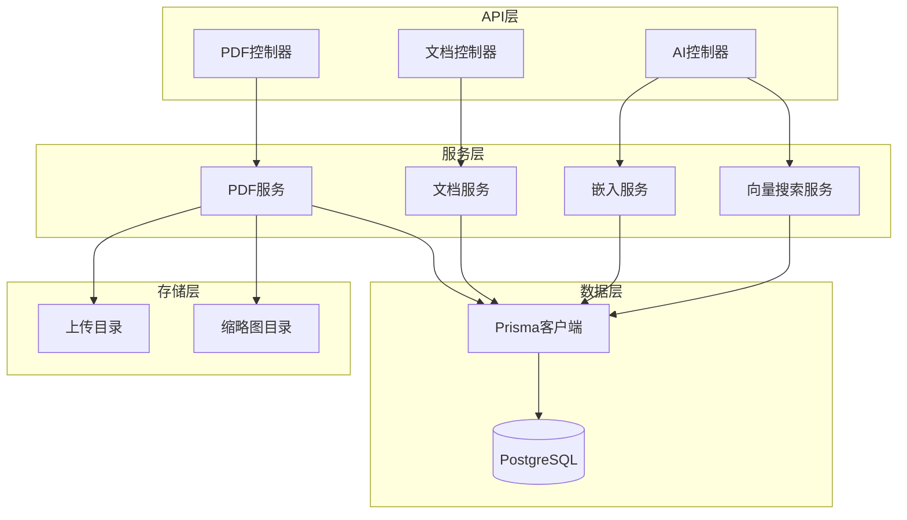
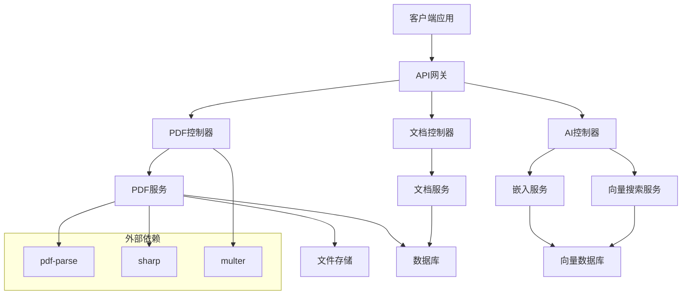
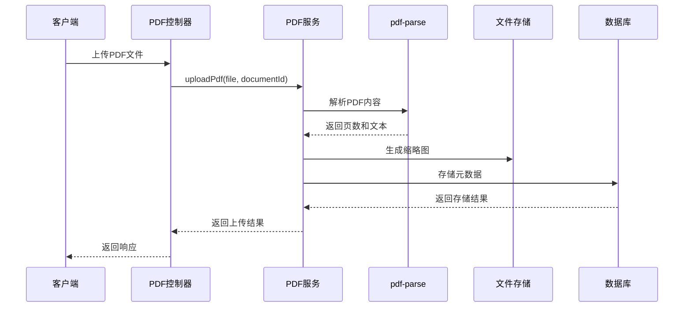
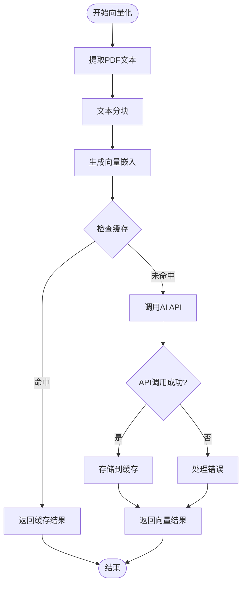
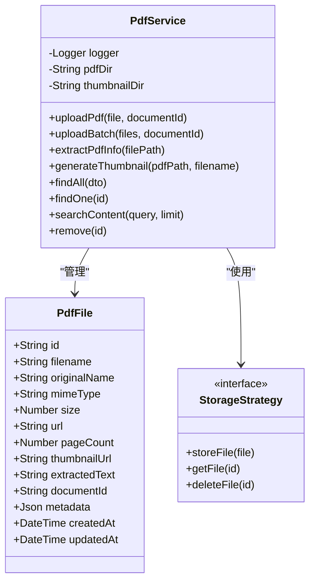
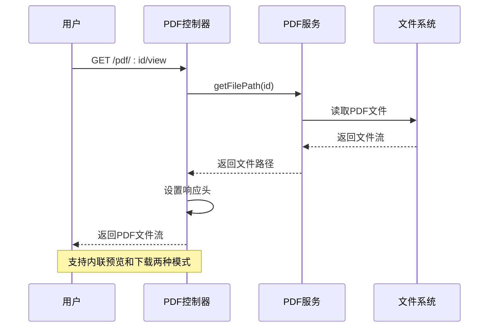
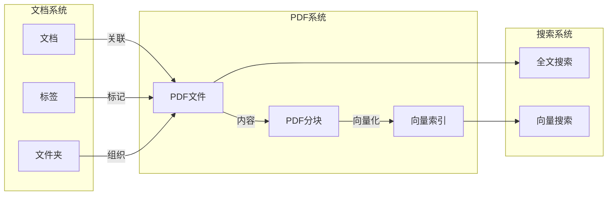
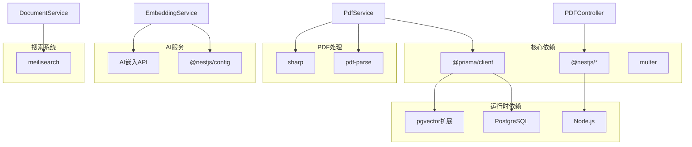

# PDF管理系统

<cite>
**本文档引用的文件**
- [apps/api/src/modules/pdf/pdf.controller.ts](file://apps/api/src/modules/pdf/pdf.controller.ts)
- [apps/api/src/modules/pdf/pdf.service.ts](file://apps/api/src/modules/pdf/pdf.service.ts)
- [apps/api/src/modules/pdf/pdf.module.ts](file://apps/api/src/modules/pdf/pdf.module.ts)
- [apps/api/src/modules/pdf/dto/pdf.dto.ts](file://apps/api/src/modules/pdf/dto/pdf.dto.ts)
- [apps/api/prisma/schema.prisma](file://apps/api/prisma/schema.prisma)
- [apps/api/src/modules/ai/embedding.service.ts](file://apps/api/src/modules/ai/embedding.service.ts)
- [apps/api/src/modules/ai/vector-search.service.ts](file://apps/api/src/modules/ai/vector-search.service.ts)
- [apps/api/src/modules/documents/documents.service.ts](file://apps/api/src/modules/documents/documents.service.ts)
- [apps/api/package.json](file://apps/api/package.json)
</cite>

## 目录
1. [简介](#简介)
2. [项目结构](#项目结构)
3. [核心组件](#核心组件)
4. [架构概览](#架构概览)
5. [详细组件分析](#详细组件分析)
6. [依赖关系分析](#依赖关系分析)
7. [性能考虑](#性能考虑)
8. [故障排除指南](#故障排除指南)
9. [结论](#结论)

## 简介
本项目为APP2的PDF管理系统，提供完整的PDF文件生命周期管理能力。系统支持PDF文件的上传、解析、内容提取、存储、检索、预览等功能，并与文档系统深度集成，实现PDF与文档的双向关联。

## 项目结构
PDF管理系统采用NestJS微服务架构，主要包含以下模块：

**图表来源**
- [apps/api/src/modules/pdf/pdf.controller.ts](file://apps/api/src/modules/pdf/pdf.controller.ts#L37-L228)
- [apps/api/src/modules/pdf/pdf.service.ts](file://apps/api/src/modules/pdf/pdf.service.ts#L21-L385)
- [apps/api/src/modules/pdf/pdf.module.ts](file://apps/api/src/modules/pdf/pdf.module.ts#L1-L18)

**章节来源**
- [apps/api/src/modules/pdf/pdf.controller.ts](file://apps/api/src/modules/pdf/pdf.controller.ts#L1-L228)
- [apps/api/src/modules/pdf/pdf.service.ts](file://apps/api/src/modules/pdf/pdf.service.ts#L1-L385)
- [apps/api/src/modules/pdf/pdf.module.ts](file://apps/api/src/modules/pdf/pdf.module.ts#L1-L18)

## 核心组件
PDF管理系统的核心组件包括PDF控制器、PDF服务、嵌入服务和向量搜索服务。

### PDF控制器
负责处理PDF相关的HTTP请求，提供文件上传、下载、预览、搜索等功能。

### PDF服务
实现PDF文件的具体业务逻辑，包括文件解析、内容提取、缩略图生成、存储管理等。

### 嵌入服务
提供文本向量化功能，支持批量向量计算和内存缓存。

### 向量搜索服务
基于向量相似度进行PDF内容检索，支持多维度过滤条件。

**章节来源**
- [apps/api/src/modules/pdf/pdf.controller.ts](file://apps/api/src/modules/pdf/pdf.controller.ts#L37-L228)
- [apps/api/src/modules/pdf/pdf.service.ts](file://apps/api/src/modules/pdf/pdf.service.ts#L21-L385)
- [apps/api/src/modules/ai/embedding.service.ts](file://apps/api/src/modules/ai/embedding.service.ts#L1-L128)
- [apps/api/src/modules/ai/vector-search.service.ts](file://apps/api/src/modules/ai/vector-search.service.ts#L1-L140)

## 架构概览
系统采用分层架构设计，确保职责分离和可维护性：

**图表来源**
- [apps/api/src/modules/pdf/pdf.controller.ts](file://apps/api/src/modules/pdf/pdf.controller.ts#L1-L228)
- [apps/api/src/modules/pdf/pdf.service.ts](file://apps/api/src/modules/pdf/pdf.service.ts#L1-L385)
- [apps/api/src/modules/ai/embedding.service.ts](file://apps/api/src/modules/ai/embedding.service.ts#L1-L128)
- [apps/api/src/modules/ai/vector-search.service.ts](file://apps/api/src/modules/ai/vector-search.service.ts#L1-L140)

## 详细组件分析

### PDF文件解析与内容提取

PDF服务实现了完整的文件解析流程：

**图表来源**
- [apps/api/src/modules/pdf/pdf.controller.ts](file://apps/api/src/modules/pdf/pdf.controller.ts#L42-L84)
- [apps/api/src/modules/pdf/pdf.service.ts](file://apps/api/src/modules/pdf/pdf.service.ts#L39-L83)

PDF解析的关键特性：
- **文本提取**：使用pdf-parse库提取PDF文本内容，限制最大文本长度避免数据库压力
- **元数据获取**：自动获取页数、文件大小等基本信息
- **缩略图生成**：通过sharp库生成PDF缩略图，提供直观的文件预览
- **错误处理**：完善的异常捕获和清理机制

**章节来源**
- [apps/api/src/modules/pdf/pdf.service.ts](file://apps/api/src/modules/pdf/pdf.service.ts#L116-L142)
- [apps/api/src/modules/pdf/pdf.service.ts](file://apps/api/src/modules/pdf/pdf.service.ts#L147-L184)

### PDF内容向量化与索引

系统提供了完整的向量化处理流程：

**图表来源**
- [apps/api/src/modules/ai/embedding.service.ts](file://apps/api/src/modules/ai/embedding.service.ts#L33-L79)
- [apps/api/src/modules/ai/embedding.service.ts](file://apps/api/src/modules/ai/embedding.service.ts#L84-L98)

向量化处理的关键特性：
- **批量处理**：支持批量向量计算，限制每批最多25条记录
- **智能缓存**：内存缓存机制，7天TTL，减少重复API调用
- **Token估算**：智能估算token数量，支持中文和英文混合文本
- **错误恢复**：完善的错误处理和重试机制

**章节来源**
- [apps/api/src/modules/ai/embedding.service.ts](file://apps/api/src/modules/ai/embedding.service.ts#L1-L128)

### PDF存储与管理策略

系统采用多层存储策略确保数据安全和性能：

**图表来源**
- [apps/api/prisma/schema.prisma](file://apps/api/prisma/schema.prisma#L255-L275)
- [apps/api/src/modules/pdf/pdf.service.ts](file://apps/api/src/modules/pdf/pdf.service.ts#L21-L385)

存储管理的关键特性：
- **文件格式转换**：直接保存原始PDF文件，支持在线预览
- **缩略图生成**：自动生成PNG格式缩略图，提升用户体验
- **版本控制**：通过时间戳和增量更新实现版本管理
- **清理策略**：删除时自动清理相关文件和数据库记录

**章节来源**
- [apps/api/src/modules/pdf/pdf.service.ts](file://apps/api/src/modules/pdf/pdf.service.ts#L282-L304)

### PDF预览与阅读体验优化

系统提供多种预览和阅读模式：

**图表来源**
- [apps/api/src/modules/pdf/pdf.controller.ts](file://apps/api/src/modules/pdf/pdf.controller.ts#L173-L186)
- [apps/api/src/modules/pdf/pdf.controller.ts](file://apps/api/src/modules/pdf/pdf.controller.ts#L188-L207)

预览功能特性：
- **在线浏览**：直接返回文件流，支持浏览器内联预览
- **下载支持**：提供标准的文件下载功能
- **流式传输**：使用StreamableFile实现大文件的高效传输
- **响应优化**：正确设置Content-Type和Content-Disposition头

**章节来源**
- [apps/api/src/modules/pdf/pdf.controller.ts](file://apps/api/src/modules/pdf/pdf.controller.ts#L173-L207)

### PDF与文档系统集成

系统与文档系统实现深度集成，支持双向关联：

**图表来源**
- [apps/api/prisma/schema.prisma](file://apps/api/prisma/schema.prisma#L42-L73)
- [apps/api/prisma/schema.prisma](file://apps/api/prisma/schema.prisma#L255-L275)

集成特性：
- **内容同步**：PDF内容自动提取并存储到文档系统
- **标签关联**：支持对PDF文件添加和管理标签
- **全文搜索**：结合PDF文本内容提供全文检索功能
- **向量搜索**：支持基于语义的相似度搜索

**章节来源**
- [apps/api/src/modules/documents/documents.service.ts](file://apps/api/src/modules/documents/documents.service.ts#L468-L486)
- [apps/api/src/modules/pdf/pdf.service.ts](file://apps/api/src/modules/pdf/pdf.service.ts#L309-L340)

## 依赖关系分析

系统依赖关系清晰，各模块职责明确：

**图表来源**
- [apps/api/package.json](file://apps/api/package.json#L15-L35)

**章节来源**
- [apps/api/package.json](file://apps/api/package.json#L15-L35)

## 性能考虑

系统在多个层面进行了性能优化：

### 1. 缓存策略
- **嵌入缓存**：7天TTL的内存缓存，减少重复API调用
- **批量处理**：AI嵌入支持批量请求，提高处理效率
- **文件缓存**：缩略图生成使用占位符，避免重复计算

### 2. 数据库优化
- **索引设计**：为常用查询字段建立索引
- **分页查询**：支持大数据量的分页浏览
- **并发处理**：使用Promise.all并行执行查询

### 3. 文件处理优化
- **流式传输**：PDF文件使用流式传输，避免内存溢出
- **异步处理**：文件解析和缩略图生成采用异步方式
- **资源清理**：及时清理临时文件和缓存

### 4. 搜索优化
- **全文搜索**：结合PDF文本内容提供快速检索
- **向量搜索**：支持语义级别的相似度搜索
- **过滤条件**：支持多维度的搜索过滤

## 故障排除指南

### 常见问题及解决方案

#### 1. PDF解析失败
**症状**：上传PDF后无法提取文本内容
**原因**：pdf-parse库未正确安装或PDF格式不支持
**解决方案**：
- 确认pdf-parse依赖已正确安装
- 检查PDF文件格式是否有效
- 查看日志中的具体错误信息

#### 2. 缩略图生成失败
**症状**：PDF文件显示占位缩略图而非实际内容
**原因**：缺少必要的图像处理依赖
**解决方案**：
- 安装pdf2pic或poppler等图像处理工具
- 确保sharp依赖正确编译
- 检查磁盘空间和权限

#### 3. 文件上传失败
**症状**：上传过程中出现错误
**原因**：文件大小超限或类型不支持
**解决方案**：
- 检查文件大小限制（默认100MB）
- 确认文件类型为PDF格式
- 验证上传目录权限

#### 4. 搜索功能异常
**症状**：PDF搜索结果不准确或无结果
**原因**：文本提取不完整或索引未建立
**解决方案**：
- 检查PDF文本提取功能
- 确认数据库连接正常
- 验证搜索关键词的有效性

**章节来源**
- [apps/api/src/modules/pdf/pdf.service.ts](file://apps/api/src/modules/pdf/pdf.service.ts#L75-L82)
- [apps/api/src/modules/pdf/pdf.service.ts](file://apps/api/src/modules/pdf/pdf.service.ts#L180-L183)

## 结论

APP2的PDF管理系统提供了完整的PDF文件生命周期管理能力。系统采用现代化的技术栈和架构设计，具备以下优势：

1. **功能完整**：涵盖PDF上传、解析、存储、检索、预览等全流程
2. **性能优秀**：通过缓存、批量处理、流式传输等技术优化性能
3. **易于扩展**：模块化设计便于功能扩展和维护
4. **集成良好**：与文档系统深度集成，提供统一的文档管理体验

系统在实际部署中建议关注以下方面：
- 确保pdf-parse和图像处理工具的正确安装
- 根据实际需求调整文件大小和数量限制
- 定期清理缓存和临时文件
- 监控系统资源使用情况

通过合理配置和持续优化，该PDF管理系统能够满足大多数企业级PDF管理需求。