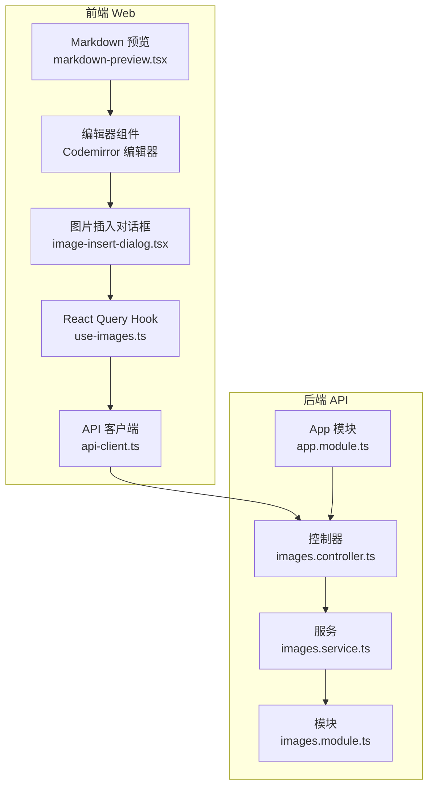
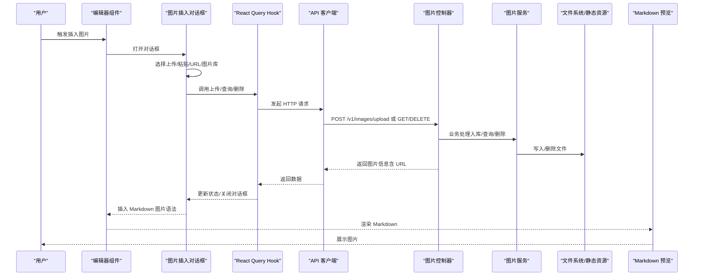
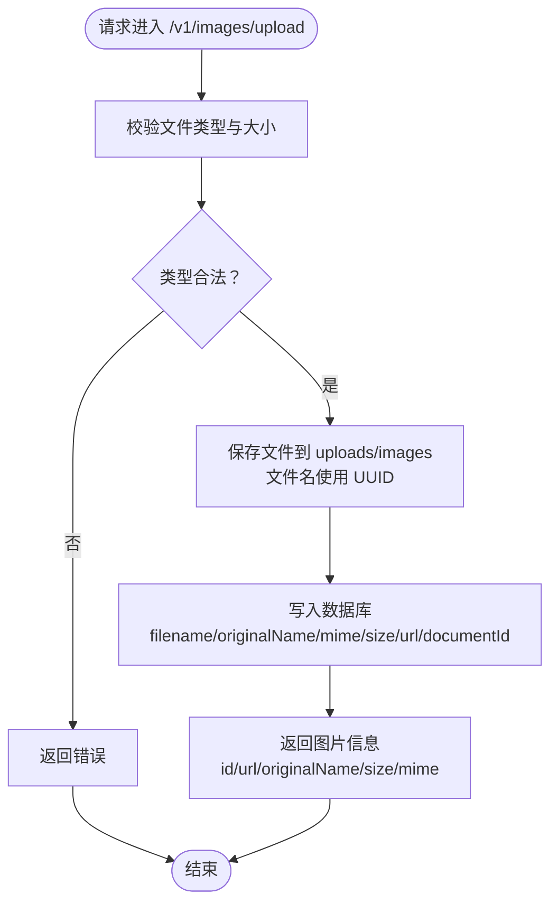
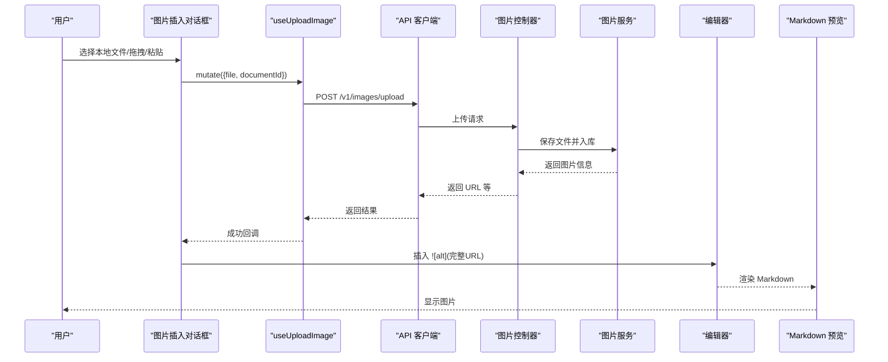
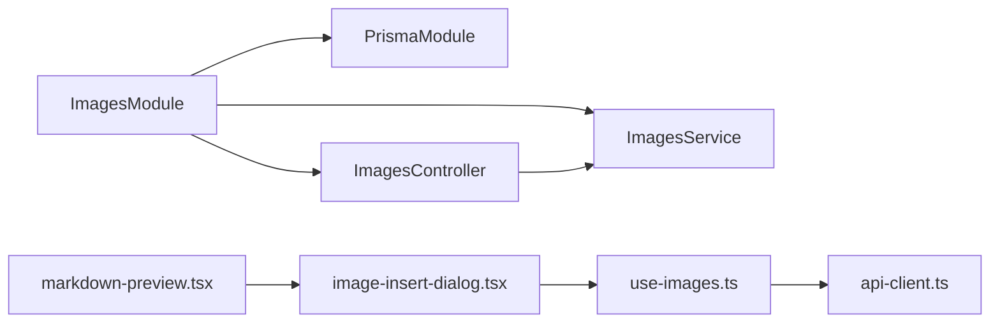

# 图像上传系统

<cite>
**本文引用的文件**
- [apps/api/src/modules/images/images.controller.ts](file://apps/api/src/modules/images/images.controller.ts)
- [apps/api/src/modules/images/images.service.ts](file://apps/api/src/modules/images/images.service.ts)
- [apps/api/src/modules/images/dto/upload-image.dto.ts](file://apps/api/src/modules/images/dto/upload-image.dto.ts)
- [apps/api/src/modules/images/images.module.ts](file://apps/api/src/modules/images/images.module.ts)
- [apps/api/src/app.module.ts](file://apps/api/src/app.module.ts)
- [apps/web/hooks/use-images.ts](file://apps/web/hooks/use-images.ts)
- [apps/web/components/editor/image-insert-dialog.tsx](file://apps/web/components/editor/image-insert-dialog.tsx)
- [apps/web/components/editor/codemirror-editor.tsx](file://apps/web/components/editor/codemirror-editor.tsx)
- [apps/web/components/editor/editor-commands.ts](file://apps/web/components/editor/editor-commands.ts)
- [apps/web/components/documents/markdown-preview.tsx](file://apps/web/components/documents/markdown-preview.tsx)
- [apps/web/lib/api-client.ts](file://apps/web/lib/api-client.ts)
- [apps/api/src/common/utils/text.utils.ts](file://apps/api/src/common/utils/text.utils.ts)
- [docs/IMAGE_UPLOAD_IMPLEMENTATION.md](file://docs/IMAGE_UPLOAD_IMPLEMENTATION.md)
- [e2e/api-images.spec.ts](file://e2e/api-images.spec.ts)
</cite>

## 目录
1. [简介](#简介)
2. [项目结构](#项目结构)
3. [核心组件](#核心组件)
4. [架构总览](#架构总览)
5. [详细组件分析](#详细组件分析)
6. [依赖关系分析](#依赖关系分析)
7. [性能考虑](#性能考虑)
8. [故障排查指南](#故障排查指南)
9. [结论](#结论)
10. [附录](#附录)

## 简介
本文件面向 APP2 项目的“图像上传系统”，系统性阐述从文件验证、格式与尺寸处理、存储管理到图片预览与管理、Markdown 编辑器内插入与渲染的完整链路。同时提供前端组件实现要点（拖拽上传、进度与错误处理）、存储策略与 CDN 集成建议、以及图片优化、缓存与性能监控的落地实践。

## 项目结构
图像上传系统横跨后端 NestJS 与前端 Next.js 两部分：
- 后端：提供图片上传、查询、删除接口；通过静态文件服务暴露上传资源；使用 Prisma 进行数据持久化。
- 前端：提供图片插入对话框、拖拽上传、图片库浏览与删除；通过 React Query 管理状态；在 Markdown 预览中渲染图片。

图表来源
- [apps/web/components/editor/codemirror-editor.tsx](file://apps/web/components/editor/codemirror-editor.tsx#L1-L272)
- [apps/web/components/editor/image-insert-dialog.tsx](file://apps/web/components/editor/image-insert-dialog.tsx#L1-L302)
- [apps/web/hooks/use-images.ts](file://apps/web/hooks/use-images.ts#L1-L68)
- [apps/web/lib/api-client.ts](file://apps/web/lib/api-client.ts#L1-L84)
- [apps/api/src/modules/images/images.controller.ts](file://apps/api/src/modules/images/images.controller.ts#L1-L92)
- [apps/api/src/modules/images/images.service.ts](file://apps/api/src/modules/images/images.service.ts#L1-L62)
- [apps/api/src/modules/images/images.module.ts](file://apps/api/src/modules/images/images.module.ts#L1-L13)
- [apps/api/src/app.module.ts](file://apps/api/src/app.module.ts#L1-L83)

章节来源
- [apps/api/src/app.module.ts](file://apps/api/src/app.module.ts#L41-L48)
- [apps/api/src/modules/images/images.controller.ts](file://apps/api/src/modules/images/images.controller.ts#L29-L71)
- [apps/web/components/editor/image-insert-dialog.tsx](file://apps/web/components/editor/image-insert-dialog.tsx#L27-L114)

## 核心组件
- 后端控制器与服务
  - 控制器负责接收 multipart/form-data，执行文件过滤与大小限制，并调用服务完成入库与返回结果。
  - 服务负责将图片信息写入数据库，并在删除时同步清理文件系统。
- 前端 Hook 与对话框
  - 使用 React Query 管理上传、查询、删除的异步状态与缓存失效。
  - 图片插入对话框提供“本地上传（拖拽/点击）”、“URL 链接”、“图片库”三种方式。
- Markdown 渲染
  - 预览组件基于 React Markdown + 插件渲染图片，支持数学公式、代码高亮、Mermaid 等扩展。

章节来源
- [apps/api/src/modules/images/images.controller.ts](file://apps/api/src/modules/images/images.controller.ts#L29-L90)
- [apps/api/src/modules/images/images.service.ts](file://apps/api/src/modules/images/images.service.ts#L12-L60)
- [apps/web/hooks/use-images.ts](file://apps/web/hooks/use-images.ts#L18-L67)
- [apps/web/components/editor/image-insert-dialog.tsx](file://apps/web/components/editor/image-insert-dialog.tsx#L27-L114)
- [apps/web/components/documents/markdown-preview.tsx](file://apps/web/components/documents/markdown-preview.tsx#L16-L31)

## 架构总览
下图展示了从用户在编辑器中触发图片插入，到后端接收、存储、返回 URL，再到前端渲染的完整流程。

图表来源
- [apps/web/components/editor/image-insert-dialog.tsx](file://apps/web/components/editor/image-insert-dialog.tsx#L39-L102)
- [apps/web/hooks/use-images.ts](file://apps/web/hooks/use-images.ts#L32-L54)
- [apps/web/lib/api-client.ts](file://apps/web/lib/api-client.ts#L8-L14)
- [apps/api/src/modules/images/images.controller.ts](file://apps/api/src/modules/images/images.controller.ts#L29-L71)
- [apps/api/src/modules/images/images.service.ts](file://apps/api/src/modules/images/images.service.ts#L12-L30)
- [apps/web/components/documents/markdown-preview.tsx](file://apps/web/components/documents/markdown-preview.tsx#L16-L31)

## 详细组件分析

### 后端：图片上传与管理
- 文件验证与限制
  - 支持格式：JPEG、PNG、GIF、WebP。
  - 单文件大小上限：10MB。
  - 存储路径：uploads/images，文件名采用 UUID。
- 接口能力
  - 上传：接收 multipart/form-data，返回图片元数据（含 URL）。
  - 查询：按 documentId 获取图片列表，按创建时间倒序。
  - 删除：删除记录并清理文件系统。
- 静态资源服务
  - 通过 ServeStaticModule 将 uploads 目录映射为 /uploads 前缀，便于直接访问。

图表来源
- [apps/api/src/modules/images/images.controller.ts](file://apps/api/src/modules/images/images.controller.ts#L32-L53)
- [apps/api/src/modules/images/images.service.ts](file://apps/api/src/modules/images/images.service.ts#L12-L30)
- [apps/api/src/app.module.ts](file://apps/api/src/app.module.ts#L41-L48)

章节来源
- [apps/api/src/modules/images/images.controller.ts](file://apps/api/src/modules/images/images.controller.ts#L29-L90)
- [apps/api/src/modules/images/images.service.ts](file://apps/api/src/modules/images/images.service.ts#L12-L60)
- [apps/api/src/app.module.ts](file://apps/api/src/app.module.ts#L41-L48)

### 前端：图片插入与管理
- 图片插入对话框
  - 三类输入：本地上传（拖拽/点击）、URL 链接、图片库（基于当前文档的已上传图片）。
  - 上传中状态与错误处理由 React Query 统一封装。
  - 插入时将生成 Markdown 语法 ，并自动补全完整 URL（基于 NEXT_PUBLIC_API_URL）。
- 图片库
  - 展示图片缩略图、原始名与大小；支持删除（二次确认），删除后失效查询缓存。
- Markdown 预览
  - 使用 React Markdown + 插件渲染图片，支持 GFM、数学公式、代码高亮、Mermaid 等。

图表来源
- [apps/web/components/editor/image-insert-dialog.tsx](file://apps/web/components/editor/image-insert-dialog.tsx#L39-L102)
- [apps/web/hooks/use-images.ts](file://apps/web/hooks/use-images.ts#L32-L54)
- [apps/web/lib/api-client.ts](file://apps/web/lib/api-client.ts#L8-L14)
- [apps/api/src/modules/images/images.controller.ts](file://apps/api/src/modules/images/images.controller.ts#L29-L71)
- [apps/api/src/modules/images/images.service.ts](file://apps/api/src/modules/images/images.service.ts#L12-L30)
- [apps/web/components/documents/markdown-preview.tsx](file://apps/web/components/documents/markdown-preview.tsx#L16-L31)

章节来源
- [apps/web/components/editor/image-insert-dialog.tsx](file://apps/web/components/editor/image-insert-dialog.tsx#L27-L114)
- [apps/web/hooks/use-images.ts](file://apps/web/hooks/use-images.ts#L18-L67)
- [apps/web/components/documents/markdown-preview.tsx](file://apps/web/components/documents/markdown-preview.tsx#L16-L31)

### Markdown 编辑器中的图片插入机制
- 快捷命令
  - 提供 wrapSelection、wrapLine、insertTemplate、insertCodeBlock、insertLink、insertImage 等工具函数，用于在编辑器中快速插入模板或包裹选区。
- 插入流程
  - 图片插入对话框在成功上传后，调用 insertTemplate 在光标处插入 Markdown 图片语法，并将光标定位到合适位置，提升编辑效率。
- 渲染策略
  - 预览组件启用 remarkGfm、remarkMath、rehypeHighlight、rehypeKatex、rehypeMermaid 等插件，确保图片在渲染时具备良好的可读性与一致性。

章节来源
- [apps/web/components/editor/editor-commands.ts](file://apps/web/components/editor/editor-commands.ts#L101-L167)
- [apps/web/components/editor/image-insert-dialog.tsx](file://apps/web/components/editor/image-insert-dialog.tsx#L39-L50)
- [apps/web/components/documents/markdown-preview.tsx](file://apps/web/components/documents/markdown-preview.tsx#L16-L31)

### 数据模型与存储策略
- 数据模型
  - 表：document_images，字段包含 id、documentId、filename、originalName、mimeType、size、url、createdAt 等，支持按 documentId 关联与索引。
- 存储策略
  - 本地存储：uploads/images 目录，文件名使用 UUID，URL 为相对路径 /uploads/images/{filename}。
  - 静态资源：通过 ServeStaticModule 将 uploads 暴露为 /uploads 前缀，便于直接访问。
- CDN 集成建议
  - 生产环境建议将 uploads 目录迁移到对象存储（如 S3/OSS），并通过 CDN 加速访问，提升全球加载速度与稳定性。

章节来源
- [docs/IMAGE_UPLOAD_IMPLEMENTATION.md](file://docs/IMAGE_UPLOAD_IMPLEMENTATION.md#L13-L29)
- [apps/api/src/app.module.ts](file://apps/api/src/app.module.ts#L41-L48)
- [apps/api/src/modules/images/images.service.ts](file://apps/api/src/modules/images/images.service.ts#L16-L26)

### 图片预览与管理
- 预览
  - 本地上传与 URL 插入均提供预览区域，便于确认图片是否正确。
- 管理
  - 图片库展示当前文档的图片列表，支持删除（二次确认），删除后自动刷新缓存。
- 缩略图与批量操作
  - 当前实现未包含缩略图生成与批量操作功能。可在后续迭代中引入缩略图生成服务与批量删除/移动等能力。

章节来源
- [apps/web/components/editor/image-insert-dialog.tsx](file://apps/web/components/editor/image-insert-dialog.tsx#L225-L296)
- [apps/web/hooks/use-images.ts](file://apps/web/hooks/use-images.ts#L56-L67)

### 错误处理与统一拦截
- 前端
  - API 客户端提供请求与响应拦截器，统一对错误进行日志输出与异常抛出，便于上层捕获与提示。
- 后端
  - 控制器对文件类型与大小进行严格校验，失败时返回明确错误；删除时若记录不存在则抛出未找到异常。

章节来源
- [apps/web/lib/api-client.ts](file://apps/web/lib/api-client.ts#L19-L55)
- [apps/api/src/modules/images/images.controller.ts](file://apps/api/src/modules/images/images.controller.ts#L41-L51)
- [apps/api/src/modules/images/images.service.ts](file://apps/api/src/modules/images/images.service.ts#L43-L60)

## 依赖关系分析
- 模块耦合
  - ImagesModule 仅依赖 PrismaModule，职责清晰；控制器与服务分离，便于测试与扩展。
  - 前端通过独立 Hook 与 API 客户端对接后端，避免组件与网络逻辑耦合。
- 外部依赖
  - ServeStaticModule 提供静态资源服务；Prisma 提供 ORM 能力；React Query 提供状态管理与缓存。
- 循环依赖
  - 未发现循环依赖迹象，模块边界清晰。

图表来源
- [apps/api/src/modules/images/images.module.ts](file://apps/api/src/modules/images/images.module.ts#L1-L13)
- [apps/api/src/modules/images/images.controller.ts](file://apps/api/src/modules/images/images.controller.ts#L1-L27)
- [apps/api/src/modules/images/images.service.ts](file://apps/api/src/modules/images/images.service.ts#L1-L10)
- [apps/web/hooks/use-images.ts](file://apps/web/hooks/use-images.ts#L1-L68)
- [apps/web/lib/api-client.ts](file://apps/web/lib/api-client.ts#L1-L84)
- [apps/web/components/editor/image-insert-dialog.tsx](file://apps/web/components/editor/image-insert-dialog.tsx#L1-L302)
- [apps/web/components/documents/markdown-preview.tsx](file://apps/web/components/documents/markdown-preview.tsx#L1-L32)

章节来源
- [apps/api/src/modules/images/images.module.ts](file://apps/api/src/modules/images/images.module.ts#L1-L13)
- [apps/web/hooks/use-images.ts](file://apps/web/hooks/use-images.ts#L1-L68)

## 性能考虑
- 传输与解析
  - 限制单文件大小为 10MB，避免过大文件影响带宽与解析时间。
  - 建议在前端增加上传进度条与取消能力，提升用户体验。
- 存储与缓存
  - 本地存储适合开发/小规模场景；生产建议迁移到对象存储 + CDN，结合缓存头与压缩策略（如 WebP）提升加载性能。
- 渲染优化
  - 预览组件已启用多种插件，建议在图片较多时采用懒加载与骨架屏，减少首屏压力。
- 监控与告警
  - 建议埋点上传成功率、耗时、失败原因；对删除失败、文件缺失等情况进行告警。

## 故障排查指南
- 上传失败
  - 检查文件类型是否为 JPEG/PNG/GIF/WebP，大小是否超过 10MB。
  - 确认 uploads/images 目录存在且具备写权限。
- 访问图片 404
  - 确认 ServeStaticModule 已正确挂载 uploads 目录并映射 /uploads 前缀。
- 删除后仍可见
  - 确认删除接口已调用且缓存已失效；检查数据库记录是否被清理。
- 预览图片不显示
  - 检查图片 URL 是否完整（NEXT_PUBLIC_API_URL 配置），确认图片文件存在于目标路径。

章节来源
- [apps/api/src/modules/images/images.controller.ts](file://apps/api/src/modules/images/images.controller.ts#L41-L51)
- [apps/api/src/app.module.ts](file://apps/api/src/app.module.ts#L41-L48)
- [apps/web/components/editor/image-insert-dialog.tsx](file://apps/web/components/editor/image-insert-dialog.tsx#L20-L25)

## 结论
该图像上传系统以清晰的前后端分层实现了从文件验证、存储、查询到 Markdown 插入与渲染的完整闭环。通过 ServeStaticModule 与 Prisma 的配合，系统具备良好的可维护性与扩展性。建议在生产环境中引入对象存储与 CDN，并完善缩略图生成、批量操作与性能监控，以进一步提升用户体验与系统稳定性。

## 附录
- 测试参考
  - 单元测试与 E2E 测试覆盖上传流程，可作为回归保障的基础。
- 文档与规范
  - 数据模型与部署注意事项详见实现文档。

章节来源
- [e2e/api-images.spec.ts](file://e2e/api-images.spec.ts#L252-L259)
- [docs/IMAGE_UPLOAD_IMPLEMENTATION.md](file://docs/IMAGE_UPLOAD_IMPLEMENTATION.md#L235-L269)