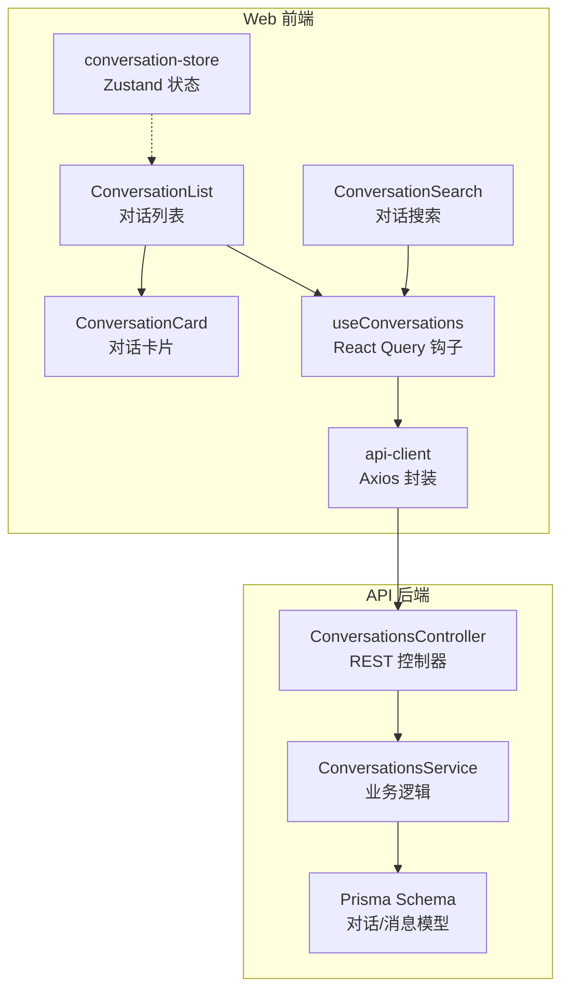
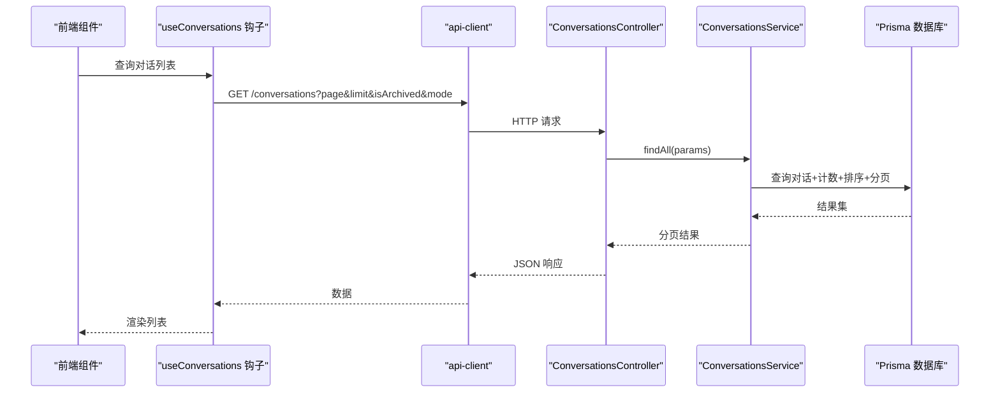
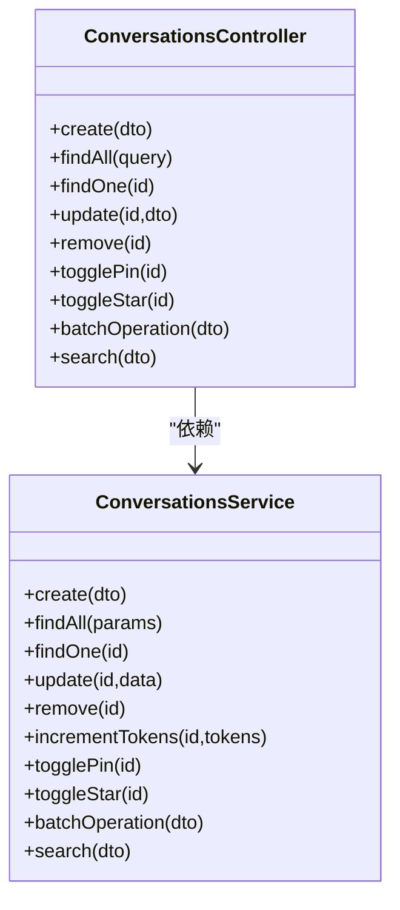
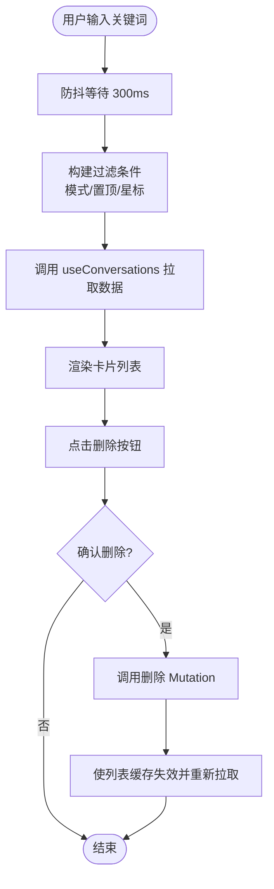
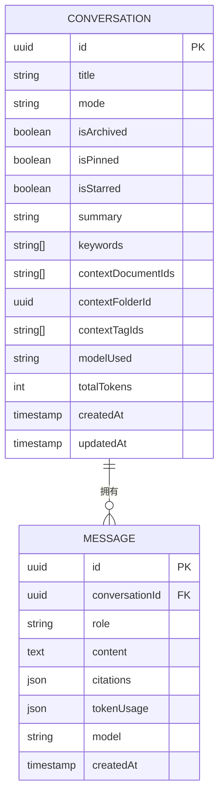
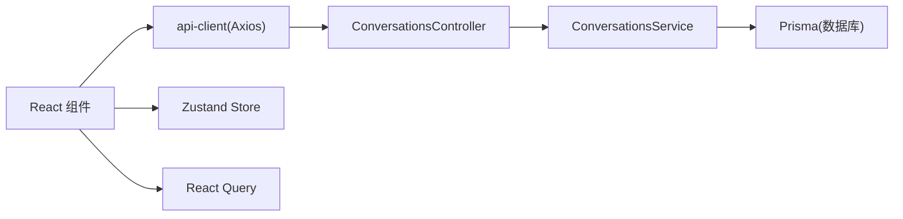

# 对话管理

<cite>
**本文引用的文件**
- [apps/api/src/modules/conversations/conversations.controller.ts](file://apps/api/src/modules/conversations/conversations.controller.ts)
- [apps/api/src/modules/conversations/conversations.service.ts](file://apps/api/src/modules/conversations/conversations.service.ts)
- [apps/api/src/modules/conversations/dto/create-conversation.dto.ts](file://apps/api/src/modules/conversations/dto/create-conversation.dto.ts)
- [apps/api/src/modules/conversations/dto/update-conversation.dto.ts](file://apps/api/src/modules/conversations/dto/update-conversation.dto.ts)
- [apps/api/src/modules/conversations/dto/query-conversation.dto.ts](file://apps/api/src/modules/conversations/dto/query-conversation.dto.ts)
- [apps/api/src/modules/conversations/dto/search.dto.ts](file://apps/api/src/modules/conversations/dto/search.dto.ts)
- [apps/api/prisma/schema.prisma](file://apps/api/prisma/schema.prisma)
- [apps/web/components/conversations/conversation-card.tsx](file://apps/web/components/conversations/conversation-card.tsx)
- [apps/web/components/conversations/conversation-list.tsx](file://apps/web/components/conversations/conversation-list.tsx)
- [apps/web/components/conversations/conversation-search.tsx](file://apps/web/components/conversations/conversation-search.tsx)
- [apps/web/hooks/use-conversations.ts](file://apps/web/hooks/use-conversations.ts)
- [apps/web/stores/conversation-store.ts](file://apps/web/stores/conversation-store.ts)
- [apps/web/lib/api-client.ts](file://apps/web/lib/api-client.ts)
</cite>

## 目录
1. [简介](#简介)
2. [项目结构](#项目结构)
3. [核心组件](#核心组件)
4. [架构总览](#架构总览)
5. [详细组件分析](#详细组件分析)
6. [依赖分析](#依赖分析)
7. [性能考虑](#性能考虑)
8. [故障排查指南](#故障排查指南)
9. [结论](#结论)
10. [附录](#附录)

## 简介
本文件系统性梳理 APP2 项目的“对话管理”能力，覆盖对话的创建、查询、更新、删除、批量操作、置顶/星标切换、搜索与筛选、以及对话与文档的上下文关联关系。同时对前端对话卡片、列表展示、搜索组件进行实现解析，并给出备份恢复、性能优化与用户体验设计建议。

## 项目结构
对话管理由三层构成：
- API 层：控制器与服务负责对话的 CRUD、批量操作、置顶/星标切换、搜索与分页。
- 数据层：Prisma 定义对话与消息模型，支持上下文文档、文件夹、标签的多维关联。
- Web 层：React 组件通过 React Query 与 Zustand 管理对话列表、详情、UI 状态；Axios 封装统一请求与错误处理。

图表来源
- [apps/web/components/conversations/conversation-list.tsx](file://apps/web/components/conversations/conversation-list.tsx#L1-L50)
- [apps/web/components/conversations/conversation-card.tsx](file://apps/web/components/conversations/conversation-card.tsx#L1-L71)
- [apps/web/components/conversations/conversation-search.tsx](file://apps/web/components/conversations/conversation-search.tsx#L1-L48)
- [apps/web/hooks/use-conversations.ts](file://apps/web/hooks/use-conversations.ts#L1-L101)
- [apps/web/stores/conversation-store.ts](file://apps/web/stores/conversation-store.ts#L1-L55)
- [apps/web/lib/api-client.ts](file://apps/web/lib/api-client.ts#L1-L84)
- [apps/api/src/modules/conversations/conversations.controller.ts](file://apps/api/src/modules/conversations/conversations.controller.ts#L1-L107)
- [apps/api/src/modules/conversations/conversations.service.ts](file://apps/api/src/modules/conversations/conversations.service.ts#L1-L304)
- [apps/api/prisma/schema.prisma](file://apps/api/prisma/schema.prisma#L126-L175)

章节来源
- [apps/web/components/conversations/conversation-list.tsx](file://apps/web/components/conversations/conversation-list.tsx#L1-L50)
- [apps/web/components/conversations/conversation-card.tsx](file://apps/web/components/conversations/conversation-card.tsx#L1-L71)
- [apps/web/components/conversations/conversation-search.tsx](file://apps/web/components/conversations/conversation-search.tsx#L1-L48)
- [apps/web/hooks/use-conversations.ts](file://apps/web/hooks/use-conversations.ts#L1-L101)
- [apps/web/stores/conversation-store.ts](file://apps/web/stores/conversation-store.ts#L1-L55)
- [apps/web/lib/api-client.ts](file://apps/web/lib/api-client.ts#L1-L84)
- [apps/api/src/modules/conversations/conversations.controller.ts](file://apps/api/src/modules/conversations/conversations.controller.ts#L1-L107)
- [apps/api/src/modules/conversations/conversations.service.ts](file://apps/api/src/modules/conversations/conversations.service.ts#L1-L304)
- [apps/api/prisma/schema.prisma](file://apps/api/prisma/schema.prisma#L126-L175)

## 核心组件
- 对话控制器：提供创建、列表、详情、更新、删除、置顶/星标切换、批量操作、搜索等接口。
- 对话服务：封装分页、过滤、排序、搜索、批量操作、上下文字段更新等业务逻辑。
- DTO 校验：对创建、更新、查询、搜索参数进行类型与取值约束。
- 前端钩子：使用 React Query 管理对话列表、详情、增删改的缓存与失效策略。
- 前端组件：对话卡片、列表、搜索组件，展示摘要、时间戳、消息数、模式标识等。
- 状态管理：Zustand 存储当前对话、模式与上下文（文档/文件夹/标签）。
- 数据模型：Prisma 定义 Conversation 与 Message，支持上下文文档、文件夹、标签、置顶/星标、摘要、关键词、Token 计数等。

章节来源
- [apps/api/src/modules/conversations/conversations.controller.ts](file://apps/api/src/modules/conversations/conversations.controller.ts#L25-L106)
- [apps/api/src/modules/conversations/conversations.service.ts](file://apps/api/src/modules/conversations/conversations.service.ts#L14-L302)
- [apps/api/src/modules/conversations/dto/create-conversation.dto.ts](file://apps/api/src/modules/conversations/dto/create-conversation.dto.ts#L10-L41)
- [apps/api/src/modules/conversations/dto/update-conversation.dto.ts](file://apps/api/src/modules/conversations/dto/update-conversation.dto.ts#L4-L31)
- [apps/api/src/modules/conversations/dto/query-conversation.dto.ts](file://apps/api/src/modules/conversations/dto/query-conversation.dto.ts#L5-L33)
- [apps/api/src/modules/conversations/dto/search.dto.ts](file://apps/api/src/modules/conversations/dto/search.dto.ts#L5-L41)
- [apps/web/hooks/use-conversations.ts](file://apps/web/hooks/use-conversations.ts#L22-L100)
- [apps/web/components/conversations/conversation-card.tsx](file://apps/web/components/conversations/conversation-card.tsx#L7-L16)
- [apps/web/stores/conversation-store.ts](file://apps/web/stores/conversation-store.ts#L3-L24)
- [apps/api/prisma/schema.prisma](file://apps/api/prisma/schema.prisma#L126-L175)

## 架构总览
对话管理采用“前端组件 + React Query + Axios + NestJS 控制器 + Prisma”的分层架构。前端通过钩子发起请求，后端控制器调用服务，服务层执行数据库操作与复杂查询，最终返回结构化数据给前端渲染。

图表来源
- [apps/web/hooks/use-conversations.ts](file://apps/web/hooks/use-conversations.ts#L22-L34)
- [apps/web/lib/api-client.ts](file://apps/web/lib/api-client.ts#L8-L55)
- [apps/api/src/modules/conversations/conversations.controller.ts](file://apps/api/src/modules/conversations/conversations.controller.ts#L37-L47)
- [apps/api/src/modules/conversations/conversations.service.ts](file://apps/api/src/modules/conversations/conversations.service.ts#L32-L77)

## 详细组件分析

### 对话控制器与服务
- 接口职责
  - 创建：接收标题、模式、上下文文档/文件夹/标签 ID，写入数据库。
  - 列表：支持分页、归档过滤、模式过滤、置顶/星标优先、按更新时间倒序。
  - 详情：按 ID 查询，包含消息列表（按时间升序）。
  - 更新：支持标题、归档、上下文集合更新。
  - 删除：存在性校验后删除。
  - 置顶/星标切换：读取当前状态并取反写回。
  - 批量操作：支持归档/取消归档、删除（级联删除消息）、置顶/取消置顶、星标/取消星标。
  - 搜索：支持关键词在标题、摘要、消息内容中模糊匹配，结合模式、置顶、星标过滤，分页返回。
- 服务实现要点
  - 分页与排序：skip/take + 多字段排序（置顶/星标优先，再按更新时间）。
  - 计数聚合：通过 include 聚合消息数量，避免二次查询。
  - 错误处理：未找到时抛出异常，保证一致性。
  - 批量事务：删除对话时先删除消息，再删除对话，确保引用完整性。

图表来源
- [apps/api/src/modules/conversations/conversations.controller.ts](file://apps/api/src/modules/conversations/conversations.controller.ts#L27-L106)
- [apps/api/src/modules/conversations/conversations.service.ts](file://apps/api/src/modules/conversations/conversations.service.ts#L9-L303)

章节来源
- [apps/api/src/modules/conversations/conversations.controller.ts](file://apps/api/src/modules/conversations/conversations.controller.ts#L30-L105)
- [apps/api/src/modules/conversations/conversations.service.ts](file://apps/api/src/modules/conversations/conversations.service.ts#L17-L302)

### DTO 参数校验
- 创建对话：可选标题、模式（枚举）、上下文文档/文件夹/标签 ID 数组（UUID v4）。
- 更新对话：可选标题、归档标志、上下文集合。
- 列表查询：页码、每页数量、归档标志、模式。
- 搜索查询：关键词、页码、每页数量、模式、置顶/星标过滤。

章节来源
- [apps/api/src/modules/conversations/dto/create-conversation.dto.ts](file://apps/api/src/modules/conversations/dto/create-conversation.dto.ts#L10-L41)
- [apps/api/src/modules/conversations/dto/update-conversation.dto.ts](file://apps/api/src/modules/conversations/dto/update-conversation.dto.ts#L4-L31)
- [apps/api/src/modules/conversations/dto/query-conversation.dto.ts](file://apps/api/src/modules/conversations/dto/query-conversation.dto.ts#L5-L33)
- [apps/api/src/modules/conversations/dto/search.dto.ts](file://apps/api/src/modules/conversations/dto/search.dto.ts#L5-L41)

### 前端对话卡片与列表
- 卡片组件：展示标题、消息数、模式图标、相对时间；提供删除按钮与确认提示。
- 列表组件：基于钩子拉取数据，空态引导新建对话；骨架屏提升加载体验。
- 搜索组件：支持关键词输入、模式选择、置顶/星标过滤，带防抖触发查询。

图表来源
- [apps/web/components/conversations/conversation-search.tsx](file://apps/web/components/conversations/conversation-search.tsx#L19-L48)
- [apps/web/hooks/use-conversations.ts](file://apps/web/hooks/use-conversations.ts#L88-L100)
- [apps/web/components/conversations/conversation-list.tsx](file://apps/web/components/conversations/conversation-list.tsx#L7-L49)
- [apps/web/components/conversations/conversation-card.tsx](file://apps/web/components/conversations/conversation-card.tsx#L18-L70)

章节来源
- [apps/web/components/conversations/conversation-card.tsx](file://apps/web/components/conversations/conversation-card.tsx#L7-L16)
- [apps/web/components/conversations/conversation-list.tsx](file://apps/web/components/conversations/conversation-list.tsx#L7-L49)
- [apps/web/components/conversations/conversation-search.tsx](file://apps/web/components/conversations/conversation-search.tsx#L19-L48)
- [apps/web/hooks/use-conversations.ts](file://apps/web/hooks/use-conversations.ts#L88-L100)

### 对话与文档的关联关系
- 上下文字段：对话记录 contextDocumentIds、contextFolderId、contextTagIds，用于限定检索/生成的上下文范围。
- 模型映射：Prisma 中 Conversation 的上下文字段与文档/标签/文件夹建立逻辑关联。
- 消息模型：Message 包含内容、引用、模型、Token 使用统计，便于审计与成本追踪。

图表来源
- [apps/api/prisma/schema.prisma](file://apps/api/prisma/schema.prisma#L126-L175)

章节来源
- [apps/api/prisma/schema.prisma](file://apps/api/prisma/schema.prisma#L126-L175)

### 对话列表展示与管理
- 分页加载：后端返回 items、total、page、limit、totalPages；前端按需渲染。
- 搜索筛选：关键词 + 模式 + 置顶/星标三类过滤；搜索结果同样支持分页。
- 排序策略：置顶/星标优先，其次按更新时间倒序，保证重要对话靠前。

章节来源
- [apps/api/src/modules/conversations/conversations.service.ts](file://apps/api/src/modules/conversations/conversations.service.ts#L32-L77)
- [apps/api/src/modules/conversations/conversations.service.ts](file://apps/api/src/modules/conversations/conversations.service.ts#L251-L302)
- [apps/web/components/conversations/conversation-search.tsx](file://apps/web/components/conversations/conversation-search.tsx#L19-L48)

### 对话卡片组件实现
- 内容摘要：标题、消息数、模式图标（普通/知识库）、相对更新时间。
- 用户交互：点击卡片跳转详情；删除按钮触发确认对话框并调用删除 Mutation。
- 样式与可访问性：hover 效果、删除按钮颜色变化、空态友好提示。

章节来源
- [apps/web/components/conversations/conversation-card.tsx](file://apps/web/components/conversations/conversation-card.tsx#L18-L70)
- [apps/web/components/conversations/conversation-list.tsx](file://apps/web/components/conversations/conversation-list.tsx#L38-L48)

### 对话搜索与过滤
- 前端搜索：输入框 + 防抖（300ms），组合模式/置顶/星标过滤条件，调用钩子发起请求。
- 后端搜索：关键词在标题、摘要、消息内容中模糊匹配；支持模式、置顶/星标过滤；分页返回。

章节来源
- [apps/web/components/conversations/conversation-search.tsx](file://apps/web/components/conversations/conversation-search.tsx#L19-L48)
- [apps/api/src/modules/conversations/conversations.service.ts](file://apps/api/src/modules/conversations/conversations.service.ts#L251-L302)

### 对话数据备份与恢复
- 备份策略
  - 数据库层：定期导出 PostgreSQL 数据（含对话与消息表），保留上下文字段与 Token 统计。
  - API 层：提供批量导出接口（如 /conversations/export），按筛选条件输出 JSON。
- 恢复流程
  - 导入前清理目标环境（可选）。
  - 通过批量导入脚本写入数据库，注意 UUID 冲突与上下文 ID 有效性校验。
  - 导入后验证关键字段（标题、模式、上下文集合、消息数量、Token 总量）。

[本节为通用实践建议，不直接分析具体文件，故无章节来源]

### 性能优化
- 前端
  - 列表分页与懒加载：限制初始加载数量，滚动触底继续加载。
  - 防抖搜索：降低高频输入带来的请求压力。
  - 缓存与失效：React Query 合理设置缓存时间与手动失效，减少重复请求。
- 后端
  - 分页与索引：使用 skip/take 并确保相关字段建立索引（归档、置顶、星标、更新时间）。
  - 聚合查询：通过 include 聚合消息数，避免 N+1 查询。
  - 批量操作：使用事务或批量更新，减少往返次数。
- 数据库
  - 对 Conversation 与 Message 建立必要索引，加速查询与排序。
  - 对关键词/摘要字段使用全文检索（如启用相关特性）提升搜索效率。

[本节为通用性能建议，不直接分析具体文件，故无章节来源]

### 用户体验设计
- 加载反馈：骨架屏与占位符，提升感知速度。
- 错误提示：统一错误拦截与提示，区分网络、服务端与业务错误。
- 交互确认：删除等危险操作增加二次确认。
- 快捷入口：空态引导新建对话，提高转化率。
- 可访问性：语义化标签、键盘导航、高对比度与无障碍提示。

[本节为通用体验建议，不直接分析具体文件，故无章节来源]

## 依赖分析
- 前端依赖
  - Axios：统一请求封装与拦截器。
  - React Query：缓存、并发、失效与重试。
  - Zustand：轻量状态管理，保存当前对话、模式与上下文。
- 后端依赖
  - Prisma：类型安全的数据访问层，支持复杂查询与事务。
  - Swagger：接口文档自动生成，便于前后端协作。
- 外部集成
  - 搜索服务：可与独立搜索引擎（如 Meilisearch）集成，实现高性能全文检索。

图表来源
- [apps/web/lib/api-client.ts](file://apps/web/lib/api-client.ts#L8-L55)
- [apps/api/src/modules/conversations/conversations.controller.ts](file://apps/api/src/modules/conversations/conversations.controller.ts#L27-L106)
- [apps/api/src/modules/conversations/conversations.service.ts](file://apps/api/src/modules/conversations/conversations.service.ts#L12-L12)
- [apps/api/prisma/schema.prisma](file://apps/api/prisma/schema.prisma#L126-L175)
- [apps/web/stores/conversation-store.ts](file://apps/web/stores/conversation-store.ts#L26-L54)
- [apps/web/hooks/use-conversations.ts](file://apps/web/hooks/use-conversations.ts#L27-L34)

章节来源
- [apps/web/lib/api-client.ts](file://apps/web/lib/api-client.ts#L8-L55)
- [apps/web/stores/conversation-store.ts](file://apps/web/stores/conversation-store.ts#L26-L54)
- [apps/web/hooks/use-conversations.ts](file://apps/web/hooks/use-conversations.ts#L27-L34)
- [apps/api/src/modules/conversations/conversations.controller.ts](file://apps/api/src/modules/conversations/conversations.controller.ts#L27-L106)
- [apps/api/src/modules/conversations/conversations.service.ts](file://apps/api/src/modules/conversations/conversations.service.ts#L12-L12)
- [apps/api/prisma/schema.prisma](file://apps/api/prisma/schema.prisma#L126-L175)

## 性能考虑
- 分页与排序：后端按需分页并使用复合索引，避免全表扫描。
- 缓存策略：React Query 合理设置 staleTime/cacheTime，批量操作后主动失效。
- 请求合并：搜索防抖与去重，避免重复请求。
- 数据库优化：为常用过滤字段（归档、置顶、星标、更新时间）建立索引；对消息内容字段考虑全文索引或外部搜索引擎。

[本节提供通用指导，不直接分析具体文件，故无章节来源]

## 故障排查指南
- 常见问题
  - 对话不存在：后端在查询/更新/删除时若找不到记录会抛出异常，前端需捕获并提示。
  - 请求失败：Axios 响应拦截器统一处理错误，打印日志并提示用户。
  - 搜索无结果：确认关键词长度、过滤条件是否过严；检查后端搜索逻辑与索引。
- 排查步骤
  - 检查网络：确认 API 地址、跨域与鉴权。
  - 检查参数：核对 DTO 校验规则与传参格式。
  - 检查缓存：React Query 是否正确失效，Zustand 状态是否同步。
  - 检查数据库：确认索引是否存在，查询计划是否合理。

章节来源
- [apps/api/src/modules/conversations/conversations.service.ts](file://apps/api/src/modules/conversations/conversations.service.ts#L92-L96)
- [apps/web/lib/api-client.ts](file://apps/web/lib/api-client.ts#L40-L54)

## 结论
对话管理模块通过清晰的分层设计与完善的 DTO 校验，实现了从创建到搜索的全链路能力。前端以 React Query 与 Zustand 提升交互体验，后端以 Prisma 保障数据一致性与扩展性。结合索引、分页与缓存策略，可在大规模场景下保持良好性能与可观测性。

## 附录
- API 端点概览
  - POST /conversations：创建对话
  - GET /conversations：获取对话列表（分页/过滤）
  - GET /conversations/:id：获取对话详情（含消息）
  - PATCH /conversations/:id：更新对话
  - DELETE /conversations/:id：删除对话
  - PATCH /conversations/:id/pin：切换置顶
  - PATCH /conversations/:id/star：切换星标
  - POST /conversations/batch：批量操作
  - GET /conversations/search/list：搜索对话

章节来源
- [apps/api/src/modules/conversations/conversations.controller.ts](file://apps/api/src/modules/conversations/conversations.controller.ts#L30-L105)