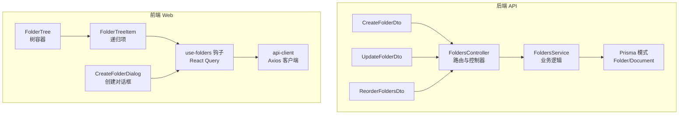
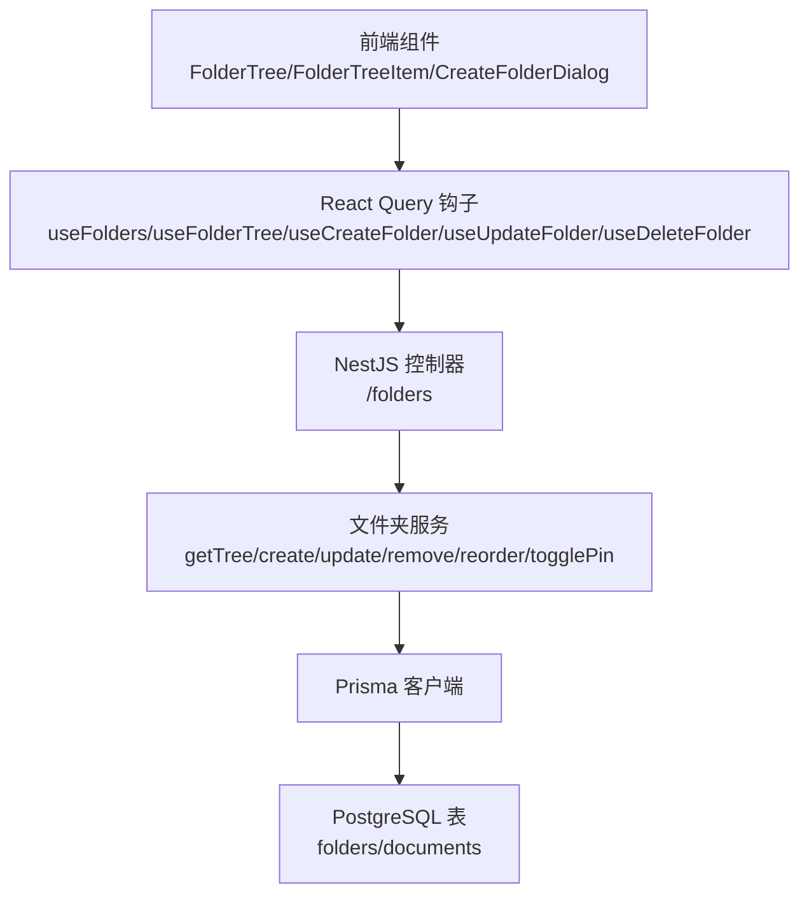
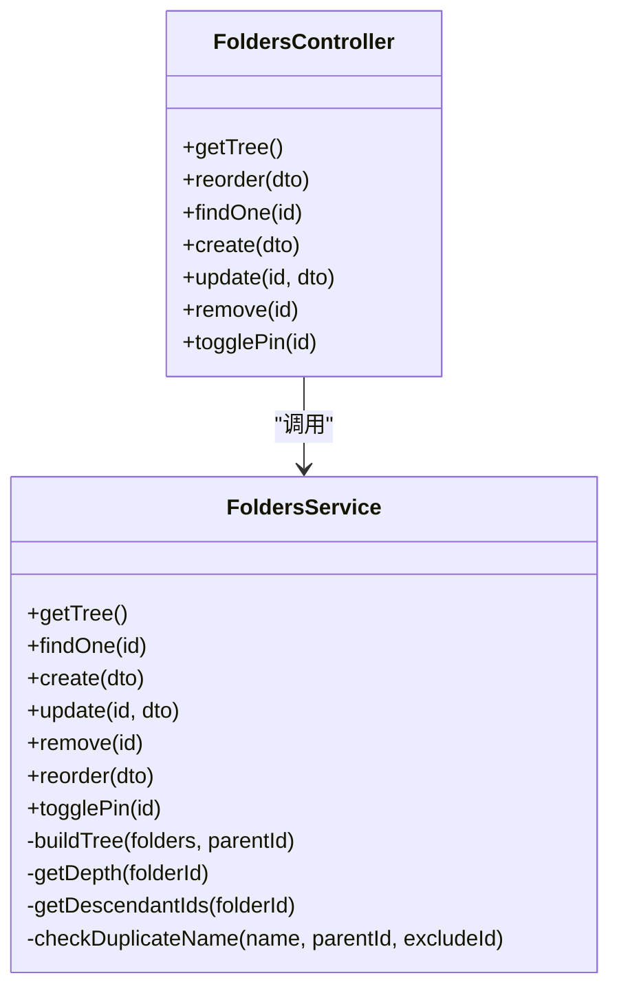
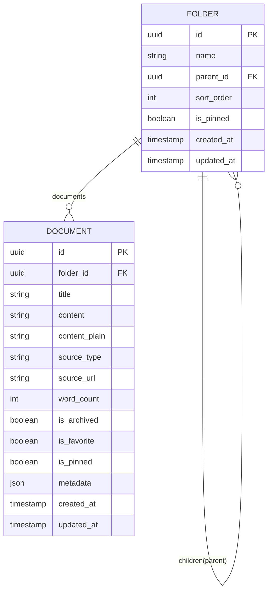
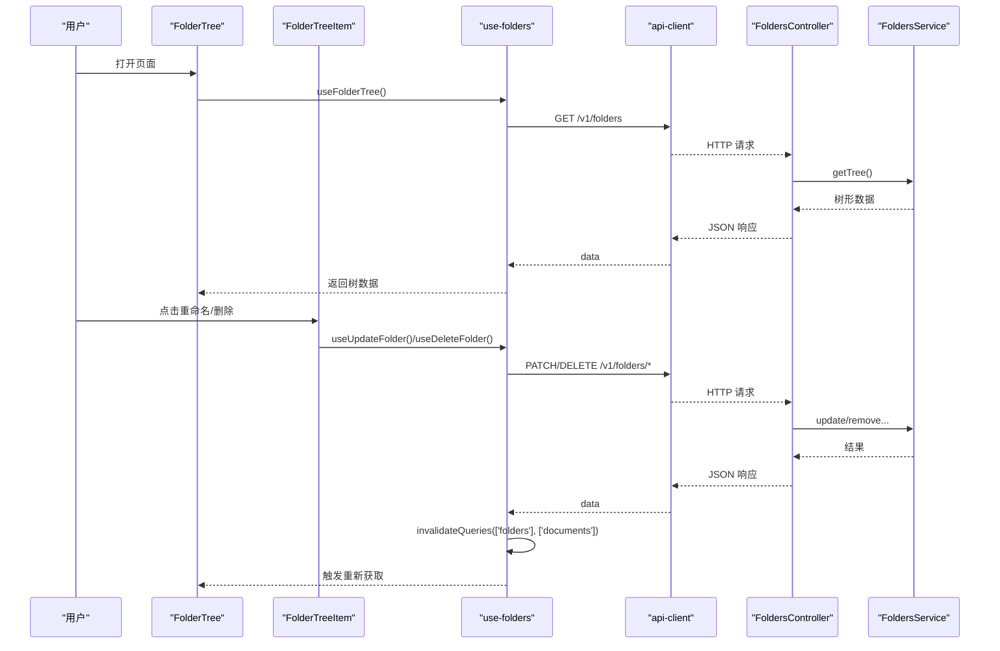
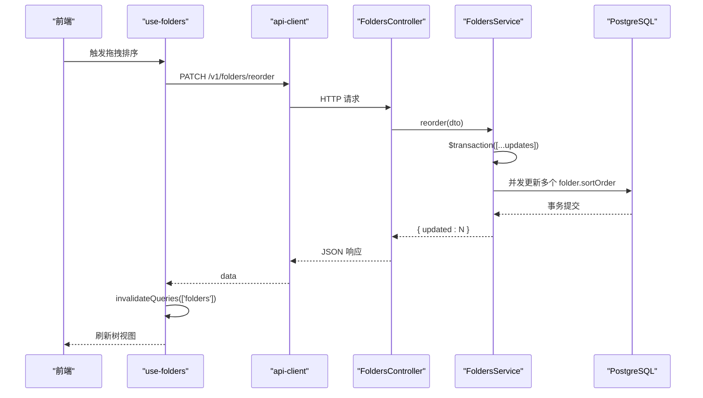
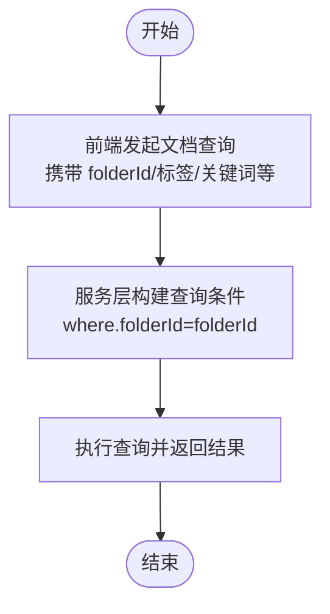
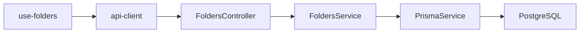

# 文件夹管理系统

<cite>
**本文引用的文件**
- [apps/api/src/modules/folders/folders.module.ts](file://apps/api/src/modules/folders/folders.module.ts)
- [apps/api/src/modules/folders/folders.controller.ts](file://apps/api/src/modules/folders/folders.controller.ts)
- [apps/api/src/modules/folders/folders.service.ts](file://apps/api/src/modules/folders/folders.service.ts)
- [apps/api/src/modules/folders/dto/create-folder.dto.ts](file://apps/api/src/modules/folders/dto/create-folder.dto.ts)
- [apps/api/src/modules/folders/dto/update-folder.dto.ts](file://apps/api/src/modules/folders/dto/update-folder.dto.ts)
- [apps/api/src/modules/folders/dto/reorder-folders.dto.ts](file://apps/api/src/modules/folders/dto/reorder-folders.dto.ts)
- [apps/api/prisma/schema.prisma](file://apps/api/prisma/schema.prisma)
- [apps/web/hooks/use-folders.ts](file://apps/web/hooks/use-folders.ts)
- [apps/web/components/folders/folder-tree.tsx](file://apps/web/components/folders/folder-tree.tsx)
- [apps/web/components/folders/folder-tree-item.tsx](file://apps/web/components/folders/folder-tree-item.tsx)
- [apps/web/components/folders/create-folder-dialog.tsx](file://apps/web/components/folders/create-folder-dialog.tsx)
- [apps/web/lib/api-client.ts](file://apps/web/lib/api-client.ts)
- [apps/web/hooks/use-documents.ts](file://apps/web/hooks/use-documents.ts)
</cite>

## 目录
1. [简介](#简介)
2. [项目结构](#项目结构)
3. [核心组件](#核心组件)
4. [架构总览](#架构总览)
5. [详细组件分析](#详细组件分析)
6. [依赖分析](#依赖分析)
7. [性能考虑](#性能考虑)
8. [故障排查指南](#故障排查指南)
9. [结论](#结论)
10. [附录](#附录)

## 简介
本文件夹管理系统围绕“文件夹树”这一核心数据结构，提供完整的层级关系维护、父子节点管理、拖拽排序、创建/更新/删除、置顶切换、以及与文档的关联筛选能力。后端采用 NestJS + Prisma 实现，数据库使用 PostgreSQL；前端基于 Next.js + React Query 提供树形组件与交互体验。系统支持：
- 树形结构的递归构建与渲染
- 同级重名校验、嵌套深度限制（最多5层）、循环引用防护
- 批量重排序与置顶切换
- 与文档的关联：通过 folderId 进行筛选与移动
- 前端缓存与乐观更新策略，提升交互性能

## 项目结构
文件夹管理相关代码分布于后端 API 与前端 Web 两部分：
- 后端模块：folders.controller.ts、folders.service.ts、DTO 定义、Prisma 模式
- 前端模块：use-folders 钩子、文件夹树组件、创建对话框、API 客户端

图表来源
- [apps/api/src/modules/folders/folders.controller.ts](file://apps/api/src/modules/folders/folders.controller.ts#L22-L90)
- [apps/api/src/modules/folders/folders.service.ts](file://apps/api/src/modules/folders/folders.service.ts#L11-L297)
- [apps/api/src/modules/folders/dto/create-folder.dto.ts](file://apps/api/src/modules/folders/dto/create-folder.dto.ts#L4-L20)
- [apps/api/src/modules/folders/dto/update-folder.dto.ts](file://apps/api/src/modules/folders/dto/update-folder.dto.ts#L1-L5)
- [apps/api/src/modules/folders/dto/reorder-folders.dto.ts](file://apps/api/src/modules/folders/dto/reorder-folders.dto.ts#L15-L22)
- [apps/api/prisma/schema.prisma](file://apps/api/prisma/schema.prisma#L20-L37)
- [apps/web/hooks/use-folders.ts](file://apps/web/hooks/use-folders.ts#L18-L76)
- [apps/web/components/folders/folder-tree.tsx](file://apps/web/components/folders/folder-tree.tsx#L7-L48)
- [apps/web/components/folders/folder-tree-item.tsx](file://apps/web/components/folders/folder-tree-item.tsx#L14-L133)
- [apps/web/components/folders/create-folder-dialog.tsx](file://apps/web/components/folders/create-folder-dialog.tsx#L12-L65)
- [apps/web/lib/api-client.ts](file://apps/web/lib/api-client.ts#L8-L59)

章节来源
- [apps/api/src/modules/folders/folders.module.ts](file://apps/api/src/modules/folders/folders.module.ts#L1-L11)
- [apps/api/src/modules/folders/folders.controller.ts](file://apps/api/src/modules/folders/folders.controller.ts#L22-L90)
- [apps/api/src/modules/folders/folders.service.ts](file://apps/api/src/modules/folders/folders.service.ts#L11-L297)
- [apps/api/prisma/schema.prisma](file://apps/api/prisma/schema.prisma#L20-L37)
- [apps/web/hooks/use-folders.ts](file://apps/web/hooks/use-folders.ts#L18-L76)
- [apps/web/components/folders/folder-tree.tsx](file://apps/web/components/folders/folder-tree.tsx#L7-L48)
- [apps/web/components/folders/folder-tree-item.tsx](file://apps/web/components/folders/folder-tree-item.tsx#L14-L133)
- [apps/web/components/folders/create-folder-dialog.tsx](file://apps/web/components/folders/create-folder-dialog.tsx#L12-L65)
- [apps/web/lib/api-client.ts](file://apps/web/lib/api-client.ts#L8-L59)

## 核心组件
- 后端模块装配：通过模块导出服务，控制器仅负责路由与 DTO 校验，业务逻辑集中在服务层。
- 文件夹树构建：服务层一次性拉取全部文件夹并递归组装为树，同时按置顶、排序、名称排序。
- CRUD 与约束：创建/更新时执行同级重名检查、深度限制、循环引用检测；删除时级联清理子树并将文档的 folderId 置空。
- 批量重排序：事务内批量更新 sortOrder，保证一致性。
- 前端钩子：统一使用 React Query 管理树与列表数据，提供创建/更新/删除的 mutation，并在成功后失效查询以触发刷新。

章节来源
- [apps/api/src/modules/folders/folders.module.ts](file://apps/api/src/modules/folders/folders.module.ts#L5-L10)
- [apps/api/src/modules/folders/folders.controller.ts](file://apps/api/src/modules/folders/folders.controller.ts#L27-L90)
- [apps/api/src/modules/folders/folders.service.ts](file://apps/api/src/modules/folders/folders.service.ts#L17-L32)
- [apps/web/hooks/use-folders.ts](file://apps/web/hooks/use-folders.ts#L18-L76)

## 架构总览
后端采用分层架构：Controller -> Service -> Prisma；前端通过 React Query 与后端交互，组件负责渲染与用户交互。

图表来源
- [apps/web/components/folders/folder-tree.tsx](file://apps/web/components/folders/folder-tree.tsx#L7-L48)
- [apps/web/components/folders/folder-tree-item.tsx](file://apps/web/components/folders/folder-tree-item.tsx#L14-L133)
- [apps/web/components/folders/create-folder-dialog.tsx](file://apps/web/components/folders/create-folder-dialog.tsx#L12-L65)
- [apps/web/hooks/use-folders.ts](file://apps/web/hooks/use-folders.ts#L18-L76)
- [apps/api/src/modules/folders/folders.controller.ts](file://apps/api/src/modules/folders/folders.controller.ts#L27-L90)
- [apps/api/src/modules/folders/folders.service.ts](file://apps/api/src/modules/folders/folders.service.ts#L17-L216)
- [apps/api/prisma/schema.prisma](file://apps/api/prisma/schema.prisma#L20-L37)

## 详细组件分析

### 后端：文件夹控制器与服务
- 控制器路由
  - GET /folders：获取完整树形结构
  - PATCH /folders/reorder：批量重排序
  - GET /folders/:id：获取单个文件夹详情
  - POST /folders：创建文件夹
  - PATCH /folders/:id：更新文件夹
  - DELETE /folders/:id：删除文件夹（级联删除子树，文档解除关联）
  - PATCH /folders/:id/pin：切换置顶状态
- 服务层关键逻辑
  - 树构建：一次性查询并递归组装 children
  - 创建：校验父节点存在性、深度限制、同级重名
  - 更新：变更父节点时进行循环引用检查、深度限制、同级重名
  - 删除：计算子孙集合，先将文档的 folderId 置空，再删除文件夹
  - 批量重排序：事务内批量更新 sortOrder
  - 置顶切换：读取当前状态并翻转

图表来源
- [apps/api/src/modules/folders/folders.controller.ts](file://apps/api/src/modules/folders/folders.controller.ts#L27-L90)
- [apps/api/src/modules/folders/folders.service.ts](file://apps/api/src/modules/folders/folders.service.ts#L17-L297)

章节来源
- [apps/api/src/modules/folders/folders.controller.ts](file://apps/api/src/modules/folders/folders.controller.ts#L27-L90)
- [apps/api/src/modules/folders/folders.service.ts](file://apps/api/src/modules/folders/folders.service.ts#L17-L297)

### 数据模型与关联
- Folder 模型
  - 主键 id，名称 name，父节点 parentId（自引用），排序字段 sortOrder，默认 0；置顶 isPinned，默认 false
  - 索引：parentId、isPinned
  - 子节点 children（一对多），文档 documents（一对多）
- Document 模型
  - folderId 外键，onDelete: SetNull，即删除文件夹时文档不被级联删除，仅解除关联
  - 索引：folderId
- 关系与影响
  - 文件夹删除：服务层先将该文件夹及子孙下所有文档的 folderId 置空，再删除文件夹，避免外键约束导致的级联失败
  - 文档筛选：通过 folderId 进行过滤，配合其他维度（标签、归档、置顶、关键词）组合查询

图表来源
- [apps/api/prisma/schema.prisma](file://apps/api/prisma/schema.prisma#L20-L37)
- [apps/api/prisma/schema.prisma](file://apps/api/prisma/schema.prisma#L42-L73)

章节来源
- [apps/api/prisma/schema.prisma](file://apps/api/prisma/schema.prisma#L20-L37)
- [apps/api/prisma/schema.prisma](file://apps/api/prisma/schema.prisma#L42-L73)

### 前端：文件夹树组件与交互
- FolderTree
  - 加载树数据，提供“全部文档”入口，清空 activeFolderId 以显示未归档文档
  - 当树为空时提示“暂无文件夹”
- FolderTreeItem
  - 递归渲染子节点，支持展开/折叠（默认前两级展开）
  - 点击项设置为激活态，显示文档计数
  - 悬停显示重命名/删除按钮，支持回车保存、ESC 取消
  - 点击删除确认后，若当前激活即清空 activeFolderId
- CreateFolderDialog
  - 输入名称，提交时调用 useCreateFolder，成功后关闭对话框
  - 默认父节点为当前 activeFolderId 或顶层
- use-folders 钩子
  - useFolderTree/useFolders：获取树/列表数据
  - useCreateFolder/useUpdateFolder/useDeleteFolder：增删改，成功后失效 folders 查询并同步 documents 查询

图表来源
- [apps/web/components/folders/folder-tree.tsx](file://apps/web/components/folders/folder-tree.tsx#L7-L48)
- [apps/web/components/folders/folder-tree-item.tsx](file://apps/web/components/folders/folder-tree-item.tsx#L14-L133)
- [apps/web/components/folders/create-folder-dialog.tsx](file://apps/web/components/folders/create-folder-dialog.tsx#L12-L65)
- [apps/web/hooks/use-folders.ts](file://apps/web/hooks/use-folders.ts#L18-L76)
- [apps/web/lib/api-client.ts](file://apps/web/lib/api-client.ts#L8-L59)
- [apps/api/src/modules/folders/folders.controller.ts](file://apps/api/src/modules/folders/folders.controller.ts#L27-L90)
- [apps/api/src/modules/folders/folders.service.ts](file://apps/api/src/modules/folders/folders.service.ts#L17-L216)

章节来源
- [apps/web/components/folders/folder-tree.tsx](file://apps/web/components/folders/folder-tree.tsx#L7-L48)
- [apps/web/components/folders/folder-tree-item.tsx](file://apps/web/components/folders/folder-tree-item.tsx#L14-L133)
- [apps/web/components/folders/create-folder-dialog.tsx](file://apps/web/components/folders/create-folder-dialog.tsx#L12-L65)
- [apps/web/hooks/use-folders.ts](file://apps/web/hooks/use-folders.ts#L18-L76)

### reorder 接口实现原理与批量重排序
- 接口路径：PATCH /folders/reorder
- 请求体：ReorderFoldersDto，数组 items，每个元素包含 id 与新的 sortOrder
- 实现要点：
  - 服务层对每个 item 生成一个更新语句
  - 使用 Prisma 事务包裹，确保要么全部成功，要么全部回滚
  - 返回更新成功的条数，便于前端反馈

图表来源
- [apps/api/src/modules/folders/folders.controller.ts](file://apps/api/src/modules/folders/folders.controller.ts#L34-L40)
- [apps/api/src/modules/folders/folders.service.ts](file://apps/api/src/modules/folders/folders.service.ts#L185-L196)
- [apps/api/src/modules/folders/dto/reorder-folders.dto.ts](file://apps/api/src/modules/folders/dto/reorder-folders.dto.ts#L15-L22)

章节来源
- [apps/api/src/modules/folders/folders.controller.ts](file://apps/api/src/modules/folders/folders.controller.ts#L34-L40)
- [apps/api/src/modules/folders/folders.service.ts](file://apps/api/src/modules/folders/folders.service.ts#L185-L196)
- [apps/api/src/modules/folders/dto/reorder-folders.dto.ts](file://apps/api/src/modules/folders/dto/reorder-folders.dto.ts#L15-L22)

### 文件夹与文档的关联与筛选
- 关联关系
  - Folder 与 Document 为一对多，删除文件夹时通过服务层将文档 folderId 置空，避免外键约束问题
- 文档筛选
  - 前端文档查询支持 folderId 参数，结合标签、归档、置顶、关键词等条件
  - 服务层在查询时根据 folderId 添加 where 条件，实现“按文件夹组织”的筛选

图表来源
- [apps/web/hooks/use-documents.ts](file://apps/web/hooks/use-documents.ts#L43-L61)
- [apps/api/src/modules/documents/documents.service.ts](file://apps/api/src/modules/documents/documents.service.ts#L50-L116)
- [apps/api/prisma/schema.prisma](file://apps/api/prisma/schema.prisma#L42-L73)

章节来源
- [apps/web/hooks/use-documents.ts](file://apps/web/hooks/use-documents.ts#L43-L61)
- [apps/api/src/modules/documents/documents.service.ts](file://apps/api/src/modules/documents/documents.service.ts#L50-L116)
- [apps/api/prisma/schema.prisma](file://apps/api/prisma/schema.prisma#L42-L73)

## 依赖分析
- 控制器依赖服务，服务依赖 Prisma；前端通过 api-client 与控制器交互
- 前端 use-folders 钩子依赖 api-client，控制器依赖 DTO 校验
- 数据库层面，Folder 的 children 与 documents 字段通过 Prisma 关系映射，删除策略为 SetNull（文档不被级联删除）

图表来源
- [apps/api/src/modules/folders/folders.controller.ts](file://apps/api/src/modules/folders/folders.controller.ts#L17-L25)
- [apps/api/src/modules/folders/folders.service.ts](file://apps/api/src/modules/folders/folders.service.ts#L13)
- [apps/web/lib/api-client.ts](file://apps/web/lib/api-client.ts#L8-L59)
- [apps/web/hooks/use-folders.ts](file://apps/web/hooks/use-folders.ts#L18-L76)

章节来源
- [apps/api/src/modules/folders/folders.controller.ts](file://apps/api/src/modules/folders/folders.controller.ts#L17-L25)
- [apps/api/src/modules/folders/folders.service.ts](file://apps/api/src/modules/folders/folders.service.ts#L13)
- [apps/web/lib/api-client.ts](file://apps/web/lib/api-client.ts#L8-L59)
- [apps/web/hooks/use-folders.ts](file://apps/web/hooks/use-folders.ts#L18-L76)

## 性能考虑
- 树构建与排序
  - 服务层一次性查询全部 Folder，按 isPinned/desc、sortOrder/asc、name/asc 排序，随后递归组装，时间复杂度 O(n log n) 排序 + O(n) 组装
  - 前端默认只展开前两级，减少初次渲染节点数量
- 批量重排序
  - 使用事务并发更新，避免多次往返网络与锁竞争
- 查询与索引
  - Folder 表对 parentId、isPinned 建有索引，有利于树构建与置顶优先展示
  - Document 表对 folderId 建有索引，有利于按文件夹筛选
- 前端缓存
  - React Query 缓存树与列表数据，增删改成功后失效对应查询，避免手动同步状态
- 深度限制
  - 服务层限制最大嵌套深度为 5，防止过深树导致渲染与遍历性能问题

章节来源
- [apps/api/src/modules/folders/folders.service.ts](file://apps/api/src/modules/folders/folders.service.ts#L17-L32)
- [apps/api/prisma/schema.prisma](file://apps/api/prisma/schema.prisma#L34-L35)
- [apps/api/prisma/schema.prisma](file://apps/api/prisma/schema.prisma#L67)
- [apps/web/components/folders/folder-tree-item.tsx](file://apps/web/components/folders/folder-tree-item.tsx#L15)

## 故障排查指南
- 常见错误与定位
  - “父文件夹不存在”：创建/更新时传入了无效 parentId
  - “同级下已存在同名文件夹”：同级重名检查失败
  - “文件夹嵌套深度不能超过 5 层”：父节点深度 + 1 超限
  - “不能将文件夹移动到其子孙文件夹中”：循环引用检测失败
  - “文件夹不存在”：查询/更新/删除的 id 无效
- 前端调试
  - 检查 React Query 错误状态与日志输出
  - 确认 api-client 的 baseURL 与响应拦截器是否正确解包 data.data
- 后端调试
  - 在服务层关键路径增加日志，核对 DTO 校验与约束检查
  - 使用 Prisma Studio 查看数据库状态，验证删除流程是否正确将文档 folderId 置空

章节来源
- [apps/api/src/modules/folders/folders.service.ts](file://apps/api/src/modules/folders/folders.service.ts#L67-L157)
- [apps/web/lib/api-client.ts](file://apps/web/lib/api-client.ts#L32-L55)

## 结论
本文件夹管理系统以“树形结构”为核心，结合严格的约束与事务保障，实现了稳定可靠的层级组织能力。后端通过 DTO 校验与服务层逻辑确保数据一致性，前端通过 React Query 与组件化渲染提供良好的交互体验。通过与文档模块的关联，用户可按文件夹高效组织与筛选内容。建议在后续迭代中继续关注：
- 权限控制：在控制器/服务层加入鉴权与授权逻辑
- 拖拽排序：前端实现拖拽事件与预览反馈，后端提供更细粒度的排序策略
- 性能扩展：大体量树的懒加载与虚拟化渲染

## 附录
- API 路由概览
  - GET /v1/folders：获取树
  - PATCH /v1/folders/reorder：批量重排
  - GET /v1/folders/:id：获取单个
  - POST /v1/folders：创建
  - PATCH /v1/folders/:id：更新
  - DELETE /v1/folders/:id：删除
  - PATCH /v1/folders/:id/pin：置顶切换
- 前端查询键
  - folders/tree：树/列表数据
  - documents：文档列表，支持 folderId 等筛选