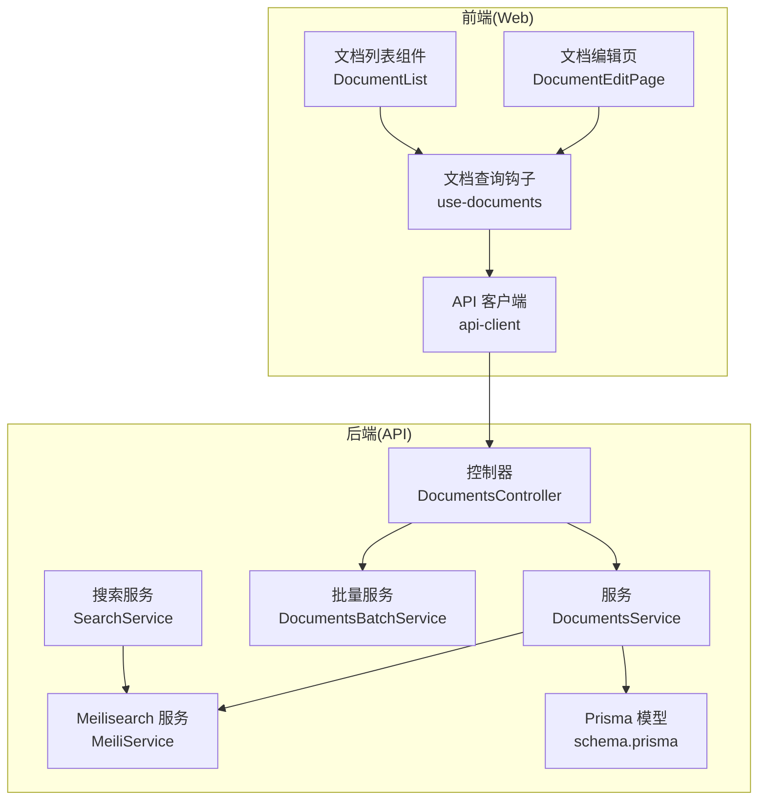
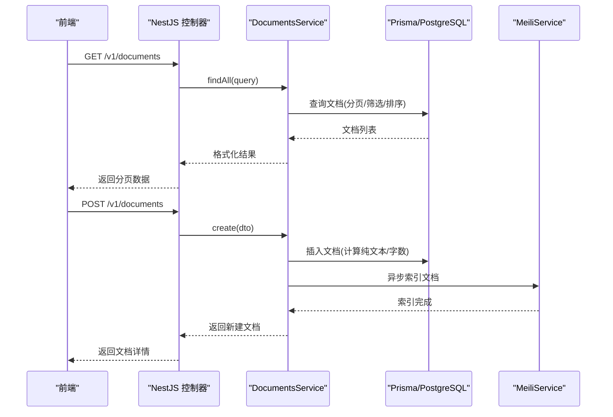
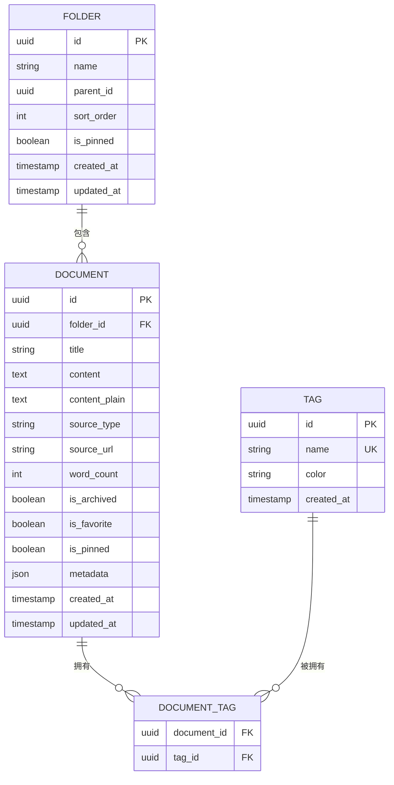
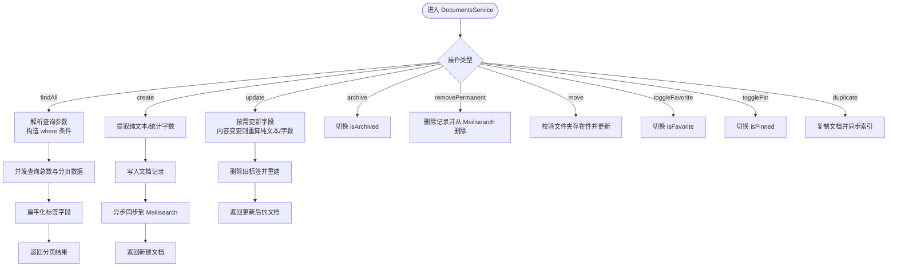
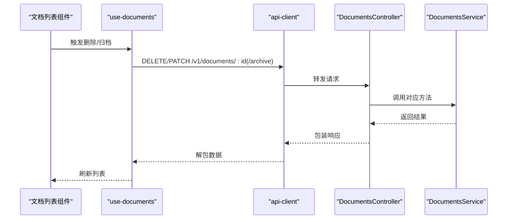
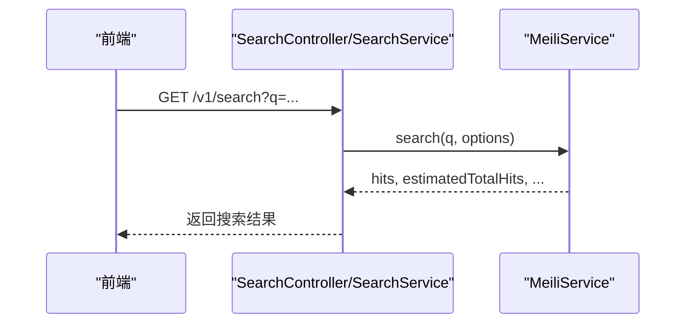
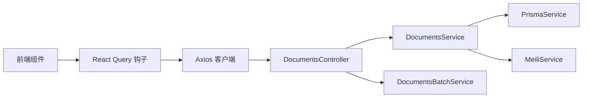

# 文档管理系统

<cite>
**本文引用的文件**   
- [apps/api/src/modules/documents/documents.service.ts](file://apps/api/src/modules/documents/documents.service.ts)
- [apps/api/src/modules/documents/documents.controller.ts](file://apps/api/src/modules/documents/documents.controller.ts)
- [apps/api/prisma/schema.prisma](file://apps/api/prisma/schema.prisma)
- [apps/api/src/modules/documents/dto/create-document.dto.ts](file://apps/api/src/modules/documents/dto/create-document.dto.ts)
- [apps/api/src/modules/documents/dto/update-document.dto.ts](file://apps/api/src/modules/documents/dto/update-document.dto.ts)
- [apps/api/src/modules/documents/dto/query-document.dto.ts](file://apps/api/src/modules/documents/dto/query-document.dto.ts)
- [apps/api/src/common/utils/text.utils.ts](file://apps/api/src/common/utils/text.utils.ts)
- [apps/api/src/modules/documents/documents-batch.service.ts](file://apps/api/src/modules/documents/documents-batch.service.ts)
- [apps/api/src/modules/search/search.service.ts](file://apps/api/src/modules/search/search.service.ts)
- [apps/api/src/modules/search/meili.service.ts](file://apps/api/src/modules/search/meili.service.ts)
- [apps/web/components/documents/document-list.tsx](file://apps/web/components/documents/document-list.tsx)
- [apps/web/hooks/use-documents.ts](file://apps/web/hooks/use-documents.ts)
- [apps/web/app/(main)/documents/[id]/page.tsx](file://apps/web/app/(main)/documents/[id]/page.tsx)
- [apps/web/lib/api-client.ts](file://apps/web/lib/api-client.ts)
- [apps/web/components/documents/document-toolbar.tsx](file://apps/web/components/documents/document-toolbar.tsx)
- [apps/web/components/editor/codemirror-editor.tsx](file://apps/web/components/editor/codemirror-editor.tsx)
</cite>

## 目录
1. [简介](#简介)
2. [项目结构](#项目结构)
3. [核心组件](#核心组件)
4. [架构总览](#架构总览)
5. [详细组件分析](#详细组件分析)
6. [依赖分析](#依赖分析)
7. [性能考虑](#性能考虑)
8. [故障排查指南](#故障排查指南)
9. [结论](#结论)
10. [附录](#附录)

## 简介
本文件面向 APP2 项目的“文档管理系统”，系统性阐述文档的全生命周期管理（创建、编辑、删除、归档、复制）、数据模型设计（标题、内容、纯文本提取、字数统计、来源类型等）、文档与文件夹/标签的多对多关系、完整的 API 接口规范（CRUD、分页、筛选、批量操作）、前端组件实现（列表展示、工具栏、编辑器集成），以及性能优化策略、全文搜索集成与数据一致性保障机制。

## 项目结构
- 后端采用 NestJS + Prisma + PostgreSQL，使用 Meilisearch 提供全文检索。
- 前端采用 Next.js App Router + React Query + CodeMirror 编辑器。
- 文档模块位于后端 apps/api/src/modules/documents，搜索模块位于 apps/api/src/modules/search；前端文档页面位于 apps/web/app/(main)/documents。

**图表来源**
- [apps/web/components/documents/document-list.tsx](file://apps/web/components/documents/document-list.tsx#L1-L166)
- [apps/web/app/(main)/documents/[id]/page.tsx](file://apps/web/app/(main)/documents/[id]/page.tsx#L1-L260)
- [apps/web/lib/api-client.ts](file://apps/web/lib/api-client.ts#L1-L84)
- [apps/web/hooks/use-documents.ts](file://apps/web/hooks/use-documents.ts#L1-L171)
- [apps/api/src/modules/documents/documents.controller.ts](file://apps/api/src/modules/documents/documents.controller.ts#L1-L210)
- [apps/api/src/modules/documents/documents.service.ts](file://apps/api/src/modules/documents/documents.service.ts#L1-L489)
- [apps/api/src/modules/documents/documents-batch.service.ts](file://apps/api/src/modules/documents/documents-batch.service.ts#L1-L204)
- [apps/api/src/modules/search/search.service.ts](file://apps/api/src/modules/search/search.service.ts#L1-L62)
- [apps/api/src/modules/search/meili.service.ts](file://apps/api/src/modules/search/meili.service.ts#L1-L128)
- [apps/api/prisma/schema.prisma](file://apps/api/prisma/schema.prisma#L1-L276)

**章节来源**
- [apps/api/src/modules/documents/documents.controller.ts](file://apps/api/src/modules/documents/documents.controller.ts#L1-L210)
- [apps/api/src/modules/documents/documents.service.ts](file://apps/api/src/modules/documents/documents.service.ts#L1-L489)
- [apps/api/prisma/schema.prisma](file://apps/api/prisma/schema.prisma#L1-L276)
- [apps/web/components/documents/document-list.tsx](file://apps/web/components/documents/document-list.tsx#L1-L166)
- [apps/web/app/(main)/documents/[id]/page.tsx](file://apps/web/app/(main)/documents/[id]/page.tsx#L1-L260)
- [apps/web/lib/api-client.ts](file://apps/web/lib/api-client.ts#L1-L84)
- [apps/web/hooks/use-documents.ts](file://apps/web/hooks/use-documents.ts#L1-L171)

## 核心组件
- 文档控制器：提供文档 CRUD、归档切换、复制、批量操作、大纲提取等端点。
- 文档服务：封装业务逻辑，负责分页/筛选/排序、纯文本提取与字数统计、与 Meilisearch 的异步同步、软删除/硬删除、复制、收藏/置顶切换等。
- 批量服务：提供批量移动、批量标签增删改、批量归档/恢复/删除。
- 搜索服务：调用 Meilisearch 进行全文检索与索引重建。
- Meilisearch 服务：封装索引初始化、文档索引、搜索过滤、批量重建。
- 前端文档列表组件：展示文档列表/网格视图、标签徽章、元数据、操作按钮。
- 前端文档编辑页：标题输入、编辑器、预览、状态栏、快捷键面板、插入数学/图片弹窗。
- 前端查询钩子：统一管理文档列表、详情、最近文档、创建/更新/删除/归档/移动等 Mutation。

**章节来源**
- [apps/api/src/modules/documents/documents.controller.ts](file://apps/api/src/modules/documents/documents.controller.ts#L1-L210)
- [apps/api/src/modules/documents/documents.service.ts](file://apps/api/src/modules/documents/documents.service.ts#L1-L489)
- [apps/api/src/modules/documents/documents-batch.service.ts](file://apps/api/src/modules/documents/documents-batch.service.ts#L1-L204)
- [apps/api/src/modules/search/search.service.ts](file://apps/api/src/modules/search/search.service.ts#L1-L62)
- [apps/api/src/modules/search/meili.service.ts](file://apps/api/src/modules/search/meili.service.ts#L1-L128)
- [apps/web/components/documents/document-list.tsx](file://apps/web/components/documents/document-list.tsx#L1-L166)
- [apps/web/app/(main)/documents/[id]/page.tsx](file://apps/web/app/(main)/documents/[id]/page.tsx#L1-L260)
- [apps/web/hooks/use-documents.ts](file://apps/web/hooks/use-documents.ts#L1-L171)

## 架构总览
系统采用前后端分离架构：
- 前端通过 React Query 发起请求，Axios 作为 HTTP 客户端，自动解包后端统一响应结构。
- 后端使用 NestJS 控制器暴露 REST API，服务层执行业务规则，Prisma 访问数据库，Meilisearch 提供全文检索。
- 文档与标签通过中间表 DocumentTag 实现多对多关系；文档与文件夹为外键关联。

**图表来源**
- [apps/api/src/modules/documents/documents.controller.ts](file://apps/api/src/modules/documents/documents.controller.ts#L66-L97)
- [apps/api/src/modules/documents/documents.service.ts](file://apps/api/src/modules/documents/documents.service.ts#L25-L184)
- [apps/api/src/modules/search/meili.service.ts](file://apps/api/src/modules/search/meili.service.ts#L65-L78)
- [apps/web/lib/api-client.ts](file://apps/web/lib/api-client.ts#L32-L55)

## 详细组件分析

### 数据模型与关系
- 文档(Document)：包含标题、Markdown 内容、纯文本、字数、来源类型/URL、归档/收藏/置顶标记、时间戳等。
- 文件夹(Folder)：树形结构，支持父/子节点、排序、置顶。
- 标签(Tag)：扁平化分类，带颜色。
- 中间表 DocumentTag：实现文档与标签的多对多关系。
- 索引与约束：为常用筛选/排序字段建立索引，如 isArchived、isFavorite、isPinned、createdAt 等。

**图表来源**
- [apps/api/prisma/schema.prisma](file://apps/api/prisma/schema.prisma#L20-L102)

**章节来源**
- [apps/api/prisma/schema.prisma](file://apps/api/prisma/schema.prisma#L20-L102)

### 文档服务与业务流程
- 分页查询：支持按文件夹、标签、归档、收藏、置顶、关键词、排序字段与方向进行筛选与排序，返回 items、total、page、limit、totalPages。
- 创建文档：自动生成纯文本与字数统计，可选 folderId 与 tagIds；异步同步至 Meilisearch。
- 更新文档：支持标题、内容、文件夹、来源类型/URL；内容更新时重新提取纯文本与字数；标签通过“先删后建”实现替换。
- 归档/恢复：切换 isArchived 标记。
- 永久删除：删除记录并从 Meilisearch 删除索引。
- 移动到文件夹：校验目标文件夹存在性。
- 收藏/置顶：切换 isFavorite/isPinned。
- 复制文档：生成副本，保留标题、内容、纯文本、字数、文件夹、标签等。
- 最近文档与收藏列表：分别按更新时间/置顶优先级排序。

**图表来源**
- [apps/api/src/modules/documents/documents.service.ts](file://apps/api/src/modules/documents/documents.service.ts#L25-L489)

**章节来源**
- [apps/api/src/modules/documents/documents.service.ts](file://apps/api/src/modules/documents/documents.service.ts#L25-L489)

### API 接口文档（后端）
- 获取文档列表（分页、筛选、排序）
  - 方法：GET
  - 路径：/v1/documents
  - 查询参数：page、limit、folderId、tagId、isArchived、isFavorite、isPinned、sortBy、sortOrder、keyword
  - 响应：items、total、page、limit、totalPages
- 获取最近文档
  - 方法：GET
  - 路径：/v1/documents/recent?limit=N
- 获取收藏文档
  - 方法：GET
  - 路径：/v1/documents/favorites?page&limit
- 获取文档详情
  - 方法：GET
  - 路径：/v1/documents/:id
- 获取文档大纲
  - 方法：GET
  - 路径：/v1/documents/:id/outline
- 创建文档
  - 方法：POST
  - 路径：/v1/documents
  - 请求体：CreateDocumentDto（标题、内容、folderId、tagIds、sourceType、sourceUrl）
- 复制文档
  - 方法：POST
  - 路径：/v1/documents/:id/duplicate
- 更新文档
  - 方法：PATCH
  - 路径：/v1/documents/:id
  - 请求体：UpdateDocumentDto（可选字段）
- 归档/恢复
  - 方法：PATCH
  - 路径：/v1/documents/:id/archive
- 移动到文件夹
  - 方法：PATCH
  - 路径：/v1/documents/:id/move
  - 请求体：{ folderId: string | null }
- 切换收藏
  - 方法：PATCH
  - 路径：/v1/documents/:id/favorite
- 切换置顶
  - 方法：PATCH
  - 路径：/v1/documents/:id/pin
- 批量操作
  - 移动：POST /v1/documents/batch-move
  - 标签：POST /v1/documents/batch-tag
  - 归档：POST /v1/documents/batch-archive
  - 恢复：POST /v1/documents/batch-restore
  - 删除：POST /v1/documents/batch-delete

**章节来源**
- [apps/api/src/modules/documents/documents.controller.ts](file://apps/api/src/modules/documents/documents.controller.ts#L44-L209)
- [apps/api/src/modules/documents/dto/create-document.dto.ts](file://apps/api/src/modules/documents/dto/create-document.dto.ts#L1-L50)
- [apps/api/src/modules/documents/dto/update-document.dto.ts](file://apps/api/src/modules/documents/dto/update-document.dto.ts#L1-L5)
- [apps/api/src/modules/documents/dto/query-document.dto.ts](file://apps/api/src/modules/documents/dto/query-document.dto.ts#L1-L64)

### 前端组件与交互
- 文档列表组件
  - 支持列表/网格两种视图，展示标题、摘要、标签、字数、更新时间、归档状态与操作按钮。
  - 使用 useDeleteDocument/useArchiveDocument 钩子触发后端删除/归档。
- 文档编辑页
  - 标题输入、编辑器、预览、状态栏（字数、保存状态、光标位置、视图模式）、快捷键面板、插入数学/图片弹窗。
  - 使用 useDocument/useUpdateDocument/useDeleteDocument 钩子管理数据与状态。
- 工具栏
  - 排序字段与方向切换、视图模式切换。
- 编辑器
  - 基于 CodeMirror，支持 Markdown 语法、快捷键、搜索、自动补全、主题样式、光标跟踪。
- API 客户端
  - Axios 实例，统一请求/响应拦截，自动解包 data.data 结构，统一错误处理。

**图表来源**
- [apps/web/components/documents/document-list.tsx](file://apps/web/components/documents/document-list.tsx#L14-L136)
- [apps/web/hooks/use-documents.ts](file://apps/web/hooks/use-documents.ts#L131-L143)
- [apps/web/lib/api-client.ts](file://apps/web/lib/api-client.ts#L32-L55)
- [apps/api/src/modules/documents/documents.controller.ts](file://apps/api/src/modules/documents/documents.controller.ts#L120-L136)

**章节来源**
- [apps/web/components/documents/document-list.tsx](file://apps/web/components/documents/document-list.tsx#L1-L166)
- [apps/web/app/(main)/documents/[id]/page.tsx](file://apps/web/app/(main)/documents/[id]/page.tsx#L1-L260)
- [apps/web/components/documents/document-toolbar.tsx](file://apps/web/components/documents/document-toolbar.tsx#L1-L61)
- [apps/web/components/editor/codemirror-editor.tsx](file://apps/web/components/editor/codemirror-editor.tsx#L1-L272)
- [apps/web/hooks/use-documents.ts](file://apps/web/hooks/use-documents.ts#L1-L171)
- [apps/web/lib/api-client.ts](file://apps/web/lib/api-client.ts#L1-L84)

### 全文搜索与索引
- 搜索服务：接收查询参数，调用 Meilisearch 执行搜索，返回命中、估算总数、耗时、分页信息。
- Meilisearch 服务：初始化索引、设置可搜索/可过滤/可排序属性、索引单个/多个文档、删除单个文档、构建过滤条件、分页搜索、高亮与裁剪。
- 文档服务：在创建/更新/复制后异步同步到 Meilisearch；删除后从索引移除。

**图表来源**
- [apps/api/src/modules/search/search.service.ts](file://apps/api/src/modules/search/search.service.ts#L15-L31)
- [apps/api/src/modules/search/meili.service.ts](file://apps/api/src/modules/search/meili.service.ts#L80-L97)

**章节来源**
- [apps/api/src/modules/search/search.service.ts](file://apps/api/src/modules/search/search.service.ts#L1-L62)
- [apps/api/src/modules/search/meili.service.ts](file://apps/api/src/modules/search/meili.service.ts#L1-L128)
- [apps/api/src/modules/documents/documents.service.ts](file://apps/api/src/modules/documents/documents.service.ts#L468-L486)

## 依赖分析
- 控制器依赖服务与批量服务；服务依赖 Prisma 与 Meilisearch；前端依赖 React Query 与 Axios。
- 文档与标签通过中间表关联，避免冗余；文件夹树形结构通过自引用关系维护层级。
- 搜索依赖 Meilisearch 的索引设置与过滤表达式，确保查询性能与准确性。

**图表来源**
- [apps/api/src/modules/documents/documents.controller.ts](file://apps/api/src/modules/documents/documents.controller.ts#L36-L40)
- [apps/api/src/modules/documents/documents.service.ts](file://apps/api/src/modules/documents/documents.service.ts#L18-L21)
- [apps/web/hooks/use-documents.ts](file://apps/web/hooks/use-documents.ts#L4-L72)
- [apps/web/lib/api-client.ts](file://apps/web/lib/api-client.ts#L8-L14)

**章节来源**
- [apps/api/src/modules/documents/documents.controller.ts](file://apps/api/src/modules/documents/documents.controller.ts#L1-L210)
- [apps/api/src/modules/documents/documents.service.ts](file://apps/api/src/modules/documents/documents.service.ts#L1-L489)
- [apps/web/hooks/use-documents.ts](file://apps/web/hooks/use-documents.ts#L1-L171)
- [apps/web/lib/api-client.ts](file://apps/web/lib/api-client.ts#L1-L84)

## 性能考虑
- 查询性能
  - 为高频筛选字段（isArchived、isFavorite、isPinned、folderId、createdAt）建立索引，减少扫描成本。
  - 分页查询使用 skip/take 并发计数，避免大偏移导致的慢查询。
- 文本处理
  - 纯文本提取与字数统计在创建/更新时一次性计算，避免重复计算。
- 搜索性能
  - 使用 Meilisearch 的可过滤/可排序属性，合理设置高亮与裁剪长度，提升用户体验与性能。
  - 批量重建索引时分批处理，降低峰值压力。
- 前端性能
  - 列表组件按需渲染标签徽章，网格视图使用懒加载容器。
  - 编辑器使用增量更新与外部值同步，避免不必要的重绘。

[本节为通用性能建议，无需特定文件引用]

## 故障排查指南
- 文档不存在
  - 控制器/服务在读取/更新/删除前均进行存在性检查，抛出 404。
- 文件夹不存在
  - 移动文档时校验目标文件夹存在性，不存在则抛出错误。
- 标签不存在
  - 批量标签操作前验证标签集合，缺失则抛出错误。
- Meilisearch 不可用
  - 初始化失败时记录警告，搜索功能降级；创建/更新/删除时捕获异常并记录日志。
- 前端错误处理
  - Axios 响应拦截器统一处理错误，打印错误信息并透传给调用方。

**章节来源**
- [apps/api/src/modules/documents/documents.service.ts](file://apps/api/src/modules/documents/documents.service.ts#L120-L141)
- [apps/api/src/modules/documents/documents.service.ts](file://apps/api/src/modules/documents/documents.service.ts#L275-L294)
- [apps/api/src/modules/documents/documents-batch.service.ts](file://apps/api/src/modules/documents/documents-batch.service.ts#L24-L32)
- [apps/api/src/modules/search/meili.service.ts](file://apps/api/src/modules/search/meili.service.ts#L37-L59)
- [apps/web/lib/api-client.ts](file://apps/web/lib/api-client.ts#L40-L55)

## 结论
该文档管理系统围绕“文档”这一核心实体，结合 Prisma 的强类型 ORM 与 PostgreSQL 的关系模型，实现了完整的生命周期管理与多对多关系建模；通过 Meilisearch 提供高性能全文检索；前端以 React Query 与 CodeMirror 为基础，提供了流畅的编辑与浏览体验。整体架构清晰、职责明确、扩展性强，具备良好的可维护性与可演进性。

## 附录
- 数据模型字段说明
  - 文档：id、folderId、title、content、contentPlain、sourceType、sourceUrl、wordCount、isArchived、isFavorite、isPinned、metadata、createdAt、updatedAt
  - 文件夹：id、name、parentId、sortOrder、isPinned、createdAt、updatedAt
  - 标签：id、name、color、createdAt
  - 中间表：documentId、tagId
- 前端类型与查询参数
  - Document 接口包含基础字段与 folder/tags 关联；DocumentQuery 用于列表查询参数映射。
- 文本处理工具
  - 提取纯文本与统计字数，支持中英文混合场景。

**章节来源**
- [apps/api/prisma/schema.prisma](file://apps/api/prisma/schema.prisma#L42-L102)
- [apps/api/src/common/utils/text.utils.ts](file://apps/api/src/common/utils/text.utils.ts#L1-L27)
- [apps/web/hooks/use-documents.ts](file://apps/web/hooks/use-documents.ts#L7-L40)