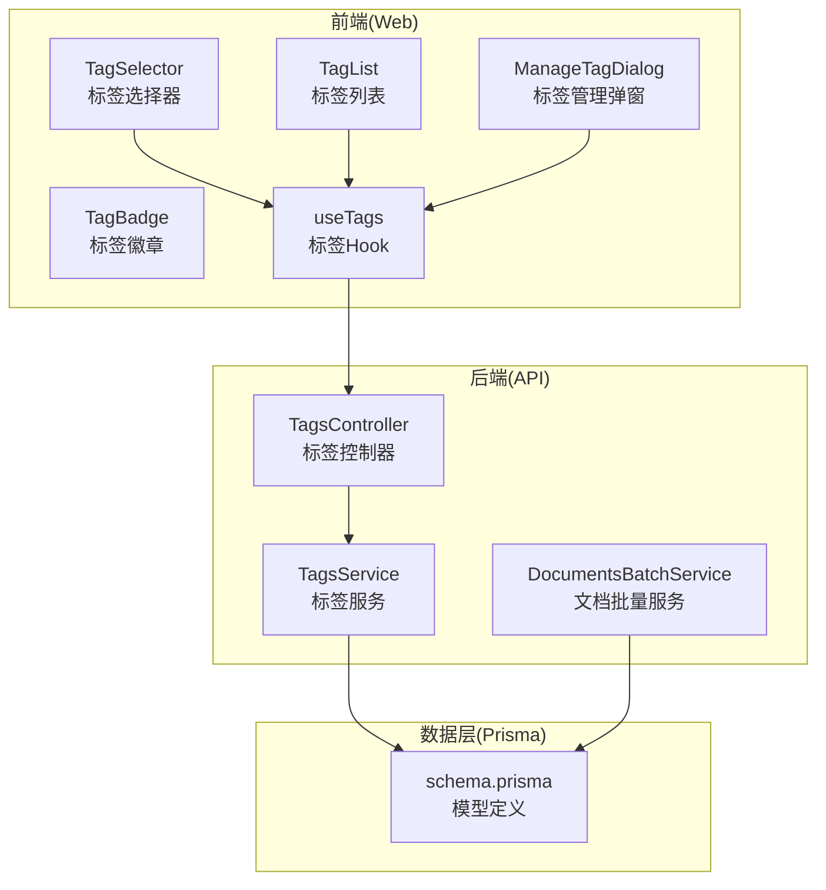
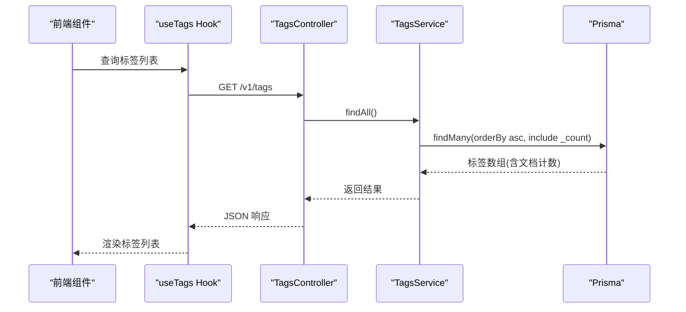
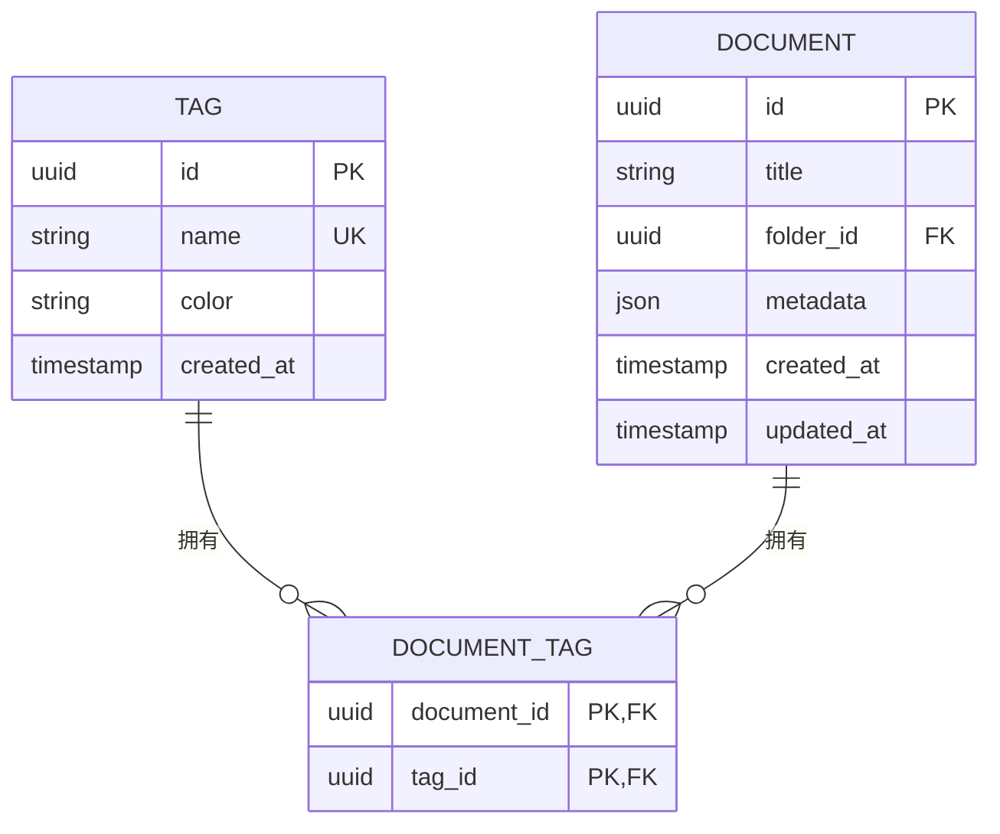
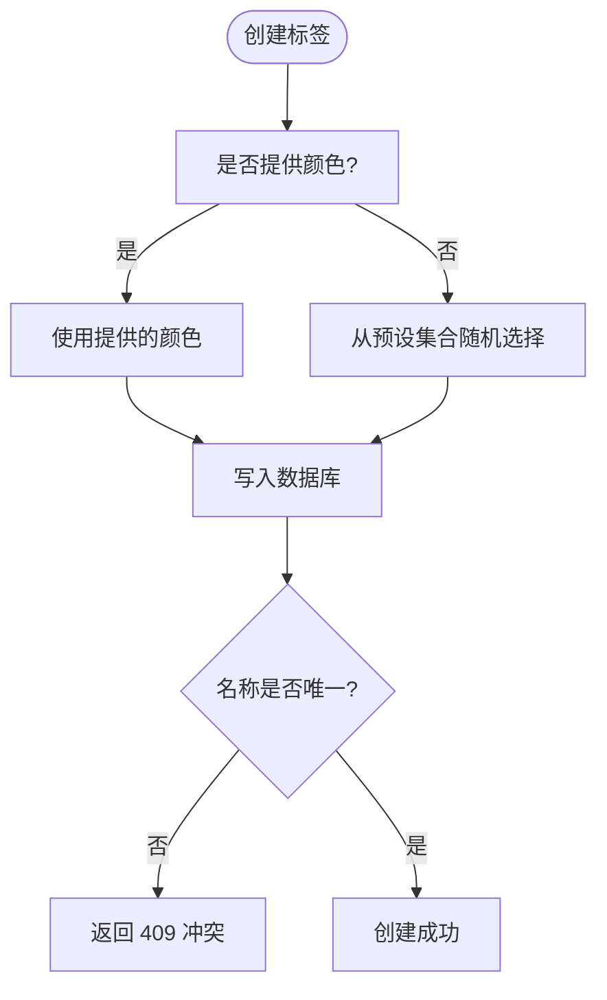
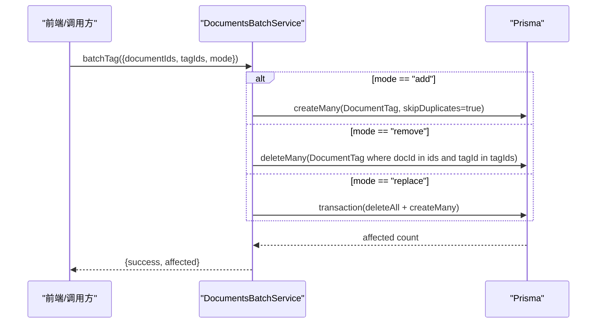
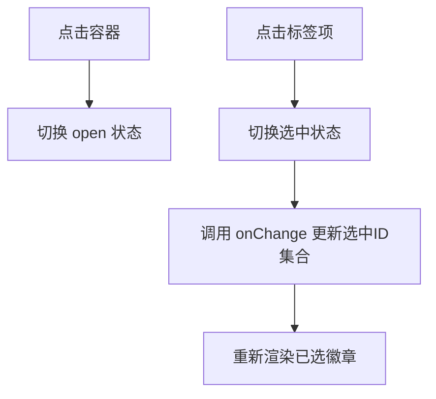
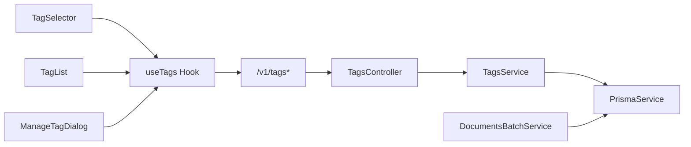

# 标签管理系统

<cite>
**本文档引用的文件**
- [apps/api/src/modules/tags/tags.controller.ts](file://apps/api/src/modules/tags/tags.controller.ts)
- [apps/api/src/modules/tags/tags.service.ts](file://apps/api/src/modules/tags/tags.service.ts)
- [apps/api/src/modules/tags/dto/create-tag.dto.ts](file://apps/api/src/modules/tags/dto/create-tag.dto.ts)
- [apps/api/src/modules/tags/dto/update-tag.dto.ts](file://apps/api/src/modules/tags/dto/update-tag.dto.ts)
- [apps/web/components/tags/tag-selector.tsx](file://apps/web/components/tags/tag-selector.tsx)
- [apps/web/components/tags/tag-list.tsx](file://apps/web/components/tags/tag-list.tsx)
- [apps/web/components/tags/manage-tag-dialog.tsx](file://apps/web/components/tags/manage-tag-dialog.tsx)
- [apps/web/components/tags/tag-badge.tsx](file://apps/web/components/tags/tag-badge.tsx)
- [apps/web/hooks/use-tags.ts](file://apps/web/hooks/use-tags.ts)
- [apps/api/prisma/schema.prisma](file://apps/api/prisma/schema.prisma)
- [apps/api/src/modules/documents/dto/batch-tag.dto.ts](file://apps/api/src/modules/documents/dto/batch-tag.dto.ts)
- [apps/api/src/modules/documents/documents-batch.service.ts](file://apps/api/src/modules/documents/documents-batch.service.ts)
- [apps/api/src/modules/documents/documents.service.ts](file://apps/api/src/modules/documents/documents.service.ts)
</cite>

## 目录
1. [简介](#简介)
2. [项目结构](#项目结构)
3. [核心组件](#核心组件)
4. [架构总览](#架构总览)
5. [详细组件分析](#详细组件分析)
6. [依赖关系分析](#依赖关系分析)
7. [性能考虑](#性能考虑)
8. [故障排除指南](#故障排除指南)
9. [结论](#结论)
10. [附录](#附录)

## 简介
本文件系统性阐述 APP2 项目的标签管理系统，覆盖标签的创建、编辑、删除与颜色管理；标签与文档的多对多关联关系及批量操作；前端标签选择器与标签列表组件的实现；颜色管理机制与视觉设计规范；以及与文档系统的深度集成与最佳实践。

## 项目结构
标签系统由三层组成：
- 数据层：Prisma 定义的 Tag、Document、DocumentTag 三张表，实现标签与文档的多对多关联。
- 接口层：NestJS 控制器提供标签的增删改查与按标签查询文档列表接口。
- 前端层：React 组件与 React Query Hook 提供标签选择、标签列表、标签管理弹窗与标签徽章展示。

图表来源
- [apps/web/components/tags/tag-selector.tsx](file://apps/web/components/tags/tag-selector.tsx#L1-L85)
- [apps/web/components/tags/tag-list.tsx](file://apps/web/components/tags/tag-list.tsx#L1-L44)
- [apps/web/components/tags/manage-tag-dialog.tsx](file://apps/web/components/tags/manage-tag-dialog.tsx#L1-L156)
- [apps/web/components/tags/tag-badge.tsx](file://apps/web/components/tags/tag-badge.tsx#L1-L48)
- [apps/web/hooks/use-tags.ts](file://apps/web/hooks/use-tags.ts#L1-L63)
- [apps/api/src/modules/tags/tags.controller.ts](file://apps/api/src/modules/tags/tags.controller.ts#L1-L91)
- [apps/api/src/modules/tags/tags.service.ts](file://apps/api/src/modules/tags/tags.service.ts#L1-L156)
- [apps/api/src/modules/documents/documents-batch.service.ts](file://apps/api/src/modules/documents/documents-batch.service.ts#L1-L204)
- [apps/api/prisma/schema.prisma](file://apps/api/prisma/schema.prisma#L75-L102)

章节来源
- [apps/api/prisma/schema.prisma](file://apps/api/prisma/schema.prisma#L75-L102)
- [apps/api/src/modules/tags/tags.controller.ts](file://apps/api/src/modules/tags/tags.controller.ts#L1-L91)
- [apps/web/components/tags/tag-selector.tsx](file://apps/web/components/tags/tag-selector.tsx#L1-L85)
- [apps/web/hooks/use-tags.ts](file://apps/web/hooks/use-tags.ts#L1-L63)

## 核心组件
- 标签实体与多对多关系：Tag 与 Document 通过 DocumentTag 关联，支持按标签筛选文档与分页查询。
- 标签 CRUD：后端提供创建、更新、删除接口；前端通过 useTags Hook 进行查询与变更。
- 批量标签操作：支持 add/remove/replace 三种模式，事务保证一致性。
- 视觉组件：TagBadge 徽章、TagSelector 多选选择器、TagList 标签云、ManageTagDialog 标签管理弹窗。

章节来源
- [apps/api/prisma/schema.prisma](file://apps/api/prisma/schema.prisma#L75-L102)
- [apps/api/src/modules/tags/tags.service.ts](file://apps/api/src/modules/tags/tags.service.ts#L1-L156)
- [apps/web/hooks/use-tags.ts](file://apps/web/hooks/use-tags.ts#L1-L63)
- [apps/api/src/modules/documents/documents-batch.service.ts](file://apps/api/src/modules/documents/documents-batch.service.ts#L59-L125)

## 架构总览
标签系统采用“前端 React Query + NestJS 控制器 + Prisma 模型”的分层架构。前端通过 API 获取标签列表并进行增删改；后端通过服务层执行业务逻辑与数据库操作；Prisma 定义清晰的数据模型与索引，确保查询与关联性能。

图表来源
- [apps/web/hooks/use-tags.ts](file://apps/web/hooks/use-tags.ts#L14-L23)
- [apps/api/src/modules/tags/tags.controller.ts](file://apps/api/src/modules/tags/tags.controller.ts#L29-L34)
- [apps/api/src/modules/tags/tags.service.ts](file://apps/api/src/modules/tags/tags.service.ts#L26-L35)

## 详细组件分析

### 标签实体与多对多关系
- 模型定义
  - Tag：id、name(唯一)、color、createdAt
  - Document：id、title、content、folderId、metadata 等
  - DocumentTag：联合主键(documentId, tagId)，外键关联 Document 与 Tag，删除时级联
- 查询与筛选
  - 按标签筛选文档：DocumentsService 在 where 条件中使用 tags.some: { tagId }
  - 按标签分页查询文档：TagsService 使用 DocumentTag 中间表查询并 include 文档详情
- 索引与约束
  - Tag.name 唯一索引
  - DocumentTag(tagId) 索引
  - DocumentTag 联合主键避免重复关联

图表来源
- [apps/api/prisma/schema.prisma](file://apps/api/prisma/schema.prisma#L75-L102)

章节来源
- [apps/api/prisma/schema.prisma](file://apps/api/prisma/schema.prisma#L75-L102)
- [apps/api/src/modules/documents/documents.service.ts](file://apps/api/src/modules/documents/documents.service.ts#L55-L60)
- [apps/api/src/modules/tags/tags.service.ts](file://apps/api/src/modules/tags/tags.service.ts#L111-L143)

### 标签 CRUD 与颜色管理
- 创建标签
  - 若未提供颜色，则从预设颜色集中随机选择
  - 名称唯一性校验，冲突返回 409
- 更新标签
  - 支持修改名称与颜色，名称冲突同样返回 409
- 删除标签
  - 级联删除 DocumentTag 关联记录
- 颜色管理
  - 前端管理弹窗提供预设颜色选择
  - TagBadge 使用 color 生成浅色背景与描边效果

图表来源
- [apps/api/src/modules/tags/tags.service.ts](file://apps/api/src/modules/tags/tags.service.ts#L40-L66)
- [apps/api/src/modules/tags/dto/create-tag.dto.ts](file://apps/api/src/modules/tags/dto/create-tag.dto.ts#L1-L16)
- [apps/web/components/tags/manage-tag-dialog.tsx](file://apps/web/components/tags/manage-tag-dialog.tsx#L7-L10)

章节来源
- [apps/api/src/modules/tags/tags.controller.ts](file://apps/api/src/modules/tags/tags.controller.ts#L39-L58)
- [apps/api/src/modules/tags/tags.service.ts](file://apps/api/src/modules/tags/tags.service.ts#L40-L106)
- [apps/api/src/modules/tags/dto/create-tag.dto.ts](file://apps/api/src/modules/tags/dto/create-tag.dto.ts#L1-L16)
- [apps/api/src/modules/tags/dto/update-tag.dto.ts](file://apps/api/src/modules/tags/dto/update-tag.dto.ts#L1-L5)
- [apps/web/components/tags/manage-tag-dialog.tsx](file://apps/web/components/tags/manage-tag-dialog.tsx#L7-L10)

### 标签与文档的多对多关联与批量操作
- 关联分配
  - 创建文档时可传入 tagIds，服务层通过 createMany 批量插入 DocumentTag
- 批量操作
  - 支持 add(去重添加)、remove(移除)、replace(先清空再添加)
  - replace 使用事务保证原子性
- 批量 DTO
  - BatchTagDto 校验 tagIds 为 UUID 数组且 mode 属于 add/remove/replace

图表来源
- [apps/api/src/modules/documents/documents-batch.service.ts](file://apps/api/src/modules/documents/documents-batch.service.ts#L62-L125)
- [apps/api/src/modules/documents/dto/batch-tag.dto.ts](file://apps/api/src/modules/documents/dto/batch-tag.dto.ts#L1-L23)

章节来源
- [apps/api/src/modules/documents/documents-batch.service.ts](file://apps/api/src/modules/documents/documents-batch.service.ts#L62-L125)
- [apps/api/src/modules/documents/dto/batch-tag.dto.ts](file://apps/api/src/modules/documents/dto/batch-tag.dto.ts#L1-L23)
- [apps/api/src/modules/documents/documents.service.ts](file://apps/api/src/modules/documents/documents.service.ts#L159-L165)

### 标签选择器组件（TagSelector）
- 功能特性
  - 多选：点击切换选中状态
  - 下拉展示：渲染全部标签，高亮已选
  - 已选标签以 TagBadge 展示，支持一键移除
- 交互流程
  - 点击容器打开/关闭下拉
  - 点击标签触发 onChange 回调更新选中集合
  - 点击已选标签触发移除回调

图表来源
- [apps/web/components/tags/tag-selector.tsx](file://apps/web/components/tags/tag-selector.tsx#L12-L22)
- [apps/web/components/tags/tag-badge.tsx](file://apps/web/components/tags/tag-badge.tsx#L12-L47)

章节来源
- [apps/web/components/tags/tag-selector.tsx](file://apps/web/components/tags/tag-selector.tsx#L1-L85)
- [apps/web/components/tags/tag-badge.tsx](file://apps/web/components/tags/tag-badge.tsx#L1-L48)

### 标签列表组件（TagList）
- 功能特性
  - 标签云：渲染所有标签为可点击徽章
  - 活跃态：点击切换 activeTagId，激活态带描边
  - 加载态：请求中显示骨架屏
- 与应用状态联动：通过全局 store 设置/清除活跃标签

章节来源
- [apps/web/components/tags/tag-list.tsx](file://apps/web/components/tags/tag-list.tsx#L1-L44)

### 标签管理弹窗（ManageTagDialog）
- 功能特性
  - 新建：输入名称与颜色，提交后刷新标签列表
  - 编辑：双击进入编辑模式，回车或失焦保存
  - 删除：确认后删除，同时失效标签与文档缓存
  - 预设颜色：提供一组颜色供选择
- 与 Hook 集成：useTags/useCreateTag/useUpdateTag/useDeleteTag

章节来源
- [apps/web/components/tags/manage-tag-dialog.tsx](file://apps/web/components/tags/manage-tag-dialog.tsx#L1-L156)
- [apps/web/hooks/use-tags.ts](file://apps/web/hooks/use-tags.ts#L14-L62)

### 标签徽章（TagBadge）
- 视觉设计
  - 背景色基于 color 生成半透明浅色
  - 文字色与圆点色与 color 一致
  - active 时添加描边强调
  - 可选 count 显示文档数量
  - 可选 onRemove 提供移除按钮

章节来源
- [apps/web/components/tags/tag-badge.tsx](file://apps/web/components/tags/tag-badge.tsx#L1-L48)

### 标签搜索与筛选（与文档系统集成）
- 标签筛选
  - DocumentsService 在查询文档时通过 where.tags.some: { tagId } 实现按标签筛选
- 标签分页查询
  - TagsController 提供 /tags/:id/documents 接口，分页返回关联文档
- 关键词与其它筛选
  - 支持关键字、收藏、置顶、归档等筛选，标签筛选可与之组合

章节来源
- [apps/api/src/modules/documents/documents.service.ts](file://apps/api/src/modules/documents/documents.service.ts#L55-L60)
- [apps/api/src/modules/tags/tags.controller.ts](file://apps/api/src/modules/tags/tags.controller.ts#L73-L89)
- [apps/api/src/modules/tags/tags.service.ts](file://apps/api/src/modules/tags/tags.service.ts#L111-L143)

## 依赖关系分析
- 前端依赖
  - useTags Hook 依赖 API 客户端与 React Query，负责标签的增删改查与缓存失效
  - 组件依赖 TagBadge 进行展示，TagSelector/TagList/ManageTagDialog 共同构成标签 UI 生态
- 后端依赖
  - TagsController 依赖 TagsService
  - TagsService 依赖 PrismaService 进行数据库访问
  - DocumentsBatchService 依赖 PrismaService 实现批量标签操作
- 数据库依赖
  - Tag.name 唯一约束防止重复
  - DocumentTag 联合主键与外键约束保证关系完整性
  - DocumentTag(tagId) 索引提升筛选性能

图表来源
- [apps/web/hooks/use-tags.ts](file://apps/web/hooks/use-tags.ts#L1-L63)
- [apps/api/src/modules/tags/tags.controller.ts](file://apps/api/src/modules/tags/tags.controller.ts#L1-L91)
- [apps/api/src/modules/tags/tags.service.ts](file://apps/api/src/modules/tags/tags.service.ts#L1-L156)
- [apps/api/src/modules/documents/documents-batch.service.ts](file://apps/api/src/modules/documents/documents-batch.service.ts#L1-L204)

章节来源
- [apps/web/hooks/use-tags.ts](file://apps/web/hooks/use-tags.ts#L1-L63)
- [apps/api/src/modules/tags/tags.controller.ts](file://apps/api/src/modules/tags/tags.controller.ts#L1-L91)
- [apps/api/src/modules/tags/tags.service.ts](file://apps/api/src/modules/tags/tags.service.ts#L1-L156)
- [apps/api/src/modules/documents/documents-batch.service.ts](file://apps/api/src/modules/documents/documents-batch.service.ts#L1-L204)

## 性能考虑
- 查询优化
  - 使用 include 与 orderBy 时注意字段索引，如 DocumentTag(tagId) 索引用于按标签筛选
  - 分页查询时限制 take 并使用 skip，避免一次性加载大量数据
- 写入优化
  - 批量插入使用 createMany(skipDuplicates: true) 减少重复写入
  - replace 使用事务包裹，保证一致性的同时减少往返次数
- 前端缓存
  - useQuery/useMutation 的缓存失效策略确保 UI 与后端数据一致
  - TagList 的活跃态切换避免不必要的重渲染

## 故障排除指南
- 标签名冲突
  - 现象：创建/更新返回 409
  - 处理：检查名称是否唯一，或更换名称
- 标签不存在
  - 现象：按标签查询文档或删除标签返回 404
  - 处理：确认标签 ID 是否正确
- 批量标签操作失败
  - 现象：部分标签不存在导致 BadRequest
  - 处理：校验 tagIds 是否均为有效 UUID 且存在

章节来源
- [apps/api/src/modules/tags/tags.service.ts](file://apps/api/src/modules/tags/tags.service.ts#L55-L65)
- [apps/api/src/modules/tags/tags.service.ts](file://apps/api/src/modules/tags/tags.service.ts#L84-L94)
- [apps/api/src/modules/documents/documents-batch.service.ts](file://apps/api/src/modules/documents/documents-batch.service.ts#L66-L71)

## 结论
标签系统通过清晰的实体关系、完善的 CRUD 与批量操作、以及直观的前端组件，实现了与文档系统的深度集成。颜色管理与视觉组件提升了可用性与一致性。遵循本文的最佳实践与性能建议，可在大规模场景下保持良好的响应与扩展性。

## 附录
- 最佳实践
  - 后端：统一使用 DTO 校验与异常处理；批量写入使用事务或去重策略
  - 前端：合理使用缓存失效；组件内聚、职责单一；颜色与样式集中管理
  - 数据库：为高频查询字段建立索引；保持唯一约束与外键约束
- 扩展建议
  - 支持标签层级/分类
  - 增加标签搜索与自动完成
  - 提供标签导入导出与统计报表