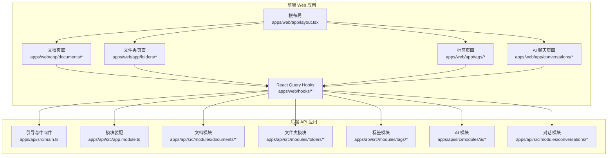
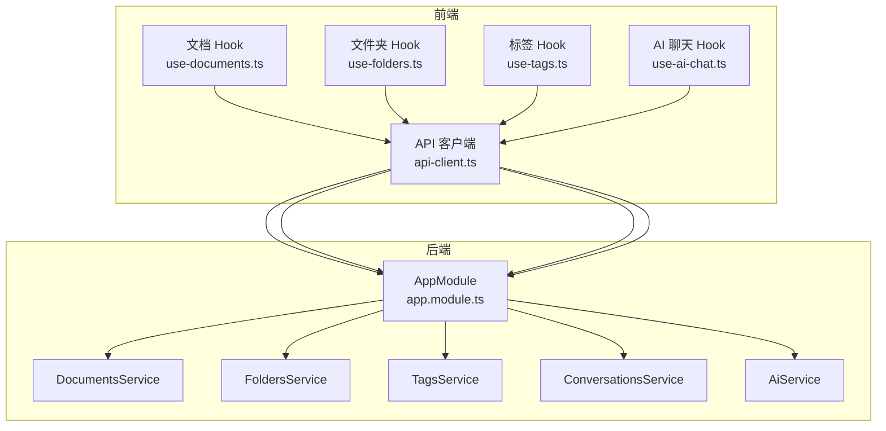
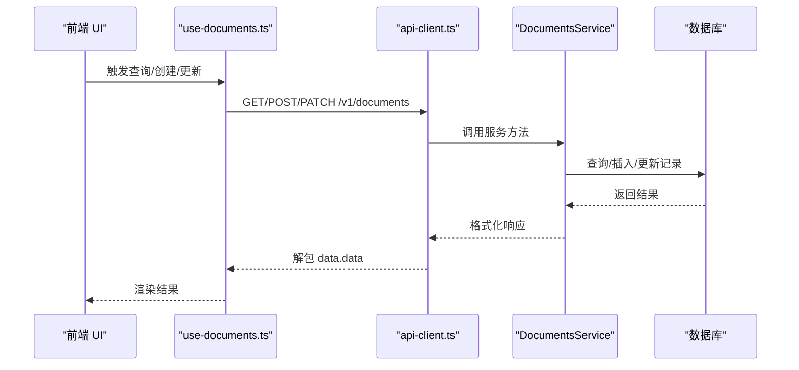
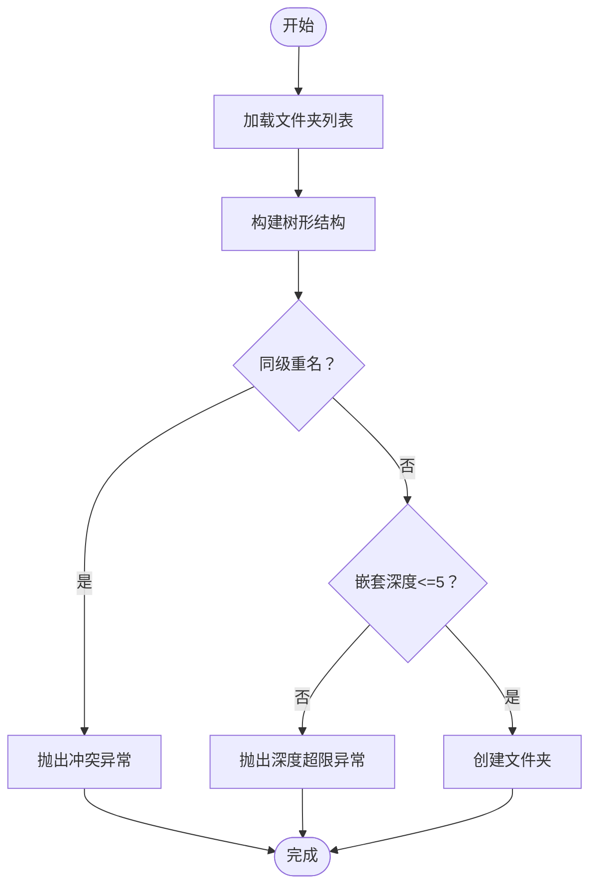
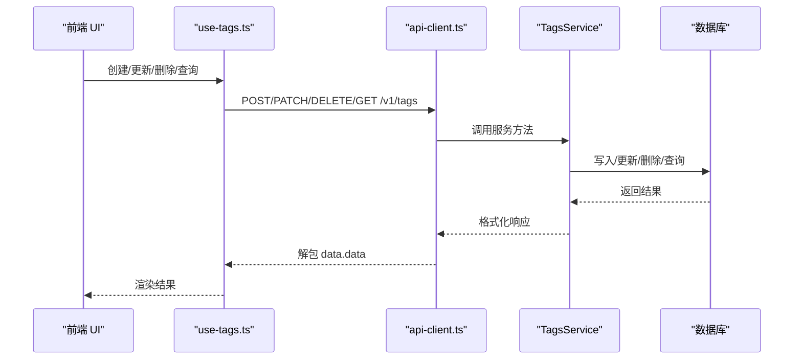
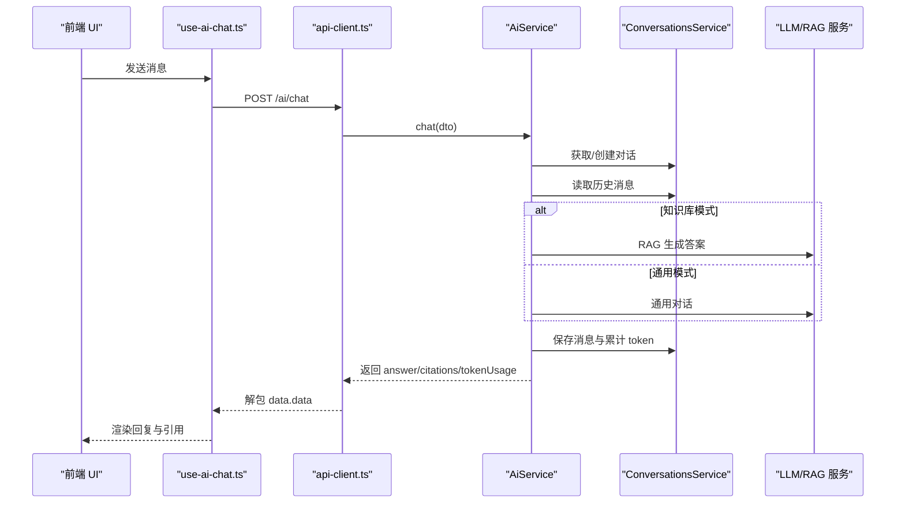
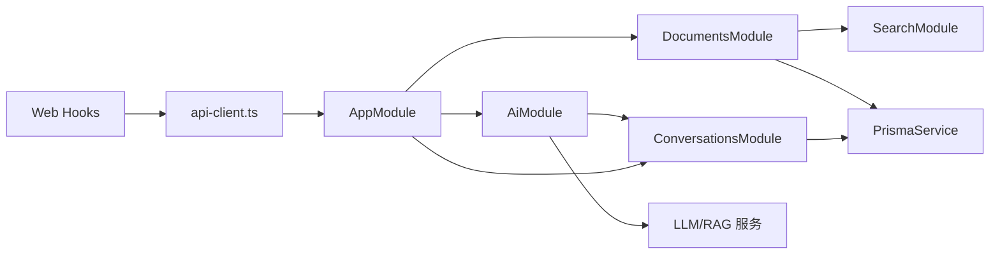

# 核心功能模块

<cite>
**本文引用的文件**
- [apps/api/src/app.module.ts](file://apps/api/src/app.module.ts)
- [apps/api/src/main.ts](file://apps/api/src/main.ts)
- [apps/api/src/modules/documents/documents.module.ts](file://apps/api/src/modules/documents/documents.module.ts)
- [apps/api/src/modules/documents/documents.service.ts](file://apps/api/src/modules/documents/documents.service.ts)
- [apps/api/src/modules/folders/folders.module.ts](file://apps/api/src/modules/folders/folders.module.ts)
- [apps/api/src/modules/folders/folders.service.ts](file://apps/api/src/modules/folders/folders.service.ts)
- [apps/api/src/modules/tags/tags.module.ts](file://apps/api/src/modules/tags/tags.module.ts)
- [apps/api/src/modules/tags/tags.service.ts](file://apps/api/src/modules/tags/tags.service.ts)
- [apps/api/src/modules/ai/ai.module.ts](file://apps/api/src/modules/ai/ai.module.ts)
- [apps/api/src/modules/ai/ai.service.ts](file://apps/api/src/modules/ai/ai.service.ts)
- [apps/api/src/modules/conversations/conversations.module.ts](file://apps/api/src/modules/conversations/conversations.module.ts)
- [apps/api/src/modules/conversations/conversations.service.ts](file://apps/api/src/modules/conversations/conversations.service.ts)
- [apps/web/app/layout.tsx](file://apps/web/app/layout.tsx)
- [apps/web/hooks/use-documents.ts](file://apps/web/hooks/use-documents.ts)
- [apps/web/hooks/use-folders.ts](file://apps/web/hooks/use-folders.ts)
- [apps/web/hooks/use-tags.ts](file://apps/web/hooks/use-tags.ts)
- [apps/web/hooks/use-ai-chat.ts](file://apps/web/hooks/use-ai-chat.ts)
- [apps/web/lib/api-client.ts](file://apps/web/lib/api-client.ts)
- [packages/shared/src/index.ts](file://packages/shared/src/index.ts)
</cite>

## 目录
1. [简介](#简介)
2. [项目结构](#项目结构)
3. [核心组件](#核心组件)
4. [架构总览](#架构总览)
5. [详细组件分析](#详细组件分析)
6. [依赖分析](#依赖分析)
7. [性能考虑](#性能考虑)
8. [故障排查指南](#故障排查指南)
9. [结论](#结论)
10. [附录](#附录)

## 简介
本文件面向 APP2 的核心功能模块，围绕“文档管理系统”“文件夹组织系统”“标签分类系统”“AI 对话系统”四大模块进行深入解析。内容涵盖模块职责、数据模型、前后端交互流程、端到端使用路径、模块间协作关系、性能与扩展性设计，并提供可直接定位到源码的路径指引，便于开发者快速理解与集成。

## 项目结构
APP2 采用前后端分离的双应用架构：
- 后端（NestJS）：统一通过全局前缀 /api 暴露 REST 接口，版本化路由，启用 Swagger 文档，提供健康检查、限流、CORS、全局验证与拦截器。
- 前端（Next.js）：通过 React Query 与后端 API 通信，提供文档、文件夹、标签、AI 对话等交互界面。

图表来源
- [apps/web/app/layout.tsx](file://apps/web/app/layout.tsx#L1-L26)
- [apps/api/src/main.ts](file://apps/api/src/main.ts#L1-L61)
- [apps/api/src/app.module.ts](file://apps/api/src/app.module.ts#L1-L83)

章节来源
- [apps/api/src/app.module.ts](file://apps/api/src/app.module.ts#L1-L83)
- [apps/api/src/main.ts](file://apps/api/src/main.ts#L1-L61)
- [apps/web/app/layout.tsx](file://apps/web/app/layout.tsx#L1-L26)

## 核心组件
- 文档管理系统：负责文档的增删改查、分页检索、收藏/置顶、与标签/文件夹关联、与搜索引擎同步。
- 文件夹组织系统：提供树形结构、父子关系、层级限制、重排序、批量更新与删除时的级联处理。
- 标签分类系统：支持标签创建/更新/删除、颜色随机分配、统计关联文档数量、按标签筛选文档。
- AI 对话系统：封装通用对话与知识库问答两种模式，支持上下文选择、RAG、流式输出、对话持久化与计费统计。

章节来源
- [apps/api/src/modules/documents/documents.service.ts](file://apps/api/src/modules/documents/documents.service.ts#L1-L200)
- [apps/api/src/modules/folders/folders.service.ts](file://apps/api/src/modules/folders/folders.service.ts#L1-L200)
- [apps/api/src/modules/tags/tags.service.ts](file://apps/api/src/modules/tags/tags.service.ts#L1-L156)
- [apps/api/src/modules/ai/ai.service.ts](file://apps/api/src/modules/ai/ai.service.ts#L1-L200)
- [apps/api/src/modules/conversations/conversations.service.ts](file://apps/api/src/modules/conversations/conversations.service.ts#L1-L200)

## 架构总览
后端通过模块化装配，将业务能力拆分为独立模块；前端通过 React Query 与后端 API 交互，形成清晰的分层与职责边界。

图表来源
- [apps/api/src/app.module.ts](file://apps/api/src/app.module.ts#L1-L83)
- [apps/web/hooks/use-documents.ts](file://apps/web/hooks/use-documents.ts#L1-L171)
- [apps/web/hooks/use-folders.ts](file://apps/web/hooks/use-folders.ts#L1-L77)
- [apps/web/hooks/use-tags.ts](file://apps/web/hooks/use-tags.ts#L1-L63)
- [apps/web/hooks/use-ai-chat.ts](file://apps/web/hooks/use-ai-chat.ts#L1-L117)
- [apps/web/lib/api-client.ts](file://apps/web/lib/api-client.ts#L1-L84)

## 详细组件分析

### 文档管理系统
- 职责与能力
  - 列表分页与筛选：支持按文件夹、标签、关键字、归档、收藏、置顶等条件组合查询。
  - 单条读取：返回文档详情及关联的文件夹与标签。
  - 创建：计算纯文本与字数，支持设置来源类型/URL、文件夹、标签。
  - 更新：动态字段更新，支持移动到文件夹、切换收藏/归档等。
  - 同步搜索引擎：创建/更新时异步同步至搜索引擎，保证检索一致性。
- 数据模型要点
  - 文档与标签为多对多关系，存储在关联表中；返回时对标签做扁平化处理。
  - 文档包含内容、纯文本、字数、来源类型/URL、归档/收藏/置顶标记。
- 前端集成
  - 通过 React Query Hook 进行查询、创建、更新、删除、归档/取消归档、移动到文件夹等操作。
  - 查询参数映射到后端查询 DTO，确保一致的筛选体验。

图表来源
- [apps/web/hooks/use-documents.ts](file://apps/web/hooks/use-documents.ts#L1-L171)
- [apps/web/lib/api-client.ts](file://apps/web/lib/api-client.ts#L1-L84)
- [apps/api/src/modules/documents/documents.service.ts](file://apps/api/src/modules/documents/documents.service.ts#L1-L200)

章节来源
- [apps/api/src/modules/documents/documents.service.ts](file://apps/api/src/modules/documents/documents.service.ts#L1-L200)
- [apps/web/hooks/use-documents.ts](file://apps/web/hooks/use-documents.ts#L1-L171)
- [apps/web/lib/api-client.ts](file://apps/web/lib/api-client.ts#L1-L84)

### 文件夹组织系统
- 职责与能力
  - 树形结构构建：按置顶、排序、名称升序生成树。
  - 单条读取：包含子节点与文档计数。
  - 创建：校验父节点存在性、同级重名、最大嵌套深度（≤5）。
  - 更新：支持变更父节点、排序、名称；防止循环引用与越界。
  - 删除：级联删除子节点，并将受影响文档的文件夹置空。
  - 批量重排序：事务内批量更新排序字段。
  - 置顶切换：便捷管理常用文件夹。
- 数据模型要点
  - 自引用父子关系；排序字段用于稳定展示顺序；文档计数用于 UI 展示。

图表来源
- [apps/api/src/modules/folders/folders.service.ts](file://apps/api/src/modules/folders/folders.service.ts#L1-L200)

章节来源
- [apps/api/src/modules/folders/folders.service.ts](file://apps/api/src/modules/folders/folders.service.ts#L1-L200)
- [apps/web/hooks/use-folders.ts](file://apps/web/hooks/use-folders.ts#L1-L77)

### 标签分类系统
- 职责与能力
  - 列表：按名称升序返回标签及关联文档数量。
  - 创建：名称唯一约束，重复创建抛冲突异常；可指定颜色，未指定则随机分配。
  - 更新：名称唯一约束校验；支持修改颜色。
  - 删除：删除标签（关联表由数据库级联清理）。
  - 按标签筛选文档：分页返回该标签下的文档列表。
- 数据模型要点
  - 标签与文档多对多；返回时包含文档数量统计，便于 UI 展示。

图表来源
- [apps/web/hooks/use-tags.ts](file://apps/web/hooks/use-tags.ts#L1-L63)
- [apps/web/lib/api-client.ts](file://apps/web/lib/api-client.ts#L1-L84)
- [apps/api/src/modules/tags/tags.service.ts](file://apps/api/src/modules/tags/tags.service.ts#L1-L156)

章节来源
- [apps/api/src/modules/tags/tags.service.ts](file://apps/api/src/modules/tags/tags.service.ts#L1-L156)
- [apps/web/hooks/use-tags.ts](file://apps/web/hooks/use-tags.ts#L1-L63)

### AI 对话系统
- 职责与能力
  - 通用对话：基于 LLM 生成回复，支持温度参数。
  - 知识库问答：基于 RAG，可限定上下文范围（文档/文件夹/标签），返回带引用的答案。
  - 对话持久化：自动创建/续用对话，保存消息与引用，累计 token 使用量。
  - 流式输出：支持流式事件推送（在服务侧实现，前端可结合流式渲染）。
  - 上下文管理：支持为对话设置上下文范围，提升问答准确性。
- 数据模型要点
  - 对话包含模式（通用/知识库）、上下文范围、消息列表、token 统计。
  - 消息包含角色、内容、引用、token 使用。

图表来源
- [apps/web/hooks/use-ai-chat.ts](file://apps/web/hooks/use-ai-chat.ts#L1-L117)
- [apps/web/lib/api-client.ts](file://apps/web/lib/api-client.ts#L1-L84)
- [apps/api/src/modules/ai/ai.service.ts](file://apps/api/src/modules/ai/ai.service.ts#L1-L200)
- [apps/api/src/modules/conversations/conversations.service.ts](file://apps/api/src/modules/conversations/conversations.service.ts#L1-L200)

章节来源
- [apps/api/src/modules/ai/ai.service.ts](file://apps/api/src/modules/ai/ai.service.ts#L1-L200)
- [apps/api/src/modules/conversations/conversations.service.ts](file://apps/api/src/modules/conversations/conversations.service.ts#L1-L200)
- [apps/web/hooks/use-ai-chat.ts](file://apps/web/hooks/use-ai-chat.ts#L1-L117)

## 依赖分析
- 模块耦合
  - 文档模块依赖搜索模块（用于同步索引），并导出服务供其他模块使用。
  - AI 模块依赖对话模块以持久化消息与上下文。
  - 前端通过统一的 API 客户端访问后端，避免直接耦合具体路由。
- 外部依赖
  - 前端：Axios、React Query、Next.js。
  - 后端：NestJS、Prisma、Swagger、CORS、限流、静态资源服务。

图表来源
- [apps/api/src/modules/documents/documents.module.ts](file://apps/api/src/modules/documents/documents.module.ts#L1-L16)
- [apps/api/src/modules/ai/ai.module.ts](file://apps/api/src/modules/ai/ai.module.ts#L1-L35)
- [apps/api/src/app.module.ts](file://apps/api/src/app.module.ts#L1-L83)
- [apps/web/lib/api-client.ts](file://apps/web/lib/api-client.ts#L1-L84)

章节来源
- [apps/api/src/modules/documents/documents.module.ts](file://apps/api/src/modules/documents/documents.module.ts#L1-L16)
- [apps/api/src/modules/ai/ai.module.ts](file://apps/api/src/modules/ai/ai.module.ts#L1-L35)
- [apps/api/src/app.module.ts](file://apps/api/src/app.module.ts#L1-L83)
- [apps/web/lib/api-client.ts](file://apps/web/lib/api-client.ts#L1-L84)

## 性能考虑
- 查询优化
  - 文档列表使用复合排序（置顶优先、再按字段排序），并按需包含关联数据，减少二次查询。
  - 使用分页与并发统计总数，避免大数据集全量扫描。
- 写入与同步
  - 文档创建/更新后异步同步搜索引擎，避免阻塞主流程。
  - 文件夹批量重排序使用事务，保证一致性与性能。
- 前端缓存
  - React Query 提供查询缓存与失效策略，减少重复请求。
- 限流与安全
  - 后端启用限流与 CORS，生产环境开启 Swagger 文档，便于调试与监控。

## 故障排查指南
- 常见错误与定位
  - 参数校验失败：后端启用全局验证管道，字段缺失或类型不符会触发错误，查看响应体中的 message。
  - 未找到资源：服务层抛出“未找到”异常，前端应提示用户或回退。
  - 冲突异常：标签名称重复导致冲突，需更换名称或更新现有标签。
  - 网络错误：前端 Axios 响应拦截器统一处理，打印错误日志并拒绝 Promise。
- 健康检查
  - 前端可通过健康检查接口确认后端可用性与数据库连通性。

章节来源
- [apps/api/src/main.ts](file://apps/api/src/main.ts#L1-L61)
- [apps/api/src/modules/tags/tags.service.ts](file://apps/api/src/modules/tags/tags.service.ts#L1-L156)
- [apps/web/lib/api-client.ts](file://apps/web/lib/api-client.ts#L1-L84)

## 结论
APP2 的核心功能模块以清晰的分层与模块化设计实现了文档、文件夹、标签与 AI 对话的协同工作。后端通过服务层抽象与 DTO 校验保障稳定性，前端通过 React Query 与统一 API 客户端实现高效交互。整体具备良好的扩展性与可维护性，适合在后续阶段继续增强搜索、导入导出、知识图谱等功能。

## 附录
- 功能特性对比（概念性说明）
  - 文档管理：支持全文检索、标签/文件夹关联、字数统计、归档与置顶。
  - 文件夹管理：树形结构、层级限制、批量重排序、父子关系校验。
  - 标签管理：唯一性约束、颜色管理、关联统计、按标签筛选。
  - AI 对话：通用与知识库双模式、上下文选择、RAG 引用、流式输出、计费统计。
- 集成指南（概念性说明）
  - 前端：通过 api-client.ts 发起请求，使用对应 Hook 管理状态与缓存。
  - 后端：在 AppModule 中注册模块，确保 Prisma 与搜索模块可用。
  - 共享：通过 shared 包导出类型与工具，保持前后端一致性。