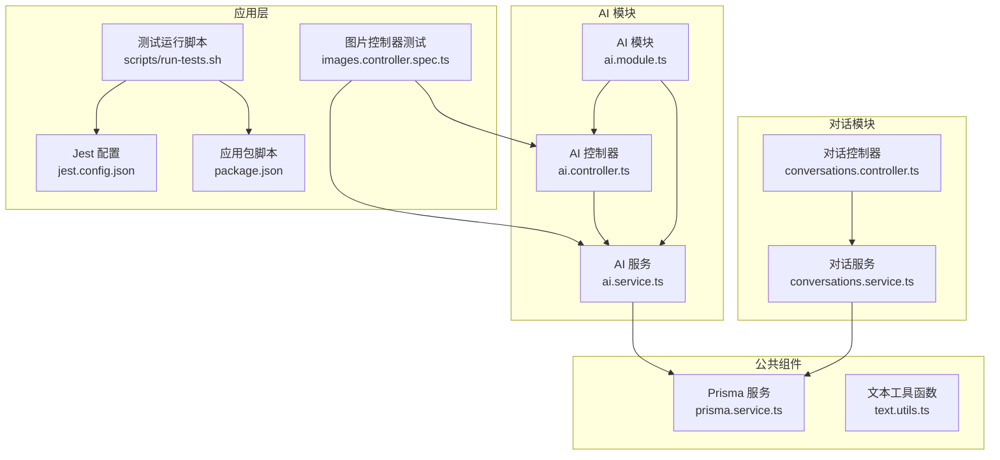
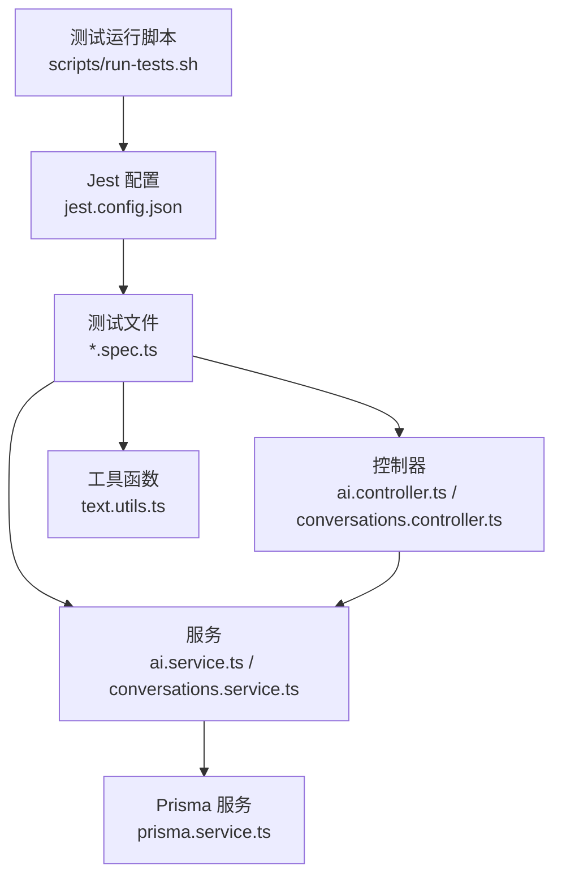
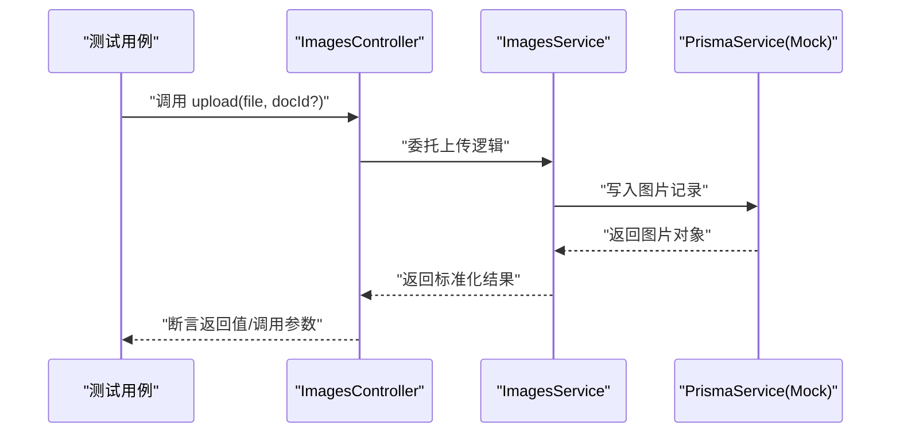
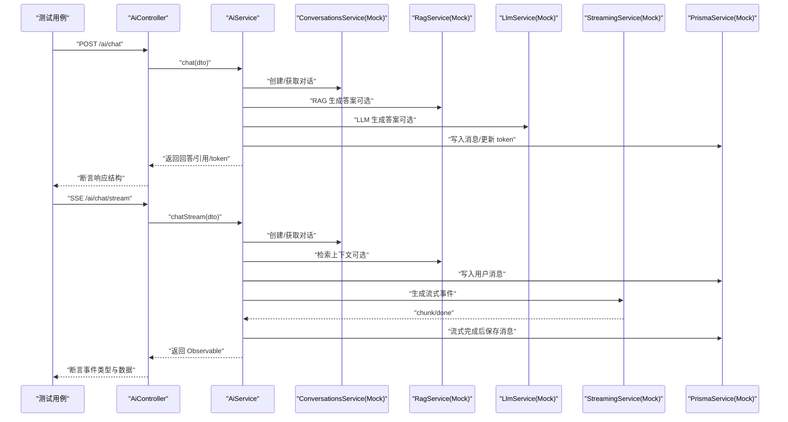
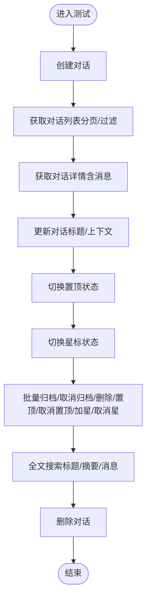
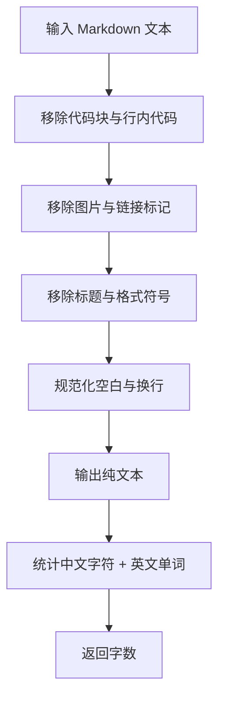
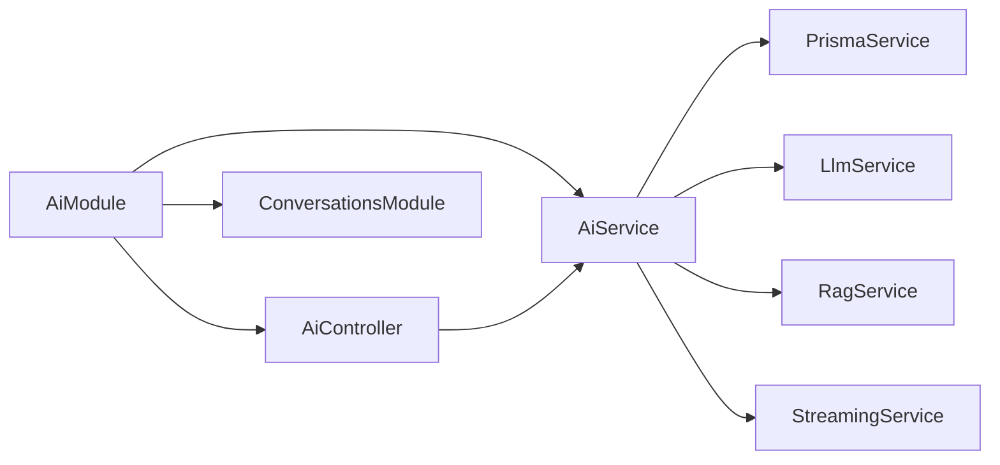

# 单元测试

<cite>
**本文引用的文件**
- [apps/api/jest.config.json](file://apps/api/jest.config.json)
- [apps/api/package.json](file://apps/api/package.json)
- [scripts/run-tests.sh](file://scripts/run-tests.sh)
- [apps/api/test/images.controller.spec.ts](file://apps/api/test/images.controller.spec.ts)
- [apps/api/src/modules/ai/ai.controller.ts](file://apps/api/src/modules/ai/ai.controller.ts)
- [apps/api/src/modules/ai/ai.service.ts](file://apps/api/src/modules/ai/ai.service.ts)
- [apps/api/src/modules/ai/ai.module.ts](file://apps/api/src/modules/ai/ai.module.ts)
- [apps/api/src/modules/conversations/conversations.controller.ts](file://apps/api/src/modules/conversations/conversations.controller.ts)
- [apps/api/src/modules/conversations/conversations.service.ts](file://apps/api/src/modules/conversations/conversations.service.ts)
- [apps/api/src/common/prisma/prisma.service.ts](file://apps/api/src/common/prisma/prisma.service.ts)
- [apps/api/src/common/utils/text.utils.ts](file://apps/api/src/common/utils/text.utils.ts)
</cite>

## 目录
1. [简介](#简介)
2. [项目结构](#项目结构)
3. [核心组件](#核心组件)
4. [架构总览](#架构总览)
5. [详细组件分析](#详细组件分析)
6. [依赖分析](#依赖分析)
7. [性能考虑](#性能考虑)
8. [故障排查指南](#故障排查指南)
9. [结论](#结论)
10. [附录](#附录)

## 简介
本文件面向 APP2 项目的单元测试实践，聚焦于使用 Jest 的配置与运行方式、测试环境与 Mock 策略、测试工具函数与断言技巧，并结合控制器、服务与模块的实际代码，给出可直接落地的测试设计与实现思路。文档同时覆盖依赖注入测试、异步操作测试、API 端点测试、业务逻辑验证与错误处理测试，以及测试数据准备、覆盖率收集与最佳实践。

## 项目结构
- 测试框架与运行脚本
  - Jest 配置位于应用级目录，通过根目录下的运行脚本统一执行测试。
  - 应用层 package.json 中定义了测试脚本，便于在 CI 或本地一键运行。
- 测试文件组织
  - 控制器测试示例位于应用层 test 目录，采用标准的 .spec.ts 命名规范。
- 关键被测模块
  - AI 模块：包含控制器、服务与多个子服务（LLM、RAG、向量检索、流式等），适合演示复杂依赖注入与异步流式场景。
  - 对话模块：控制器与服务，适合演示 CRUD 场景与查询过滤。
  - 公共组件：Prisma 服务用于数据库交互；文本工具函数用于纯函数测试。

图表来源
- [apps/api/jest.config.json](file://apps/api/jest.config.json#L1-L17)
- [apps/api/package.json](file://apps/api/package.json#L1-L55)
- [scripts/run-tests.sh](file://scripts/run-tests.sh#L1-L176)
- [apps/api/test/images.controller.spec.ts](file://apps/api/test/images.controller.spec.ts#L1-L176)
- [apps/api/src/modules/ai/ai.controller.ts](file://apps/api/src/modules/ai/ai.controller.ts#L1-L41)
- [apps/api/src/modules/ai/ai.service.ts](file://apps/api/src/modules/ai/ai.service.ts#L1-L420)
- [apps/api/src/modules/ai/ai.module.ts](file://apps/api/src/modules/ai/ai.module.ts#L1-L35)
- [apps/api/src/modules/conversations/conversations.controller.ts](file://apps/api/src/modules/conversations/conversations.controller.ts#L1-L107)
- [apps/api/src/modules/conversations/conversations.service.ts](file://apps/api/src/modules/conversations/conversations.service.ts#L1-L304)
- [apps/api/src/common/prisma/prisma.service.ts](file://apps/api/src/common/prisma/prisma.service.ts#L1-L69)
- [apps/api/src/common/utils/text.utils.ts](file://apps/api/src/common/utils/text.utils.ts#L1-L27)

章节来源
- [apps/api/jest.config.json](file://apps/api/jest.config.json#L1-L17)
- [apps/api/package.json](file://apps/api/package.json#L1-L55)
- [scripts/run-tests.sh](file://scripts/run-tests.sh#L1-L176)

## 核心组件
- Jest 配置要点
  - 测试文件匹配：通过正则匹配 .spec.ts 文件。
  - 转换器：使用 ts-jest 将 TypeScript 编译为可执行代码。
  - 覆盖率：开启覆盖率收集，输出到应用层 coverage 目录。
  - 模块映射：将共享包别名映射到共享源码目录，便于跨包导入测试。
  - 测试环境：Node 环境，适合后端单元测试。
- 测试运行脚本
  - 统一入口：通过脚本集中管理测试执行流程，支持仅运行 API/前端 E2E/单元测试与报告生成。
  - 服务器检查：在执行测试前检查 API/Web 服务是否就绪，避免外部依赖缺失导致失败。
  - Jest 执行：在应用层调用 Jest 并允许无测试时通过，保证 CI 稳定性。
- 测试文件命名与组织
  - 采用 .spec.ts 后缀，按模块划分，如 images.controller.spec.ts。
  - 使用 @nestjs/testing 的 TestingModule 构建最小化测试模块，替换真实依赖为 Mock。

章节来源
- [apps/api/jest.config.json](file://apps/api/jest.config.json#L1-L17)
- [apps/api/package.json](file://apps/api/package.json#L1-L55)
- [scripts/run-tests.sh](file://scripts/run-tests.sh#L96-L108)
- [apps/api/test/images.controller.spec.ts](file://apps/api/test/images.controller.spec.ts#L1-L176)

## 架构总览
下图展示了单元测试在项目中的位置与关系：测试脚本驱动 Jest，Jest 加载配置并执行 .spec.ts 文件；被测模块由 NestJS 模块导出，控制器与服务通过依赖注入组合；公共组件（Prisma、工具函数）作为底层依赖参与测试。

图表来源
- [scripts/run-tests.sh](file://scripts/run-tests.sh#L96-L108)
- [apps/api/jest.config.json](file://apps/api/jest.config.json#L1-L17)
- [apps/api/test/images.controller.spec.ts](file://apps/api/test/images.controller.spec.ts#L1-L176)
- [apps/api/src/modules/ai/ai.controller.ts](file://apps/api/src/modules/ai/ai.controller.ts#L1-L41)
- [apps/api/src/modules/ai/ai.service.ts](file://apps/api/src/modules/ai/ai.service.ts#L1-L420)
- [apps/api/src/modules/conversations/conversations.controller.ts](file://apps/api/src/modules/conversations/conversations.controller.ts#L1-L107)
- [apps/api/src/modules/conversations/conversations.service.ts](file://apps/api/src/modules/conversations/conversations.service.ts#L1-L304)
- [apps/api/src/common/prisma/prisma.service.ts](file://apps/api/src/common/prisma/prisma.service.ts#L1-L69)
- [apps/api/src/common/utils/text.utils.ts](file://apps/api/src/common/utils/text.utils.ts#L1-L27)

## 详细组件分析

### 图片控制器单元测试（示例）
该测试文件展示了典型的控制器单元测试模式：通过 TestingModule 注入服务与 Prisma Mock，构造请求参数与期望返回值，验证控制器行为与异常处理。

图表来源
- [apps/api/test/images.controller.spec.ts](file://apps/api/test/images.controller.spec.ts#L34-L49)
- [apps/api/test/images.controller.spec.ts](file://apps/api/test/images.controller.spec.ts#L55-L115)

章节来源
- [apps/api/test/images.controller.spec.ts](file://apps/api/test/images.controller.spec.ts#L1-L176)

### AI 控制器与服务单元测试（重点）
AI 模块包含多种端点与复杂的异步流程，适合演示：
- 依赖注入测试：通过 TestingModule 导入模块，替换子服务为 Mock，验证控制器与服务协作。
- 异步操作测试：对 chat、chatStream、summarizeConversation、getSuggestions 等异步方法进行断言。
- 错误处理测试：模拟异常路径，验证错误传播与日志记录。

图表来源
- [apps/api/src/modules/ai/ai.controller.ts](file://apps/api/src/modules/ai/ai.controller.ts#L12-L40)
- [apps/api/src/modules/ai/ai.service.ts](file://apps/api/src/modules/ai/ai.service.ts#L50-L144)
- [apps/api/src/modules/ai/ai.service.ts](file://apps/api/src/modules/ai/ai.service.ts#L192-L299)
- [apps/api/src/modules/ai/ai.module.ts](file://apps/api/src/modules/ai/ai.module.ts#L1-L35)

章节来源
- [apps/api/src/modules/ai/ai.controller.ts](file://apps/api/src/modules/ai/ai.controller.ts#L1-L41)
- [apps/api/src/modules/ai/ai.service.ts](file://apps/api/src/modules/ai/ai.service.ts#L1-L420)
- [apps/api/src/modules/ai/ai.module.ts](file://apps/api/src/modules/ai/ai.module.ts#L1-L35)

### 对话控制器与服务单元测试（示例）
对话模块提供了完整的 CRUD 与批量操作接口，适合演示：
- 查询过滤与分页：对查询 DTO 参数进行断言。
- 状态切换：togglePin/toggleStar 的布尔翻转逻辑。
- 批量操作：对不同 operation 分支进行断言。
- 错误处理：对不存在的资源抛出 NotFoundException 的场景进行验证。

图表来源
- [apps/api/src/modules/conversations/conversations.controller.ts](file://apps/api/src/modules/conversations/conversations.controller.ts#L30-L106)
- [apps/api/src/modules/conversations/conversations.service.ts](file://apps/api/src/modules/conversations/conversations.service.ts#L17-L302)

章节来源
- [apps/api/src/modules/conversations/conversations.controller.ts](file://apps/api/src/modules/conversations/conversations.controller.ts#L1-L107)
- [apps/api/src/modules/conversations/conversations.service.ts](file://apps/api/src/modules/conversations/conversations.service.ts#L1-L304)

### 工具函数测试（示例）
文本工具函数包含纯函数逻辑，适合演示：
- Markdown 文本清理：移除代码块、行内代码、图片、标题、强调等标记。
- 单词计数：区分中英文字符与单词边界，统计字数。

图表来源
- [apps/api/src/common/utils/text.utils.ts](file://apps/api/src/common/utils/text.utils.ts#L4-L26)

章节来源
- [apps/api/src/common/utils/text.utils.ts](file://apps/api/src/common/utils/text.utils.ts#L1-L27)

## 依赖分析
- 模块耦合
  - AI 模块通过 ConversationsModule 依赖对话模块；AI 服务依赖多个子服务（LLM、RAG、向量检索、流式等）。
  - 控制器与服务之间通过依赖注入解耦，测试时可通过 TestingModule 替换任意子服务为 Mock。
- 外部依赖
  - Prisma 服务负责数据库连接与健康检查，测试中通常以 Mock 形式注入，避免真实数据库副作用。
- 循环依赖
  - 从模块结构看未发现循环导入；若后续扩展需注意避免控制器与服务互相导入。

图表来源
- [apps/api/src/modules/ai/ai.module.ts](file://apps/api/src/modules/ai/ai.module.ts#L1-L35)
- [apps/api/src/modules/ai/ai.controller.ts](file://apps/api/src/modules/ai/ai.controller.ts#L1-L41)
- [apps/api/src/modules/ai/ai.service.ts](file://apps/api/src/modules/ai/ai.service.ts#L1-L420)

章节来源
- [apps/api/src/modules/ai/ai.module.ts](file://apps/api/src/modules/ai/ai.module.ts#L1-L35)

## 性能考虑
- 测试执行速度
  - 使用 Mock 替换耗时外部依赖（如 LLM/RAG/数据库），确保测试快速稳定。
  - 对并发与流式场景，优先断言事件序列而非等待完整完成，减少等待时间。
- 覆盖率收集
  - 配置已启用覆盖率收集，建议在 CI 中开启覆盖率阈值，防止覆盖率下降。
- 数据库交互
  - 测试中避免真实写入，使用 Mock 返回预期值；如需真实数据，建议使用内存数据库或测试专用数据库实例。

## 故障排查指南
- 测试无法启动或找不到模块
  - 检查 Jest 配置中的模块映射与 rootDir 设置，确保指向正确的源码目录。
  - 确认应用层 package.json 中的测试脚本可用。
- Mock 不生效或调用断言失败
  - 确保在 beforeEach 中通过 TestingModule.provide/useValue 注入 Mock。
  - 对于异步方法，使用 resolvedValue/rejectedValue 设置返回值。
- 覆盖率不更新
  - 确认 collectCoverageFrom 正确匹配目标文件，且测试脚本执行了相应模块。
- 依赖注入错误
  - 若出现循环依赖或缺少 Provider，检查模块导入与导出，确保服务在模块 providers 中注册。

章节来源
- [apps/api/jest.config.json](file://apps/api/jest.config.json#L1-L17)
- [apps/api/package.json](file://apps/api/package.json#L1-L55)

## 结论
本项目已具备完善的 Jest 测试基础设施：明确的配置、统一的运行脚本与示例测试文件。通过 Mock 策略与 TestingModule，可以高效地对控制器、服务与模块进行单元测试，覆盖依赖注入、异步操作、错误处理与业务逻辑。建议在后续迭代中持续完善覆盖率、补充边缘场景与并发流式测试，以提升测试质量与稳定性。

## 附录
- 测试数据准备
  - 使用 Mock 对象模拟外部依赖；构造最小化的 DTO 与实体对象，避免冗余字段。
  - 对于流式场景，使用事件数组模拟 chunk/done 事件序列。
- 断言策略
  - 对返回值结构进行断言；对 Mock 调用参数使用 expect.objectContaining。
  - 对异常场景使用 rejects.toThrow 或捕获错误后断言。
- 覆盖率收集
  - 通过 Jest 配置开启覆盖率收集；在 CI 中设置阈值，确保关键路径被覆盖。
- 最佳实践
  - 保持测试隔离：每个测试只关注单一职责。
  - 使用 describe/nested describe 组织测试套件，提高可读性。
  - 对异步与流式逻辑，分别断言中间态与最终态。
  - 对纯函数使用边界值与典型值组合测试。