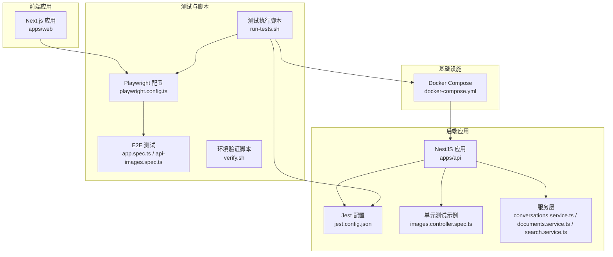
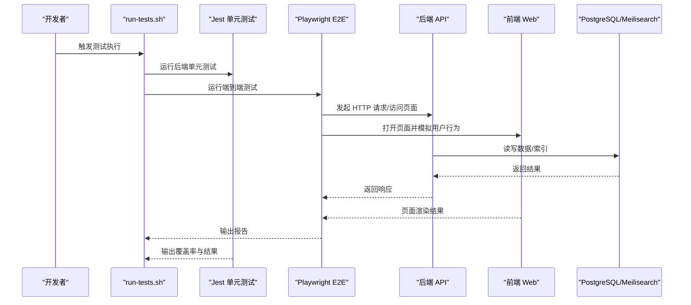
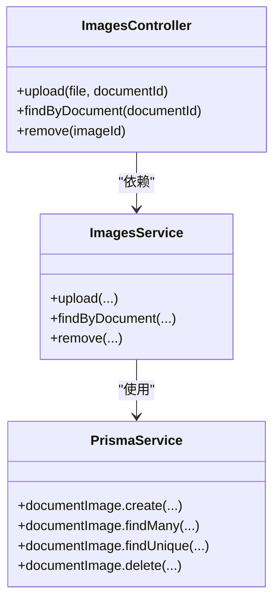
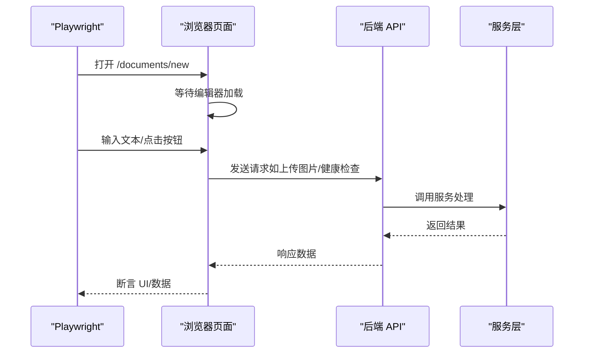
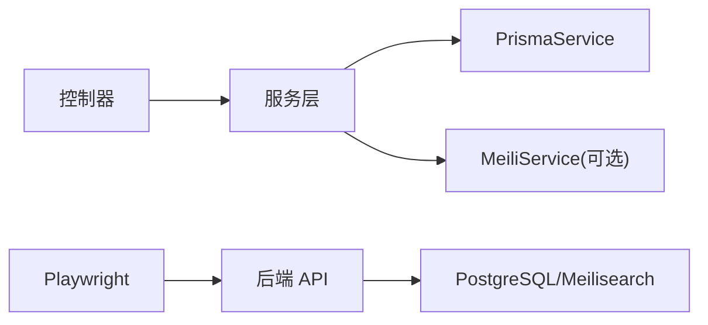

# 测试策略

<cite>
**本文引用的文件**
- [apps/api/jest.config.json](file://apps/api/jest.config.json)
- [apps/api/test/images.controller.spec.ts](file://apps/api/test/images.controller.spec.ts)
- [apps/api/src/modules/conversations/conversations.service.ts](file://apps/api/src/modules/conversations/conversations.service.ts)
- [apps/api/src/modules/documents/documents.service.ts](file://apps/api/src/modules/documents/documents.service.ts)
- [apps/api/src/modules/search/search.service.ts](file://apps/api/src/modules/search/search.service.ts)
- [apps/api/nest-cli.json](file://apps/api/nest-cli.json)
- [apps/api/tsconfig.json](file://apps/api/tsconfig.json)
- [playwright.config.ts](file://playwright.config.ts)
- [e2e/app.spec.ts](file://e2e/app.spec.ts)
- [e2e/api-images.spec.ts](file://e2e/api-images.spec.ts)
- [scripts/run-tests.sh](file://scripts/run-tests.sh)
- [scripts/verify.sh](file://scripts/verify.sh)
- [package.json](file://package.json)
- [docker-compose.yml](file://docker-compose.yml)
- [docs/TEST_FAILURE_ANALYSIS.md](file://docs/TEST_FAILURE_ANALYSIS.md)
</cite>

## 目录
1. [引言](#引言)
2. [项目结构](#项目结构)
3. [核心组件](#核心组件)
4. [架构总览](#架构总览)
5. [详细组件分析](#详细组件分析)
6. [依赖关系分析](#依赖关系分析)
7. [性能考量](#性能考量)
8. [故障排查指南](#故障排查指南)
9. [结论](#结论)
10. [附录](#附录)

## 引言
本测试策略文档面向 APP2 项目，系统性阐述单元测试、集成测试与端到端测试的实施方法与最佳实践；明确 Jest 与 Playwright 的配置与使用要点；给出测试覆盖率与质量门禁建议；并提供测试数据管理、环境隔离与持续集成中的测试执行策略，以及调试技巧与常见问题的解决方案。

## 项目结构
APP2 采用多包工作区组织，包含后端 NestJS 应用、前端 Next.js 应用、共享包、测试与脚本等模块。测试相关的关键位置如下：
- 后端测试：apps/api/test 下存放 Jest 单元测试
- 端到端测试：e2e 下存放 Playwright 测试
- 测试工具与脚本：scripts/ 目录下的自动化测试执行脚本
- 测试配置：apps/api/jest.config.json、playwright.config.ts、apps/api/tsconfig.json 等

图表来源
- [apps/api/jest.config.json](file://apps/api/jest.config.json#L1-L17)
- [apps/api/test/images.controller.spec.ts](file://apps/api/test/images.controller.spec.ts#L1-L176)
- [apps/api/src/modules/conversations/conversations.service.ts](file://apps/api/src/modules/conversations/conversations.service.ts#L1-L304)
- [apps/api/src/modules/documents/documents.service.ts](file://apps/api/src/modules/documents/documents.service.ts#L1-L489)
- [apps/api/src/modules/search/search.service.ts](file://apps/api/src/modules/search/search.service.ts#L1-L62)
- [playwright.config.ts](file://playwright.config.ts#L1-L24)
- [e2e/app.spec.ts](file://e2e/app.spec.ts#L1-L288)
- [e2e/api-images.spec.ts](file://e2e/api-images.spec.ts#L1-L115)
- [scripts/run-tests.sh](file://scripts/run-tests.sh#L1-L176)
- [scripts/verify.sh](file://scripts/verify.sh#L1-L160)
- [docker-compose.yml](file://docker-compose.yml#L1-L53)

章节来源
- [apps/api/jest.config.json](file://apps/api/jest.config.json#L1-L17)
- [playwright.config.ts](file://playwright.config.ts#L1-L24)
- [scripts/run-tests.sh](file://scripts/run-tests.sh#L1-L176)
- [docker-compose.yml](file://docker-compose.yml#L1-L53)

## 核心组件
- 后端测试框架与配置
  - Jest：用于后端模块的单元测试，配置了 ts-jest、测试文件匹配规则、覆盖率输出目录、Node 环境与模块映射等。
  - Nest CLI：指定源码根目录与编译选项。
  - TypeScript 编译配置：启用严格模式、路径映射等。
- 端到端测试框架与配置
  - Playwright：配置测试目录、并行度、重试策略、报告器、trace 与截图策略、设备项目等。
  - 自动化脚本：run-tests.sh 提供统一入口，支持按需运行单元/前端E2E/API E2E，并生成 HTML 报告。
- 基础设施与环境
  - docker-compose：提供 PostgreSQL（含 pgvector 扩展）与 Meilisearch 服务，便于测试依赖的数据与检索服务。
  - verify.sh：环境验证脚本，确保容器与服务可用。

章节来源
- [apps/api/jest.config.json](file://apps/api/jest.config.json#L1-L17)
- [apps/api/nest-cli.json](file://apps/api/nest-cli.json#L1-L10)
- [apps/api/tsconfig.json](file://apps/api/tsconfig.json#L1-L29)
- [playwright.config.ts](file://playwright.config.ts#L1-L24)
- [scripts/run-tests.sh](file://scripts/run-tests.sh#L1-L176)
- [docker-compose.yml](file://docker-compose.yml#L1-L53)

## 架构总览
下图展示测试体系在 APP2 中的交互关系：测试脚本驱动 Jest 与 Playwright，Playwright 通过请求或浏览器与后端 API、前端页面交互，必要时依赖 Docker Compose 启动的数据库与搜索引擎服务。

图表来源
- [scripts/run-tests.sh](file://scripts/run-tests.sh#L96-L135)
- [playwright.config.ts](file://playwright.config.ts#L1-L24)
- [e2e/app.spec.ts](file://e2e/app.spec.ts#L1-L288)
- [e2e/api-images.spec.ts](file://e2e/api-images.spec.ts#L1-L115)
- [docker-compose.yml](file://docker-compose.yml#L1-L53)

## 详细组件分析

### Jest 单元测试策略与实践
- 测试目标
  - 验证控制器与服务的业务逻辑、错误处理与边界条件。
  - 通过 Mock 降低外部依赖耦合，提升测试稳定性与速度。
- 配置要点
  - 测试文件匹配：以 .spec.ts 结尾。
  - 转换器：ts-jest。
  - 覆盖率：收集所有 .ts/.js 文件，输出至 ../coverage。
  - 模块映射：将 @kb/shared 映射到 shared 包源码。
  - 测试环境：Node。
- 示例：ImagesController 测试
  - 使用 TestingModule 构建测试模块，注入 Mock 的 PrismaService。
  - 覆盖上传、按文档查询、删除等场景，验证返回值与异常抛出。
  - 使用 afterEach 清理所有 Mock。
- 最佳实践
  - 优先对服务层进行单元测试，控制器作为薄层主要验证路由与参数。
  - 对复杂业务流程（如文档创建/更新、对话管理、搜索）编写独立用例。
  - 使用 expect.objectContaining 等断言提高可维护性。

图表来源
- [apps/api/test/images.controller.spec.ts](file://apps/api/test/images.controller.spec.ts#L1-L176)

章节来源
- [apps/api/jest.config.json](file://apps/api/jest.config.json#L1-L17)
- [apps/api/test/images.controller.spec.ts](file://apps/api/test/images.controller.spec.ts#L1-L176)

### Playwright 端到端测试策略与实践
- 测试目标
  - 验证前端编辑器、数学公式、表格、图片插入等核心功能。
  - 验证后端健康检查与图片上传 API 的正确性。
- 配置要点
  - 测试目录：./e2e。
  - 并行与重试：CI 环境启用重试，本地默认关闭。
  - 报告器：HTML 与 list。
  - Trace 与截图：首次重试时开启 trace，失败时生成截图。
  - 设备项目：当前配置为 Chromium。
- 测试用例设计
  - 文档管理：页面布局、新建文件夹、新建文档。
  - 编辑器功能：CodeMirror 行号、输入、加粗、预览、中文输入、字数统计。
  - 数学公式：内联/块级公式渲染、打开公式插入对话框。
  - 表格编辑：Markdown 表格在预览中渲染。
  - 图片管理：插入图片对话框、URL 插入、拖拽占位提示、保存后才可使用图片库。
  - API 健康检查：后端健康端点返回 200。
- 最佳实践
  - 使用 page.locator().first() 避免 strict mode 问题。
  - 通过 title 属性或语义化角色定位按钮，减少脆弱选择器。
  - 对需要后端支持的功能，使用条件判断与超时控制，避免无后端时阻塞。

图表来源
- [playwright.config.ts](file://playwright.config.ts#L1-L24)
- [e2e/app.spec.ts](file://e2e/app.spec.ts#L1-L288)
- [e2e/api-images.spec.ts](file://e2e/api-images.spec.ts#L1-L115)

章节来源
- [playwright.config.ts](file://playwright.config.ts#L1-L24)
- [e2e/app.spec.ts](file://e2e/app.spec.ts#L1-L288)
- [e2e/api-images.spec.ts](file://e2e/api-images.spec.ts#L1-L115)

### 测试覆盖率与质量门禁
- 覆盖率采集
  - Jest 已配置收集所有 .ts/.js 文件的覆盖率，输出目录为 ../coverage。
- 质量门禁建议
  - 建议在 CI 中设置阈值（如行/分支/函数/语句覆盖率），未达标则阻断合并。
  - 对关键服务（如文档、对话、搜索、图片）设定更高覆盖率门槛。
  - 将覆盖率报告与 PR 检查结合，形成持续反馈闭环。

章节来源
- [apps/api/jest.config.json](file://apps/api/jest.config.json#L8-L12)

### 测试数据管理与环境隔离
- 数据库与搜索引擎
  - 使用 docker-compose 启动 PostgreSQL（含 pgvector）与 Meilisearch，确保测试具备一致的外部依赖。
- 环境隔离
  - 建议为测试创建独立的数据库 schema 或临时数据库实例，避免与开发/生产数据冲突。
  - 对于 Meilisearch，可在测试前清空索引或使用独立索引。
- 自动化验证
  - verify.sh 负责检查容器与服务健康状态，确保测试前环境就绪。

章节来源
- [docker-compose.yml](file://docker-compose.yml#L1-L53)
- [scripts/verify.sh](file://scripts/verify.sh#L1-L160)

### 持续集成中的测试执行策略
- 统一入口
  - run-tests.sh 提供多种运行模式：仅单元测试、仅前端 E2E、仅 API E2E、生成 HTML 报告等。
- CI 集成建议
  - 先启动 docker-compose，再执行 verify.sh 确认服务可用。
  - 执行 run-tests.sh，默认顺序运行单元测试与端到端测试。
  - 在 CI 中缓存 node_modules，加速安装与测试。
  - 将 Playwright HTML 报告与 Jest 覆盖率报告归档，便于回溯。

章节来源
- [scripts/run-tests.sh](file://scripts/run-tests.sh#L1-L176)
- [package.json](file://package.json#L1-L36)

## 依赖关系分析
- 组件耦合
  - 控制器依赖服务层；服务层依赖 PrismaService 与可选的 MeiliService。
  - E2E 测试依赖后端 API 与前端页面；部分功能需数据库与搜索引擎支持。
- 外部依赖
  - Jest 与 ts-jest 用于后端测试。
  - Playwright 用于端到端测试。
  - Docker Compose 提供数据库与搜索引擎。
- 循环依赖
  - 当前结构清晰，未见明显循环依赖迹象。

图表来源
- [apps/api/src/modules/conversations/conversations.service.ts](file://apps/api/src/modules/conversations/conversations.service.ts#L1-L304)
- [apps/api/src/modules/documents/documents.service.ts](file://apps/api/src/modules/documents/documents.service.ts#L1-L489)
- [apps/api/src/modules/search/search.service.ts](file://apps/api/src/modules/search/search.service.ts#L1-L62)
- [e2e/app.spec.ts](file://e2e/app.spec.ts#L1-L288)
- [docker-compose.yml](file://docker-compose.yml#L1-L53)

章节来源
- [apps/api/src/modules/conversations/conversations.service.ts](file://apps/api/src/modules/conversations/conversations.service.ts#L1-L304)
- [apps/api/src/modules/documents/documents.service.ts](file://apps/api/src/modules/documents/documents.service.ts#L1-L489)
- [apps/api/src/modules/search/search.service.ts](file://apps/api/src/modules/search/search.service.ts#L1-L62)

## 性能考量
- 测试并行
  - Playwright 在本地默认并发运行，CI 中可限制 worker 数量以平衡资源与速度。
- Mock 策略
  - 优先使用 Mock 替代真实数据库与外部服务调用，减少等待时间。
- 覆盖率与速度
  - 单元测试应快速、稳定；端到端测试聚焦关键路径，避免过度冗长。
- 资源占用
  - Docker 服务在本地可按需启动，CI 中建议复用容器生命周期。

## 故障排查指南
- 常见问题与修复
  - API 测试失败（需要数据库环境）：确保 Docker、PostgreSQL、Meilisearch 与后端服务均已启动并可通过健康检查。
  - 前端选择器问题：使用 .first()、title 属性或更稳定的语义化定位；根据实际组件结构调整选择器。
  - 严格模式（strict mode）错误：对可能返回多个元素的选择器使用 .first() 或更精确的定位。
  - 按钮名称不匹配：使用 title 属性或正则匹配替代 aria-label。
- 调试技巧
  - 开启 trace 与截图，定位失败步骤。
  - 使用超时与条件判断，避免无后端时阻塞。
  - 将测试拆分为更小用例，缩小问题范围。
- 参考文档
  - TEST_FAILURE_ANALYSIS.md 提供了详细的失败分类与修复方案。

章节来源
- [docs/TEST_FAILURE_ANALYSIS.md](file://docs/TEST_FAILURE_ANALYSIS.md#L1-L207)

## 结论
APP2 的测试体系以 Jest 单元测试为基础，配合 Playwright 端到端测试，辅以 docker-compose 提供的数据库与搜索引擎环境。通过统一的 run-tests.sh 与 verify.sh，能够在本地与 CI 中高效执行测试并产出报告。建议进一步完善覆盖率阈值、关键服务的测试密度与环境隔离策略，持续提升测试质量与稳定性。

## 附录
- 快速开始
  - 启动依赖：pnpm docker:up
  - 环境验证：pnpm verify
  - 运行测试：./scripts/run-tests.sh
- 关键文件清单
  - Jest 配置：apps/api/jest.config.json
  - Playwright 配置：playwright.config.ts
  - 单元测试示例：apps/api/test/images.controller.spec.ts
  - 端到端测试：e2e/app.spec.ts、e2e/api-images.spec.ts
  - 测试脚本：scripts/run-tests.sh、scripts/verify.sh
  - 基础设施：docker-compose.yml
  - 环境验证：scripts/verify.sh
  - 项目脚本：package.json