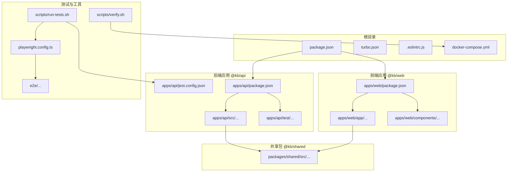
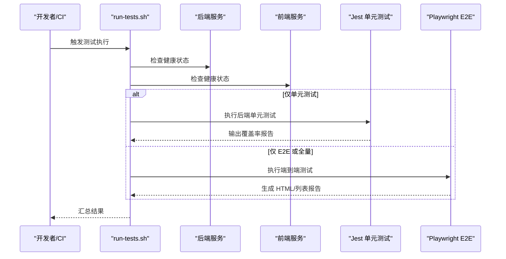
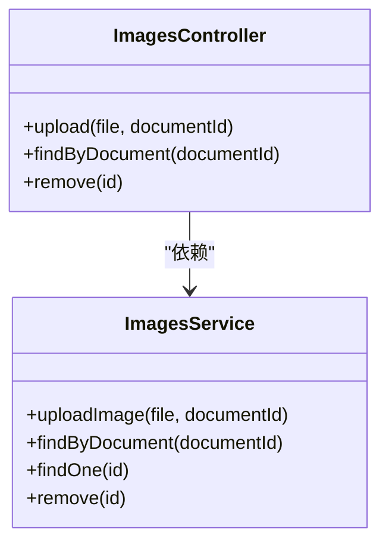
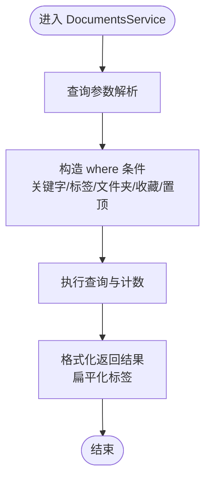
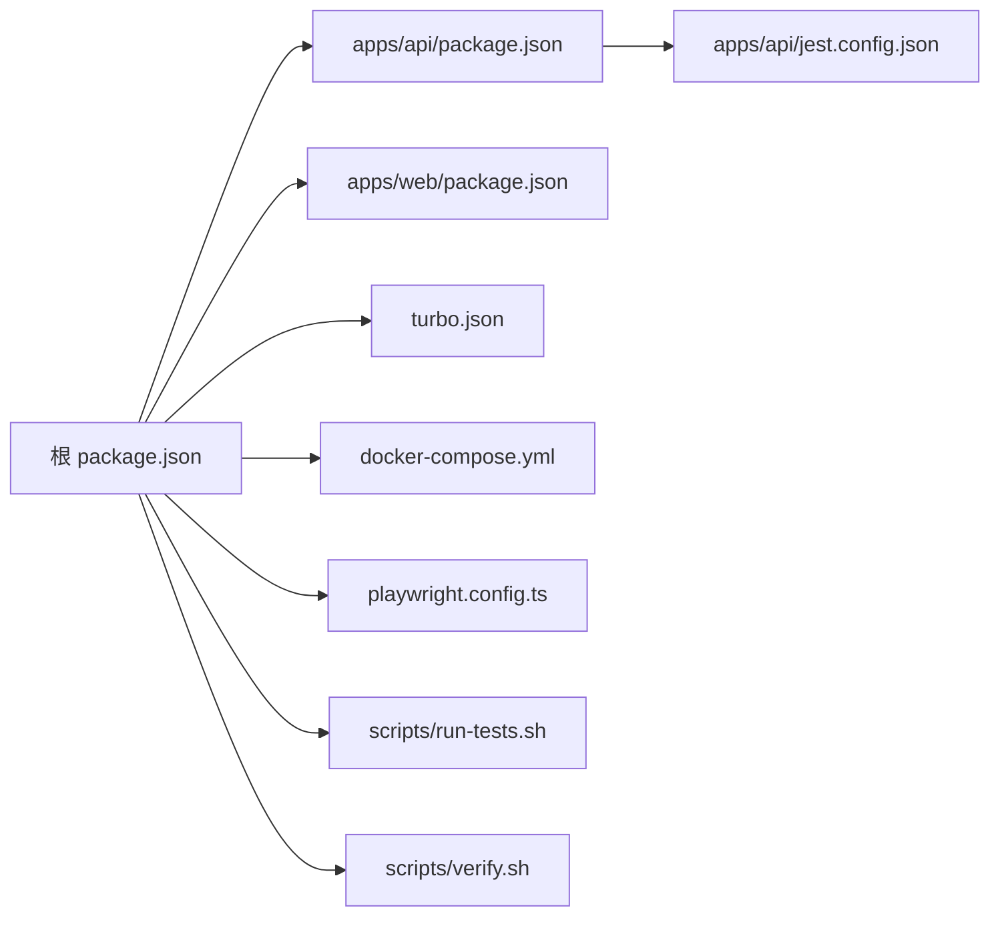

# 测试覆盖率与质量保证

<cite>
**本文引用的文件**
- [package.json](file://package.json)
- [apps/api/package.json](file://apps/api/package.json)
- [apps/web/package.json](file://apps/web/package.json)
- [apps/api/jest.config.json](file://apps/api/jest.config.json)
- [playwright.config.ts](file://playwright.config.ts)
- [scripts/run-tests.sh](file://scripts/run-tests.sh)
- [scripts/verify.sh](file://scripts/verify.sh)
- [turbo.json](file://turbo.json)
- [docker-compose.yml](file://docker-compose.yml)
- [apps/api/test/images.controller.spec.ts](file://apps/api/test/images.controller.spec.ts)
- [e2e/app.spec.ts](file://e2e/app.spec.ts)
- [e2e/api-images.spec.ts](file://e2e/api-images.spec.ts)
- [apps/api/src/modules/images/images.controller.ts](file://apps/api/src/modules/images/images.controller.ts)
- [apps/api/src/modules/images/images.service.ts](file://apps/api/src/modules/images/images.service.ts)
- [apps/api/src/modules/conversations/conversations.service.ts](file://apps/api/src/modules/conversations/conversations.service.ts)
- [apps/api/src/modules/documents/documents.service.ts](file://apps/api/src/modules/documents/documents.service.ts)
- [apps/api/src/common/utils/text.utils.ts](file://apps/api/src/common/utils/text.utils.ts)
- [.eslintrc.js](file://.eslintrc.js)
</cite>

## 目录
1. [简介](#简介)
2. [项目结构](#项目结构)
3. [核心组件](#核心组件)
4. [架构总览](#架构总览)
5. [详细组件分析](#详细组件分析)
6. [依赖关系分析](#依赖关系分析)
7. [性能考量](#性能考量)
8. [故障排查指南](#故障排查指南)
9. [结论](#结论)
10. [附录](#附录)

## 简介
本文件面向 APP2 项目，提供系统化的测试覆盖率与质量保证方案。内容涵盖：
- 测试覆盖率指标与阈值建议（行覆盖率、分支覆盖率、函数覆盖率、语句覆盖率）
- Jest 配置与报告生成
- 质量门禁标准与持续集成中的测试执行策略
- 低覆盖率区域识别与修复路径
- 平衡测试质量与开发效率的方法
- 测试质量指标监控与报告分析

## 项目结构
APP2 采用多包工作区结构，包含后端 NestJS 应用、前端 Next.js 应用、共享类型包、端到端测试与自动化脚本。

图表来源
- [package.json](file://package.json#L1-L36)
- [apps/api/package.json](file://apps/api/package.json#L1-L55)
- [apps/web/package.json](file://apps/web/package.json#L1-L54)
- [apps/api/jest.config.json](file://apps/api/jest.config.json#L1-L17)
- [playwright.config.ts](file://playwright.config.ts#L1-L24)
- [scripts/run-tests.sh](file://scripts/run-tests.sh#L1-L176)
- [scripts/verify.sh](file://scripts/verify.sh#L1-L160)
- [turbo.json](file://turbo.json#L1-L21)
- [docker-compose.yml](file://docker-compose.yml#L1-L53)

章节来源
- [package.json](file://package.json#L1-L36)
- [turbo.json](file://turbo.json#L1-L21)

## 核心组件
- 后端单元测试与覆盖率收集：通过 Jest 在后端应用中执行，配置了 TypeScript 转换、模块映射与覆盖率输出目录。
- 端到端测试：使用 Playwright，支持 HTML 报告与列表报告，支持按项目并行执行。
- 自动化测试脚本：统一入口，支持仅运行 API/E2E/单元测试与报告生成；内置服务可用性检查。
- 质量门禁：在 CI 中启用严格模式与重试策略，确保测试稳定性。
- 开发环境：Turbo 管道构建与缓存，便于快速迭代。

章节来源
- [apps/api/jest.config.json](file://apps/api/jest.config.json#L1-L17)
- [playwright.config.ts](file://playwright.config.ts#L1-L24)
- [scripts/run-tests.sh](file://scripts/run-tests.sh#L1-L176)
- [turbo.json](file://turbo.json#L1-L21)

## 架构总览
下图展示测试执行的关键流程与组件交互：

图表来源
- [scripts/run-tests.sh](file://scripts/run-tests.sh#L69-L176)
- [playwright.config.ts](file://playwright.config.ts#L1-L24)
- [apps/api/jest.config.json](file://apps/api/jest.config.json#L1-L17)

## 详细组件分析

### 测试覆盖率配置与指标
- 配置要点
  - Jest 根目录与正则匹配：扫描 src 下所有 spec.ts 文件。
  - TypeScript 转换：使用 ts-jest。
  - 模块映射：将 @kb/shared 映射到共享源码目录。
  - 覆盖率输出：输出至 ../coverage 目录。
- 指标定义
  - 行覆盖率：被至少执行一次的源码行占比。
  - 分支覆盖率：被至少执行一次的分支（if/else、三元等）占比。
  - 函数覆盖率：被至少调用一次的函数占比。
  - 语句覆盖率：被至少执行一次的语句占比。
- 阈值建议（示例）
  - 行覆盖率：≥80%
  - 分支覆盖率：≥70%
  - 函数覆盖率：≥85%
  - 语句覆盖率：≥80%
  - 说明：阈值应结合业务复杂度与风险调整，建议在 CI 中强制执行。

章节来源
- [apps/api/jest.config.json](file://apps/api/jest.config.json#L1-L17)

### Jest 配置与报告生成
- 执行命令
  - 后端应用内执行：npm 脚本 test 调用 jest。
  - E2E 测试：npm 脚本 test:e2e 指向独立配置文件。
- 报告生成
  - 单元测试：由 Jest 配置决定输出目录与格式。
  - E2E 测试：Playwright 默认生成 HTML 报告与列表报告。
- 自动化脚本
  - run-tests.sh 支持 --report 参数生成 HTML 报告，并在完成后提示打开方式。

章节来源
- [apps/api/package.json](file://apps/api/package.json#L5-L14)
- [apps/api/jest.config.json](file://apps/api/jest.config.json#L1-L17)
- [playwright.config.ts](file://playwright.config.ts#L1-L24)
- [scripts/run-tests.sh](file://scripts/run-tests.sh#L110-L135)

### 质量门禁与持续集成策略
- CI 设置建议
  - 并行度：workers=1（避免资源竞争），retries=2（提升稳定性）。
  - 严格模式：forbidOnly=!!process.env.CI，确保仅运行标记为 Only 的用例时失败。
  - 截图与追踪：仅在失败时截图，首次重试时开启 trace。
- 服务依赖
  - 通过 docker-compose 提供 PostgreSQL 与 Meilisearch。
  - verify.sh 自动拉起所需容器并校验健康状态。
- 执行策略
  - 本地：run-tests.sh 支持选择性执行（API-only、E2E-only、unit-only）。
  - CI：优先执行单元测试，再执行 E2E；若失败，利用 HTML 报告定位问题。

章节来源
- [playwright.config.ts](file://playwright.config.ts#L1-L24)
- [scripts/verify.sh](file://scripts/verify.sh#L1-L160)
- [docker-compose.yml](file://docker-compose.yml#L1-L53)
- [scripts/run-tests.sh](file://scripts/run-tests.sh#L1-L176)

### 低覆盖率区域识别与修复
- 识别方法
  - 查看 Jest 生成的 coverage 报告，定位未覆盖的文件与行号。
  - 结合业务逻辑，重点检查分支较多的函数、异常处理路径与边界条件。
- 修复路径
  - 针对控制器与服务层补充单元测试，覆盖正常与异常分支。
  - 对于工具函数（如文本处理），补充边界与特殊输入场景。
  - 对于 E2E 场景，补充端到端用例，覆盖用户操作链路。
- 示例参考
  - 图片上传控制器与服务：存在文件类型校验、大小限制、数据库写入与文件系统清理等分支，需完善对应测试。
  - 文档服务：包含大量查询、更新、标签管理与 Meilisearch 同步逻辑，需分模块补充测试。

章节来源
- [apps/api/test/images.controller.spec.ts](file://apps/api/test/images.controller.spec.ts#L1-L176)
- [apps/api/src/modules/images/images.controller.ts](file://apps/api/src/modules/images/images.controller.ts#L1-L92)
- [apps/api/src/modules/images/images.service.ts](file://apps/api/src/modules/images/images.service.ts#L1-L62)
- [apps/api/src/modules/documents/documents.service.ts](file://apps/api/src/modules/documents/documents.service.ts#L1-L489)
- [apps/api/src/common/utils/text.utils.ts](file://apps/api/src/common/utils/text.utils.ts#L1-L27)

### 测试质量指标监控与报告分析
- 指标采集
  - 单元测试：Jest 覆盖率报告中的行/分支/函数/语句覆盖率。
  - E2E 测试：Playwright HTML 报告中的用例通过率、失败重试次数与失败截图。
- 报告分析
  - 定期对比历史数据，关注趋势变化。
  - 对失败用例进行分类统计（网络错误、断言失败、页面元素不可见等）。
  - 结合日志与 trace，定位根因并制定修复计划。
- 建议流程
  - 每次提交后在 CI 中生成并上传报告。
  - 在 PR 中展示覆盖率变化与关键失败用例摘要。

章节来源
- [playwright.config.ts](file://playwright.config.ts#L1-L24)
- [scripts/run-tests.sh](file://scripts/run-tests.sh#L110-L135)

### 组件级测试覆盖分析

#### 图片模块（ImagesController/ImagesService）
- 覆盖点
  - 上传接口：文件类型校验、大小限制、返回结构、带 documentId 的场景。
  - 查询接口：无参数时返回空数组，有参数时调用服务层。
  - 删除接口：存在与不存在的两种分支，异常抛出与返回结构。
- 建议补充
  - 上传失败（无效类型、超限）的边界测试。
  - 删除失败（文件系统异常）的日志与回滚路径测试。
  - 服务层与 Prisma 的集成测试，确保数据库一致性。

图表来源
- [apps/api/src/modules/images/images.controller.ts](file://apps/api/src/modules/images/images.controller.ts#L1-L92)
- [apps/api/src/modules/images/images.service.ts](file://apps/api/src/modules/images/images.service.ts#L1-L62)

章节来源
- [apps/api/test/images.controller.spec.ts](file://apps/api/test/images.controller.spec.ts#L1-L176)
- [apps/api/src/modules/images/images.controller.ts](file://apps/api/src/modules/images/images.controller.ts#L1-L92)
- [apps/api/src/modules/images/images.service.ts](file://apps/api/src/modules/images/images.service.ts#L1-L62)

#### 文档模块（DocumentsService）
- 覆盖点
  - 分页查询：关键字、标签、文件夹、收藏、置顶等多维过滤。
  - 创建/更新：内容解析、纯文本提取、字数统计、Meilisearch 同步。
  - 标签管理：替换标签的删除与重建逻辑。
  - 归档/删除：软删除与永久删除的差异。
- 建议补充
  - 查询条件组合的边界测试（空值、非法值）。
  - Meilisearch 同步失败的降级与重试策略测试。
  - 文本处理工具函数的边界与国际化字符处理。

图表来源
- [apps/api/src/modules/documents/documents.service.ts](file://apps/api/src/modules/documents/documents.service.ts#L25-L116)
- [apps/api/src/common/utils/text.utils.ts](file://apps/api/src/common/utils/text.utils.ts#L1-L27)

章节来源
- [apps/api/src/modules/documents/documents.service.ts](file://apps/api/src/modules/documents/documents.service.ts#L1-L489)
- [apps/api/src/common/utils/text.utils.ts](file://apps/api/src/common/utils/text.utils.ts#L1-L27)

#### 对话模块（ConversationsService）
- 覆盖点
  - 创建、查询、详情、更新、删除。
  - 批量操作：归档/取消归档、删除、置顶/取消、加星/取消。
  - 搜索：多字段模糊匹配与排序。
- 建议补充
  - 批量操作的事务一致性测试。
  - 消息数量统计与分页的正确性测试。

章节来源
- [apps/api/src/modules/conversations/conversations.service.ts](file://apps/api/src/modules/conversations/conversations.service.ts#L1-L304)

### 端到端测试策略
- 覆盖范围
  - 文档管理：新建、编辑、布局与基础交互。
  - 编辑器功能：CodeMirror 行号、文本输入、加粗、预览、中文输入、状态栏词数。
  - 数学公式：行内与块级公式渲染、插入对话框。
  - 表格编辑：Markdown 表格在预览中的渲染。
  - 图片管理：插入对话框、URL 插入、拖拽占位、库功能提示。
  - API 健康检查：后端健康端点。
- 执行策略
  - 本地：run-tests.sh 支持按组筛选（API-only、E2E-only）。
  - CI：默认全量执行，失败自动重试，生成 HTML 报告。

章节来源
- [e2e/app.spec.ts](file://e2e/app.spec.ts#L1-L288)
- [e2e/api-images.spec.ts](file://e2e/api-images.spec.ts#L1-L115)
- [scripts/run-tests.sh](file://scripts/run-tests.sh#L110-L135)

## 依赖关系分析
- 包管理与脚本
  - 根 package.json 定义项目脚本与引擎版本。
  - 后端与前端各自维护独立的依赖与脚本。
- 工作流与缓存
  - Turbo 管理构建依赖与缓存，dev 任务不缓存以保证实时性。
- 测试依赖
  - Jest 用于后端单元测试，Playwright 用于前端 E2E。
  - verify.sh 与 docker-compose 确保测试环境可用。

图表来源
- [package.json](file://package.json#L1-L36)
- [apps/api/package.json](file://apps/api/package.json#L1-L55)
- [apps/web/package.json](file://apps/web/package.json#L1-L54)
- [apps/api/jest.config.json](file://apps/api/jest.config.json#L1-L17)
- [turbo.json](file://turbo.json#L1-L21)
- [docker-compose.yml](file://docker-compose.yml#L1-L53)
- [playwright.config.ts](file://playwright.config.ts#L1-L24)
- [scripts/run-tests.sh](file://scripts/run-tests.sh#L1-L176)
- [scripts/verify.sh](file://scripts/verify.sh#L1-L160)

章节来源
- [package.json](file://package.json#L1-L36)
- [turbo.json](file://turbo.json#L1-L21)

## 性能考量
- 测试执行性能
  - Playwright 并行执行，建议在 CI 中限制 workers 以控制资源占用。
  - Jest 测试文件拆分合理，避免单文件过大导致加载缓慢。
- 覆盖率收集性能
  - 覆盖率统计会增加执行时间，建议在本地快速迭代时关闭覆盖率，在 CI 中开启。
- 环境准备
  - verify.sh 自动拉起数据库与搜索引擎容器，减少手动准备成本。
- 缓存与增量
  - Turbo 的构建缓存可显著缩短开发周期；测试缓存可在 CI 中按需启用。

## 故障排查指南
- 端到端测试失败
  - 检查前端与后端服务是否启动（run-tests.sh 会进行健康检查）。
  - 查看 Playwright HTML 报告中的截图与 trace，定位失败步骤。
- 单元测试覆盖率不足
  - 使用 Jest 报告定位未覆盖分支，补充针对异常路径与边界条件的用例。
- 环境问题
  - 使用 verify.sh 快速检查 Docker 容器、数据库扩展与服务健康状态。
  - 若容器未运行，执行 docker compose up -d 并等待健康检查通过。

章节来源
- [scripts/run-tests.sh](file://scripts/run-tests.sh#L72-L108)
- [scripts/verify.sh](file://scripts/verify.sh#L76-L127)
- [playwright.config.ts](file://playwright.config.ts#L1-L24)

## 结论
通过合理的覆盖率指标、完善的 Jest 与 Playwright 配置、严格的 CI 门禁与自动化脚本，APP2 项目可以建立可持续的质量保障体系。建议持续优化测试用例的覆盖面与稳定性，结合报告分析与趋势监控，逐步提升整体测试质量与交付效率。

## 附录
- 质量门禁清单
  - CI 中启用 forbidOnly，确保用例标记规范。
  - E2E 失败自动重试，失败时保留截图与 trace。
  - 单元测试覆盖率阈值在 CI 中强制执行。
- 开发效率平衡
  - 本地快速迭代：关闭覆盖率，缩短反馈周期。
  - 提交前与 CI：开启覆盖率与全量测试，确保质量门槛。