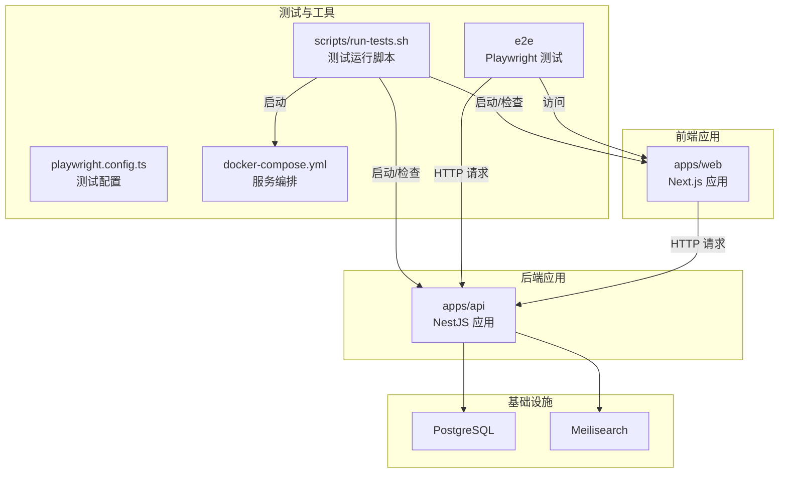
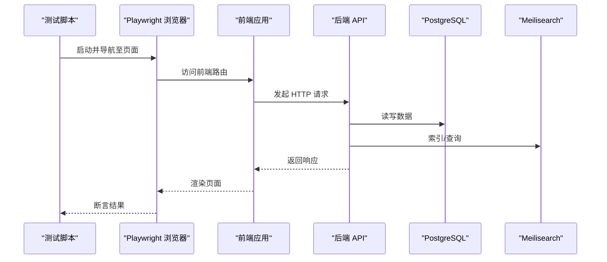
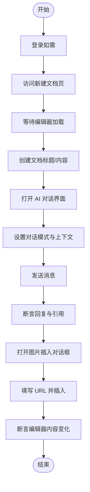
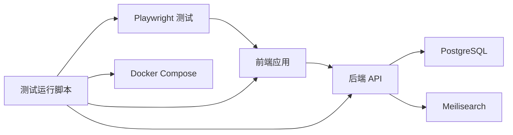

# 端到端测试

<cite>
**本文引用的文件**
- [playwright.config.ts](file://playwright.config.ts)
- [package.json](file://package.json)
- [e2e/app.spec.ts](file://e2e/app.spec.ts)
- [e2e/api-images.spec.ts](file://e2e/api-images.spec.ts)
- [scripts/run-tests.sh](file://scripts/run-tests.sh)
- [docker-compose.yml](file://docker-compose.yml)
- [turbo.json](file://turbo.json)
- [apps/api/test/images.controller.spec.ts](file://apps/api/test/images.controller.spec.ts)
- [apps/web/app/layout.tsx](file://apps/web/app/layout.tsx)
- [apps/web/components/editor/codemirror-editor.tsx](file://apps/web/components/editor/codemirror-editor.tsx)
- [apps/web/components/ai/chat-interface.tsx](file://apps/web/components/ai/chat-interface.tsx)
- [apps/web/hooks/use-ai-chat.ts](file://apps/web/hooks/use-ai-chat.ts)
- [apps/web/components/documents/document-toolbar.tsx](file://apps/web/components/documents/document-toolbar.tsx)
</cite>

## 目录
1. [简介](#简介)
2. [项目结构](#项目结构)
3. [核心组件](#核心组件)
4. [架构总览](#架构总览)
5. [详细组件分析](#详细组件分析)
6. [依赖关系分析](#依赖关系分析)
7. [性能考量](#性能考量)
8. [故障排查指南](#故障排查指南)
9. [结论](#结论)
10. [附录](#附录)

## 简介
本文件面向 APP2 项目的端到端测试，系统化阐述 Playwright 测试框架的配置与使用方法，覆盖浏览器自动化、页面对象模式、测试用例设计与执行策略。文档重点说明如何测试完整用户工作流：从登录（如需）到文档创建、编辑器功能、AI 对话以及文件上传的端到端流程；同时提供页面元素定位、用户交互模拟、响应时间测试、动态内容与异步操作处理、跨浏览器兼容性策略，并给出测试数据准备、测试环境部署与 CI/CD 集成建议。

## 项目结构
APP2 采用多包工作区（pnpm workspaces）组织，前端 Next.js 应用位于 apps/web，后端 NestJS 应用位于 apps/api，测试相关目录包括：
- e2e：Playwright 端到端测试
- scripts：测试运行脚本
- docker-compose.yml：数据库与搜索引擎服务编排
- playwright.config.ts：Playwright 测试配置
- turbo.json：任务编排与缓存策略

图表来源
- [playwright.config.ts](file://playwright.config.ts#L1-L24)
- [scripts/run-tests.sh](file://scripts/run-tests.sh#L69-L176)
- [docker-compose.yml](file://docker-compose.yml#L1-L53)

章节来源
- [playwright.config.ts](file://playwright.config.ts#L1-L24)
- [package.json](file://package.json#L1-L36)
- [turbo.json](file://turbo.json#L1-L21)

## 核心组件
- Playwright 配置与执行
  - 测试目录、并行度、重试策略、报告器、基础 URL、截图与追踪等均在配置中定义。
  - 当前仅启用 Chromium 设备，便于稳定与一致的跨平台行为。
- 自动化测试脚本
  - 使用 scripts/run-tests.sh 统一入口，支持 API-only、E2E-only、unit-only 与报告生成等选项。
  - 在 CI 环境下自动启用重试与单 worker，提升稳定性。
- 前端与后端服务
  - 前端 Next.js 应用提供页面与交互；后端 NestJS 提供 API（含图像上传、健康检查等）。
  - Docker Compose 启动数据库与搜索引擎，确保测试环境一致性。

章节来源
- [playwright.config.ts](file://playwright.config.ts#L3-L23)
- [scripts/run-tests.sh](file://scripts/run-tests.sh#L110-L135)
- [docker-compose.yml](file://docker-compose.yml#L1-L53)

## 架构总览
下图展示端到端测试的整体流程：测试脚本通过 Playwright 控制浏览器访问前端页面，前端通过 HTTP 客户端调用后端 API；后端连接数据库与搜索引擎完成业务逻辑。

图表来源
- [e2e/app.spec.ts](file://e2e/app.spec.ts#L1-L288)
- [e2e/api-images.spec.ts](file://e2e/api-images.spec.ts#L1-L115)
- [apps/web/hooks/use-ai-chat.ts](file://apps/web/hooks/use-ai-chat.ts#L1-L117)
- [docker-compose.yml](file://docker-compose.yml#L1-L53)

## 详细组件分析

### Playwright 配置与项目设置
- 测试目录与并行
  - testDir 指向 e2e，fullyParallel 开启并行以提升效率。
- 重试与 CI 行为
  - CI 环境下启用 forbidOnly、retries=2、workers=1，保证稳定与可重复性。
- 报告与追踪
  - 使用 html 与 list 报告器；trace 仅在首次重试时记录，便于问题定位。
- 基础 URL 与设备
  - baseURL 指向前端本地服务；当前仅配置 Chromium 设备，便于跨平台一致性。
- WebServer 启动策略
  - 配置中注释掉 webServer，测试脚本负责手动启动与检查服务。

章节来源
- [playwright.config.ts](file://playwright.config.ts#L3-L23)

### 测试脚本与执行策略
- 运行入口
  - scripts/run-tests.sh 提供统一入口，支持多种组合模式与报告生成。
- 服务器检查
  - 自动检查 API 与 Web 服务是否就绪，必要时提示启动方式。
- 测试分类执行
  - 支持按正则过滤 E2E 与 API 测试，便于局部调试与 CI 分阶段执行。
- 报告输出
  - 自动生成 HTML 报告，便于本地查看与 CI 归档。

章节来源
- [scripts/run-tests.sh](file://scripts/run-tests.sh#L1-L176)

### 页面对象模式与元素定位
- 页面描述块
  - 使用 test.describe 将相关测试分组，便于维护与并行执行。
- 元素定位策略
  - 使用角色（getByRole）、文本匹配（getByText）、占位符与标题属性等进行定位，减少对实现细节的耦合。
  - 对于严格模式，使用 first() 或 OR 组合避免“多个匹配”错误。
- 动态内容与异步等待
  - 对编辑器、预览、KaTeX 渲染等异步内容使用显式 waitFor/timeout 与可见性断言。
- 用户交互模拟
  - 键盘输入、按钮点击、Tab 页切换、拖拽区域可见性验证等。

章节来源
- [e2e/app.spec.ts](file://e2e/app.spec.ts#L1-L288)

### 编辑器功能测试（CodeMirror）
- 编辑器初始化与行号
  - 等待 .cm-editor 与 .cm-gutters 可见，确保编辑器加载完成。
- 文本输入与格式化
  - 通过键盘输入与快捷键触发加粗、斜体、删除线、代码块等格式化。
- 预览与状态栏
  - 切换“分屏预览”，断言标题、表格、公式等渲染；校验状态栏词数显示。
- 中文输入
  - 验证中文字符输入与显示。

章节来源
- [e2e/app.spec.ts](file://e2e/app.spec.ts#L54-L136)
- [apps/web/components/editor/codemirror-editor.tsx](file://apps/web/components/editor/codemirror-editor.tsx#L1-L272)

### 数学公式与表格编辑
- 内联与块级公式
  - 输入 LaTeX 语法，断言 KaTeX 渲染元素出现。
- 数学公式插入对话框
  - 触发按钮打开对话框，断言标题与标签页存在。
- Markdown 表格
  - 输入表格语法，断言预览渲染表格。

章节来源
- [e2e/app.spec.ts](file://e2e/app.spec.ts#L138-L201)

### 图片管理与上传
- 插入图片对话框
  - 打开图片按钮，断言对话框标题与标签页（本地上传、URL 链接、图片库）。
- URL 图片插入
  - 切换到 URL 标签页，填写示例链接并插入，断言编辑器中出现图片标记。
- 拖拽与占位提示
  - 验证编辑器可接收拖拽事件；在新文档场景下断言图片库占位提示。
- API 图像上传测试
  - 使用 multipart 上传 PNG 文件，断言返回状态、数据结构与 URL 规范。
  - 验证无效类型拒绝、无 documentId 查询空数组、删除与二次删除行为。

章节来源
- [e2e/app.spec.ts](file://e2e/app.spec.ts#L203-L278)
- [e2e/api-images.spec.ts](file://e2e/api-images.spec.ts#L1-L115)

### AI 对话与上下文选择
- 组件与 Hook
  - ChatInterface 负责模式切换、上下文选择器、消息列表与输入框；useAIChat 管理消息状态与发送逻辑。
- 工作流
  - 设置模式（通用/知识库），必要时配置上下文（文档、文件夹、标签），发送消息并断言 AI 回复与引用跳转。
- 与前端页面的集成
  - 通过路由跳转到文档详情，验证引用点击行为。

章节来源
- [apps/web/components/ai/chat-interface.tsx](file://apps/web/components/ai/chat-interface.tsx#L1-L125)
- [apps/web/hooks/use-ai-chat.ts](file://apps/web/hooks/use-ai-chat.ts#L1-L117)

### 健康检查与后台服务
- 健康检查
  - 通过 request.get 访问后端健康端点，断言状态码与响应结构。
- 数据库与搜索引擎
  - Docker Compose 启动 PostgreSQL 与 Meilisearch，提供向量索引与全文检索能力。

章节来源
- [e2e/app.spec.ts](file://e2e/app.spec.ts#L280-L287)
- [docker-compose.yml](file://docker-compose.yml#L1-L53)

### 页面布局与工具栏
- 根布局
  - Next.js 根布局提供语言、元数据与 Provider 包装，确保前端渲染与状态管理可用。
- 文档工具栏
  - 排序与视图切换，用于验证文档列表交互。

章节来源
- [apps/web/app/layout.tsx](file://apps/web/app/layout.tsx#L1-L26)
- [apps/web/components/documents/document-toolbar.tsx](file://apps/web/components/documents/document-toolbar.tsx#L1-L61)

### 端到端工作流设计（登录到文档创建、AI 对话、文件上传）
- 登录（如需）
  - 若前端需要登录态，可在 beforeEach 中先访问登录页并完成登录流程，再进入目标页面。
- 文档创建
  - 导航至“新建文档”页面，等待编辑器加载，断言标题输入与编辑器存在。
- AI 对话
  - 初始化 ChatInterface，设置模式与上下文，发送消息并断言回复与引用。
- 文件上传
  - 打开图片插入对话框，选择 URL 链接，填入示例地址并插入，断言编辑器内容变化。
- 断言与追踪
  - 使用 trace 与截图在失败时辅助定位问题。

（本图为概念流程示意，不直接映射具体源码文件）

## 依赖关系分析
- 测试与应用的耦合
  - Playwright 通过 baseURL 访问前端；前端通过 HTTP 客户端调用后端 API；后端依赖数据库与搜索引擎。
- 任务编排
  - Turbo 管理构建与开发任务，scripts 负责测试运行与服务检查。
- Docker 服务
  - Postgres 与 Meilisearch 作为外部依赖，测试前需确保其健康可用。

图表来源
- [playwright.config.ts](file://playwright.config.ts#L10-L14)
- [scripts/run-tests.sh](file://scripts/run-tests.sh#L69-L176)
- [docker-compose.yml](file://docker-compose.yml#L1-L53)

章节来源
- [turbo.json](file://turbo.json#L1-L21)
- [docker-compose.yml](file://docker-compose.yml#L1-L53)

## 性能考量
- 并行与重试
  - 在非 CI 环境下开启 fullyParallel，在 CI 环境下启用 retries 与单 worker，平衡速度与稳定性。
- 等待策略
  - 对异步渲染（编辑器、预览、公式）使用明确的超时与可见性断言，避免盲目等待。
- 截图与追踪
  - 仅在失败时生成截图，trace 仅在首次重试时启用，降低测试开销。
- 服务启动顺序
  - 使用脚本先检查服务可用性，避免测试因服务未就绪而失败。

章节来源
- [playwright.config.ts](file://playwright.config.ts#L5-L14)
- [scripts/run-tests.sh](file://scripts/run-tests.sh#L72-L94)

## 故障排查指南
- 服务未启动
  - 使用 run-tests.sh 的服务检查函数确认 API 与 Web 服务状态，按提示启动对应服务。
- 测试不稳定
  - 在 CI 环境下启用 retries；适当增加断言超时；使用 trace 定位首失败。
- 元素定位失败
  - 使用更稳定的定位策略（角色、标题、占位符），对严格模式使用 first() 或 OR 组合。
- 异步内容未渲染
  - 明确等待条件（可见、存在、文本匹配），结合断言超时。
- API 上传失败
  - 确认上传二进制数据格式与 MIME 类型；检查后端对无效类型的拒绝策略与返回码。

章节来源
- [scripts/run-tests.sh](file://scripts/run-tests.sh#L72-L94)
- [e2e/api-images.spec.ts](file://e2e/api-images.spec.ts#L42-L57)

## 结论
本项目已具备完善的 Playwright 端到端测试基础：清晰的配置、统一的运行脚本、覆盖编辑器、图片上传与 API 的测试用例。建议在现有基础上扩展以下内容以进一步完善测试体系：
- 增加登录流程与权限控制测试
- 引入跨浏览器（Firefox、Safari）与移动设备测试项目
- 优化测试数据准备与清理策略
- 在 CI 中拆分单元测试、API 测试与 E2E 测试阶段，提升反馈速度

## 附录

### 测试数据准备与环境部署
- 数据库与搜索引擎
  - 使用 docker-compose 启动 PostgreSQL 与 Meilisearch，确保索引与向量能力可用。
- 服务健康检查
  - run-tests.sh 提供 API 与 Web 服务检查逻辑，可在 CI 中复用。
- 单元测试与 API 测试
  - 后端单元测试与 API 图像上传测试可独立运行，便于快速验证接口正确性。

章节来源
- [docker-compose.yml](file://docker-compose.yml#L1-L53)
- [scripts/run-tests.sh](file://scripts/run-tests.sh#L69-L176)
- [apps/api/test/images.controller.spec.ts](file://apps/api/test/images.controller.spec.ts#L1-L176)

### CI/CD 集成策略
- 分阶段执行
  - 先运行单元测试，再运行 API 测试，最后运行 E2E 测试，缩短反馈周期。
- 并行与缓存
  - 利用 Turbo 的持久化与缓存策略加速构建；Playwright 在 CI 下启用单 worker 与重试。
- 报告归档
  - 生成 HTML 报告并在 CI 中归档，便于回溯与审计。

章节来源
- [scripts/run-tests.sh](file://scripts/run-tests.sh#L110-L135)
- [playwright.config.ts](file://playwright.config.ts#L7-L8)