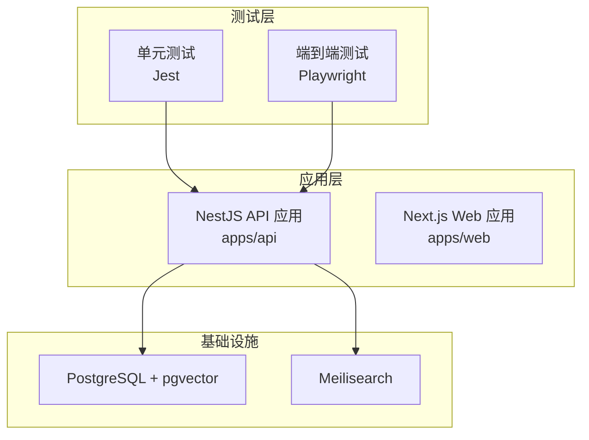
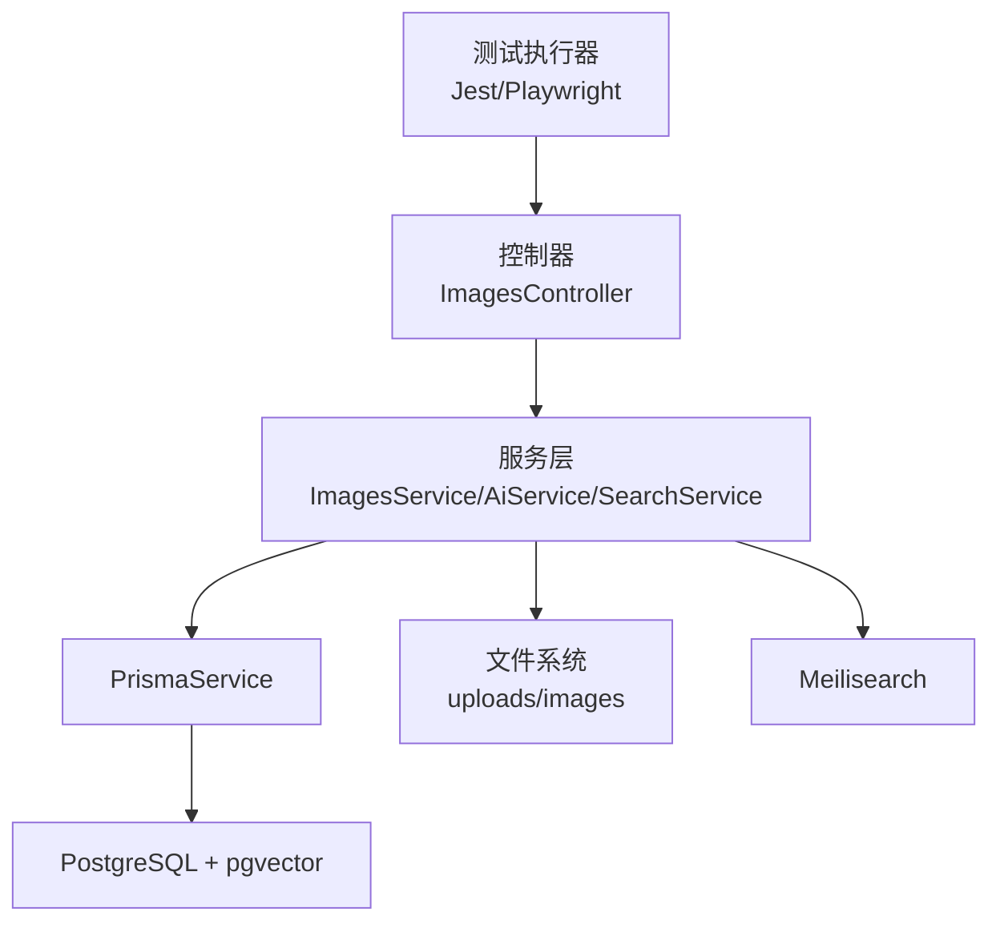
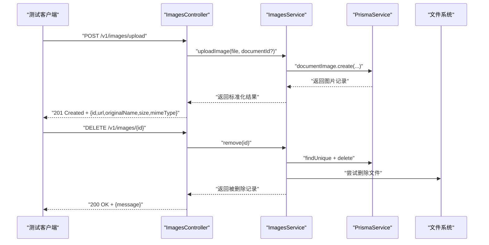
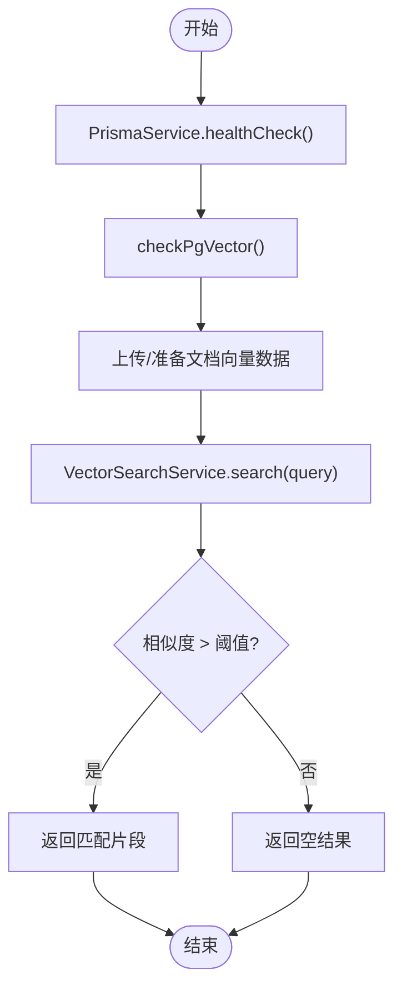
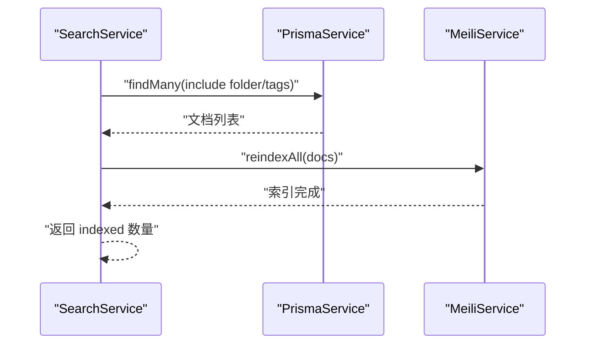
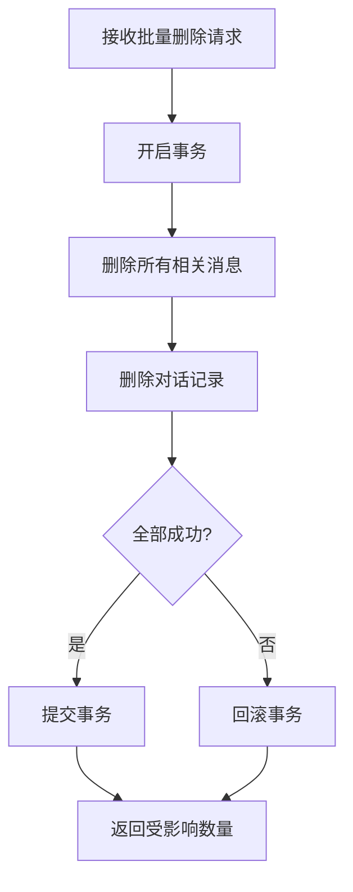
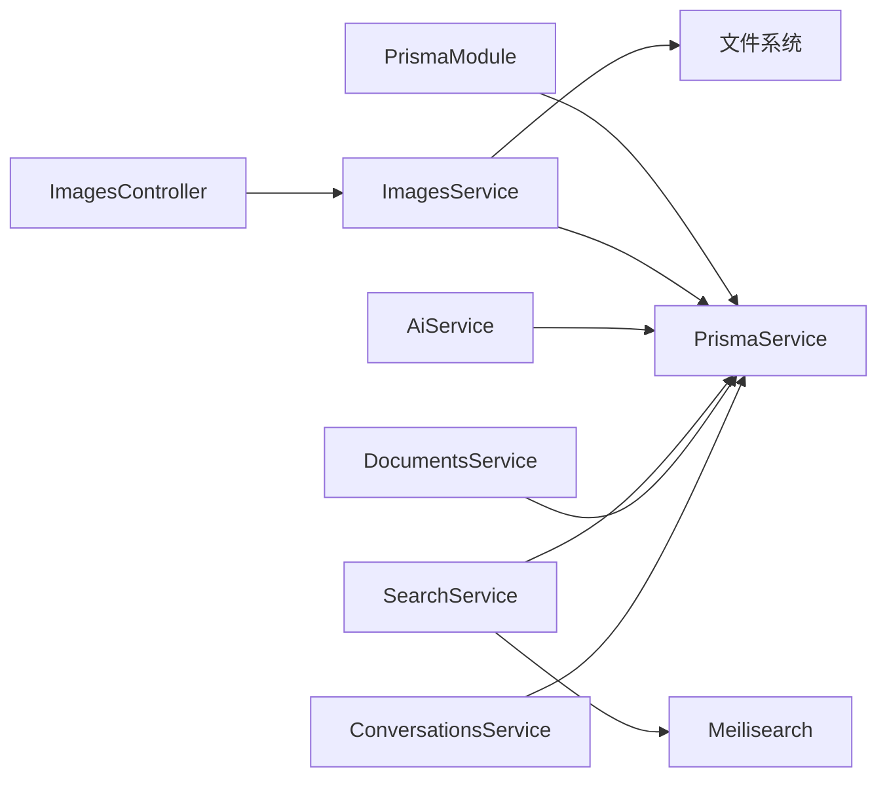

# 集成测试

<cite>
**本文引用的文件**
- [apps/api/test/images.controller.spec.ts](file://apps/api/test/images.controller.spec.ts)
- [apps/api/jest.config.json](file://apps/api/jest.config.json)
- [apps/api/src/common/prisma/prisma.service.ts](file://apps/api/src/common/prisma/prisma.service.ts)
- [apps/api/src/common/prisma/prisma.module.ts](file://apps/api/src/common/prisma/prisma.module.ts)
- [apps/api/src/modules/images/images.controller.ts](file://apps/api/src/modules/images/images.controller.ts)
- [apps/api/src/modules/images/images.service.ts](file://apps/api/src/modules/images/images.service.ts)
- [e2e/api-images.spec.ts](file://e2e/api-images.spec.ts)
- [playwright.config.ts](file://playwright.config.ts)
- [scripts/run-tests.sh](file://scripts/run-tests.sh)
- [docker-compose.yml](file://docker-compose.yml)
- [apps/api/src/modules/ai/ai.service.ts](file://apps/api/src/modules/ai/ai.service.ts)
- [apps/api/src/modules/ai/vector-search.service.ts](file://apps/api/src/modules/ai/vector-search.service.ts)
- [apps/api/src/modules/search/search.service.ts](file://apps/api/src/modules/search/search.service.ts)
- [apps/api/src/modules/documents/documents.service.ts](file://apps/api/src/modules/documents/documents.service.ts)
- [apps/api/src/modules/conversations/conversations.service.ts](file://apps/api/src/modules/conversations/conversations.service.ts)
</cite>

## 目录
1. [简介](#简介)
2. [项目结构](#项目结构)
3. [核心组件](#核心组件)
4. [架构总览](#架构总览)
5. [详细组件分析](#详细组件分析)
6. [依赖关系分析](#依赖关系分析)
7. [性能考量](#性能考量)
8. [故障排查指南](#故障排查指南)
9. [结论](#结论)
10. [附录](#附录)

## 简介
本文件面向 APP2 项目的集成测试，聚焦以下目标：
- 测试模块间交互与数据库连接，涵盖 Prisma ORM 的集成测试策略
- 设置测试数据库、模拟外部服务与测试 API 端点的完整流程
- 数据库事务测试、事务回滚与数据一致性验证方法
- 文件上传、AI 服务调用、向量搜索等复杂功能的集成测试
- 测试环境配置与测试数据管理策略

## 项目结构
APP2 采用多包工作区，测试主要分布在：
- 单元测试：NestJS 应用内位于 apps/api/test
- 端到端测试：Playwright 测试位于 e2e
- 测试运行脚本：scripts/run-tests.sh
- 测试数据库与搜索引擎：docker-compose.yml 中定义 PostgreSQL + pgvector 与 Meilisearch

图表来源
- [docker-compose.yml](file://docker-compose.yml#L1-L53)
- [playwright.config.ts](file://playwright.config.ts#L1-L24)
- [scripts/run-tests.sh](file://scripts/run-tests.sh#L1-L176)

章节来源
- [docker-compose.yml](file://docker-compose.yml#L1-L53)
- [playwright.config.ts](file://playwright.config.ts#L1-L24)
- [scripts/run-tests.sh](file://scripts/run-tests.sh#L1-L176)

## 核心组件
- Prisma ORM：统一数据库访问与健康检查、扩展检测能力
- 图片模块：文件上传、查询与删除的端到端流程
- AI 与向量检索：RAG、流式聊天、向量相似度搜索
- 文档与对话：全文检索、索引重建、批量操作与一致性校验
- 测试框架：Jest 单元测试、Playwright 端到端测试、自定义自动化脚本

章节来源
- [apps/api/src/common/prisma/prisma.service.ts](file://apps/api/src/common/prisma/prisma.service.ts#L1-L69)
- [apps/api/src/modules/images/images.controller.ts](file://apps/api/src/modules/images/images.controller.ts#L1-L92)
- [apps/api/src/modules/ai/ai.service.ts](file://apps/api/src/modules/ai/ai.service.ts#L1-L420)
- [apps/api/src/modules/ai/vector-search.service.ts](file://apps/api/src/modules/ai/vector-search.service.ts#L1-L140)
- [apps/api/src/modules/search/search.service.ts](file://apps/api/src/modules/search/search.service.ts#L1-L62)
- [apps/api/src/modules/documents/documents.service.ts](file://apps/api/src/modules/documents/documents.service.ts#L1-L489)
- [apps/api/src/modules/conversations/conversations.service.ts](file://apps/api/src/modules/conversations/conversations.service.ts#L1-L304)

## 架构总览
下图展示测试视角下的系统交互：测试驱动 API，API 通过 Prisma 访问数据库与搜索引擎，同时涉及文件系统。

图表来源
- [apps/api/src/modules/images/images.controller.ts](file://apps/api/src/modules/images/images.controller.ts#L1-L92)
- [apps/api/src/modules/images/images.service.ts](file://apps/api/src/modules/images/images.service.ts#L1-L62)
- [apps/api/src/common/prisma/prisma.service.ts](file://apps/api/src/common/prisma/prisma.service.ts#L1-L69)
- [apps/api/src/modules/search/search.service.ts](file://apps/api/src/modules/search/search.service.ts#L1-L62)
- [docker-compose.yml](file://docker-compose.yml#L1-L53)

## 详细组件分析

### 图片模块集成测试
- 目标：验证文件上传、按文档查询、删除并返回一致结果；确保 Prisma 写入与文件系统清理的一致性
- 测试策略：
  - 单元测试：使用 TestingModule 注入 MockPrismaService，断言控制器行为与服务调用参数
  - 端到端测试：通过 Playwright 请求 API，断言响应结构、URL 规范与错误码
- 关键流程：

图表来源
- [apps/api/src/modules/images/images.controller.ts](file://apps/api/src/modules/images/images.controller.ts#L54-L90)
- [apps/api/src/modules/images/images.service.ts](file://apps/api/src/modules/images/images.service.ts#L12-L60)
- [apps/api/test/images.controller.spec.ts](file://apps/api/test/images.controller.spec.ts#L55-L174)
- [e2e/api-images.spec.ts](file://e2e/api-images.spec.ts#L8-L113)

章节来源
- [apps/api/test/images.controller.spec.ts](file://apps/api/test/images.controller.spec.ts#L1-L176)
- [apps/api/src/modules/images/images.controller.ts](file://apps/api/src/modules/images/images.controller.ts#L1-L92)
- [apps/api/src/modules/images/images.service.ts](file://apps/api/src/modules/images/images.service.ts#L1-L62)
- [e2e/api-images.spec.ts](file://e2e/api-images.spec.ts#L1-L115)

### AI 与向量检索集成测试
- 目标：验证 RAG 问答、流式聊天、向量相似度搜索在真实数据库与向量扩展下的行为
- 测试策略：
  - 使用 PrismaService.healthCheck 与 checkPgVector 确认数据库可用与扩展存在
  - 通过 VectorSearchService 执行向量相似度查询，断言返回条目与相似度阈值
  - 通过 AiService.chat 与 chatStream 验证消息持久化、token 统计与标题生成
- 关键流程：

图表来源
- [apps/api/src/common/prisma/prisma.service.ts](file://apps/api/src/common/prisma/prisma.service.ts#L46-L67)
- [apps/api/src/modules/ai/vector-search.service.ts](file://apps/api/src/modules/ai/vector-search.service.ts#L36-L66)

章节来源
- [apps/api/src/common/prisma/prisma.service.ts](file://apps/api/src/common/prisma/prisma.service.ts#L1-L69)
- [apps/api/src/modules/ai/vector-search.service.ts](file://apps/api/src/modules/ai/vector-search.service.ts#L1-L140)
- [apps/api/src/modules/ai/ai.service.ts](file://apps/api/src/modules/ai/ai.service.ts#L1-L420)

### 全文检索与索引重建
- 目标：验证 SearchService 与 Meilisearch 的集成，以及批量索引重建
- 测试策略：
  - 通过 SearchService.search 查询并断言命中、分页与处理时间
  - 通过 reindexAll 将文档全量同步至 Meilisearch，并断言索引数量
- 关键流程：

图表来源
- [apps/api/src/modules/search/search.service.ts](file://apps/api/src/modules/search/search.service.ts#L33-L60)
- [apps/api/src/modules/documents/documents.service.ts](file://apps/api/src/modules/documents/documents.service.ts#L34-L56)

章节来源
- [apps/api/src/modules/search/search.service.ts](file://apps/api/src/modules/search/search.service.ts#L1-L62)
- [apps/api/src/modules/documents/documents.service.ts](file://apps/api/src/modules/documents/documents.service.ts#L1-L489)

### 对话与消息的事务一致性
- 目标：验证批量操作中的事务一致性（如批量删除对话与其消息）
- 测试策略：
  - 使用 Prisma 的 $transaction 包裹多表删除，确保原子性
  - 通过 ConversationsService.batchOperation 的 delete 分支验证事务回滚与一致性
- 关键流程：

图表来源
- [apps/api/src/modules/conversations/conversations.service.ts](file://apps/api/src/modules/conversations/conversations.service.ts#L209-L217)

章节来源
- [apps/api/src/modules/conversations/conversations.service.ts](file://apps/api/src/modules/conversations/conversations.service.ts#L1-L304)

## 依赖关系分析
- NestJS 模块与 Prisma：
  - PrismaModule 全局导出 PrismaService，各服务通过构造函数注入
  - 控制器依赖服务，服务依赖 PrismaService 完成数据库操作
- 外部服务：
  - Meilisearch 由 SearchService 间接依赖
  - 文件系统用于图片存储
- 测试依赖：
  - Jest 单元测试通过 TestingModule 注入 Mock 实例
  - Playwright 通过本地 API 端口进行端到端测试

图表来源
- [apps/api/src/common/prisma/prisma.module.ts](file://apps/api/src/common/prisma/prisma.module.ts#L1-L10)
- [apps/api/src/common/prisma/prisma.service.ts](file://apps/api/src/common/prisma/prisma.service.ts#L1-L69)
- [apps/api/src/modules/images/images.controller.ts](file://apps/api/src/modules/images/images.controller.ts#L1-L92)
- [apps/api/src/modules/images/images.service.ts](file://apps/api/src/modules/images/images.service.ts#L1-L62)
- [apps/api/src/modules/ai/ai.service.ts](file://apps/api/src/modules/ai/ai.service.ts#L1-L420)
- [apps/api/src/modules/search/search.service.ts](file://apps/api/src/modules/search/search.service.ts#L1-L62)
- [apps/api/src/modules/documents/documents.service.ts](file://apps/api/src/modules/documents/documents.service.ts#L1-L489)
- [apps/api/src/modules/conversations/conversations.service.ts](file://apps/api/src/modules/conversations/conversations.service.ts#L1-L304)

章节来源
- [apps/api/src/common/prisma/prisma.module.ts](file://apps/api/src/common/prisma/prisma.module.ts#L1-L10)
- [apps/api/src/common/prisma/prisma.service.ts](file://apps/api/src/common/prisma/prisma.service.ts#L1-L69)

## 性能考量
- 向量搜索性能：通过阈值与 limit 控制返回数量，避免高延迟；日志记录查询耗时便于定位瓶颈
- 全文检索性能：分页与索引重建需控制批量大小，避免阻塞
- 文件上传性能：限制文件大小与类型，避免过载；异步清理失败时记录告警
- 数据库连接：开发环境下打印 SQL 有助于调试，生产环境减少日志级别

## 故障排查指南
- 数据库不可达
  - 使用 PrismaService.healthCheck 快速判断连接状态
  - 若失败，检查 docker-compose 服务健康检查与端口映射
- 缺少 pgvector 扩展
  - 使用 checkPgVector 检测扩展是否存在
  - 如缺失，确认初始化脚本是否正确挂载与执行
- Meilisearch 不可用
  - Playwright 测试中 baseURL 指向 3000 端口，但 API 服务默认 4000 端口
  - 确保测试前置服务已启动，或调整 playwright.config.ts 的 baseURL
- 单元测试失败
  - Jest 配置通过 moduleNameMapper 解析 @kb/shared
  - 确保测试文件命名与正则匹配（.*\.spec\.ts）

章节来源
- [apps/api/src/common/prisma/prisma.service.ts](file://apps/api/src/common/prisma/prisma.service.ts#L46-L67)
- [docker-compose.yml](file://docker-compose.yml#L1-L53)
- [playwright.config.ts](file://playwright.config.ts#L1-L24)
- [apps/api/jest.config.json](file://apps/api/jest.config.json#L1-L17)

## 结论
本集成测试文档提供了从单元到端到端的测试路径，覆盖了文件上传、AI 服务、向量检索与事务一致性等关键场景。通过 Prisma 的健康检查与扩展检测、Mock 与真实环境结合的测试策略，以及 Docker 编排的基础设施，能够稳定地验证模块间交互与数据一致性。

## 附录

### 测试环境配置与运行
- 启动基础设施
  - 使用 docker-compose 启动 PostgreSQL + pgvector 与 Meilisearch
- 运行测试
  - 使用 scripts/run-tests.sh 统一执行单元与端到端测试
  - 支持选项：--api-only、--e2e-only、--unit-only、--report
- Playwright 配置
  - 测试目录 e2e，基础 URL 指向本地 API（默认 4000 端口）
- Jest 配置
  - 根目录 src，测试文件正则匹配 .*\.spec\.ts，模块名映射 @kb/shared

章节来源
- [scripts/run-tests.sh](file://scripts/run-tests.sh#L1-L176)
- [playwright.config.ts](file://playwright.config.ts#L1-L24)
- [apps/api/jest.config.json](file://apps/api/jest.config.json#L1-L17)
- [docker-compose.yml](file://docker-compose.yml#L1-L53)