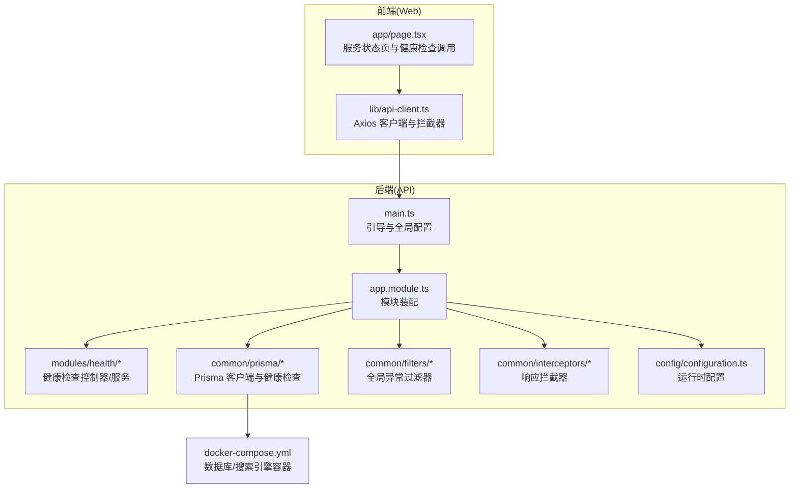
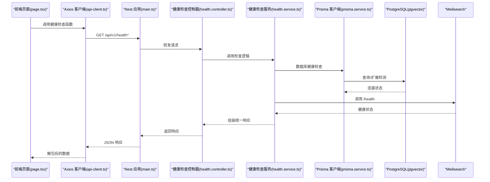
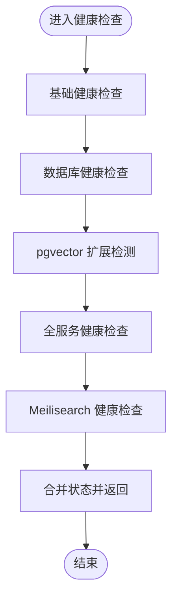
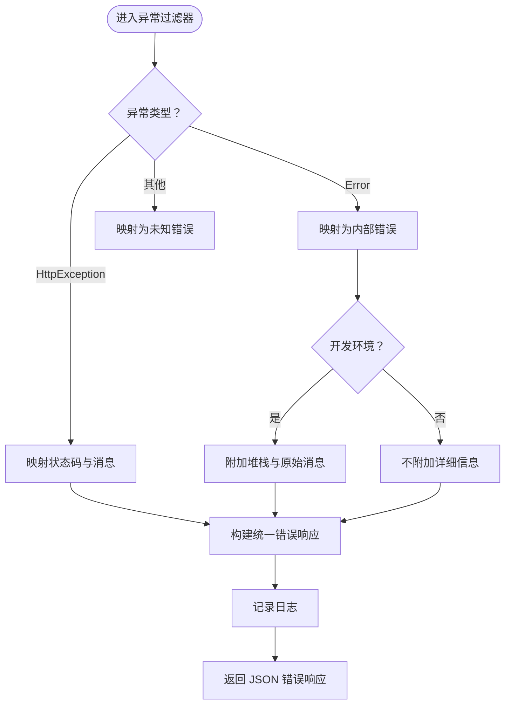
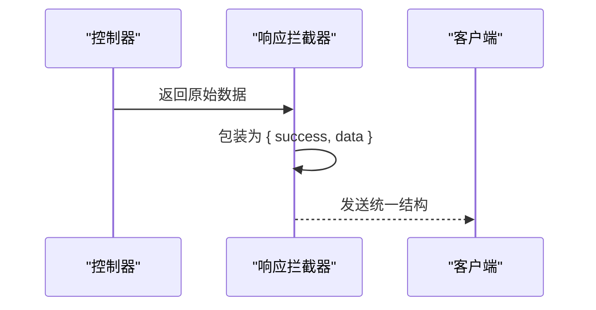
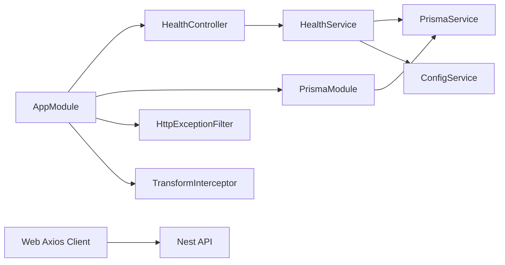

# 系统监控

<cite>
**本文引用的文件**
- [apps/api/src/modules/health/health.controller.ts](file://apps/api/src/modules/health/health.controller.ts)
- [apps/api/src/modules/health/health.service.ts](file://apps/api/src/modules/health/health.service.ts)
- [apps/api/src/common/filters/http-exception.filter.ts](file://apps/api/src/common/filters/http-exception.filter.ts)
- [apps/api/src/common/interceptors/transform.interceptor.ts](file://apps/api/src/common/interceptors/transform.interceptor.ts)
- [apps/api/src/app.module.ts](file://apps/api/src/app.module.ts)
- [apps/api/src/main.ts](file://apps/api/src/main.ts)
- [apps/api/src/config/configuration.ts](file://apps/api/src/config/configuration.ts)
- [apps/api/src/common/prisma/prisma.service.ts](file://apps/api/src/common/prisma/prisma.service.ts)
- [apps/api/src/common/prisma/prisma.module.ts](file://apps/api/src/common/prisma/prisma.module.ts)
- [docker-compose.yml](file://docker-compose.yml)
- [apps/web/lib/api-client.ts](file://apps/web/lib/api-client.ts)
- [apps/web/app/page.tsx](file://apps/web/app/page.tsx)
- [package.json](file://package.json)
- [turbo.json](file://turbo.json)
</cite>

## 目录
1. [简介](#简介)
2. [项目结构](#项目结构)
3. [核心组件](#核心组件)
4. [架构总览](#架构总览)
5. [详细组件分析](#详细组件分析)
6. [依赖关系分析](#依赖关系分析)
7. [性能与监控最佳实践](#性能与监控最佳实践)
8. [故障排查指南](#故障排查指南)
9. [结论](#结论)
10. [附录](#附录)

## 简介
本文件面向 APP2 项目的系统监控与健康检查，聚焦以下目标：
- 健康检查 API 的实现与调用链路
- 全局异常过滤器与响应拦截器的设计与统一错误/响应格式
- 监控指标收集机制与日志策略
- 性能监控最佳实践（日志、指标、告警）
- 开发与生产环境的监控差异与配置要点
- 故障排查与常见问题诊断
- 监控工具集成与可视化方案

## 项目结构
后端采用 NestJS，前端采用 Next.js，通过统一的健康检查接口对外暴露服务状态，并由前端页面进行聚合展示。

图表来源
- [apps/api/src/main.ts](file://apps/api/src/main.ts#L1-L61)
- [apps/api/src/app.module.ts](file://apps/api/src/app.module.ts#L1-L83)
- [apps/api/src/modules/health/health.controller.ts](file://apps/api/src/modules/health/health.controller.ts#L1-L31)
- [apps/api/src/modules/health/health.service.ts](file://apps/api/src/modules/health/health.service.ts#L1-L96)
- [apps/api/src/common/prisma/prisma.service.ts](file://apps/api/src/common/prisma/prisma.service.ts#L1-L69)
- [apps/api/src/common/filters/http-exception.filter.ts](file://apps/api/src/common/filters/http-exception.filter.ts#L1-L76)
- [apps/api/src/common/interceptors/transform.interceptor.ts](file://apps/api/src/common/interceptors/transform.interceptor.ts#L1-L26)
- [apps/api/src/config/configuration.ts](file://apps/api/src/config/configuration.ts#L1-L30)
- [apps/web/lib/api-client.ts](file://apps/web/lib/api-client.ts#L1-L84)
- [apps/web/app/page.tsx](file://apps/web/app/page.tsx#L56-L185)
- [docker-compose.yml](file://docker-compose.yml#L1-L53)

章节来源
- [apps/api/src/main.ts](file://apps/api/src/main.ts#L1-L61)
- [apps/api/src/app.module.ts](file://apps/api/src/app.module.ts#L1-L83)
- [apps/api/src/config/configuration.ts](file://apps/api/src/config/configuration.ts#L1-L30)
- [docker-compose.yml](file://docker-compose.yml#L1-L53)

## 核心组件
- 健康检查模块：提供基础健康、数据库健康、全服务健康三个端点，统一返回结构，便于前端聚合展示。
- 全局异常过滤器：捕获未处理异常，输出统一错误响应，区分开发/生产环境细节。
- 响应拦截器：对所有成功响应进行包装，统一 success/data 结构，简化前端处理。
- 配置模块：集中读取环境变量，支持数据库、搜索引擎、CORS 等配置。
- Prisma 客户端：封装数据库连接健康检查与扩展检测，支撑健康检查。
- 前端客户端：Axios 封装，自动解包 data.data，统一错误日志；调用后端健康检查接口。

章节来源
- [apps/api/src/modules/health/health.controller.ts](file://apps/api/src/modules/health/health.controller.ts#L1-L31)
- [apps/api/src/modules/health/health.service.ts](file://apps/api/src/modules/health/health.service.ts#L1-L96)
- [apps/api/src/common/filters/http-exception.filter.ts](file://apps/api/src/common/filters/http-exception.filter.ts#L1-L76)
- [apps/api/src/common/interceptors/transform.interceptor.ts](file://apps/api/src/common/interceptors/transform.interceptor.ts#L1-L26)
- [apps/api/src/common/prisma/prisma.service.ts](file://apps/api/src/common/prisma/prisma.service.ts#L1-L69)
- [apps/api/src/config/configuration.ts](file://apps/api/src/config/configuration.ts#L1-L30)
- [apps/web/lib/api-client.ts](file://apps/web/lib/api-client.ts#L1-L84)

## 架构总览
后端通过引导文件注册全局配置、版本化、CORS、Swagger、过滤器与拦截器；健康检查模块作为独立子域提供状态查询；前端通过 Axios 客户端发起请求并展示状态。

图表来源
- [apps/api/src/main.ts](file://apps/api/src/main.ts#L1-L61)
- [apps/api/src/modules/health/health.controller.ts](file://apps/api/src/modules/health/health.controller.ts#L1-L31)
- [apps/api/src/modules/health/health.service.ts](file://apps/api/src/modules/health/health.service.ts#L1-L96)
- [apps/api/src/common/prisma/prisma.service.ts](file://apps/api/src/common/prisma/prisma.service.ts#L1-L69)
- [apps/web/lib/api-client.ts](file://apps/web/lib/api-client.ts#L1-L84)
- [apps/web/app/page.tsx](file://apps/web/app/page.tsx#L56-L185)

## 详细组件分析

### 健康检查 API 设计与实现
- 端点设计
  - GET /api/v1/health：基础健康，返回服务状态、时间戳与运行时长
  - GET /api/v1/health/db：数据库健康，返回数据库连接与 pgvector 扩展状态
  - GET /api/v1/health/services：全服务健康，聚合 API、数据库、搜索引擎状态
- 实现要点
  - 控制器仅转发调用至服务层
  - 服务层使用 Prisma 进行数据库连通性与扩展检测；使用 fetch 访问 Meilisearch /health
  - 统一返回结构，便于前端聚合展示
- 前端集成
  - 前端页面在加载时调用健康检查接口，渲染整体与各子服务状态
  - Axios 客户端自动解包 data.data，统一错误日志

图表来源
- [apps/api/src/modules/health/health.controller.ts](file://apps/api/src/modules/health/health.controller.ts#L1-L31)
- [apps/api/src/modules/health/health.service.ts](file://apps/api/src/modules/health/health.service.ts#L1-L96)

章节来源
- [apps/api/src/modules/health/health.controller.ts](file://apps/api/src/modules/health/health.controller.ts#L1-L31)
- [apps/api/src/modules/health/health.service.ts](file://apps/api/src/modules/health/health.service.ts#L1-L96)
- [apps/web/lib/api-client.ts](file://apps/web/lib/api-client.ts#L64-L83)
- [apps/web/app/page.tsx](file://apps/web/app/page.tsx#L56-L185)

### 全局异常过滤器设计原理
- 捕获范围：捕获所有未处理异常，兼容 HttpException 与未知异常
- 错误映射
  - HttpException：按其响应结构提取 message/error/details
  - Error：统一映射为内部错误，开发环境附加堆栈与原始消息
  - 其他：统一映射为未知错误
- 统一响应字段：success、statusCode、message、error、details、timestamp、path
- 日志策略：记录异常信息与堆栈，便于定位问题

图表来源
- [apps/api/src/common/filters/http-exception.filter.ts](file://apps/api/src/common/filters/http-exception.filter.ts#L1-L76)

章节来源
- [apps/api/src/common/filters/http-exception.filter.ts](file://apps/api/src/common/filters/http-exception.filter.ts#L1-L76)

### 响应拦截器设计原理
- 功能：对所有成功响应进行包装，统一 success/data 结构
- 适用范围：除异常外的所有控制器返回
- 前端收益：无需关心后端是否直接返回对象或数组，始终拿到 { success, data }

图表来源
- [apps/api/src/common/interceptors/transform.interceptor.ts](file://apps/api/src/common/interceptors/transform.interceptor.ts#L1-L26)

章节来源
- [apps/api/src/common/interceptors/transform.interceptor.ts](file://apps/api/src/common/interceptors/transform.interceptor.ts#L1-L26)

### 监控指标与日志策略
- 健康检查指标
  - API 状态：ok/degraded/error
  - 数据库状态：connected/disconnected + pgvector 扩展状态
  - 搜索引擎状态：connected/HTTP 错误/超时
- 日志策略
  - 数据库连接：Prisma 在初始化/销毁阶段记录连接状态
  - 健康检查：数据库失败记录错误；搜索引擎失败记录警告
  - 异常：全局过滤器记录异常与堆栈
- 前端展示：前端页面聚合后端返回的服务状态，直观呈现

章节来源
- [apps/api/src/common/prisma/prisma.service.ts](file://apps/api/src/common/prisma/prisma.service.ts#L1-L69)
- [apps/api/src/modules/health/health.service.ts](file://apps/api/src/modules/health/health.service.ts#L1-L96)
- [apps/api/src/common/filters/http-exception.filter.ts](file://apps/api/src/common/filters/http-exception.filter.ts#L1-L76)
- [apps/web/app/page.tsx](file://apps/web/app/page.tsx#L56-L185)

### 配置与环境差异
- 配置来源：ConfigModule 加载 configuration.ts，支持 DATABASE_URL、MEILI_HOST、AI_*、CORS 等
- 环境差异
  - 开发环境：Prisma 输出 query/info/warn/error；Swagger 文档启用；异常过滤器可输出详细信息
  - 生产环境：Prisma 仅输出 warn/error；Swagger 文档禁用；异常过滤器不输出详细信息
- 前缀与版本：全局前缀 api；URI 版本化默认 v1

章节来源
- [apps/api/src/config/configuration.ts](file://apps/api/src/config/configuration.ts#L1-L30)
- [apps/api/src/common/prisma/prisma.service.ts](file://apps/api/src/common/prisma/prisma.service.ts#L1-L69)
- [apps/api/src/main.ts](file://apps/api/src/main.ts#L1-L61)

## 依赖关系分析
- 模块耦合
  - AppModule 装配健康检查模块、Prisma 模块、全局过滤器与拦截器
  - HealthController 依赖 HealthService；HealthService 依赖 PrismaService 与 ConfigService
  - PrismaModule 为全局单例，PrismaService 提供 healthCheck 与扩展检测
- 外部依赖
  - PostgreSQL（pgvector 扩展）与 Meilisearch 通过健康检查进行连通性验证
- 前端依赖
  - Axios 客户端负责请求/响应拦截与错误日志

图表来源
- [apps/api/src/app.module.ts](file://apps/api/src/app.module.ts#L1-L83)
- [apps/api/src/modules/health/health.controller.ts](file://apps/api/src/modules/health/health.controller.ts#L1-L31)
- [apps/api/src/modules/health/health.service.ts](file://apps/api/src/modules/health/health.service.ts#L1-L96)
- [apps/api/src/common/prisma/prisma.module.ts](file://apps/api/src/common/prisma/prisma.module.ts#L1-L10)
- [apps/api/src/common/prisma/prisma.service.ts](file://apps/api/src/common/prisma/prisma.service.ts#L1-L69)
- [apps/web/lib/api-client.ts](file://apps/web/lib/api-client.ts#L1-L84)

章节来源
- [apps/api/src/app.module.ts](file://apps/api/src/app.module.ts#L1-L83)
- [apps/api/src/common/prisma/prisma.module.ts](file://apps/api/src/common/prisma/prisma.module.ts#L1-L10)

## 性能与监控最佳实践
- 日志级别与输出
  - 开发：开启 query/info/warn/error，便于调试 SQL 与性能瓶颈
  - 生产：仅 warn/error，降低 IO 压力
- 健康检查频率
  - 前端建议轮询间隔 10–30 秒，避免频繁探测造成压力
- 超时与重试
  - 健康检查对搜索引擎设置 5 秒超时；网络异常时快速失败
- 指标采集
  - 建议引入 Prometheus/Grafana 或云厂商监控，采集：请求量、错误率、响应时间、数据库连接数、pgvector 使用情况
- 告警策略
  - API/数据库/搜索引擎任一降级触发告警；连续失败阈值触发升级告警
- 配置热更新
  - 通过环境变量与 ConfigService 动态读取，避免重启变更配置

章节来源
- [apps/api/src/common/prisma/prisma.service.ts](file://apps/api/src/common/prisma/prisma.service.ts#L1-L69)
- [apps/api/src/modules/health/health.service.ts](file://apps/api/src/modules/health/health.service.ts#L70-L94)
- [apps/api/src/main.ts](file://apps/api/src/main.ts#L42-L51)

## 故障排查指南
- 无法访问健康检查
  - 检查后端是否监听端口与全局前缀是否正确
  - 检查 CORS 配置与浏览器跨域限制
- 数据库不可达
  - 查看 Prisma 初始化日志与连接状态
  - 确认数据库容器健康与 pgvector 扩展存在
- 搜索引擎不可达
  - 检查 Meilisearch 容器健康与 /health 接口可用性
  - 核对 MEILI_HOST 与超时设置
- 异常未统一格式
  - 确认全局过滤器已注册
  - 检查开发/生产环境 NODE_ENV 与异常详情输出策略
- 前端状态不一致
  - 检查 Axios 客户端是否正确解包 data.data
  - 核对 API URL 与版本路径

章节来源
- [apps/api/src/main.ts](file://apps/api/src/main.ts#L35-L51)
- [apps/api/src/common/prisma/prisma.service.ts](file://apps/api/src/common/prisma/prisma.service.ts#L25-L41)
- [apps/api/src/modules/health/health.service.ts](file://apps/api/src/modules/health/health.service.ts#L70-L94)
- [apps/api/src/common/filters/http-exception.filter.ts](file://apps/api/src/common/filters/http-exception.filter.ts#L46-L52)
- [apps/web/lib/api-client.ts](file://apps/web/lib/api-client.ts#L32-L55)

## 结论
APP2 的监控体系以“健康检查 + 统一响应/异常处理 + 配置驱动”为核心，既满足前端直观展示，又便于生产环境稳定运行。建议在此基础上补充指标采集与告警，形成闭环监控。

## 附录

### 健康检查端点一览
- GET /api/v1/health：基础健康
- GET /api/v1/health/db：数据库健康
- GET /api/v1/health/services：全服务健康

章节来源
- [apps/api/src/modules/health/health.controller.ts](file://apps/api/src/modules/health/health.controller.ts#L10-L29)

### 开发与生产环境差异对照
- Prisma 日志级别：开发包含 query/info，生产仅 warn/error
- Swagger：非生产环境启用
- 异常详情：开发环境输出堆栈，生产环境不输出
- 全局前缀与版本：均启用

章节来源
- [apps/api/src/common/prisma/prisma.service.ts](file://apps/api/src/common/prisma/prisma.service.ts#L8-L22)
- [apps/api/src/main.ts](file://apps/api/src/main.ts#L42-L51)
- [apps/api/src/common/filters/http-exception.filter.ts](file://apps/api/src/common/filters/http-exception.filter.ts#L46-L52)

### 监控工具集成与可视化建议
- 指标采集
  - 使用 Prometheus 抓取 /metrics（需在应用中暴露指标端点）
  - Grafana 展示：API 状态面板、数据库连接面板、搜索引擎健康面板
- 日志采集
  - 结合应用日志与容器日志，集中存储于 ELK 或 Loki
- 告警
  - 基于阈值与趋势的告警规则，结合企业微信/钉钉推送

[本节为通用实践建议，不直接分析具体源文件]