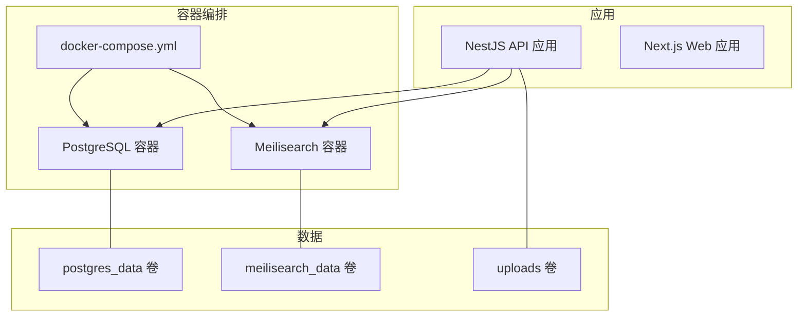
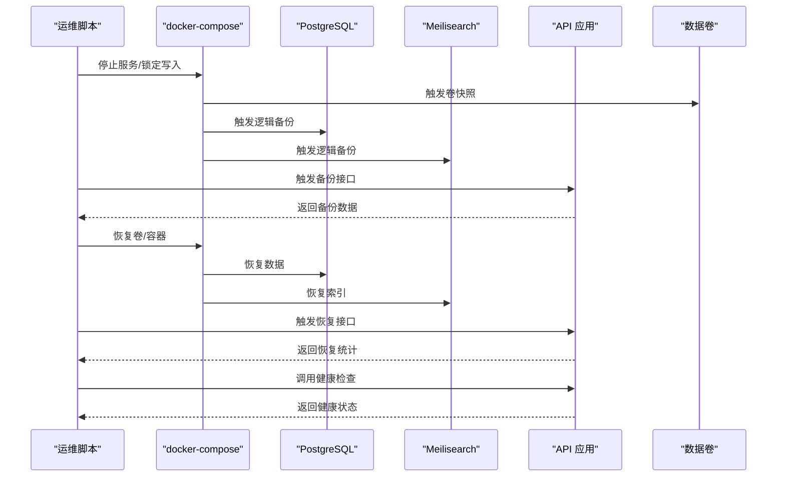
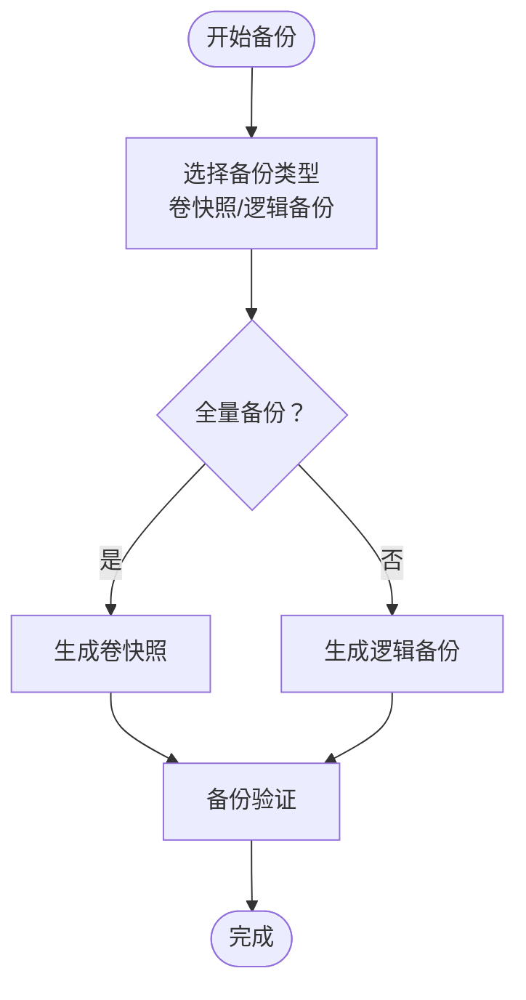
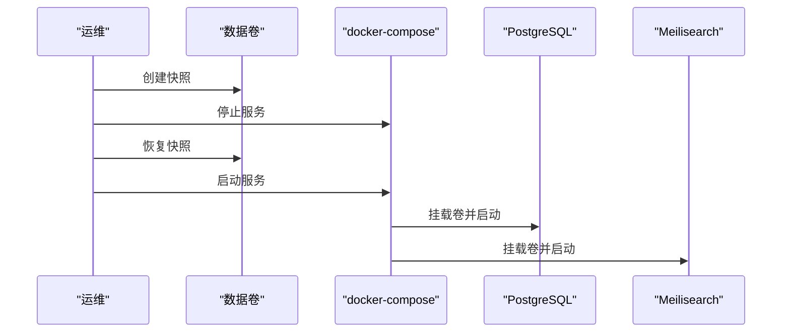
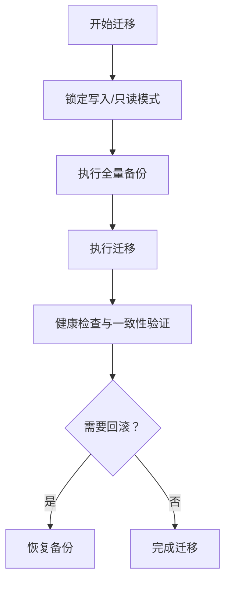
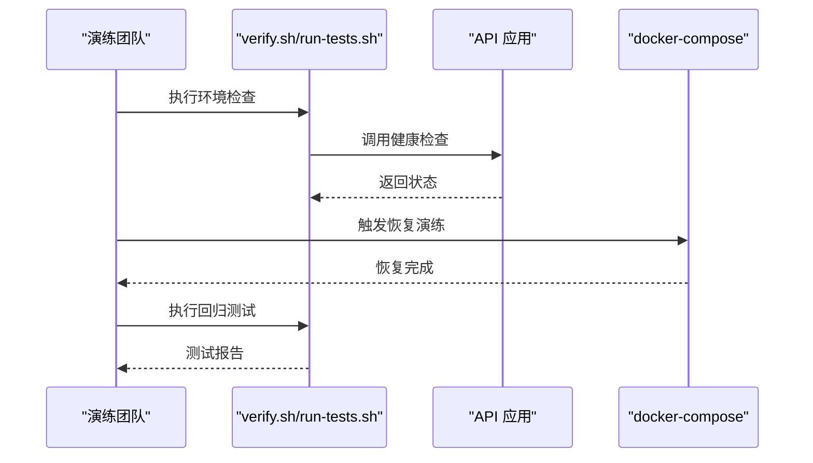
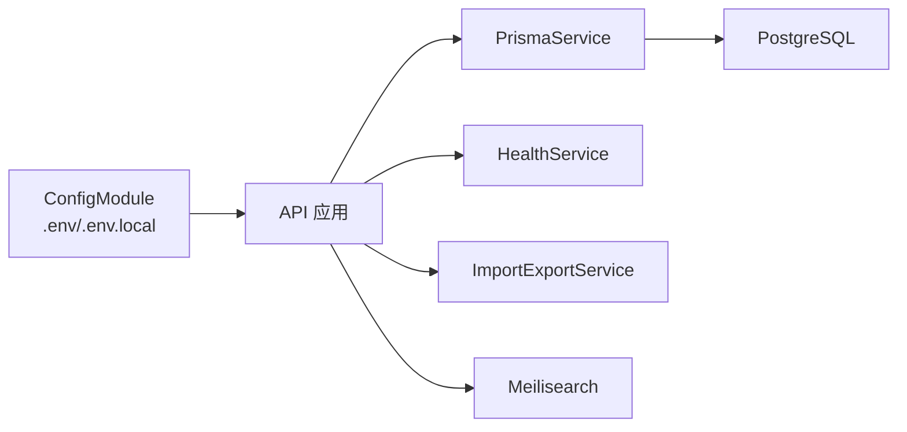

# 备份与灾难恢复

<cite>
**本文引用的文件**
- [docker-compose.yml](file://docker-compose.yml)
- [init.sql](file://docker/postgres/init.sql)
- [schema.prisma](file://apps/api/prisma/schema.prisma)
- [configuration.ts](file://apps/api/src/config/configuration.ts)
- [import-export.service.ts](file://apps/api/src/modules/import-export/import-export.service.ts)
- [import-export.controller.ts](file://apps/api/src/modules/import-export/import-export.controller.ts)
- [import-export.dto.ts](file://apps/api/src/modules/import-export/dto/import-export.dto.ts)
- [health.controller.ts](file://apps/api/src/modules/health/health.controller.ts)
- [health.service.ts](file://apps/api/src/modules/health/health.service.ts)
- [app.module.ts](file://apps/api/src/app.module.ts)
- [main.ts](file://apps/api/src/main.ts)
- [run-tests.sh](file://scripts/run-tests.sh)
- [verify.sh](file://scripts/verify.sh)
- [package.json](file://package.json)
- [images.service.ts](file://apps/api/src/modules/images/images.service.ts)
- [IMAGE_UPLOAD_IMPLEMENTATION.md](file://docs/IMAGE_UPLOAD_IMPLEMENTATION.md)
- [phase1-3c-spec.md](file://specs/phase1-3c-spec.md)
- [migration_lock.toml](file://apps/api/prisma/migrations/migration_lock.toml)
- [20260308143313_migration.sql](file://apps/api/prisma/migrations/20260308143313_/migration.sql)
</cite>

## 目录
1. [简介](#简介)
2. [项目结构](#项目结构)
3. [核心组件](#核心组件)
4. [架构总览](#架构总览)
5. [详细组件分析](#详细组件分析)
6. [依赖分析](#依赖分析)
7. [性能考虑](#性能考虑)
8. [故障排查指南](#故障排查指南)
9. [结论](#结论)
10. [附录](#附录)

## 简介
本文件面向 APP2 项目，提供系统化的备份与灾难恢复方案，覆盖数据库全量/增量备份与验证、数据卷持久化保护、配置与环境变量管理、灾难恢复计划与业务连续性保障、数据迁移与版本升级的备份策略、恢复演练与故障模拟实施、以及数据一致性检查与恢复验证方法。方案以现有代码库为基础，结合容器化部署与 Prisma 数据模型，形成可执行、可验证的运维实践。

## 项目结构
APP2 采用多包工作区与容器编排方式：
- 应用层分为 API 与 Web 两部分，API 使用 NestJS + Prisma，Web 使用 Next.js。
- 数据层由 PostgreSQL（含 pgvector 扩展）与 Meilisearch 组成，通过 docker-compose 管理。
- 配置通过 NestJS 的 ConfigModule 加载，支持 .env 与 .env.local。
- 上传的图片等静态资源位于宿主机卷，映射到容器内 uploads 目录。

图表来源
- [docker-compose.yml](file://docker-compose.yml#L1-L53)
- [app.module.ts](file://apps/api/src/app.module.ts#L42-L48)

章节来源
- [docker-compose.yml](file://docker-compose.yml#L1-L53)
- [app.module.ts](file://apps/api/src/app.module.ts#L42-L48)

## 核心组件
- 数据库与索引
  - PostgreSQL（pgvector 扩展）承载结构化数据与向量索引；初始化脚本确保扩展可用。
  - Meilisearch 提供全文检索能力。
- 应用与配置
  - API 应用通过 ConfigModule 注入 DATABASE_URL、Meilisearch 主机与密钥、AI 相关参数等。
  - Web 应用通过 Next.js 构建，静态资源挂载 uploads。
- 导入导出与备份
  - API 提供统一的备份与恢复接口，支持按实体维度选择性导出/导入。
- 健康检查
  - API 提供基础健康、数据库健康、服务总览健康接口，便于自动化巡检与恢复后验证。

章节来源
- [schema.prisma](file://apps/api/prisma/schema.prisma#L1-L276)
- [init.sql](file://docker/postgres/init.sql#L1-L26)
- [configuration.ts](file://apps/api/src/config/configuration.ts#L1-L30)
- [health.controller.ts](file://apps/api/src/modules/health/health.controller.ts#L1-L31)
- [health.service.ts](file://apps/api/src/modules/health/health.service.ts#L1-L96)
- [import-export.controller.ts](file://apps/api/src/modules/import-export/import-export.controller.ts#L125-L137)
- [import-export.service.ts](file://apps/api/src/modules/import-export/import-export.service.ts#L338-L462)

## 架构总览
APP2 的备份与恢复涉及以下关键路径：
- 数据库备份：基于容器卷快照与逻辑备份（SQL/自定义格式）相结合。
- 搜索引擎备份：基于 Meilisearch 数据目录卷快照。
- 静态资源备份：基于 uploads 卷快照。
- 配置与环境变量：集中于 .env 与 .env.local，配合 API 配置加载。
- 恢复验证：通过健康检查与导入导出接口进行一致性校验。

图表来源
- [docker-compose.yml](file://docker-compose.yml#L1-L53)
- [import-export.controller.ts](file://apps/api/src/modules/import-export/import-export.controller.ts#L125-L137)
- [health.controller.ts](file://apps/api/src/modules/health/health.controller.ts#L17-L29)

## 详细组件分析

### 数据库备份策略（PostgreSQL + pgvector）
- 全量备份
  - 方案一：容器卷快照（推荐用于生产）——利用 docker volume 快照或底层存储快照，实现秒级回滚。
  - 方案二：逻辑备份（SQL/自定义格式）——通过 API 备份接口导出结构化数据，或使用 pg_dump。
- 增量备份
  - PostgreSQL 无原生增量备份工具链，建议结合 WAL 归档与时间点恢复（RPO/RTO 严格场景）。
  - 若无法启用 WAL，可在业务低峰期进行周期性全量备份，并对重要表做“伪增量”（仅导出变更时间窗口内的记录）。
- 备份验证
  - 使用健康检查接口验证数据库连通性与 pgvector 扩展状态。
  - 通过导入导出接口进行抽样恢复与一致性比对。

图表来源
- [docker-compose.yml](file://docker-compose.yml#L14-L26)
- [health.service.ts](file://apps/api/src/modules/health/health.service.ts#L28-L46)
- [import-export.controller.ts](file://apps/api/src/modules/import-export/import-export.controller.ts#L125-L137)

章节来源
- [docker-compose.yml](file://docker-compose.yml#L14-L26)
- [schema.prisma](file://apps/api/prisma/schema.prisma#L1-L276)
- [init.sql](file://docker/postgres/init.sql#L1-L26)
- [health.service.ts](file://apps/api/src/modules/health/health.service.ts#L28-L46)
- [import-export.controller.ts](file://apps/api/src/modules/import-export/import-export.controller.ts#L125-L137)

### 数据卷备份与恢复（PostgreSQL、Meilisearch、uploads）
- 卷定位
  - postgres_data：PostgreSQL 数据目录。
  - meilisearch_data：Meilisearch 索引目录。
  - uploads：API 上传的图片等静态资源。
- 备份
  - 卷快照：在停止写入或只读模式下触发快照，确保一致性。
  - 备份介质：本地磁盘、对象存储或网络存储，建议异地容灾。
- 恢复
  - 恢复卷后重启容器，确保数据目录权限与用户一致。
  - 如需跨主机恢复，先创建同名卷并注入数据，再启动容器。

图表来源
- [docker-compose.yml](file://docker-compose.yml#L50-L53)

章节来源
- [docker-compose.yml](file://docker-compose.yml#L50-L53)
- [images.service.ts](file://apps/api/src/modules/images/images.service.ts#L47-L59)

### 配置文件与环境变量备份管理
- 配置来源
  - API 通过 ConfigModule 加载 .env 与 .env.local，支持 DATABASE_URL、Meilisearch 主机与密钥、AI 相关参数等。
- 备份策略
  - 将 .env 与 .env.local 纳入版本控制（敏感信息使用密钥管理），定期导出备份。
  - 在升级或迁移前后，保留当前配置快照以便回滚。
- 环境隔离
  - 不同环境（开发/测试/生产）使用不同 .env 文件，避免误操作。

章节来源
- [app.module.ts](file://apps/api/src/app.module.ts#L27-L31)
- [configuration.ts](file://apps/api/src/config/configuration.ts#L1-L30)

### 灾难恢复计划与业务连续性
- RTO/RPO 目标
  - 生产环境建议：RTO<15min，RPO<5min（结合 WAL+快照）。
- 角色与职责
  - 运维团队负责备份与恢复执行；开发团队负责验证与修复；管理层负责资源与预算。
- 恢复优先级
  - 业务连续性：Meilisearch → API → PostgreSQL → 静态资源。
- 通知与审计
  - 恢复过程记录日志，事件上报至监控系统。

章节来源
- [health.controller.ts](file://apps/api/src/modules/health/health.controller.ts#L17-L29)
- [health.service.ts](file://apps/api/src/modules/health/health.service.ts#L51-L66)

### 数据迁移与版本升级的备份策略
- 迁移前
  - 执行一次全量备份（卷快照+逻辑备份）。
  - 记录当前 schema 版本与迁移锁状态。
- 迁移中
  - 保持只读或降级服务，避免 schema 变更期间的数据写入。
- 迁移后
  - 使用健康检查与导入导出接口进行一致性验证。
  - 回归测试脚本验证功能正常。

图表来源
- [migration_lock.toml](file://apps/api/prisma/migrations/migration_lock.toml#L1-L3)
- [20260308143313_migration.sql](file://apps/api/prisma/migrations/20260308143313_/migration.sql#L1-L152)
- [health.controller.ts](file://apps/api/src/modules/health/health.controller.ts#L17-L29)
- [import-export.controller.ts](file://apps/api/src/modules/import-export/import-export.controller.ts#L125-L137)

章节来源
- [migration_lock.toml](file://apps/api/prisma/migrations/migration_lock.toml#L1-L3)
- [20260308143313_migration.sql](file://apps/api/prisma/migrations/20260308143313_/migration.sql#L1-L152)
- [health.controller.ts](file://apps/api/src/modules/health/health.controller.ts#L17-L29)
- [import-export.controller.ts](file://apps/api/src/modules/import-export/import-export.controller.ts#L125-L137)

### 恢复演练与故障模拟实施方案
- 演练类型
  - 卷快照回滚演练：验证容器重启与数据恢复。
  - 逻辑备份恢复演练：验证 API 备份/恢复接口。
  - 故障模拟：断电/网络分区/数据库崩溃，观察自动重启与健康检查。
- 工具与脚本
  - 使用 verify.sh 进行环境与服务健康检查。
  - 使用 run-tests.sh 进行回归测试与报告生成。
- 演练频率
  - 至少每季度一次完整演练，重大变更后立即演练。

图表来源
- [verify.sh](file://scripts/verify.sh#L1-L160)
- [run-tests.sh](file://scripts/run-tests.sh#L1-L176)
- [health.controller.ts](file://apps/api/src/modules/health/health.controller.ts#L17-L29)

章节来源
- [verify.sh](file://scripts/verify.sh#L1-L160)
- [run-tests.sh](file://scripts/run-tests.sh#L1-L176)
- [health.controller.ts](file://apps/api/src/modules/health/health.controller.ts#L17-L29)

### 数据一致性检查与恢复验证
- 健康检查
  - 基础健康：返回服务状态与运行时信息。
  - 数据库健康：检查连接与 pgvector 扩展状态。
  - 服务总览：聚合 API、数据库、搜索引擎状态。
- 一致性验证
  - 通过导入导出接口导出抽样数据，恢复到独立实例，比对数量与关键字段。
  - 使用 Swagger 文档验证端点可用性与响应格式。

章节来源
- [health.controller.ts](file://apps/api/src/modules/health/health.controller.ts#L10-L30)
- [health.service.ts](file://apps/api/src/modules/health/health.service.ts#L28-L66)
- [main.ts](file://apps/api/src/main.ts#L42-L51)
- [import-export.controller.ts](file://apps/api/src/modules/import-export/import-export.controller.ts#L125-L137)

## 依赖分析
- 组件耦合
  - API 应用依赖 ConfigModule 获取数据库与搜索引擎配置。
  - 健康检查模块依赖 PrismaService 与 ConfigService。
  - 导入导出模块依赖 PrismaService 并通过事务保证原子性。
- 外部依赖
  - PostgreSQL（pgvector）、Meilisearch、Docker Compose。
- 潜在风险
  - 配置泄露：.env 文件需妥善保管。
  - 卷一致性：恢复时需确保容器内用户与权限正确。

图表来源
- [app.module.ts](file://apps/api/src/app.module.ts#L27-L31)
- [configuration.ts](file://apps/api/src/config/configuration.ts#L1-L30)
- [health.service.ts](file://apps/api/src/modules/health/health.service.ts#L9-L12)
- [import-export.service.ts](file://apps/api/src/modules/import-export/import-export.service.ts#L58-L61)

章节来源
- [app.module.ts](file://apps/api/src/app.module.ts#L27-L31)
- [configuration.ts](file://apps/api/src/config/configuration.ts#L1-L30)
- [health.service.ts](file://apps/api/src/modules/health/health.service.ts#L9-L12)
- [import-export.service.ts](file://apps/api/src/modules/import-export/import-export.service.ts#L58-L61)

## 性能考虑
- 备份窗口
  - 卷快照几乎无性能影响；逻辑备份应安排在业务低峰。
- 并发控制
  - 迁移与备份期间限制写入，必要时降级服务。
- 存储与传输
  - 使用压缩与分片，优化备份与恢复速度。
- 监控告警
  - 对备份任务与恢复演练设置监控与告警。

## 故障排查指南
- 常见问题
  - 容器无法启动：检查卷权限与数据目录所有权。
  - 数据库不可达：使用健康检查接口定位连接与扩展状态。
  - 恢复后功能异常：执行回归测试脚本与一致性验证。
- 工具与入口
  - verify.sh：一键环境与服务检查。
  - run-tests.sh：执行单元与端到端测试并生成报告。
  - Swagger 文档：在线验证 API 行为。

章节来源
- [verify.sh](file://scripts/verify.sh#L76-L115)
- [run-tests.sh](file://scripts/run-tests.sh#L72-L135)
- [main.ts](file://apps/api/src/main.ts#L42-L51)

## 结论
APP2 的备份与灾难恢复方案以“卷快照+逻辑备份”为核心，结合 API 的备份/恢复接口与健康检查机制，形成可落地、可验证的闭环。通过定期演练与严格的配置管理，可有效保障业务连续性与数据安全。

## 附录
- 快速参考
  - 启动/停止容器：使用 docker compose。
  - 数据库迁移：使用 Prisma CLI。
  - 验证环境：使用 verify.sh。
  - 回归测试：使用 run-tests.sh。
- 相关端点
  - 健康检查：GET /api/health, /api/health/db, /api/health/services
  - 备份/恢复：POST /api/import-export/backup, POST /api/import-export/restore, POST /api/import-export/restore-file

章节来源
- [docker-compose.yml](file://docker-compose.yml#L16-L26)
- [package.json](file://package.json#L12-L18)
- [verify.sh](file://scripts/verify.sh#L108-L127)
- [run-tests.sh](file://scripts/run-tests.sh#L110-L135)
- [health.controller.ts](file://apps/api/src/modules/health/health.controller.ts#L10-L29)
- [import-export.controller.ts](file://apps/api/src/modules/import-export/import-export.controller.ts#L125-L137)