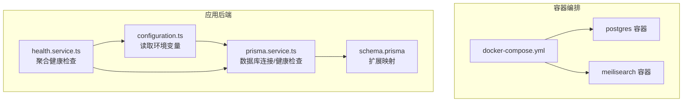
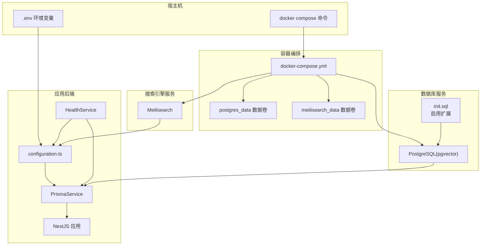
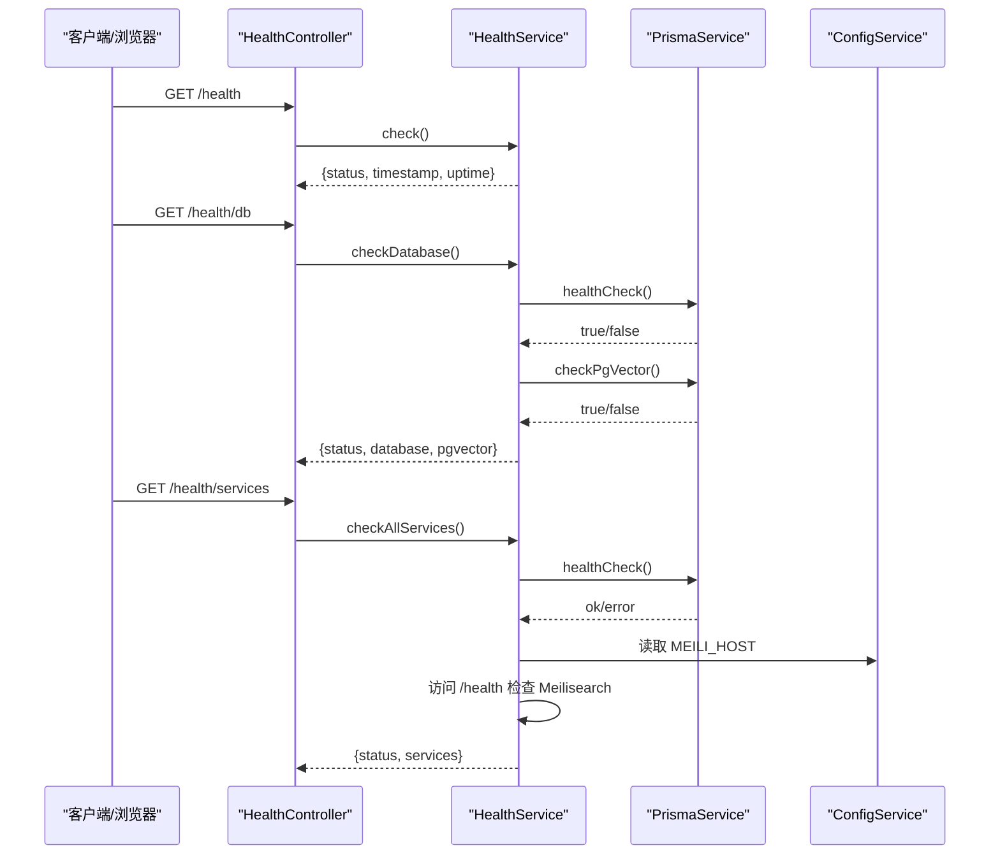
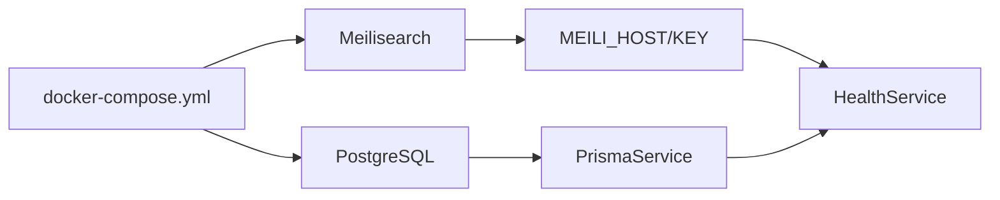
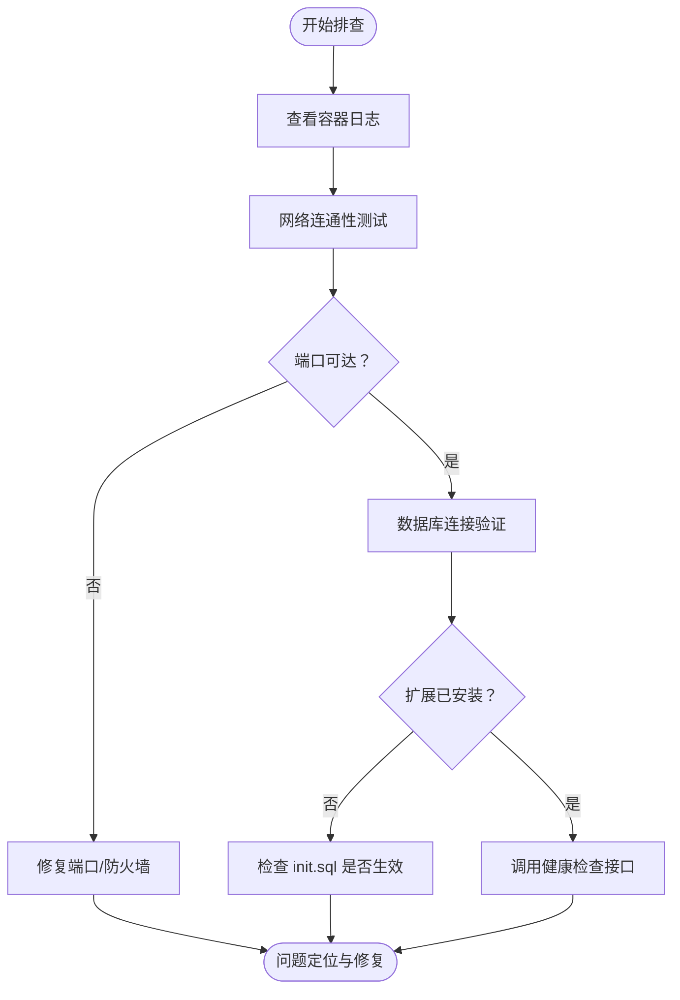

# 容器化部署

<cite>
**本文引用的文件**
- [docker-compose.yml](file://docker-compose.yml)
- [init.sql](file://docker/postgres/init.sql)
- [configuration.ts](file://apps/api/src/config/configuration.ts)
- [prisma.service.ts](file://apps/api/src/common/prisma/prisma.service.ts)
- [schema.prisma](file://apps/api/prisma/schema.prisma)
- [health.controller.ts](file://apps/api/src/modules/health/health.controller.ts)
- [health.service.ts](file://apps/api/src/modules/health/health.service.ts)
- [package.json](file://package.json)
- [verify.sh](file://scripts/verify.sh)
- [.env.example](file://specs/knowledge-base-phase0-spec.md)
- [phase0-summary.md](file://specs/phase0-summary.md)
</cite>

## 目录
1. [简介](#简介)
2. [项目结构](#项目结构)
3. [核心组件](#核心组件)
4. [架构总览](#架构总览)
5. [详细组件分析](#详细组件分析)
6. [依赖关系分析](#依赖关系分析)
7. [性能考虑](#性能考虑)
8. [故障排查指南](#故障排查指南)
9. [结论](#结论)
10. [附录](#附录)

## 简介
本文件面向 APP2 项目的容器化部署，聚焦于使用 Docker Compose 编排 PostgreSQL 与 Meilisearch 两大基础设施服务，并结合应用后端的健康检查机制与资源限制策略，提供从环境准备、配置说明、启动顺序、网络与数据卷挂载到故障排查的完整实践指南。

## 项目结构
APP2 采用多包工作区结构，容器化部署主要涉及以下关键位置：
- docker-compose.yml：定义 PostgreSQL 与 Meilisearch 服务及其资源限制、健康检查与重启策略
- docker/postgres/init.sql：初始化数据库扩展（pgvector、uuid-ossp）
- apps/api/src/config/configuration.ts：后端读取数据库与搜索引擎等外部服务的配置
- apps/api/src/common/prisma/prisma.service.ts：数据库连接与健康检查能力
- apps/api/prisma/schema.prisma：数据库模型与扩展映射
- apps/api/src/modules/health/health.*：健康检查接口与服务状态聚合
- scripts/verify.sh：容器与服务可用性验证脚本
- package.json：提供 docker:up / docker:down 等常用脚本

图表来源
- [docker-compose.yml](file://docker-compose.yml#L1-L53)
- [configuration.ts](file://apps/api/src/config/configuration.ts#L1-L30)
- [prisma.service.ts](file://apps/api/src/common/prisma/prisma.service.ts#L1-L69)
- [schema.prisma](file://apps/api/prisma/schema.prisma#L1-L20)

章节来源
- [docker-compose.yml](file://docker-compose.yml#L1-L53)
- [package.json](file://package.json#L1-L36)

## 核心组件
- PostgreSQL（pgvector）：提供结构化数据与向量扩展支持，初始化脚本启用 pgvector 与 uuid-ossp 扩展
- Meilisearch：提供全文检索与向量搜索能力，通过健康检查端点进行可用性验证
- 应用后端（NestJS + Prisma）：读取环境变量配置数据库与搜索引擎地址，提供统一健康检查接口

章节来源
- [docker-compose.yml](file://docker-compose.yml#L4-L26)
- [docker-compose.yml](file://docker-compose.yml#L28-L48)
- [configuration.ts](file://apps/api/src/config/configuration.ts#L6-L15)
- [prisma.service.ts](file://apps/api/src/common/prisma/prisma.service.ts#L46-L67)

## 架构总览
下图展示容器编排、应用配置与健康检查的整体交互：

图表来源
- [docker-compose.yml](file://docker-compose.yml#L1-L53)
- [init.sql](file://docker/postgres/init.sql#L1-L26)
- [configuration.ts](file://apps/api/src/config/configuration.ts#L1-L30)
- [prisma.service.ts](file://apps/api/src/common/prisma/prisma.service.ts#L1-L69)
- [health.service.ts](file://apps/api/src/modules/health/health.service.ts#L1-L95)

## 详细组件分析

### PostgreSQL 服务配置与初始化
- 镜像与端口映射：使用官方 pgvector 镜像，暴露 5432 端口
- 环境变量：设置用户名、密码、数据库名与数据目录
- 数据卷：持久化数据目录与初始化脚本挂载
- 资源限制：内存上限 512MB
- 健康检查：使用 pg_isready 检测数据库就绪
- 重启策略：unless-stopped

初始化脚本要点：
- 启用 pgvector 与 uuid-ossp 扩展
- 扩展存在性校验与异常抛出
- 输出初始化完成状态

章节来源
- [docker-compose.yml](file://docker-compose.yml#L4-L26)
- [init.sql](file://docker/postgres/init.sql#L5-L25)

### Meilisearch 服务配置
- 镜像与端口映射：使用官方镜像，暴露 7700 端口
- 环境变量：主密钥、环境、禁用分析上报
- 数据卷：持久化 /meili_data
- 资源限制：内存上限 384MB
- 健康检查：访问 /health 接口
- 重启策略：unless-stopped

章节来源
- [docker-compose.yml](file://docker-compose.yml#L28-L48)

### 应用后端配置与健康检查
- 配置读取：后端通过配置模块读取 DATABASE_URL、MEILI_HOST、MEILI_API_KEY 等环境变量
- 数据库连接：PrismaService 在模块初始化时建立连接，并提供健康检查与 pgvector 扩展检测
- 健康检查接口：HealthController 提供基础健康、数据库健康与全服务聚合检查
- 健康检查流程：先检查数据库连通与扩展，再检查 Meilisearch 可达性

图表来源
- [health.controller.ts](file://apps/api/src/modules/health/health.controller.ts#L1-L30)
- [health.service.ts](file://apps/api/src/modules/health/health.service.ts#L1-L95)
- [prisma.service.ts](file://apps/api/src/common/prisma/prisma.service.ts#L46-L67)
- [configuration.ts](file://apps/api/src/config/configuration.ts#L11-L15)

章节来源
- [configuration.ts](file://apps/api/src/config/configuration.ts#L6-L15)
- [prisma.service.ts](file://apps/api/src/common/prisma/prisma.service.ts#L25-L41)
- [health.controller.ts](file://apps/api/src/modules/health/health.controller.ts#L10-L29)
- [health.service.ts](file://apps/api/src/modules/health/health.service.ts#L28-L66)

### 数据库模型与扩展映射
- Prisma 使用 postgresql 提供商，通过 extensions 映射 pgvector 与 uuid-ossp
- 模型中使用向量类型与 UUID 主键，确保与初始化脚本一致

章节来源
- [schema.prisma](file://apps/api/prisma/schema.prisma#L6-L15)

## 依赖关系分析
- 容器依赖：PostgreSQL 与 Meilisearch 作为后端服务依赖；应用后端依赖数据库与搜索引擎
- 启动顺序：Compose 默认按 services 顺序启动；健康检查可作为“软依赖”保障服务可用性
- 网络：容器通过默认桥接网络通信；应用通过 localhost:5432 与 7700 访问服务
- 数据持久化：通过命名卷 postgres_data 与 meilisearch_data 保持数据

图表来源
- [docker-compose.yml](file://docker-compose.yml#L1-L53)
- [configuration.ts](file://apps/api/src/config/configuration.ts#L11-L15)
- [health.service.ts](file://apps/api/src/modules/health/health.service.ts#L71-L94)

章节来源
- [docker-compose.yml](file://docker-compose.yml#L1-L53)
- [configuration.ts](file://apps/api/src/config/configuration.ts#L1-L30)

## 性能考虑
- 资源限制：PostgreSQL 与 Meilisearch 分别设置了内存上限，避免资源争用
- 健康检查间隔与超时：10s 间隔、5s 超时，平衡探测频率与开销
- 重启策略：unless-stopped，保证服务异常退出后自动恢复
- 生产建议：根据实际负载调整内存上限；为数据库与搜索引擎分别分配独立卷以提升 I/O 隔离

章节来源
- [docker-compose.yml](file://docker-compose.yml#L17-L26)
- [docker-compose.yml](file://docker-compose.yml#L39-L48)

## 故障排查指南
- 容器状态与日志
  - 查看容器运行状态与端口映射
  - 查看容器日志定位启动失败原因
- 网络连接测试
  - 使用 curl 或 wget 访问 Meilisearch /health
  - 使用 telnet/nc 测试 5432/7700 端口可达性
- 数据库连接验证
  - 使用 docker exec 进入容器执行 pg_isready
  - 检查扩展是否安装（pgvector 与 uuid-ossp）
- 健康检查接口
  - 访问后端 /health、/health/db、/health/services 获取服务状态
- 自动化验证脚本
  - 使用 verify.sh 脚本一键检查容器、数据库与服务状态

图表来源
- [verify.sh](file://scripts/verify.sh#L71-L104)
- [health.controller.ts](file://apps/api/src/modules/health/health.controller.ts#L10-L29)
- [health.service.ts](file://apps/api/src/modules/health/health.service.ts#L68-L94)

章节来源
- [verify.sh](file://scripts/verify.sh#L71-L104)
- [health.controller.ts](file://apps/api/src/modules/health/health.controller.ts#L10-L29)
- [health.service.ts](file://apps/api/src/modules/health/health.service.ts#L68-L94)

## 结论
通过 Docker Compose 编排 PostgreSQL 与 Meilisearch，并结合应用后端的健康检查与资源限制策略，APP2 实现了稳定、可观测且易于维护的容器化部署。生产环境中建议进一步细化网络隔离、安全密钥管理与监控告警，以满足更高的可靠性要求。

## 附录

### 部署命令与步骤
- 启动服务
  - 使用项目提供的脚本一键启动
  - 或直接使用 docker compose 命令
- 运行数据库迁移
  - 使用 Prisma 提供的脚本生成与执行迁移
- 启动开发服务器
  - 分别启动 API 与 Web 服务
- 运行验证脚本
  - 使用 verify.sh 检查容器、数据库与服务状态

章节来源
- [package.json](file://package.json#L16-L18)
- [phase0-summary.md](file://specs/phase0-summary.md#L172-L189)

### 环境变量与配置要点
- 数据库连接：DATABASE_URL
- Meilisearch 地址与密钥：MEILI_HOST、MEILI_API_KEY
- 应用端口与环境：API_PORT、NODE_ENV
- 前端 API 基础地址：NEXT_PUBLIC_API_URL

章节来源
- [.env.example](file://specs/knowledge-base-phase0-spec.md#L351-L388)
- [configuration.ts](file://apps/api/src/config/configuration.ts#L1-L30)