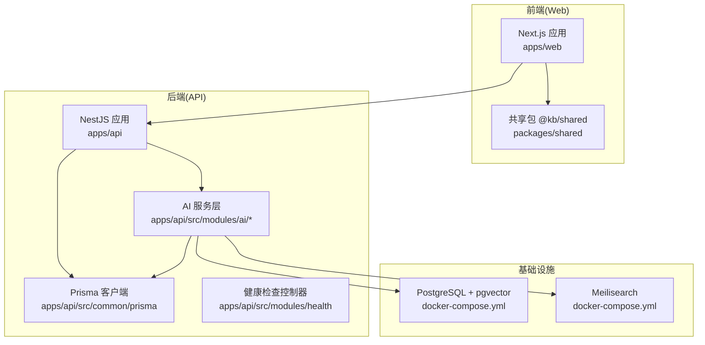
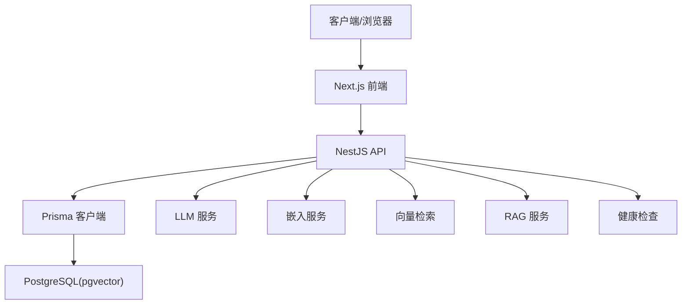
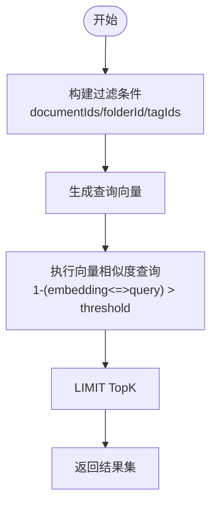
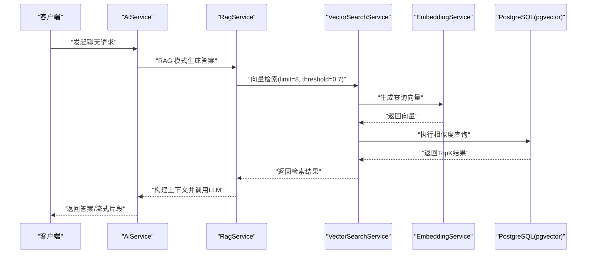
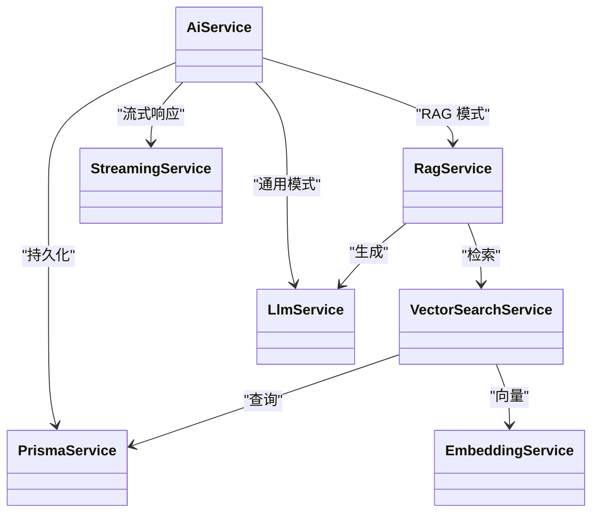

# 性能优化

<cite>
**本文引用的文件**
- [apps/api/src/common/prisma/prisma.service.ts](file://apps/api/src/common/prisma/prisma.service.ts)
- [apps/api/src/common/prisma/prisma.module.ts](file://apps/api/src/common/prisma/prisma.module.ts)
- [apps/api/src/config/configuration.ts](file://apps/api/src/config/configuration.ts)
- [apps/api/src/modules/ai/ai.service.ts](file://apps/api/src/modules/ai/ai.service.ts)
- [apps/api/src/modules/ai/rag.service.ts](file://apps/api/src/modules/ai/rag.service.ts)
- [apps/api/src/modules/ai/vector-search.service.ts](file://apps/api/src/modules/ai/vector-search.service.ts)
- [apps/api/src/modules/ai/embedding.service.ts](file://apps/api/src/modules/ai/embedding.service.ts)
- [apps/api/src/modules/ai/llm.service.ts](file://apps/api/src/modules/ai/llm.service.ts)
- [apps/api/src/modules/ai/streaming.service.ts](file://apps/api/src/modules/ai/streaming.service.ts)
- [apps/api/prisma/schema.prisma](file://apps/api/prisma/schema.prisma)
- [apps/api/src/modules/health/health.controller.ts](file://apps/api/src/modules/health/health.controller.ts)
- [apps/web/next.config.mjs](file://apps/web/next.config.mjs)
- [apps/web/package.json](file://apps/web/package.json)
- [docker-compose.yml](file://docker-compose.yml)
</cite>

## 目录
1. [简介](#简介)
2. [项目结构](#项目结构)
3. [核心组件](#核心组件)
4. [架构总览](#架构总览)
5. [详细组件分析](#详细组件分析)
6. [依赖分析](#依赖分析)
7. [性能考虑](#性能考虑)
8. [故障排查指南](#故障排查指南)
9. [结论](#结论)
10. [附录](#附录)

## 简介
本文件面向 APP2 项目，提供端到端的性能优化方案，覆盖数据库、向量数据库、AI 服务、前端以及整体监控与基准测试方法。重点包括：
- 数据库性能优化：连接池配置、索引优化、查询性能调优
- 向量数据库性能参数：向量维度、相似度阈值、TopK 参数优化
- 前端性能优化：代码分割、懒加载、缓存策略
- AI 服务性能调优：模型参数、并发处理、资源限制
- 性能监控指标与基准测试方法
- 内存使用优化、CPU 资源分配与 I/O 性能调优

## 项目结构
APP2 采用多包工作区布局，后端为 NestJS 应用，前端为 Next.js 应用，共享类型与工具位于 packages/shared。数据库使用 PostgreSQL 并启用 pgvector 扩展，AI 服务通过外部模型提供商接口调用。

图表来源
- [apps/web/next.config.mjs](file://apps/web/next.config.mjs#L1-L11)
- [apps/api/src/common/prisma/prisma.service.ts](file://apps/api/src/common/prisma/prisma.service.ts#L1-L69)
- [apps/api/src/modules/ai/ai.service.ts](file://apps/api/src/modules/ai/ai.service.ts#L1-L420)
- [docker-compose.yml](file://docker-compose.yml#L1-L53)

章节来源
- [apps/web/next.config.mjs](file://apps/web/next.config.mjs#L1-L11)
- [apps/api/src/common/prisma/prisma.module.ts](file://apps/api/src/common/prisma/prisma.module.ts#L1-L10)
- [apps/api/src/modules/health/health.controller.ts](file://apps/api/src/modules/health/health.controller.ts#L1-L31)
- [docker-compose.yml](file://docker-compose.yml#L1-L53)

## 核心组件
- 数据库层：Prisma 客户端封装，提供连接生命周期管理、开发日志与健康检查能力，并集成 pgvector 扩展。
- AI 服务层：包含嵌入、向量检索、RAG、LLM、流式响应等模块，负责向量相似度搜索与对话生成。
- 健康检查：提供基础健康、数据库连接与全服务状态检查接口。
- 前端：Next.js 应用，启用包转译与按需导入优化。

章节来源
- [apps/api/src/common/prisma/prisma.service.ts](file://apps/api/src/common/prisma/prisma.service.ts#L1-L69)
- [apps/api/src/modules/ai/ai.service.ts](file://apps/api/src/modules/ai/ai.service.ts#L1-L420)
- [apps/api/src/modules/ai/vector-search.service.ts](file://apps/api/src/modules/ai/vector-search.service.ts#L1-L140)
- [apps/api/src/modules/ai/rag.service.ts](file://apps/api/src/modules/ai/rag.service.ts#L1-L248)
- [apps/api/src/modules/ai/llm.service.ts](file://apps/api/src/modules/ai/llm.service.ts#L1-L110)
- [apps/api/src/modules/ai/streaming.service.ts](file://apps/api/src/modules/ai/streaming.service.ts#L1-L123)
- [apps/api/src/modules/health/health.controller.ts](file://apps/api/src/modules/health/health.controller.ts#L1-L31)
- [apps/web/next.config.mjs](file://apps/web/next.config.mjs#L1-L11)

## 架构总览
后端通过 Prisma 连接 PostgreSQL（启用 pgvector），AI 服务在需要时调用外部模型提供商接口；向量检索基于 document_chunks 表的向量字段进行相似度计算；前端 Next.js 通过 API 层访问后端能力。

图表来源
- [apps/api/src/common/prisma/prisma.service.ts](file://apps/api/src/common/prisma/prisma.service.ts#L1-L69)
- [apps/api/prisma/schema.prisma](file://apps/api/prisma/schema.prisma#L192-L210)
- [apps/api/src/modules/ai/llm.service.ts](file://apps/api/src/modules/ai/llm.service.ts#L1-L110)
- [apps/api/src/modules/ai/embedding.service.ts](file://apps/api/src/modules/ai/embedding.service.ts#L1-L128)
- [apps/api/src/modules/ai/vector-search.service.ts](file://apps/api/src/modules/ai/vector-search.service.ts#L1-L140)
- [apps/api/src/modules/ai/rag.service.ts](file://apps/api/src/modules/ai/rag.service.ts#L1-L248)
- [apps/api/src/modules/health/health.controller.ts](file://apps/api/src/modules/health/health.controller.ts#L1-L31)

## 详细组件分析

### 数据库性能优化（PostgreSQL + pgvector）
- 连接池配置
  - 当前实现未显式配置连接池参数，Prisma 默认行为依赖运行环境变量与驱动默认值。建议在生产环境明确设置连接池大小、空闲超时、最大语句数等参数，避免高并发下的连接争用与抖动。
  - 参考路径：[apps/api/src/common/prisma/prisma.service.ts](file://apps/api/src/common/prisma/prisma.service.ts#L8-L23)
- 索引优化
  - 已有关键索引：folders.parentId、folders.isPinned、documents.folderId、documents.isArchived、documents.isFavorite、documents.isPinned、documents.createdAt、document_tags.tagId、conversations.isArchived、conversations.isPinned、conversations.isStarred、conversations.updatedAt、conversations.contextFolderId、messages.conversationId、document_chunks.documentId、document_chunks.createdAt。
  - 建议补充：对 document_chunks.embedding 建立 ivfflat 或 hnsw 向量索引（由 pgvector 提供），并结合业务查询模式增加复合索引（如 document_id + chunk_index）。
  - 参考路径：[apps/api/prisma/schema.prisma](file://apps/api/prisma/schema.prisma#L34-L36), [apps/api/prisma/schema.prisma](file://apps/api/prisma/schema.prisma#L67-L73), [apps/api/prisma/schema.prisma](file://apps/api/prisma/schema.prisma#L99-L102), [apps/api/prisma/schema.prisma](file://apps/api/prisma/schema.prisma#L150-L156), [apps/api/prisma/schema.prisma](file://apps/api/prisma/schema.prisma#L173-L175), [apps/api/prisma/schema.prisma](file://apps/api/prisma/schema.prisma#L207-L209)
- 查询性能调优
  - 向量相似度查询已使用 1 - (dc.embedding <=> $1::vector) > threshold 的形式，建议：
    - 使用 pgvector 的 ivfflat 或 hnsw 索引，合理设置 lists/ef_construction 参数；
    - 控制 limit（TopK）与 threshold 的平衡，避免返回过多候选导致后续排序成本上升；
    - 对过滤条件（文档ID、文件夹、标签）进行必要性评估，尽量减少不必要的 JOIN 与子查询。
  - 参考路径：[apps/api/src/modules/ai/vector-search.service.ts](file://apps/api/src/modules/ai/vector-search.service.ts#L104-L138)

图表来源
- [apps/api/src/modules/ai/vector-search.service.ts](file://apps/api/src/modules/ai/vector-search.service.ts#L36-L67)
- [apps/api/src/modules/ai/vector-search.service.ts](file://apps/api/src/modules/ai/vector-search.service.ts#L104-L138)

章节来源
- [apps/api/src/common/prisma/prisma.service.ts](file://apps/api/src/common/prisma/prisma.service.ts#L1-L69)
- [apps/api/prisma/schema.prisma](file://apps/api/prisma/schema.prisma#L1-L276)
- [apps/api/src/modules/ai/vector-search.service.ts](file://apps/api/src/modules/ai/vector-search.service.ts#L1-L140)

### 向量数据库性能参数调优（向量维度、相似度阈值、TopK）
- 向量维度
  - schema 中定义了 unsupported vector(1024)，建议根据实际 embedding 模型输出维度进行统一与校验，避免不一致导致的索引与比较开销异常。
  - 参考路径：[apps/api/prisma/schema.prisma](file://apps/api/prisma/schema.prisma#L199)
- 相似度阈值
  - 当前默认阈值为 0.7，建议根据召回率与误检率进行 A/B 实验，动态调整阈值或引入自适应阈值策略。
  - 参考路径：[apps/api/src/modules/ai/vector-search.service.ts](file://apps/api/src/modules/ai/vector-search.service.ts#L39-L44), [apps/api/src/modules/ai/rag.service.ts](file://apps/api/src/modules/ai/rag.service.ts#L78-L81)
- TopK 参数
  - 当前默认 TopK=8，建议结合业务场景与 LLM 上下文窗口限制进行实验，逐步提升至 12~20，观察回答质量与延迟变化。
  - 参考路径：[apps/api/src/modules/ai/vector-search.service.ts](file://apps/api/src/modules/ai/vector-search.service.ts#L39-L44), [apps/api/src/modules/ai/rag.service.ts](file://apps/api/src/modules/ai/rag.service.ts#L78-L81)

章节来源
- [apps/api/prisma/schema.prisma](file://apps/api/prisma/schema.prisma#L199)
- [apps/api/src/modules/ai/vector-search.service.ts](file://apps/api/src/modules/ai/vector-search.service.ts#L36-L67)
- [apps/api/src/modules/ai/rag.service.ts](file://apps/api/src/modules/ai/rag.service.ts#L71-L82)

### 前端性能优化（Next.js）
- 代码分割与懒加载
  - 已启用 transpilePackages 与 optimizePackageImports，建议进一步拆分页面路由与组件，利用 React.lazy 与 Suspense 实现按需加载。
  - 参考路径：[apps/web/next.config.mjs](file://apps/web/next.config.mjs#L4-L7)
- 缓存策略
  - 启用 React Query 缓存与本地持久化，合理设置 staleTime、gcTime 与 refetch 策略，降低重复请求。
  - 参考路径：[apps/web/package.json](file://apps/web/package.json#L22-L24)
- 其他建议
  - 图片懒加载、字体预加载、CSS/JS 压缩与 CDN 加速；Tailwind 按需引入，避免全局样式膨胀。

章节来源
- [apps/web/next.config.mjs](file://apps/web/next.config.mjs#L1-L11)
- [apps/web/package.json](file://apps/web/package.json#L1-L54)

### AI 服务性能调优（模型参数、并发、资源限制）
- 模型参数
  - LLM 与嵌入服务均支持通过配置注入模型名称与基础 URL，默认模型与温度参数可在配置中心统一管理。
  - 参考路径：[apps/api/src/config/configuration.ts](file://apps/api/src/config/configuration.ts#L17-L23), [apps/api/src/modules/ai/llm.service.ts](file://apps/api/src/modules/ai/llm.service.ts#L26-L32), [apps/api/src/modules/ai/embedding.service.ts](file://apps/api/src/modules/ai/embedding.service.ts#L21-L28)
- 并发处理
  - 嵌入服务支持批量请求（每批最多 25），建议在上游聚合文本时充分利用批量能力，减少网络往返。
  - 参考路径：[apps/api/src/modules/ai/embedding.service.ts](file://apps/api/src/modules/ai/embedding.service.ts#L84-L98)
- 资源限制
  - 建议为外部模型调用设置超时与重试策略，避免下游不稳定影响整体可用性；对流式响应进行背压控制与缓冲区大小限制。
  - 参考路径：[apps/api/src/modules/ai/streaming.service.ts](file://apps/api/src/modules/ai/streaming.service.ts#L34-L46), [apps/api/src/modules/ai/llm.service.ts](file://apps/api/src/modules/ai/llm.service.ts#L47-L59)

图表来源
- [apps/api/src/modules/ai/ai.service.ts](file://apps/api/src/modules/ai/ai.service.ts#L71-L104)
- [apps/api/src/modules/ai/rag.service.ts](file://apps/api/src/modules/ai/rag.service.ts#L71-L141)
- [apps/api/src/modules/ai/vector-search.service.ts](file://apps/api/src/modules/ai/vector-search.service.ts#L36-L67)
- [apps/api/src/modules/ai/embedding.service.ts](file://apps/api/src/modules/ai/embedding.service.ts#L33-L79)
- [apps/api/prisma/schema.prisma](file://apps/api/prisma/schema.prisma#L192-L210)

章节来源
- [apps/api/src/modules/ai/ai.service.ts](file://apps/api/src/modules/ai/ai.service.ts#L1-L420)
- [apps/api/src/modules/ai/rag.service.ts](file://apps/api/src/modules/ai/rag.service.ts#L1-L248)
- [apps/api/src/modules/ai/vector-search.service.ts](file://apps/api/src/modules/ai/vector-search.service.ts#L1-L140)
- [apps/api/src/modules/ai/embedding.service.ts](file://apps/api/src/modules/ai/embedding.service.ts#L1-L128)
- [apps/api/src/modules/ai/llm.service.ts](file://apps/api/src/modules/ai/llm.service.ts#L1-L110)
- [apps/api/src/modules/ai/streaming.service.ts](file://apps/api/src/modules/ai/streaming.service.ts#L1-L123)
- [apps/api/src/config/configuration.ts](file://apps/api/src/config/configuration.ts#L1-L30)

## 依赖分析
- 组件耦合
  - AiService 依赖 ConversationsService、LlmService、RagService、StreamingService、PrismaService，体现高层协调与数据持久化职责。
  - RagService 依赖 VectorSearchService 与 LlmService，承担检索与生成的编排。
  - VectorSearchService 依赖 PrismaService 与 EmbeddingService，负责向量检索与过滤。
- 外部依赖
  - PostgreSQL（pgvector）、Meilisearch（在 compose 中定义）、外部 LLM/Embedding 服务（通过配置注入）。

图表来源
- [apps/api/src/modules/ai/ai.service.ts](file://apps/api/src/modules/ai/ai.service.ts#L39-L45)
- [apps/api/src/modules/ai/rag.service.ts](file://apps/api/src/modules/ai/rag.service.ts#L63-L66)
- [apps/api/src/modules/ai/vector-search.service.ts](file://apps/api/src/modules/ai/vector-search.service.ts#L28-L31)
- [apps/api/src/modules/ai/embedding.service.ts](file://apps/api/src/modules/ai/embedding.service.ts#L10-L28)
- [apps/api/src/modules/ai/llm.service.ts](file://apps/api/src/modules/ai/llm.service.ts#L19-L32)
- [apps/api/src/modules/ai/streaming.service.ts](file://apps/api/src/modules/ai/streaming.service.ts#L9-L22)
- [apps/api/src/common/prisma/prisma.service.ts](file://apps/api/src/common/prisma/prisma.service.ts#L4-L6)

章节来源
- [apps/api/src/modules/ai/ai.service.ts](file://apps/api/src/modules/ai/ai.service.ts#L1-L420)
- [apps/api/src/modules/ai/rag.service.ts](file://apps/api/src/modules/ai/rag.service.ts#L1-L248)
- [apps/api/src/modules/ai/vector-search.service.ts](file://apps/api/src/modules/ai/vector-search.service.ts#L1-L140)
- [apps/api/src/modules/ai/embedding.service.ts](file://apps/api/src/modules/ai/embedding.service.ts#L1-L128)
- [apps/api/src/modules/ai/llm.service.ts](file://apps/api/src/modules/ai/llm.service.ts#L1-L110)
- [apps/api/src/modules/ai/streaming.service.ts](file://apps/api/src/modules/ai/streaming.service.ts#L1-L123)
- [apps/api/src/common/prisma/prisma.service.ts](file://apps/api/src/common/prisma/prisma.service.ts#L1-L69)

## 性能考虑
- 内存使用优化
  - 后端容器在 docker-compose 中设置了内存上限，建议结合 JVM/Node 运行时参数与 GC 日志进行调优，避免 OOM。
  - 参考路径：[docker-compose.yml](file://docker-compose.yml#L17-L26), [docker-compose.yml](file://docker-compose.yml#L39-L48)
- CPU 资源分配
  - 通过 compose 的 deploy.resources.limits 限制容器 CPU 使用，结合负载测试确定最优配额。
- I/O 性能调优
  - 数据库 I/O：确保磁盘为 SSD，开启 WAL、checkpoint 调整与连接池参数；向量检索 I/O：合理设置 TopK 与过滤条件，避免全表扫描。
- 缓存策略
  - 嵌入服务内置内存缓存（TTL 7 天），建议结合业务热点文本进行缓存命中率监控与 TTL 动态调整。
  - 参考路径：[apps/api/src/modules/ai/embedding.service.ts](file://apps/api/src/modules/ai/embedding.service.ts#L17-L28), [apps/api/src/modules/ai/embedding.service.ts](file://apps/api/src/modules/ai/embedding.service.ts#L33-L79)

## 故障排查指南
- 健康检查
  - 提供基础健康、数据库连接与全服务状态检查接口，便于快速定位服务异常。
  - 参考路径：[apps/api/src/modules/health/health.controller.ts](file://apps/api/src/modules/health/health.controller.ts#L1-L31)
- 数据库连接
  - PrismaService 提供健康检查与 pgvector 扩展检测，可用于诊断连接与扩展可用性。
  - 参考路径：[apps/api/src/common/prisma/prisma.service.ts](file://apps/api/src/common/prisma/prisma.service.ts#L46-L67)
- AI 服务错误
  - LLM 与流式服务对 HTTP 错误进行捕获与日志记录，便于定位外部服务异常。
  - 参考路径：[apps/api/src/modules/ai/llm.service.ts](file://apps/api/src/modules/ai/llm.service.ts#L61-L64), [apps/api/src/modules/ai/streaming.service.ts](file://apps/api/src/modules/ai/streaming.service.ts#L48-L50), [apps/api/src/modules/ai/streaming.service.ts](file://apps/api/src/modules/ai/streaming.service.ts#L117-L120)

章节来源
- [apps/api/src/modules/health/health.controller.ts](file://apps/api/src/modules/health/health.controller.ts#L1-L31)
- [apps/api/src/common/prisma/prisma.service.ts](file://apps/api/src/common/prisma/prisma.service.ts#L46-L67)
- [apps/api/src/modules/ai/llm.service.ts](file://apps/api/src/modules/ai/llm.service.ts#L61-L64)
- [apps/api/src/modules/ai/streaming.service.ts](file://apps/api/src/modules/ai/streaming.service.ts#L48-L50)
- [apps/api/src/modules/ai/streaming.service.ts](file://apps/api/src/modules/ai/streaming.service.ts#L117-L120)

## 结论
本优化文档围绕数据库、向量检索、AI 服务与前端三大领域提出系统性建议。建议优先实施索引与 TopK/阈值调优、批量嵌入与缓存策略、前端懒加载与缓存配置，并建立完善的健康检查与监控体系，持续迭代性能指标与基准测试结果。

## 附录
- 性能监控指标建议
  - 数据库：连接数、查询耗时 P95/P99、索引命中率、pgvector 向量查询耗时分布
  - AI 服务：嵌入调用耗时与成功率、LLM 调用耗时与 token 使用、流式响应首字节时间
  - 前端：页面首屏时间、组件懒加载命中率、缓存命中率
- 基准测试方法
  - 使用 wrk/JMeter 对关键接口（向量检索、RAG、流式聊天）进行并发压测，记录响应时间、吞吐量与错误率；对不同 TopK、阈值与批量大小进行对比实验，确定最优参数组合