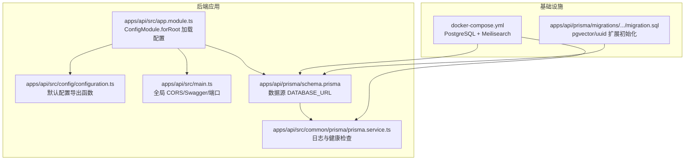
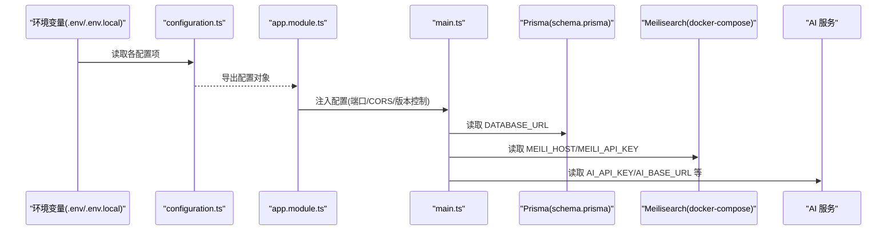
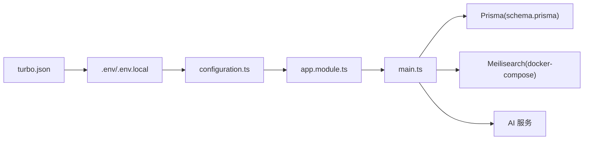

# 环境配置

<cite>
**本文引用的文件**
- [apps/api/src/config/configuration.ts](file://apps/api/src/config/configuration.ts)
- [apps/api/src/main.ts](file://apps/api/src/main.ts)
- [apps/api/src/app.module.ts](file://apps/api/src/app.module.ts)
- [apps/api/prisma/schema.prisma](file://apps/api/prisma/schema.prisma)
- [apps/api/prisma/migrations/20260308143313_/migration.sql](file://apps/api/prisma/migrations/20260308143313_/migration.sql)
- [docker-compose.yml](file://docker-compose.yml)
- [apps/api/src/common/prisma/prisma.service.ts](file://apps/api/src/common/prisma/prisma.service.ts)
- [apps/api/src/common/filters/http-exception.filter.ts](file://apps/api/src/common/filters/http-exception.filter.ts)
- [apps/api/package.json](file://apps/api/package.json)
- [package.json](file://package.json)
- [specs/knowledge-base-phase0-spec.md](file://specs/knowledge-base-phase0-spec.md)
</cite>

## 目录
1. [简介](#简介)
2. [项目结构](#项目结构)
3. [核心组件](#核心组件)
4. [架构总览](#架构总览)
5. [详细组件分析](#详细组件分析)
6. [依赖分析](#依赖分析)
7. [性能考虑](#性能考虑)
8. [故障排查指南](#故障排查指南)
9. [结论](#结论)
10. [附录](#附录)

## 简介
本文件面向 APP2 项目的运维与开发人员，系统性说明环境配置方案，涵盖：
- 环境变量的含义与配置方法
- 数据库连接字符串、AI 服务密钥、搜索引擎配置、CORS 等关键项
- 开发、测试、生产环境的配置差异与最佳实践
- 配置文件加载顺序与优先级规则
- 敏感信息的安全存储与管理策略
- 配置验证与错误处理机制
- 常见配置问题的排查与解决

## 项目结构
APP2 采用 Monorepo 结构，后端基于 NestJS，使用 @nestjs/config 管理配置；数据库通过 Prisma 连接 PostgreSQL，并启用 pgvector 扩展；Meilisearch 作为全文检索服务；Docker Compose 提供本地开发环境。

图表来源
- [apps/api/src/app.module.ts](file://apps/api/src/app.module.ts#L27-L31)
- [apps/api/src/config/configuration.ts](file://apps/api/src/config/configuration.ts#L1-L29)
- [apps/api/src/main.ts](file://apps/api/src/main.ts#L36-L54)
- [apps/api/prisma/schema.prisma](file://apps/api/prisma/schema.prisma#L11-L15)
- [apps/api/src/common/prisma/prisma.service.ts](file://apps/api/src/common/prisma/prisma.service.ts#L8-L23)
- [docker-compose.yml](file://docker-compose.yml#L4-L48)
- [apps/api/prisma/migrations/20260308143313_/migration.sql](file://apps/api/prisma/migrations/20260308143313_/migration.sql#L1-L5)

章节来源
- [apps/api/src/app.module.ts](file://apps/api/src/app.module.ts#L27-L31)
- [apps/api/src/config/configuration.ts](file://apps/api/src/config/configuration.ts#L1-L29)
- [apps/api/src/main.ts](file://apps/api/src/main.ts#L36-L54)
- [apps/api/prisma/schema.prisma](file://apps/api/prisma/schema.prisma#L11-L15)
- [docker-compose.yml](file://docker-compose.yml#L4-L48)

## 核心组件
- 配置加载与导出：通过 @nestjs/config 的 ConfigModule.forRoot 加载 configuration.ts 导出的配置对象，默认读取 .env.local 与 .env 两个文件。
- 应用启动：main.ts 设置全局前缀、版本控制、全局验证管道、全局过滤器与拦截器、CORS 与 Swagger。
- 数据库：Prisma 通过 schema.prisma 中 datasource db 的 url 读取 DATABASE_URL 环境变量；迁移脚本确保 pgvector 与 uuid 扩展可用。
- 搜索引擎：Meilisearch 由 docker-compose 提供，支持主机地址与 API Key 的环境变量配置。
- AI 服务：支持 OpenAI 兼容接口（如 DeepSeek），通过 AI_API_KEY、AI_BASE_URL、AI_CHAT_MODEL、AI_EMBEDDING_MODEL 等配置。

章节来源
- [apps/api/src/app.module.ts](file://apps/api/src/app.module.ts#L27-L31)
- [apps/api/src/config/configuration.ts](file://apps/api/src/config/configuration.ts#L1-L29)
- [apps/api/src/main.ts](file://apps/api/src/main.ts#L36-L54)
- [apps/api/prisma/schema.prisma](file://apps/api/prisma/schema.prisma#L11-L15)
- [apps/api/prisma/migrations/20260308143313_/migration.sql](file://apps/api/prisma/migrations/20260308143313_/migration.sql#L1-L5)

## 架构总览
下图展示配置在系统中的流向与依赖关系：

图表来源
- [apps/api/src/config/configuration.ts](file://apps/api/src/config/configuration.ts#L1-L29)
- [apps/api/src/app.module.ts](file://apps/api/src/app.module.ts#L27-L31)
- [apps/api/src/main.ts](file://apps/api/src/main.ts#L36-L54)
- [apps/api/prisma/schema.prisma](file://apps/api/prisma/schema.prisma#L11-L15)
- [docker-compose.yml](file://docker-compose.yml#L28-L48)

## 详细组件分析

### 配置加载顺序与优先级
- 配置文件加载顺序：ConfigModule.forRoot 中指定 envFilePath 为 ['.env.local', '.env']，即 .env.local 优先于 .env。
- 优先级规则：运行时 process.env 中的同名变量覆盖 .env/.env.local 的值；main.ts 中对部分配置（如 API_PORT、CORS）也直接读取 process.env 并具备最终覆盖能力。
- Turbo 缓存：turbo.json 声明 globalDependencies 包含 .env 与 .env.local，确保变更能触发重新构建。

章节来源
- [apps/api/src/app.module.ts](file://apps/api/src/app.module.ts#L27-L31)
- [turbo.json](file://turbo.json#L3-L3)
- [apps/api/src/main.ts](file://apps/api/src/main.ts#L36-L54)

### 环境变量清单与含义
- 应用层
  - NODE_ENV：运行环境（development/production 等），影响日志级别与 Swagger 显示。
  - API_PORT：后端监听端口，默认 4000。
  - CORS_ORIGIN：允许跨域来源列表（逗号分隔），默认 http://localhost:3000。
- 数据库
  - DATABASE_URL：PostgreSQL 连接字符串，Prisma 通过 schema.prisma 的 datasource db 读取。
- 搜索引擎
  - MEILI_HOST：Meilisearch 主机地址，默认 http://localhost:7700。
  - MEILI_API_KEY：Meilisearch 访问密钥。
- AI 服务
  - AI_API_KEY：AI 服务密钥。
  - AI_BASE_URL：AI 服务基础 URL，默认 OpenAI 兼容接口。
  - AI_CHAT_MODEL：聊天模型名称，默认 deepseek-chat。
  - AI_EMBEDDING_MODEL：嵌入模型名称，默认 text-embedding-3-small。
- 前端
  - NEXT_PUBLIC_API_URL：前端访问后端 API 的地址（示例中指向本地 4000 端口）。

章节来源
- [apps/api/src/config/configuration.ts](file://apps/api/src/config/configuration.ts#L3-L28)
- [apps/api/src/main.ts](file://apps/api/src/main.ts#L36-L54)
- [apps/api/prisma/schema.prisma](file://apps/api/prisma/schema.prisma#L11-L15)
- [docker-compose.yml](file://docker-compose.yml#L28-L48)
- [specs/knowledge-base-phase0-spec.md](file://specs/knowledge-base-phase0-spec.md#L351-L388)

### 开发/测试/生产环境差异对比
- 开发环境（development）
  - NODE_ENV=development，开启详细日志与查询事件，Swagger 文档可用。
  - 默认 CORS 来源包含 http://localhost:3000。
  - 数据库日志级别较高，便于调试。
- 测试环境（staging 或 CI）
  - 推荐使用独立的 DATABASE_URL、Meilisearch 密钥与 AI 服务密钥。
  - 关闭或限制 Swagger，仅在内网开放。
  - 严格控制 CORS 来源，避免跨域风险。
- 生产环境（production）
  - NODE_ENV=production，降低日志级别，关闭 Swagger。
  - 使用强密码与专用密钥，定期轮换。
  - 限制 CORS 来源为可信域名，启用 HTTPS。
  - 数据库连接使用只读账号或最小权限账号进行查询。

章节来源
- [apps/api/src/main.ts](file://apps/api/src/main.ts#L42-L51)
- [apps/api/src/common/prisma/prisma.service.ts](file://apps/api/src/common/prisma/prisma.service.ts#L10-L21)
- [apps/api/src/config/configuration.ts](file://apps/api/src/config/configuration.ts#L3-L28)

### 配置验证与错误处理机制
- 全局异常过滤器：统一捕获未处理异常，按开发/生产环境返回结构化错误响应，开发环境可包含堆栈信息。
- Prisma 健康检查：提供数据库连通性与 pgvector 扩展存在性检查，便于在启动阶段快速发现问题。
- CORS 配置：main.ts 与 configuration.ts 均可配置 CORS，若来源不匹配会导致跨域失败。
- Swagger 控制：仅在非生产环境启用，避免泄露内部接口文档。

章节来源
- [apps/api/src/common/filters/http-exception.filter.ts](file://apps/api/src/common/filters/http-exception.filter.ts#L15-L74)
- [apps/api/src/common/prisma/prisma.service.ts](file://apps/api/src/common/prisma/prisma.service.ts#L46-L67)
- [apps/api/src/main.ts](file://apps/api/src/main.ts#L36-L51)

### 安全存储与管理策略
- 敏感信息隔离：将密钥与连接串放入 .env.local（不在版本控制中），.env 仅存放示例或公共默认值。
- 最小权限原则：数据库连接使用最小权限账号；AI 服务密钥按功能拆分。
- 定期轮换：建立密钥轮换流程，更新后立即重启服务。
- 环境隔离：不同环境使用独立的 .env.local，避免混用。
- 传输安全：生产环境强制 HTTPS，CORS 仅允许受信域名。
- 审计与监控：记录关键配置变更，监控数据库与搜索引擎健康状态。

章节来源
- [turbo.json](file://turbo.json#L3-L3)
- [specs/knowledge-base-phase0-spec.md](file://specs/knowledge-base-phase0-spec.md#L351-L388)

### 数据库与向量扩展配置
- 连接字符串：DATABASE_URL 由 Prisma schema.prisma 的 datasource db 读取，迁移脚本确保 pgvector 与 uuid 扩展可用。
- 启动检查：PrismaService 在开发环境输出 SQL 查询事件，生产环境仅保留警告与错误日志。
- 健康检查：提供数据库连通性与 pgvector 扩展存在性检测，便于自动化部署与监控。

章节来源
- [apps/api/prisma/schema.prisma](file://apps/api/prisma/schema.prisma#L11-L15)
- [apps/api/prisma/migrations/20260308143313_/migration.sql](file://apps/api/prisma/migrations/20260308143313_/migration.sql#L1-L5)
- [apps/api/src/common/prisma/prisma.service.ts](file://apps/api/src/common/prisma/prisma.service.ts#L25-L41)

### 搜索引擎与 AI 服务配置
- Meilisearch：通过 docker-compose 提供容器，默认 Master Key 与环境变量需在生产中修改。
- AI 服务：支持 OpenAI 兼容接口，可通过 AI_API_KEY、AI_BASE_URL、AI_CHAT_MODEL、AI_EMBEDDING_MODEL 进行配置。

章节来源
- [docker-compose.yml](file://docker-compose.yml#L28-L48)
- [apps/api/src/config/configuration.ts](file://apps/api/src/config/configuration.ts#L17-L23)

## 依赖分析
- 配置依赖链：app.module.ts -> configuration.ts -> process.env；main.ts 直接读取 process.env 并覆盖默认值。
- 外部依赖：PostgreSQL（pgvector/uuid）、Meilisearch、AI 服务（OpenAI 兼容）。
- 构建与缓存：turbo.json 将 .env/.env.local 视为全局依赖，任何变更都会触发重新构建。

图表来源
- [apps/api/src/app.module.ts](file://apps/api/src/app.module.ts#L27-L31)
- [apps/api/src/config/configuration.ts](file://apps/api/src/config/configuration.ts#L1-L29)
- [apps/api/src/main.ts](file://apps/api/src/main.ts#L36-L54)
- [apps/api/prisma/schema.prisma](file://apps/api/prisma/schema.prisma#L11-L15)
- [docker-compose.yml](file://docker-compose.yml#L28-L48)
- [turbo.json](file://turbo.json#L3-L3)

章节来源
- [apps/api/src/app.module.ts](file://apps/api/src/app.module.ts#L27-L31)
- [apps/api/src/main.ts](file://apps/api/src/main.ts#L36-L54)
- [turbo.json](file://turbo.json#L3-L3)

## 性能考虑
- 日志级别：开发环境开启查询事件，生产环境仅保留警告与错误，减少 I/O 压力。
- CORS 限制：仅允许必要来源，避免不必要的预检请求。
- Swagger：仅在开发/测试环境启用，生产关闭以减少暴露面与资源消耗。
- 数据库连接：使用连接池与最小权限账号，避免长事务与大查询阻塞。

## 故障排查指南
- 数据库无法连接
  - 检查 DATABASE_URL 是否正确，容器是否启动。
  - 查看 PrismaService 的健康检查与 pgvector 扩展检查结果。
- Meilisearch 无法访问
  - 检查 MEILI_HOST 与 MEILI_API_KEY 是否配置正确，容器健康状态是否正常。
- AI 服务调用失败
  - 检查 AI_API_KEY、AI_BASE_URL、模型名称是否匹配。
- CORS 跨域失败
  - 检查 CORS_ORIGIN 是否包含当前前端地址，是否允许多个来源。
- Swagger 不可见
  - 确认 NODE_ENV 非 production，或手动调整 main.ts 中的条件。
- 端口占用
  - 修改 API_PORT 或释放 4000 端口占用。

章节来源
- [apps/api/src/common/prisma/prisma.service.ts](file://apps/api/src/common/prisma/prisma.service.ts#L46-L67)
- [apps/api/src/main.ts](file://apps/api/src/main.ts#L36-L51)
- [docker-compose.yml](file://docker-compose.yml#L28-L48)
- [apps/api/src/config/configuration.ts](file://apps/api/src/config/configuration.ts#L3-L28)

## 结论
APP2 的环境配置以 @nestjs/config 为核心，结合 .env 与 .env.local 实现灵活的多环境管理。通过明确的加载顺序、严格的错误处理与健康检查机制，能够有效保障开发、测试与生产的稳定性与安全性。建议在生产环境中强化密钥管理、网络隔离与日志审计，并持续优化性能与可观测性。

## 附录
- 快速对照表
  - 数据库连接：DATABASE_URL（schema.prisma datasource db）
  - 搜索引擎：MEILI_HOST、MEILI_API_KEY（docker-compose）
  - AI 服务：AI_API_KEY、AI_BASE_URL、AI_CHAT_MODEL、AI_EMBEDDING_MODEL（configuration.ts）
  - 应用：NODE_ENV、API_PORT、CORS_ORIGIN（main.ts 与 configuration.ts）
- 建议的 .env.local 示例字段（请勿直接复制内容，仅作字段参考）
  - DATABASE_URL
  - MEILI_HOST
  - MEILI_API_KEY
  - AI_API_KEY
  - AI_BASE_URL
  - AI_CHAT_MODEL
  - AI_EMBEDDING_MODEL
  - NODE_ENV
  - API_PORT
  - CORS_ORIGIN
  - NEXT_PUBLIC_API_URL