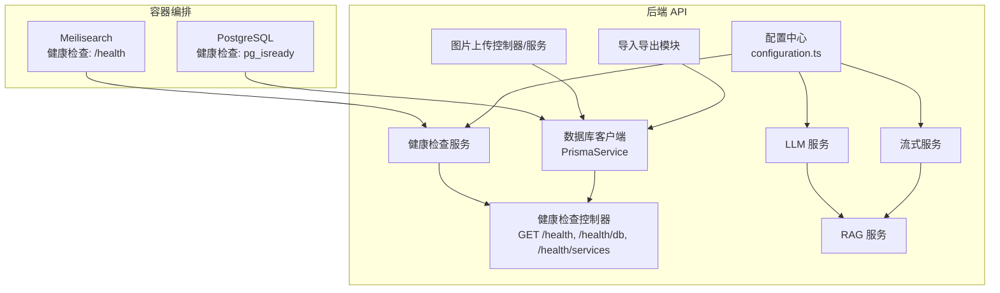
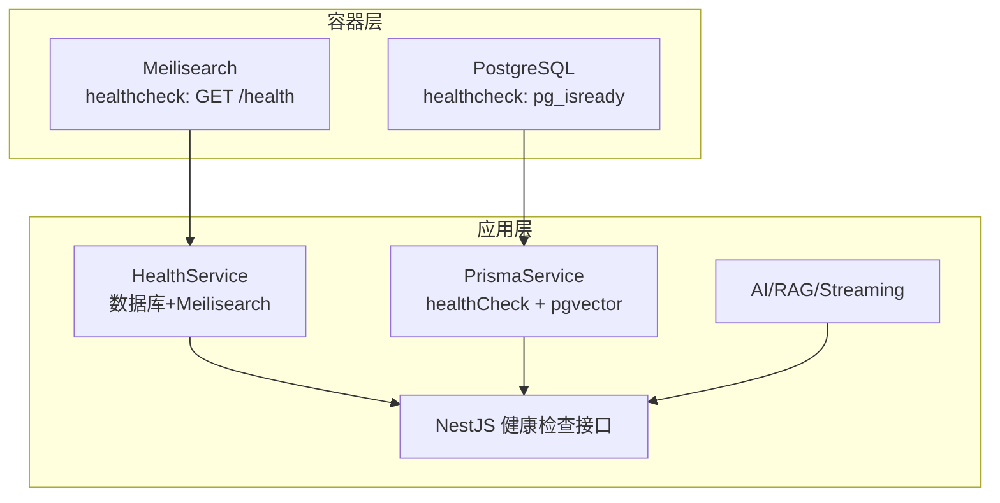
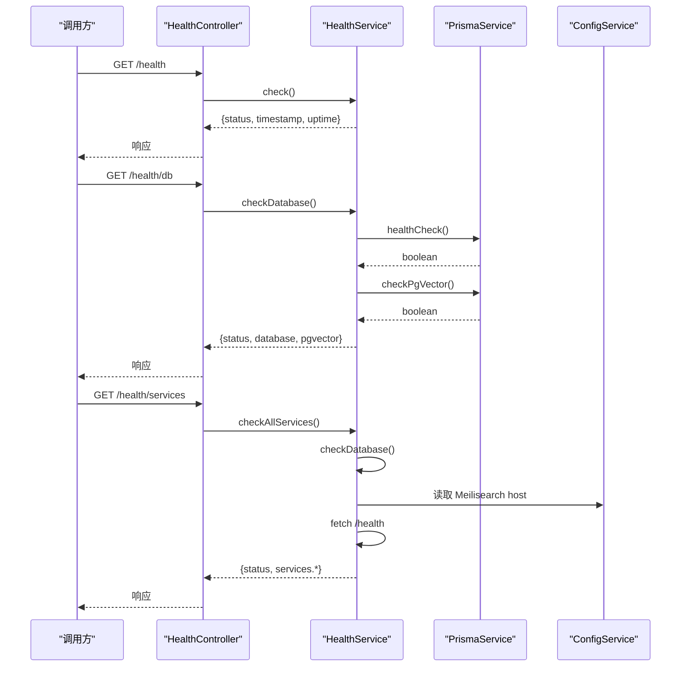
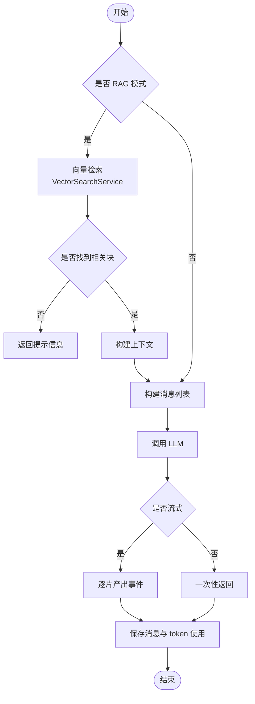
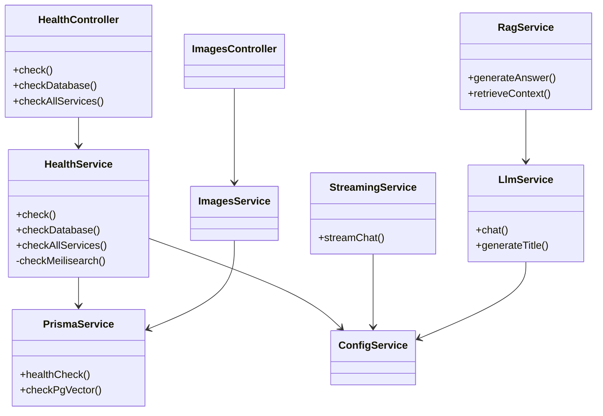

# 监控告警

<cite>
**本文引用的文件**
- [docker-compose.yml](file://docker-compose.yml)
- [apps/api/src/modules/health/health.controller.ts](file://apps/api/src/modules/health/health.controller.ts)
- [apps/api/src/modules/health/health.service.ts](file://apps/api/src/modules/health/health.service.ts)
- [apps/api/src/common/prisma/prisma.service.ts](file://apps/api/src/common/prisma/prisma.service.ts)
- [apps/api/src/config/configuration.ts](file://apps/api/src/config/configuration.ts)
- [apps/api/src/modules/ai/llm.service.ts](file://apps/api/src/modules/ai/llm.service.ts)
- [apps/api/src/modules/ai/rag.service.ts](file://apps/api/src/modules/ai/rag.service.ts)
- [apps/api/src/modules/ai/streaming.service.ts](file://apps/api/src/modules/ai/streaming.service.ts)
- [apps/api/src/common/filters/http-exception.filter.ts](file://apps/api/src/common/filters/http-exception.filter.ts)
- [apps/api/src/common/interceptors/transform.interceptor.ts](file://apps/api/src/common/interceptors/transform.interceptor.ts)
- [apps/api/src/modules/images/images.controller.ts](file://apps/api/src/modules/images/images.controller.ts)
- [apps/api/src/modules/images/images.service.ts](file://apps/api/src/modules/images/images.service.ts)
- [apps/api/src/modules/import-export/import-export.module.ts](file://apps/api/src/modules/import-export/import-export.module.ts)
- [package.json](file://package.json)
</cite>

## 目录
1. [简介](#简介)
2. [项目结构](#项目结构)
3. [核心组件](#核心组件)
4. [架构总览](#架构总览)
5. [详细组件分析](#详细组件分析)
6. [依赖关系分析](#依赖关系分析)
7. [性能考量](#性能考量)
8. [故障排查指南](#故障排查指南)
9. [结论](#结论)
10. [附录](#附录)

## 简介
本文件面向 APP2 项目的监控与告警，聚焦容器服务健康检查、数据库连接状态、AI 服务能力、文件存储空间、日志聚合与分析、性能指标（响应时间、吞吐量、错误率）、告警规则与通知渠道，以及故障自动恢复与降级策略。文档基于仓库现有实现进行梳理，并提供可落地的监控与告警实施方案。

## 项目结构
APP2 由前端 Web 应用与后端 API 两部分组成，API 通过 Docker Compose 编排运行 PostgreSQL 与 Meilisearch，并提供统一的健康检查接口。关键目录与职责如下：
- apps/api：后端 NestJS 应用，包含健康检查模块、AI 服务模块、文件上传模块等
- docker-compose.yml：容器编排与健康检查配置
- docker/postgres/init.sql：数据库初始化脚本（用于向量扩展等）
- packages/shared：共享类型与工具
- scripts：开发与测试辅助脚本
- specs/docs：需求与设计文档

图表来源
- [docker-compose.yml](file://docker-compose.yml#L17-L25)
- [docker-compose.yml](file://docker-compose.yml#L43-L47)
- [apps/api/src/modules/health/health.controller.ts](file://apps/api/src/modules/health/health.controller.ts#L10-L29)
- [apps/api/src/modules/health/health.service.ts](file://apps/api/src/modules/health/health.service.ts#L17-L65)
- [apps/api/src/common/prisma/prisma.service.ts](file://apps/api/src/common/prisma/prisma.service.ts#L46-L67)
- [apps/api/src/config/configuration.ts](file://apps/api/src/config/configuration.ts#L11-L23)
- [apps/api/src/modules/ai/llm.service.ts](file://apps/api/src/modules/ai/llm.service.ts#L37-L86)
- [apps/api/src/modules/ai/rag.service.ts](file://apps/api/src/modules/ai/rag.service.ts#L71-L141)
- [apps/api/src/modules/ai/streaming.service.ts](file://apps/api/src/modules/ai/streaming.service.ts#L27-L121)
- [apps/api/src/modules/images/images.controller.ts](file://apps/api/src/modules/images/images.controller.ts#L29-L71)
- [apps/api/src/modules/import-export/import-export.module.ts](file://apps/api/src/modules/import-export/import-export.module.ts#L8-L19)

章节来源
- [docker-compose.yml](file://docker-compose.yml#L1-L53)
- [package.json](file://package.json#L1-L36)

## 核心组件
- 容器健康检查：PostgreSQL 与 Meilisearch 的健康检查已通过 compose 配置启用，分别使用 pg_isready 与 HTTP 探针
- 后端健康检查：提供基础健康、数据库健康、全服务健康接口，覆盖 API 自身、数据库与 Meilisearch
- 数据库连接：PrismaService 提供健康检查与 pgvector 扩展检测
- AI 服务能力：LLM 与 RAG 服务封装外部模型调用，支持流式与非流式两种模式
- 文件存储：图片上传采用本地磁盘存储，支持大小限制与类型过滤
- 日志与错误：全局异常过滤器与统一响应拦截器，便于日志聚合与可观测性

章节来源
- [docker-compose.yml](file://docker-compose.yml#L21-L25)
- [docker-compose.yml](file://docker-compose.yml#L43-L47)
- [apps/api/src/modules/health/health.controller.ts](file://apps/api/src/modules/health/health.controller.ts#L10-L29)
- [apps/api/src/modules/health/health.service.ts](file://apps/api/src/modules/health/health.service.ts#L17-L94)
- [apps/api/src/common/prisma/prisma.service.ts](file://apps/api/src/common/prisma/prisma.service.ts#L46-L67)
- [apps/api/src/modules/ai/llm.service.ts](file://apps/api/src/modules/ai/llm.service.ts#L37-L86)
- [apps/api/src/modules/ai/streaming.service.ts](file://apps/api/src/modules/ai/streaming.service.ts#L27-L121)
- [apps/api/src/modules/images/images.controller.ts](file://apps/api/src/modules/images/images.controller.ts#L29-L71)
- [apps/api/src/common/filters/http-exception.filter.ts](file://apps/api/src/common/filters/http-exception.filter.ts#L15-L74)
- [apps/api/src/common/interceptors/transform.interceptor.ts](file://apps/api/src/common/interceptors/transform.interceptor.ts#L16-L24)

## 架构总览
下图展示容器与后端服务之间的健康检查与数据流关系：

图表来源
- [docker-compose.yml](file://docker-compose.yml#L21-L25)
- [docker-compose.yml](file://docker-compose.yml#L43-L47)
- [apps/api/src/modules/health/health.service.ts](file://apps/api/src/modules/health/health.service.ts#L51-L94)
- [apps/api/src/common/prisma/prisma.service.ts](file://apps/api/src/common/prisma/prisma.service.ts#L46-L67)

## 详细组件分析

### 容器健康检查配置
- PostgreSQL
  - 使用 pg_isready 进行健康检查，间隔与重试次数已配置
  - 内存资源限制为 512M
- Meilisearch
  - 使用 wget 访问 /health 端点进行健康检查
  - 内存资源限制为 384M

建议补充：
- 增加重启策略以外的健康检查失败告警
- 结合容器编排平台的健康检查失败事件进行告警

章节来源
- [docker-compose.yml](file://docker-compose.yml#L17-L25)
- [docker-compose.yml](file://docker-compose.yml#L43-L47)

### 后端健康检查接口
- 基础健康：返回服务状态、时间戳与运行时长
- 数据库健康：执行一次查询并检测 pgvector 扩展是否安装
- 全服务健康：组合数据库与 Meilisearch 健康检查结果，返回聚合状态

图表来源
- [apps/api/src/modules/health/health.controller.ts](file://apps/api/src/modules/health/health.controller.ts#L10-L29)
- [apps/api/src/modules/health/health.service.ts](file://apps/api/src/modules/health/health.service.ts#L17-L94)
- [apps/api/src/common/prisma/prisma.service.ts](file://apps/api/src/common/prisma/prisma.service.ts#L46-L67)
- [apps/api/src/config/configuration.ts](file://apps/api/src/config/configuration.ts#L11-L15)

章节来源
- [apps/api/src/modules/health/health.controller.ts](file://apps/api/src/modules/health/health.controller.ts#L10-L29)
- [apps/api/src/modules/health/health.service.ts](file://apps/api/src/modules/health/health.service.ts#L17-L94)

### 数据库连接状态监控
- PrismaService 提供 healthCheck 与 pgvector 扩展检测
- HealthService 在数据库健康检查失败时记录错误日志

监控要点：
- 周期性调用 /health/db 接口，观察 status 与 pgvector 字段
- 失败时结合日志定位连接参数、网络连通性与权限问题

章节来源
- [apps/api/src/common/prisma/prisma.service.ts](file://apps/api/src/common/prisma/prisma.service.ts#L46-L67)
- [apps/api/src/modules/health/health.service.ts](file://apps/api/src/modules/health/health.service.ts#L28-L46)

### AI 服务可用性监控
- LLM 服务：封装外部模型调用，记录请求耗时与 token 使用
- RAG 服务：检索相关文档块并调用 LLM 生成答案，记录处理时长
- 流式服务：支持增量事件流，记录完成时长与 token 数

图表来源
- [apps/api/src/modules/ai/rag.service.ts](file://apps/api/src/modules/ai/rag.service.ts#L71-L141)
- [apps/api/src/modules/ai/llm.service.ts](file://apps/api/src/modules/ai/llm.service.ts#L37-L86)
- [apps/api/src/modules/ai/streaming.service.ts](file://apps/api/src/modules/ai/streaming.service.ts#L27-L121)

章节来源
- [apps/api/src/modules/ai/llm.service.ts](file://apps/api/src/modules/ai/llm.service.ts#L37-L86)
- [apps/api/src/modules/ai/rag.service.ts](file://apps/api/src/modules/ai/rag.service.ts#L71-L141)
- [apps/api/src/modules/ai/streaming.service.ts](file://apps/api/src/modules/ai/streaming.service.ts#L27-L121)

### 文件存储空间监控
- 图片上传使用本地磁盘存储，默认目标路径为 uploads/images
- 上传接口对文件类型与大小进行限制
- 删除图片时会同步删除本地文件并清理数据库记录

监控要点：
- 监控 uploads/images 目录的磁盘使用率阈值
- 监控上传失败（类型不支持、超限、IO 错误）的错误率
- 建议结合容器卷挂载与宿主机磁盘告警联动

章节来源
- [apps/api/src/modules/images/images.controller.ts](file://apps/api/src/modules/images/images.controller.ts#L29-L71)
- [apps/api/src/modules/images/images.service.ts](file://apps/api/src/modules/images/images.service.ts#L12-L60)
- [apps/api/src/modules/import-export/import-export.module.ts](file://apps/api/src/modules/import-export/import-export.module.ts#L8-L19)

### 日志聚合与分析策略
- 统一响应拦截器：将业务返回包装为 { success, data }，便于日志结构化
- 全局异常过滤器：捕获未处理异常，输出结构化错误响应（含时间戳、路径、错误码等）
- 开发环境日志：Prisma 在开发环境输出 query 事件，便于调试但需控制日志量

建议：
- 使用结构化日志格式（JSON），包含 service、level、timestamp、traceId、spanId、message、meta 等字段
- 配置日志轮转（按大小或时间），避免单文件过大
- 将容器标准输出接入集中式日志系统（如 ELK、Loki+Grafana）

章节来源
- [apps/api/src/common/interceptors/transform.interceptor.ts](file://apps/api/src/common/interceptors/transform.interceptor.ts#L16-L24)
- [apps/api/src/common/filters/http-exception.filter.ts](file://apps/api/src/common/filters/http-exception.filter.ts#L15-L74)
- [apps/api/src/common/prisma/prisma.service.ts](file://apps/api/src/common/prisma/prisma.service.ts#L8-L22)

### 性能指标监控
- 响应时间：LLM 与流式服务在成功时记录处理时长；建议在网关或中间件层采集端到端 RT
- 吞吐量：统计每分钟/每小时请求量与成功/失败比率
- 错误率：结合异常过滤器输出的错误码分布与错误堆栈
- Token 使用：LLM 与 RAG 返回 token 使用情况，可用于成本与性能分析

章节来源
- [apps/api/src/modules/ai/llm.service.ts](file://apps/api/src/modules/ai/llm.service.ts#L67-L71)
- [apps/api/src/modules/ai/streaming.service.ts](file://apps/api/src/modules/ai/streaming.service.ts#L104-L116)
- [apps/api/src/modules/ai/rag.service.ts](file://apps/api/src/modules/ai/rag.service.ts#L135)

## 依赖关系分析
- HealthController 依赖 HealthService
- HealthService 依赖 PrismaService 与 ConfigService
- AI/RAG/Streaming 依赖 ConfigService 读取外部服务地址与密钥
- 图片上传依赖 PrismaService 与本地文件系统

图表来源
- [apps/api/src/modules/health/health.controller.ts](file://apps/api/src/modules/health/health.controller.ts#L8-L29)
- [apps/api/src/modules/health/health.service.ts](file://apps/api/src/modules/health/health.service.ts#L9-L12)
- [apps/api/src/common/prisma/prisma.service.ts](file://apps/api/src/common/prisma/prisma.service.ts#L4-L12)
- [apps/api/src/config/configuration.ts](file://apps/api/src/config/configuration.ts#L11-L23)
- [apps/api/src/modules/ai/llm.service.ts](file://apps/api/src/modules/ai/llm.service.ts#L26-L32)
- [apps/api/src/modules/ai/rag.service.ts](file://apps/api/src/modules/ai/rag.service.ts#L63-L66)
- [apps/api/src/modules/ai/streaming.service.ts](file://apps/api/src/modules/ai/streaming.service.ts#L16-L22)
- [apps/api/src/modules/images/images.controller.ts](file://apps/api/src/modules/images/images.controller.ts#L26-L27)
- [apps/api/src/modules/images/images.service.ts](file://apps/api/src/modules/images/images.service.ts#L10)

章节来源
- [apps/api/src/modules/health/health.controller.ts](file://apps/api/src/modules/health/health.controller.ts#L8-L29)
- [apps/api/src/modules/health/health.service.ts](file://apps/api/src/modules/health/health.service.ts#L9-L12)
- [apps/api/src/common/prisma/prisma.service.ts](file://apps/api/src/common/prisma/prisma.service.ts#L4-L12)
- [apps/api/src/config/configuration.ts](file://apps/api/src/config/configuration.ts#L11-L23)
- [apps/api/src/modules/ai/llm.service.ts](file://apps/api/src/modules/ai/llm.service.ts#L26-L32)
- [apps/api/src/modules/ai/rag.service.ts](file://apps/api/src/modules/ai/rag.service.ts#L63-L66)
- [apps/api/src/modules/ai/streaming.service.ts](file://apps/api/src/modules/ai/streaming.service.ts#L16-L22)
- [apps/api/src/modules/images/images.controller.ts](file://apps/api/src/modules/images/images.controller.ts#L26-L27)
- [apps/api/src/modules/images/images.service.ts](file://apps/api/src/modules/images/images.service.ts#L10)

## 性能考量
- 数据库查询与 pgvector 扩展检测：确保查询语句简单高效，避免在高并发场景下阻塞
- Meilisearch 健康检查：带超时控制，避免阻塞健康检查线程
- AI 服务：流式返回可降低首字节延迟；注意外部 API 的限流与重试策略
- 文件上传：限制文件大小与类型，避免内存与磁盘压力

[本节为通用指导，无需列出章节来源]

## 故障排查指南
- 数据库不可达
  - 检查 /health/db 返回 status 是否为 error
  - 查看 PrismaService 日志与 HealthService 错误日志
  - 核对连接串与容器网络连通性
- Meilisearch 不可用
  - 检查 /health/services 中 meilisearch 状态
  - 关注 HealthService 的超时与异常日志
- AI 服务异常
  - 观察 LLM/Streaming/RAG 的错误日志与处理时长
  - 核对外部 API 的密钥、URL 与配额
- 文件上传失败
  - 检查文件类型与大小限制
  - 查看本地磁盘空间与权限
  - 关注异常过滤器输出的错误详情

章节来源
- [apps/api/src/modules/health/health.service.ts](file://apps/api/src/modules/health/health.service.ts#L38-L45)
- [apps/api/src/common/filters/http-exception.filter.ts](file://apps/api/src/common/filters/http-exception.filter.ts#L15-L74)
- [apps/api/src/modules/ai/llm.service.ts](file://apps/api/src/modules/ai/llm.service.ts#L82-L85)
- [apps/api/src/modules/ai/streaming.service.ts](file://apps/api/src/modules/ai/streaming.service.ts#L117-L120)
- [apps/api/src/modules/images/images.controller.ts](file://apps/api/src/modules/images/images.controller.ts#L41-L48)
- [apps/api/src/modules/images/images.service.ts](file://apps/api/src/modules/images/images.service.ts#L48-L55)

## 结论
APP2 已具备容器与后端健康检查的基础能力，数据库与 AI 服务的关键路径均有可观测性支撑。建议在此基础上完善日志结构化与轮转、引入端到端性能指标采集、细化告警规则与通知渠道，并制定故障自动恢复与降级策略，以提升系统的稳定性与可维护性。

[本节为总结，无需列出章节来源]

## 附录

### 健康检查接口定义
- GET /health
  - 返回：服务状态、时间戳、运行时长
- GET /health/db
  - 返回：数据库连接状态、pgvector 扩展状态
- GET /health/services
  - 返回：聚合状态与各子服务状态

章节来源
- [apps/api/src/modules/health/health.controller.ts](file://apps/api/src/modules/health/health.controller.ts#L10-L29)

### 配置项参考
- Meilisearch 主机与密钥
- AI API 密钥、基础 URL、模型名称
- CORS 源

章节来源
- [apps/api/src/config/configuration.ts](file://apps/api/src/config/configuration.ts#L11-L28)

### 告警规则与通知建议
- 健康检查失败
  - 触发条件：容器健康检查失败或 /health/services 返回 degraded
  - 通知渠道：邮件/IM/Webhook
- 数据库不可用
  - 触发条件：/health/db 返回 error 或数据库连接异常
  - 通知渠道：运维值班群
- AI 服务错误率升高
  - 触发条件：错误率超过阈值或 RT 持续升高
  - 通知渠道：技术团队
- 存储空间不足
  - 触发条件：磁盘使用率超过阈值
  - 通知渠道：平台运维

[本节为通用指导，无需列出章节来源]