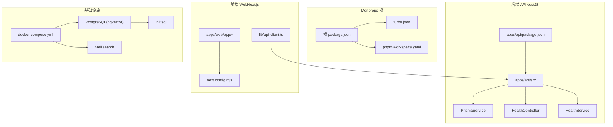
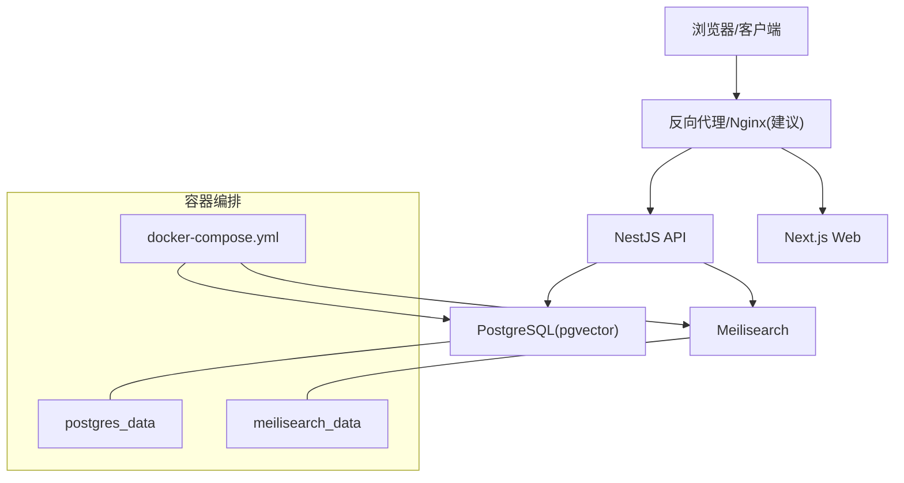
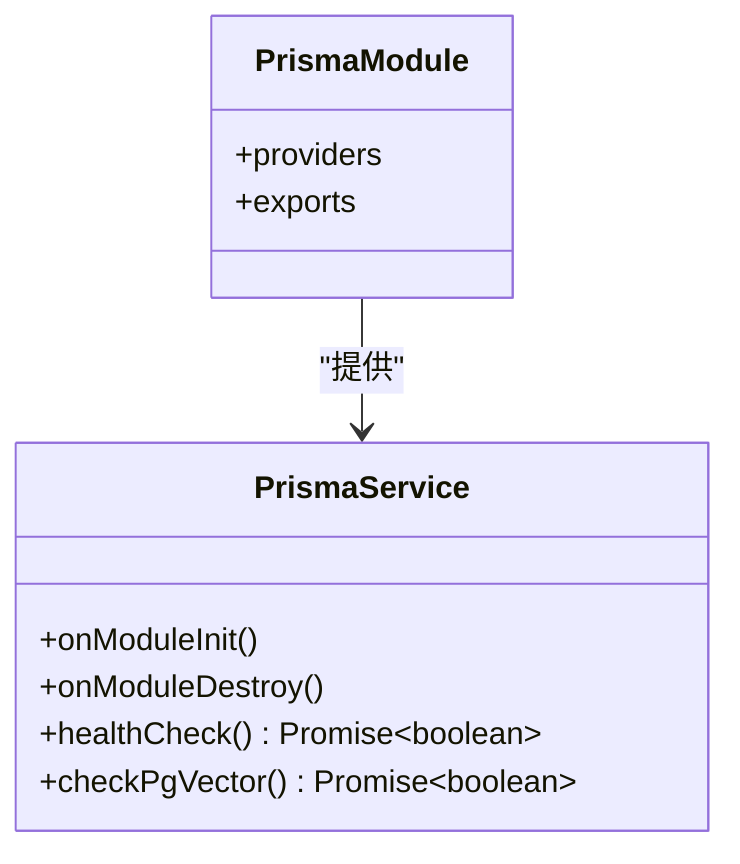
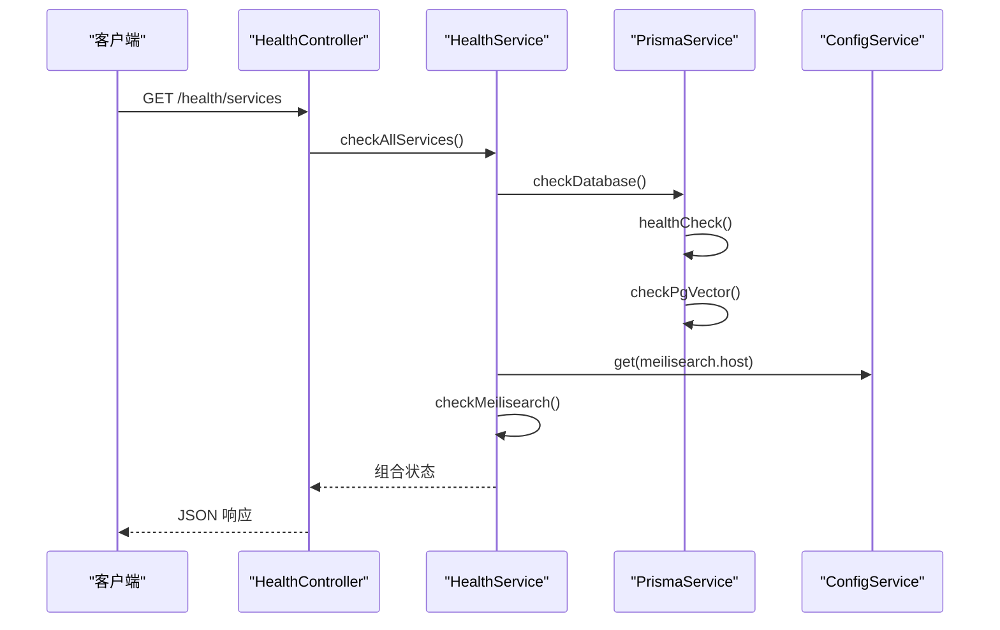
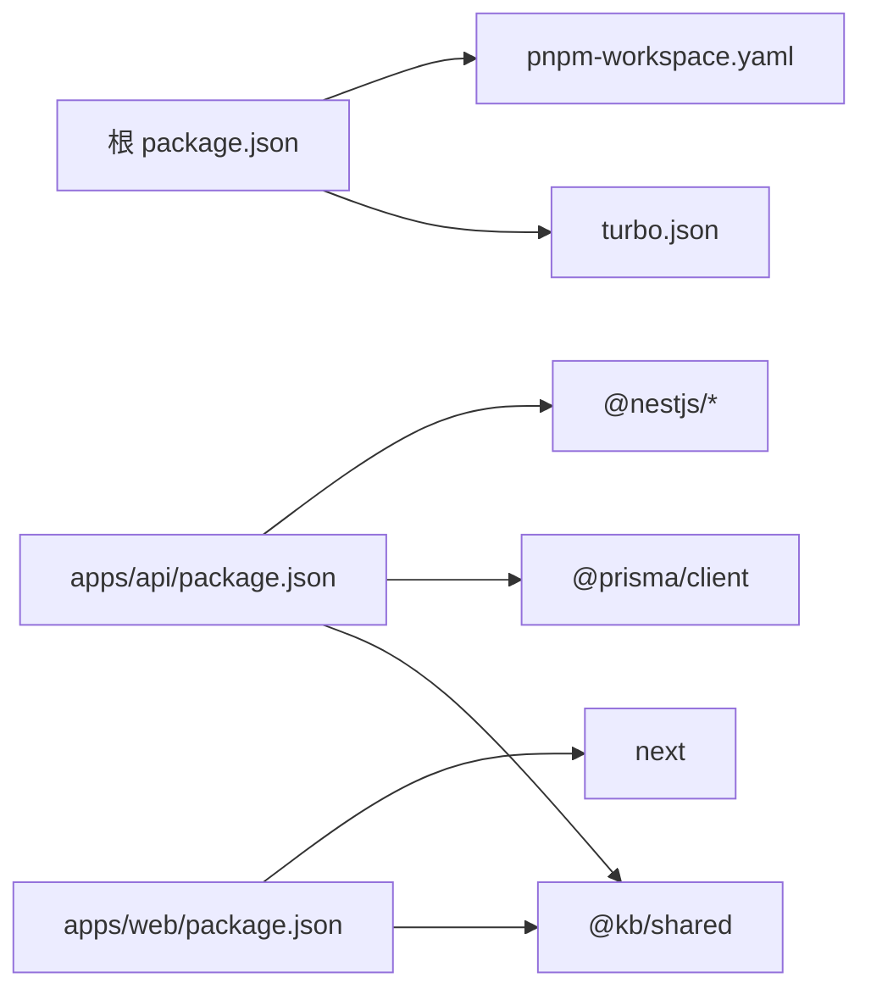
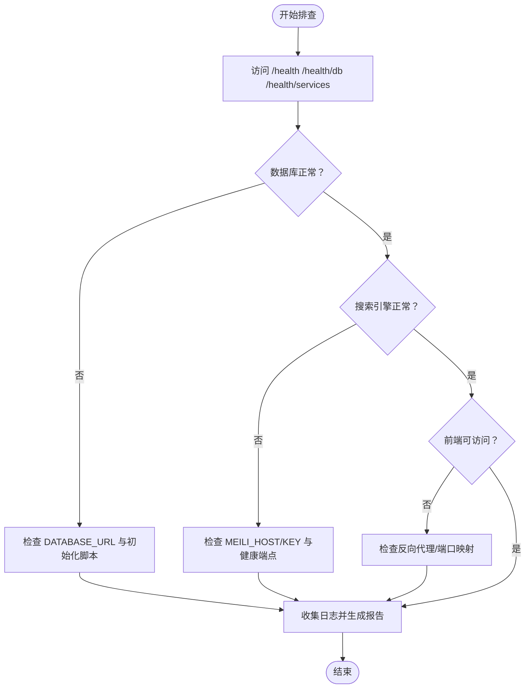

# 部署运维

<cite>
**本文引用的文件**
- [docker-compose.yml](file://docker-compose.yml)
- [init.sql](file://docker/postgres/init.sql)
- [.env.example](file://specs/knowledge-base-phase0-spec.md)
- [configuration.ts](file://apps/api/src/config/configuration.ts)
- [prisma.service.ts](file://apps/api/src/common/prisma/prisma.service.ts)
- [prisma.module.ts](file://apps/api/src/common/prisma/prisma.module.ts)
- [health.controller.ts](file://apps/api/src/modules/health/health.controller.ts)
- [health.service.ts](file://apps/api/src/modules/health/health.service.ts)
- [package.json（根）](file://package.json)
- [package.json（API）](file://apps/api/package.json)
- [package.json（Web）](file://apps/web/package.json)
- [turbo.json](file://turbo.json)
- [pnpm-workspace.yaml](file://pnpm-workspace.yaml)
- [run-tests.sh](file://scripts/run-tests.sh)
- [next.config.mjs](file://apps/web/next.config.mjs)
</cite>

## 目录
1. [简介](#简介)
2. [项目结构](#项目结构)
3. [核心组件](#核心组件)
4. [架构总览](#架构总览)
5. [详细组件分析](#详细组件分析)
6. [依赖关系分析](#依赖关系分析)
7. [性能考虑](#性能考虑)
8. [故障排查指南](#故障排查指南)
9. [结论](#结论)
10. [附录](#附录)

## 简介
本文件面向 APP2 项目的部署与运维，围绕容器化部署、服务编排、环境变量与数据持久化、生产最佳实践（负载均衡、SSL、安全加固）、CI/CD 流水线、性能优化（数据库连接池、缓存、资源限制）、监控告警与日志管理、以及故障恢复与灾备预案进行系统化说明。内容基于仓库中的 docker-compose 编排、NestJS API 的配置与健康检查、Next.js 前端构建配置、测试与验证脚本等实际实现。

## 项目结构
APP2 采用 monorepo 结构，使用 pnpm workspace 管理多包；Turbo 负责跨包构建与任务编排；API 使用 NestJS + Prisma + Meilisearch；Web 使用 Next.js；PostgreSQL 使用 pgvector 扩展支持向量检索。

图表来源
- [docker-compose.yml](file://docker-compose.yml#L1-L53)
- [init.sql](file://docker/postgres/init.sql#L1-L26)
- [turbo.json](file://turbo.json#L1-L21)
- [pnpm-workspace.yaml](file://pnpm-workspace.yaml#L1-L4)
- [package.json（根）](file://package.json#L1-L36)
- [package.json（API）](file://apps/api/package.json#L1-L55)
- [package.json（Web）](file://apps/web/package.json#L1-L54)
- [prisma.service.ts](file://apps/api/src/common/prisma/prisma.service.ts#L1-L69)
- [health.controller.ts](file://apps/api/src/modules/health/health.controller.ts#L1-L31)
- [health.service.ts](file://apps/api/src/modules/health/health.service.ts#L1-L96)
- [next.config.mjs](file://apps/web/next.config.mjs#L1-L11)

章节来源
- [package.json（根）](file://package.json#L1-L36)
- [pnpm-workspace.yaml](file://pnpm-workspace.yaml#L1-L4)
- [turbo.json](file://turbo.json#L1-L21)

## 核心组件
- 容器编排与持久化
  - 使用 docker-compose 启动 PostgreSQL（pgvector）与 Meilisearch，并通过命名卷实现数据持久化。
  - PostgreSQL 初始化脚本启用向量与 UUID 扩展，确保向量检索能力。
- 应用配置与环境变量
  - API 层通过配置模块读取 DATABASE_URL、MEILI_HOST/MEILI_API_KEY、AI_*、CORS_ORIGIN 等环境变量。
  - 提供 .env.example 作为本地开发模板。
- 健康检查与可观测性
  - API 提供 /health、/health/db、/health/services 多级健康检查，覆盖数据库与外部服务。
  - Prisma 在开发模式下输出 SQL 日志，便于诊断。
- 前端构建与运行
  - Next.js 通过 next.config.mjs 优化共享包导入，提升构建效率。

章节来源
- [docker-compose.yml](file://docker-compose.yml#L1-L53)
- [init.sql](file://docker/postgres/init.sql#L1-L26)
- [configuration.ts](file://apps/api/src/config/configuration.ts#L1-L30)
- [health.controller.ts](file://apps/api/src/modules/health/health.controller.ts#L1-L31)
- [health.service.ts](file://apps/api/src/modules/health/health.service.ts#L1-L96)
- [prisma.service.ts](file://apps/api/src/common/prisma/prisma.service.ts#L1-L69)
- [next.config.mjs](file://apps/web/next.config.mjs#L1-L11)

## 架构总览
APP2 的部署架构由“容器层”和“应用层”组成。容器层提供数据库与搜索引擎，应用层提供 API 与 Web 前端。API 通过 Prisma 访问 PostgreSQL，同时调用 Meilisearch 进行全文检索；Web 前端通过 API 客户端访问后端接口。

图表来源
- [docker-compose.yml](file://docker-compose.yml#L1-L53)
- [health.controller.ts](file://apps/api/src/modules/health/health.controller.ts#L1-L31)
- [health.service.ts](file://apps/api/src/modules/health/health.service.ts#L1-L96)

## 详细组件分析

### 容器化与服务编排
- PostgreSQL（pgvector）
  - 使用官方 pgvector 镜像，初始化时启用 vector 与 uuid 扩展，确保向量相似度检索可用。
  - 通过命名卷持久化数据与初始化脚本挂载，设置内存上限与健康检查。
- Meilisearch
  - 提供搜索索引能力，开启 master key、禁用分析上报，暴露 7700 端口。
  - 通过命名卷持久化索引数据，设置内存上限与健康检查。
- 命令与脚本
  - 根 package.json 提供 docker:up/down 脚本，便于一键启动/停止编排服务。

章节来源
- [docker-compose.yml](file://docker-compose.yml#L1-L53)
- [init.sql](file://docker/postgres/init.sql#L1-L26)
- [package.json（根）](file://package.json#L1-L36)

### 环境变量与配置
- API 配置项
  - 数据库连接：DATABASE_URL
  - Meilisearch：MEILI_HOST、MEILI_API_KEY
  - AI 接口：AI_API_KEY、AI_BASE_URL、AI_CHAT_MODEL、AI_EMBEDDING_MODEL
  - CORS：CORS_ORIGIN（逗号分隔）
  - 应用：NODE_ENV、API_PORT
- 前端配置
  - NEXT_PUBLIC_API_URL 指向前端可访问的 API 地址（在反向代理或域名场景中需调整）

章节来源
- [configuration.ts](file://apps/api/src/config/configuration.ts#L1-L30)
- [.env.example](file://specs/knowledge-base-phase0-spec.md#L351-L388)

### 数据库与向量检索
- 初始化脚本
  - 启用 vector 与 uuid 扩展，并在失败时抛出异常，保证环境一致性。
- Prisma 集成
  - PrismaService 在开发模式下输出 SQL 与耗时，便于调试；提供 healthCheck 与 pgvector 扩展检测。
- Prisma 模块
  - 以全局模块方式注入，统一提供数据库服务。

图表来源
- [prisma.service.ts](file://apps/api/src/common/prisma/prisma.service.ts#L1-L69)
- [prisma.module.ts](file://apps/api/src/common/prisma/prisma.module.ts#L1-L10)

章节来源
- [init.sql](file://docker/postgres/init.sql#L1-L26)
- [prisma.service.ts](file://apps/api/src/common/prisma/prisma.service.ts#L1-L69)
- [prisma.module.ts](file://apps/api/src/common/prisma/prisma.module.ts#L1-L10)

### 健康检查与可观测性
- API 健康端点
  - /health：基础状态
  - /health/db：数据库连接与 pgvector 扩展状态
  - /health/services：聚合检查数据库与 Meilisearch
- Meilisearch 健康检查
  - 通过配置的 host 发起健康检查请求，超时控制为 5 秒，失败记录警告日志。

图表来源
- [health.controller.ts](file://apps/api/src/modules/health/health.controller.ts#L1-L31)
- [health.service.ts](file://apps/api/src/modules/health/health.service.ts#L1-L96)
- [prisma.service.ts](file://apps/api/src/common/prisma/prisma.service.ts#L1-L69)

章节来源
- [health.controller.ts](file://apps/api/src/modules/health/health.controller.ts#L1-L31)
- [health.service.ts](file://apps/api/src/modules/health/health.service.ts#L1-L96)

### 前端构建与运行
- Next.js 配置
  - 通过 transpilePackages 与 optimizePackageImports 优化对共享包的处理，减少打包体积与提升构建速度。
- 运行与调试
  - 开发端口默认 3000；生产通过 next start 启动。

章节来源
- [next.config.mjs](file://apps/web/next.config.mjs#L1-L11)
- [package.json（Web）](file://apps/web/package.json#L1-L54)

## 依赖关系分析
- 包管理与工作空间
  - pnpm-workspace.yaml 定义 apps/* 与 packages/* 为工作空间，Turbo 读取根 package.json 中的脚本与依赖。
- 构建与任务
  - turbo.json 声明 globalDependencies 为 .env/.env.local，构建任务依赖上游包，输出目录排除缓存以加速增量构建。
- Monorepo 内部依赖
  - Web 依赖 @kb/shared；API 依赖 @kb/shared 与 Prisma 客户端等。

图表来源
- [package.json（根）](file://package.json#L1-L36)
- [turbo.json](file://turbo.json#L1-L21)
- [pnpm-workspace.yaml](file://pnpm-workspace.yaml#L1-L4)
- [package.json（API）](file://apps/api/package.json#L1-L55)
- [package.json（Web）](file://apps/web/package.json#L1-L54)

章节来源
- [package.json（根）](file://package.json#L1-L36)
- [turbo.json](file://turbo.json#L1-L21)
- [pnpm-workspace.yaml](file://pnpm-workspace.yaml#L1-L4)

## 性能考虑
- 数据库连接池
  - 当前 Prisma 默认行为适用于开发；生产建议在数据库连接字符串中显式配置连接池参数（例如最大连接数、空闲超时等），并在容器编排中限制数据库资源，避免过度占用。
- 缓存策略
  - 建议引入应用层缓存（如 Redis，可在 docker-compose 中新增服务）以缓存热点查询结果与会话数据；结合 API 层的节流与限速中间件降低突发流量对下游的影响。
- 资源限制
  - docker-compose 已对 PostgreSQL 与 Meilisearch 设置内存上限；建议为 API 与 Web 容器分别设置 CPU/内存配额与重启策略，保障稳定性。
- 前端优化
  - Next.js 已启用共享包优化；可进一步开启静态资源压缩、图片优化与 CDN 加速。

章节来源
- [docker-compose.yml](file://docker-compose.yml#L17-L26)
- [docker-compose.yml](file://docker-compose.yml#L39-L48)
- [next.config.mjs](file://apps/web/next.config.mjs#L1-L11)

## 故障排查指南
- 健康检查
  - 使用 /health、/health/db、/health/services 快速定位 API、数据库与搜索引擎状态。
- 数据库问题
  - 检查 PostgreSQL 是否成功加载 vector/uuid 扩展；查看 Prisma 在开发模式下的 SQL 输出与日志。
- 搜索引擎问题
  - 确认 MEILI_HOST 与 MEILI_API_KEY 正确；检查 Meilisearch 健康端点可达性。
- 端到端测试
  - 使用 run-tests.sh 脚本执行单元测试与 E2E 测试，支持按模块筛选与生成 HTML 报告。

图表来源
- [health.controller.ts](file://apps/api/src/modules/health/health.controller.ts#L1-L31)
- [health.service.ts](file://apps/api/src/modules/health/health.service.ts#L1-L96)
- [run-tests.sh](file://scripts/run-tests.sh#L1-L176)

章节来源
- [health.controller.ts](file://apps/api/src/modules/health/health.controller.ts#L1-L31)
- [health.service.ts](file://apps/api/src/modules/health/health.service.ts#L1-L96)
- [run-tests.sh](file://scripts/run-tests.sh#L1-L176)

## 结论
APP2 已具备完善的容器化与健康检查能力，结合 .env.example 与配置模块即可快速完成本地与生产部署。建议在生产环境中补充反向代理、SSL、Redis 缓存、资源配额与监控告警体系，并完善 CI/CD 流水线以实现自动化部署与发布。

## 附录

### 生产环境部署最佳实践
- 负载均衡与反向代理
  - 使用 Nginx 或云厂商 LB 将流量分发至多个 API/Web 实例；配置健康检查探针指向 /health。
- SSL 与证书
  - 通过 ACME 自动签发与续期证书；在反向代理层终止 TLS 并向后端传递安全头。
- 安全加固
  - 限制容器网络；仅暴露必要端口；使用只读根文件系统与最小权限用户；定期更新镜像与依赖。
- 数据持久化与备份
  - 对 postgres_data 与 meilisearch_data 卷进行周期性快照与异地备份；保留 init.sql 以便重建环境。
- CI/CD 流水线
  - 建议在流水线中包含：安装依赖、构建（Turbo）、测试（run-tests.sh）、打包镜像、推送镜像、编排部署与健康检查。

### 监控告警与日志
- 监控指标
  - API：请求量、错误率、响应时间、数据库连接数、搜索引擎延迟。
  - 基础设施：CPU/内存/磁盘使用率、卷容量、PG/Meili 健康状态。
- 日志管理
  - API 与 Web 标准输出采集；集中化存储与检索；敏感字段脱敏；按服务与时间切分索引。

### 故障恢复与灾备
- 快速回滚
  - 采用蓝绿/滚动发布；保留最近 N 个版本镜像；失败自动回滚。
- 灾难恢复
  - 基于快照的数据库与索引恢复；init.sql 重装扩展；验证 /health/services 与业务功能。