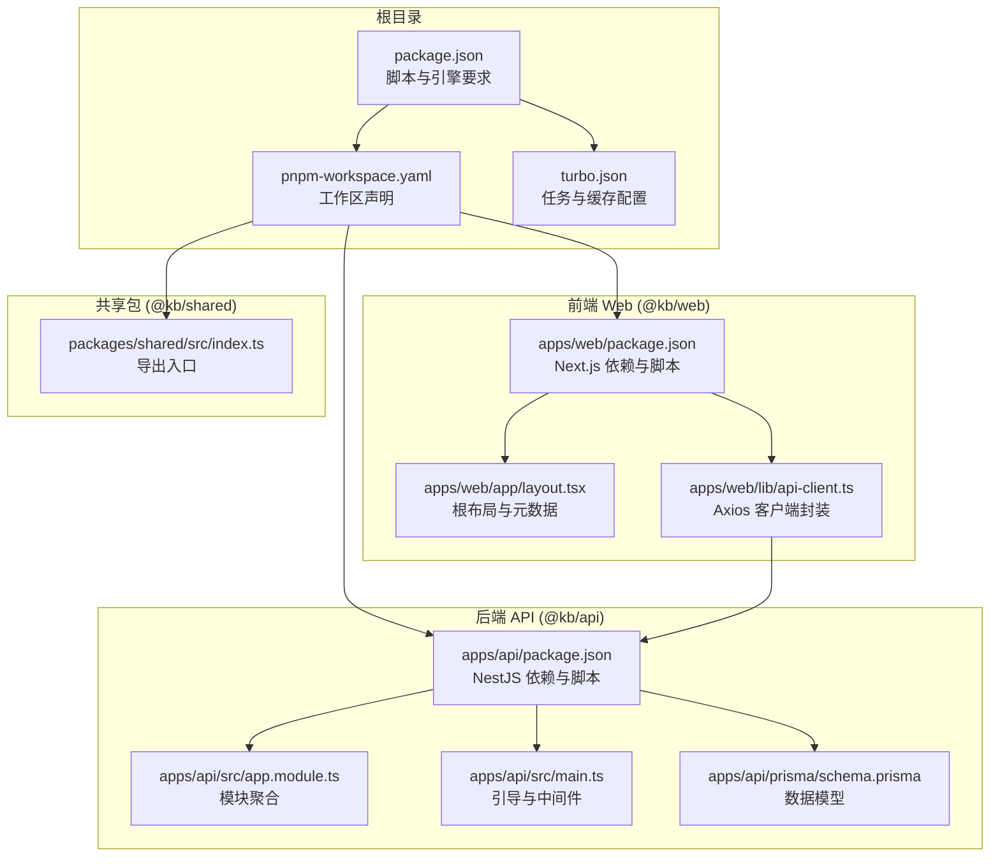
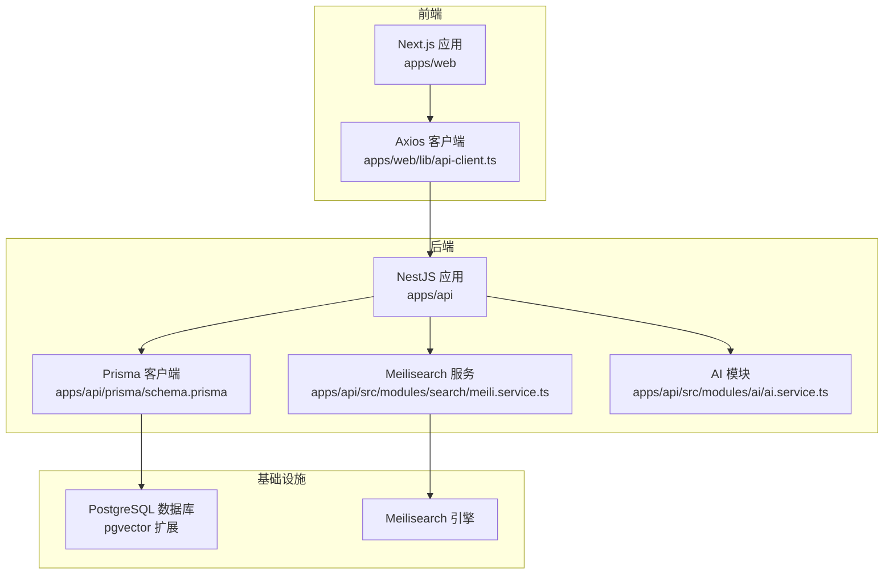
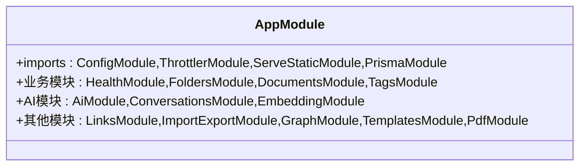
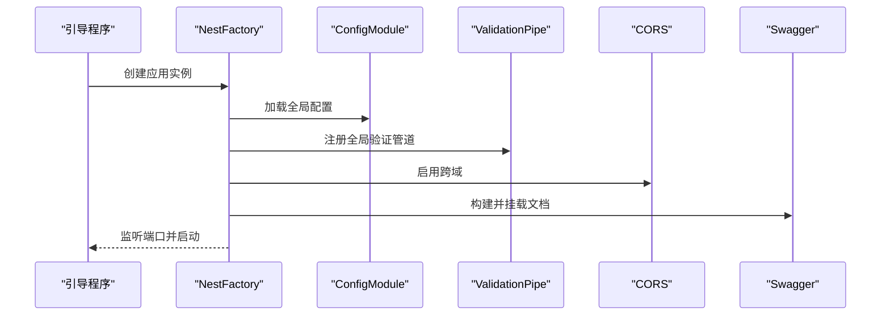
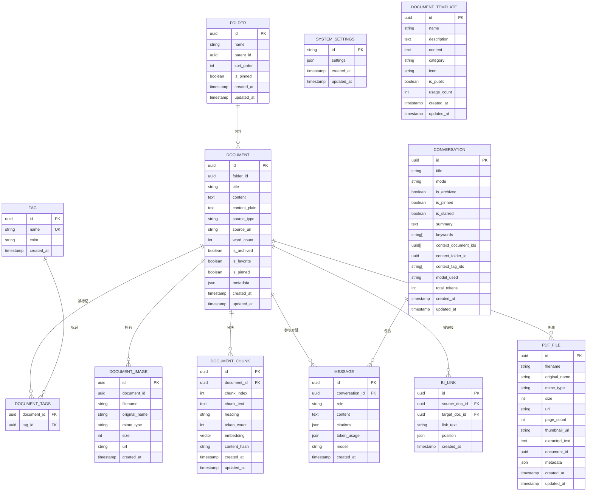
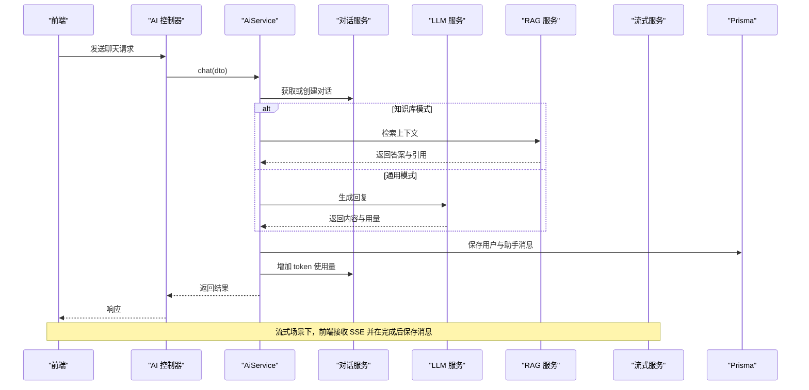
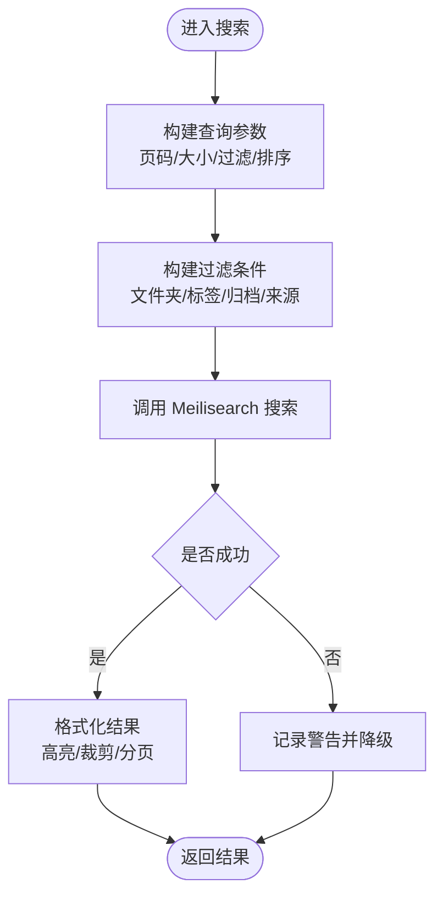
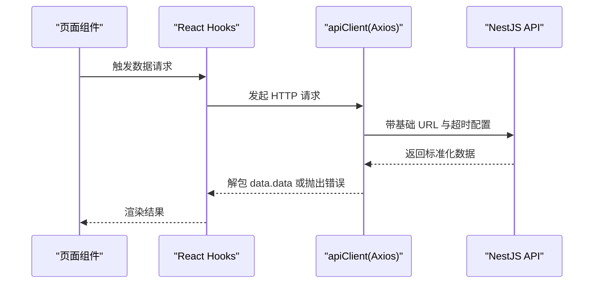
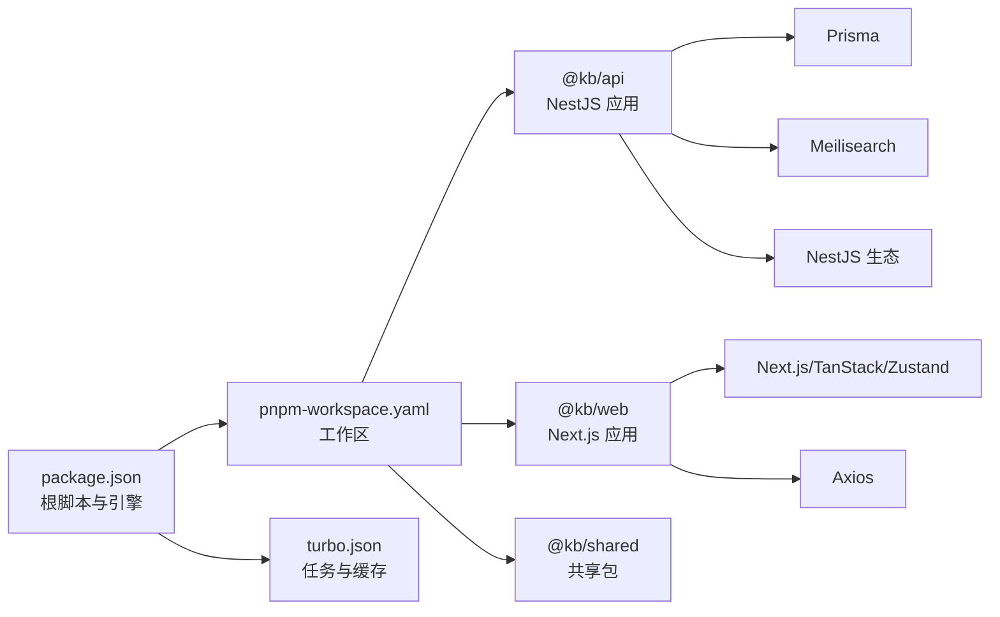

# 项目概述

<cite>
**本文引用的文件**
- [package.json](file://package.json)
- [pnpm-workspace.yaml](file://pnpm-workspace.yaml)
- [turbo.json](file://turbo.json)
- [apps/api/package.json](file://apps/api/package.json)
- [apps/api/src/app.module.ts](file://apps/api/src/app.module.ts)
- [apps/api/src/main.ts](file://apps/api/src/main.ts)
- [apps/api/prisma/schema.prisma](file://apps/api/prisma/schema.prisma)
- [apps/api/src/modules/ai/ai.module.ts](file://apps/api/src/modules/ai/ai.module.ts)
- [apps/api/src/modules/ai/ai.service.ts](file://apps/api/src/modules/ai/ai.service.ts)
- [apps/api/src/modules/search/search.module.ts](file://apps/api/src/modules/search/search.module.ts)
- [apps/api/src/modules/search/meili.service.ts](file://apps/api/src/modules/search/meili.service.ts)
- [apps/web/package.json](file://apps/web/package.json)
- [apps/web/app/layout.tsx](file://apps/web/app/layout.tsx)
- [apps/web/lib/api-client.ts](file://apps/web/lib/api-client.ts)
- [packages/shared/src/index.ts](file://packages/shared/src/index.ts)
</cite>

## 目录
1. [引言](#引言)
2. [项目结构](#项目结构)
3. [核心组件](#核心组件)
4. [架构总览](#架构总览)
5. [详细组件分析](#详细组件分析)
6. [依赖分析](#依赖分析)
7. [性能考虑](#性能考虑)
8. [故障排除指南](#故障排除指南)
9. [结论](#结论)
10. [附录](#附录)

## 引言
APP2 是一个基于 AI 技术的个人知识库应用，旨在帮助用户高效地管理文档、进行智能检索，并通过对话式交互实现知识的深度利用。项目采用 monorepo 架构，将后端 API（NestJS）与前端 Web 应用（Next.js）统一管理，配合数据库（PostgreSQL）、向量扩展（pgvector）、全文搜索引擎（Meilisearch）以及嵌入模型（Embedding）构建完整的知识管理闭环。

项目愿景是打造“个人 AI 助手 + 知识库”的一体化平台，支持文档的结构化组织、智能搜索、RAG 对话、双向链接、知识图谱、导入导出与模板体系等能力，逐步演进至知识网络的可视化与自动化管理。

## 项目结构
项目采用 pnpm workspace + Turbo 的 monorepo 结构，前后端分别位于 apps/api 与 apps/web，共享类型与工具位于 packages/shared。根目录提供统一的开发脚本与缓存策略，确保多包协同开发与增量构建。

图表来源
- [package.json](file://package.json#L1-L36)
- [pnpm-workspace.yaml](file://pnpm-workspace.yaml#L1-L4)
- [turbo.json](file://turbo.json#L1-L21)
- [apps/api/package.json](file://apps/api/package.json#L1-L55)
- [apps/api/src/app.module.ts](file://apps/api/src/app.module.ts#L1-L83)
- [apps/api/src/main.ts](file://apps/api/src/main.ts#L1-L61)
- [apps/api/prisma/schema.prisma](file://apps/api/prisma/schema.prisma#L1-L276)
- [apps/web/package.json](file://apps/web/package.json#L1-L54)
- [apps/web/app/layout.tsx](file://apps/web/app/layout.tsx#L1-L26)
- [apps/web/lib/api-client.ts](file://apps/web/lib/api-client.ts#L1-L84)
- [packages/shared/src/index.ts](file://packages/shared/src/index.ts#L1-L6)

章节来源
- [package.json](file://package.json#L1-L36)
- [pnpm-workspace.yaml](file://pnpm-workspace.yaml#L1-L4)
- [turbo.json](file://turbo.json#L1-L21)

## 核心组件
- 后端 API（NestJS）
  - 负责业务模块聚合、数据持久化、AI 能力集成与对外接口暴露。
  - 关键模块：健康检查、文件夹、文档、标签、搜索、图片、AI 对话、嵌入、链接、导入导出、图谱、模板、PDF 等。
- 数据层（PostgreSQL + Prisma）
  - 使用 Prisma 管理数据模型与迁移；启用 PostgreSQL 扩展 pgvector 支持向量索引；提供全文检索与向量检索能力。
- 搜索与检索（Meilisearch）
  - 提供高性能全文检索，支持过滤、排序、高亮与裁剪，作为主检索通道。
- 前端 Web（Next.js）
  - 基于 React 的现代化界面，集成编辑器、对话组件、搜索与导航，通过 Axios 封装的客户端访问后端 API。
- 共享包（@kb/shared）
  - 统一导出类型与工具，降低前后端耦合，便于跨包复用。

章节来源
- [apps/api/src/app.module.ts](file://apps/api/src/app.module.ts#L1-L83)
- [apps/api/prisma/schema.prisma](file://apps/api/prisma/schema.prisma#L1-L276)
- [apps/api/src/modules/search/meili.service.ts](file://apps/api/src/modules/search/meili.service.ts#L1-L128)
- [apps/web/lib/api-client.ts](file://apps/web/lib/api-client.ts#L1-L84)
- [packages/shared/src/index.ts](file://packages/shared/src/index.ts#L1-L6)

## 架构总览
APP2 采用“前端 Next.js + 后端 NestJS + 数据库 PostgreSQL + 搜索引擎 Meilisearch”的分层架构。前端通过 Axios 客户端调用后端 API，后端通过 Prisma 访问数据库，同时集成 AI 服务（LLM、嵌入、RAG、向量检索）与搜索服务（Meilisearch），形成“文档管理 → 搜索检索 → AI 对话”的完整闭环。

图表来源
- [apps/web/lib/api-client.ts](file://apps/web/lib/api-client.ts#L1-L84)
- [apps/api/src/main.ts](file://apps/api/src/main.ts#L1-L61)
- [apps/api/prisma/schema.prisma](file://apps/api/prisma/schema.prisma#L1-L276)
- [apps/api/src/modules/search/meili.service.ts](file://apps/api/src/modules/search/meili.service.ts#L1-L128)
- [apps/api/src/modules/ai/ai.service.ts](file://apps/api/src/modules/ai/ai.service.ts#L1-L420)

## 详细组件分析

### 后端模块聚合（AppModule）
AppModule 将配置、限流、静态资源、数据库、健康检查、文件夹、文档、标签、搜索、图片、AI 对话、嵌入、链接、导入导出、图谱、模板、PDF 等模块整合，形成统一的后端服务入口。

图表来源
- [apps/api/src/app.module.ts](file://apps/api/src/app.module.ts#L1-L83)

章节来源
- [apps/api/src/app.module.ts](file://apps/api/src/app.module.ts#L1-L83)

### API 引导与中间件（main.ts）
main.ts 负责应用启动、全局前缀、版本控制、全局验证管道、CORS、Swagger 文档与端口监听，确保 API 的一致性与可观测性。

图表来源
- [apps/api/src/main.ts](file://apps/api/src/main.ts#L1-L61)

章节来源
- [apps/api/src/main.ts](file://apps/api/src/main.ts#L1-L61)

### 数据模型与向量扩展（Prisma Schema）
数据模型覆盖文件夹、文档、标签、文档-标签关联、文档图片、对话、消息、系统设置、文档分块（向量）、双向链接、文档模板、PDF 文件等。其中文档分块模型使用 PostgreSQL 的向量扩展（pgvector）存储嵌入向量，支撑 RAG 与相似度检索。

图表来源
- [apps/api/prisma/schema.prisma](file://apps/api/prisma/schema.prisma#L1-L276)

章节来源
- [apps/api/prisma/schema.prisma](file://apps/api/prisma/schema.prisma#L1-L276)

### AI 对话与 RAG（AiModule/AiService）
AI 模块提供通用对话、知识库对话（RAG）、流式对话、对话摘要与建议生成等能力。AiService 根据模式选择不同的处理路径：通用模式直接调用 LLM，知识库模式通过 RAG 检索上下文并注入系统提示词，最后统一保存消息与更新 token 使用量。

图表来源
- [apps/api/src/modules/ai/ai.module.ts](file://apps/api/src/modules/ai/ai.module.ts#L1-L35)
- [apps/api/src/modules/ai/ai.service.ts](file://apps/api/src/modules/ai/ai.service.ts#L1-L420)

章节来源
- [apps/api/src/modules/ai/ai.module.ts](file://apps/api/src/modules/ai/ai.module.ts#L1-L35)
- [apps/api/src/modules/ai/ai.service.ts](file://apps/api/src/modules/ai/ai.service.ts#L1-L420)

### 搜索模块（SearchModule/MeiliService）
SearchModule 通过 MeiliService 与 Meilisearch 进行交互，支持索引文档、批量重建、删除、查询与过滤，返回高亮与裁剪后的结果，满足全文检索与筛选需求。

图表来源
- [apps/api/src/modules/search/search.module.ts](file://apps/api/src/modules/search/search.module.ts#L1-L14)
- [apps/api/src/modules/search/meili.service.ts](file://apps/api/src/modules/search/meili.service.ts#L1-L128)

章节来源
- [apps/api/src/modules/search/search.module.ts](file://apps/api/src/modules/search/search.module.ts#L1-L14)
- [apps/api/src/modules/search/meili.service.ts](file://apps/api/src/modules/search/meili.service.ts#L1-L128)

### 前端应用与 API 客户端
前端 Next.js 应用通过 Axios 封装的 apiClient 统一访问后端 API，支持请求/响应拦截与错误处理；根布局定义站点元数据与全局样式提供者。

图表来源
- [apps/web/lib/api-client.ts](file://apps/web/lib/api-client.ts#L1-L84)
- [apps/web/app/layout.tsx](file://apps/web/app/layout.tsx#L1-L26)
- [apps/web/package.json](file://apps/web/package.json#L1-L54)

章节来源
- [apps/web/lib/api-client.ts](file://apps/web/lib/api-client.ts#L1-L84)
- [apps/web/app/layout.tsx](file://apps/web/app/layout.tsx#L1-L26)
- [apps/web/package.json](file://apps/web/package.json#L1-L54)

## 依赖分析
- 包管理与工作区
  - pnpm workspace 声明 apps/* 与 packages/*，统一管理多包依赖与发布。
  - Turbo 管理构建、开发、清理与 lint 任务，支持增量构建与缓存。
- 后端依赖
  - NestJS 生态（Config、Throttler、ServeStatic、Swagger、Throttler）提供配置、限流、静态资源、文档与安全。
  - Prisma 与 Meilisearch 提供 ORM 与全文检索。
  - 多媒体与 PDF 处理（sharp、pdf-parse）增强内容处理能力。
- 前端依赖
  - Next.js 14、React 18、TailwindCSS、Mermaid、CodeMirror 等构建现代化编辑与展示体验。
  - TanStack React Query 管理服务端状态，Zustand 管理轻量本地状态。
- 共享包
  - 统一导出类型与工具，减少重复代码与边界不一致。

图表来源
- [package.json](file://package.json#L1-L36)
- [pnpm-workspace.yaml](file://pnpm-workspace.yaml#L1-L4)
- [turbo.json](file://turbo.json#L1-L21)
- [apps/api/package.json](file://apps/api/package.json#L1-L55)
- [apps/web/package.json](file://apps/web/package.json#L1-L54)
- [packages/shared/src/index.ts](file://packages/shared/src/index.ts#L1-L6)

章节来源
- [package.json](file://package.json#L1-L36)
- [pnpm-workspace.yaml](file://pnpm-workspace.yaml#L1-L4)
- [turbo.json](file://turbo.json#L1-L21)
- [apps/api/package.json](file://apps/api/package.json#L1-L55)
- [apps/web/package.json](file://apps/web/package.json#L1-L54)
- [packages/shared/src/index.ts](file://packages/shared/src/index.ts#L1-L6)

## 性能考虑
- 增量构建与缓存
  - Turbo 的任务依赖与缓存策略可显著缩短开发与构建时间，建议在 CI 中开启缓存以提升效率。
- 数据库与索引
  - Prisma 使用 PostgreSQL 扩展 pgvector 存储向量，适合大规模向量检索；建议对高频查询字段建立索引，合理拆分批量写入。
- 搜索性能
  - Meilisearch 适合实时全文检索与过滤，建议按需分页与限制高亮裁剪长度，避免过长文本影响性能。
- 前端渲染
  - 使用 React Query 缓存与去重请求，避免重复拉取；编辑器组件按需加载，减少首屏压力。
- 流式传输
  - AI 对话采用流式传输，前端需及时消费事件并在完成后保存消息，避免阻塞 UI。

## 故障排除指南
- 开发环境启动
  - 确认 Docker Compose 已启动数据库与 Meilisearch，并正确设置环境变量（如 DATABASE_URL、Meilisearch 主机与密钥）。
  - 使用根脚本一键启动前后端：pnpm dev 或分别运行 pnpm dev:api 与 pnpm dev:web。
- API 文档与健康检查
  - Swagger 文档地址：http://localhost:4000/api/docs（非生产环境）。
  - 健康检查接口：/api/v1/health、/api/v1/health/db、/api/v1/health/services。
- 数据库与迁移
  - 使用 Prisma 脚本生成与执行迁移：pnpm db:generate、pnpm db:migrate。
- 前端 API 调用
  - 确保 NEXT_PUBLIC_API_URL 指向正确的后端地址；Axios 客户端已内置统一错误处理与响应解包逻辑。

章节来源
- [package.json](file://package.json#L1-L36)
- [apps/api/src/main.ts](file://apps/api/src/main.ts#L1-L61)
- [apps/web/lib/api-client.ts](file://apps/web/lib/api-client.ts#L1-L84)

## 结论
APP2 以 monorepo 为核心，结合 NestJS、Next.js、Prisma、PostgreSQL 与 Meilisearch，构建了面向个人的知识管理平台。其模块化设计与清晰的数据模型为后续扩展 AI 对话、RAG、知识图谱与双向链接提供了坚实基础。通过统一的共享包与工程化工具链，团队可以高效迭代并持续交付高质量的功能。

## 附录
- 快速开始
  - 安装依赖：pnpm install
  - 启动数据库与搜索：pnpm docker:up
  - 初始化数据库：pnpm db:generate && pnpm db:migrate
  - 启动开发：pnpm dev
- 常用脚本
  - 前端：pnpm dev、pnpm build、pnpm lint
  - 后端：pnpm dev、pnpm build、pnpm test、pnpm lint
  - 根级：pnpm db:studio、pnpm verify